# AI Primer
---

## Lesson Objectives 2


 * See the potential of AI
 
 * Learn from industry use cases
 
 * Understand the problems AI can solve

 * Understand the basic AI vocabulary

 * Learn about AI software & hardware
 
 * Running an AI project

 * Building Data Science teams

 * Any thing else you want to cover


Notes:


---

## About You and Me


 * About you

     - Your name

     - Your background (developer, admin, manager, etc.)

     - Technologies you are familiar with

     - Familiarity with Machine Learning and AI  **(scale of 1-4; 1-new, 4-expert)**

     -  **Something non-technical about you!**  **(favorite ice cream flavor, hobby, etc.)**

   &nbsp;


Notes:

---
## Recommended Resources:

- [AI for Everyone](https://www.coursera.org/learn/ai-for-everyone) - A very good course (free!) by Professor Andrew Ng 

* [AI Tranformation Playbook](https://landing.ai/ai-transformation-playbook/) - Another great free ebook by Andrew Ng

---

# Part 1: State of AI

---

## Question for Audience

 * Think of something you did today / this week that is AI powered?

Notes:

---

## Demo - Gmail AI Helper


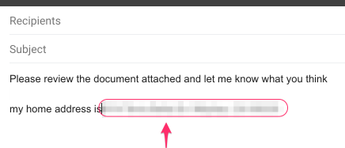


Notes:


---

## AI - Google Assistant


 * Google Assistant Making phone calls


 * Also Google Voice has gotten a lot better in recent years


 
[Link](https://ai.googleblog.com/2018/05/duplex-ai-system-for-natural-conversation.html)

Notes:

https://ai.googleblog.com/2018/05/duplex-ai-system-for-natural-conversation.html


---

# Why AI Matters?


---

## AI is a Huge Disruptor / Enabler


Notes:


---

## AI Growing at a Phenomenal Rate


Notes:

https://mapr.com/blog/ai-ml-2018-and-beyond/


---

## Question for Class: Are We in a AI Hype Cycle?


Notes:


---

## Case for AI


Notes:

Image credit: coursera

---
## How Important is AI ?

> "AI will create US$13 Trillion value by year 2030"  
>   -- McKinsey Global Institute


Notes:  
- [Link](https://www.mckinsey.com/featured-insights/artificial-intelligence/notes-from-the-ai-frontier-applications-and-value-of-deep-learning)

---

## How Important is AI


Notes:  
- [Link](https://www.mckinsey.com/featured-insights/artificial-intelligence/notes-from-the-ai-frontier-applications-and-value-of-deep-learning)


---

## How Important is AI ?


> "8 out of 10 companies are already implementing, or planning to adopt AI by 2020"  
>    -- Oracle

 * AI is no longer 'novel'

 * Companies are expected to have some AI in their products

     - Just like they are expected to have website that works on a phone

     - Or having an 'app'

Notes:

Source: [8 out of 10 - Oracle](https://www.oracle.com/webfolder/s/delivery_production/docs/FY16h1/doc35/CXResearchVirtualExperiences.pdf)


---

# AI Use Cases

Notes:


---

## AI Use Cases at a Glance

|       Finance       |         Healthcare        |        Retail       |        Manufacturing       |    Network & Security    |
|:-------------------:|:-------------------------:|:-------------------:|:--------------------------:|:------------------------:|
| Fraud Detection     | Diagnosis                 | Recommendations     | Identify defects           | Identify security breach |
| Algorithmic trading | Patient care              | Customer retentions | Fully automated assemblies | Facial recognition       |
| Credit Approvals    | Treatment recommendations |                     |                            |                          |


Notes:


---


## Use Case - Uber Eats


<!--  -->


[AI @ Uber Eats Video](https://www.youtube.com/watch?v=AiinFkL-pmw&feature=youtu.be)

Notes:

https://www.youtube.com/watch?v=AiinFkL-pmw&feature=youtu.be


---

## Use Case - Uber Eats


 * 6 Billion in Revenue (Uber Eats alone!) within 4 years of launching!

 * UberEats is built with AI from ground up


Notes:

https://venturebeat.com/2018/10/02/uber-eats-and-the-6b-bookings-run-rate-the-ai-success-story-no-one-is-talking-about/


---

## Uber Eats - AI

Here are the actions in Uber Eats 

- Step 1: When user launches the app, need to display restaurants

- Step 2: Choose menu items from a restaurant 

- Step 3: Uber to dispatch a courier to pick up the food and deliver 
    - Plan the optimal route for pick and up delivery

- Step 4 : Gather feedback from user (ratings / reviews)

---

## Uber AI : Step 1 : Recommending Restaurants


**Question for class**     
What factors Uber might consider when recommending a restaurant?

(Answer next slide)

---

## Uber AI : Step 1 : Recommending Restaurants

- Recommend restaurants based on past orders

- Location based

- Balance new restaurants vs. established restaurants


<!--  -->


---
## Uber Eats AI : Step 2 : Recommend Menu Items 


**Question for class** :   
What factors Uber might consider when recommending a items from a restaurant?

(Answer next slide)

---

## Uber Eats AI : Step 2 : Recommend Menu Items 


- Based on past orders

- Most popular items

- 'Specials'

> "Don't order fish at restaurants on Mondays"  
>   -- Anthony Bourdain, Chef and Author "Kitchen Confidentials"


Notes:


---


## UberEats - AI Architecture / Workflow


Notes:

Source : https://www.youtube.com/watch?v=AiinFkL-pmw&feature=youtu.be


---

## Use Case : Uber driver verification

- To increase passenger safety, Uber drivers have to verify their identity before accepting rides

- Uber uses [Microsoft Cognitive Services](https://azure.microsoft.com/en-us/services/cognitive-services/) to recognize 7 million+ drivers in milli seconds

- [Link](https://venturebeat.com/wp-content/uploads/2016/09/uberids.gif?resize=343%2C600&strip=all)


---

## Use Case : Photobucket

- [Photobucket](http://photobucket.com/) is a image / video hosting service

- They want to identify and tag NSFW (Not Safe For Work) images and offensive images

- Previously, their human moderation team was only able to monitor about 1% of content

- Now AI system (Using [Clarify](https://www.clarifai.com/)), screens images and tags them properly.  
Illegal images (child pornography ..etc) are flagged for law enforcement

- [Link](https://blog.clarifai.com/how-photobucket-uses-image-recognition-to-protect-its-community-from-unwanted-content)


Notes:  
- https://blog.clarifai.com/how-photobucket-uses-image-recognition-to-protect-its-community-from-unwanted-content

---

## Use Case : Staples

- [Staples](https://www.staples.com) relies on organic search traffic to drive sales

- One way the ways to score high on search engine results is put meaningful ALT tags for each product images

- Doing it manually was an expensive proposition

- They use  [Clarify](https://www.clarifai.com/) to automatically tag images

- [Link](https://clarifai.com/customers/staples)


Notes:  
- https://clarifai.com/customers/staples

---


## Use Case - AirBnB - Customer Service


Notes:


---

## Use Case AirBnB


 * Problem

     - 5000 support engineers

     - Needs to scale

 * Solution

     - Deploy AI to handle customer queries

     - AI is smart enough to understand customer questions and provide answers"how do I verify my ID?"

 * [Link](http://bigdatausecases.info/entry/airbnb-driving-a-higher-level-of-customer-support-with-machine-learning)

Notes:

http://bigdatausecases.info/entry/airbnb-driving-a-higher-level-of-customer-support-with-machine-learning


---

## Use Case in Finance: Capitol One - Credit Card Fraud Prevention


 * Capitol ONE:
     - 365 Billion in assets,
     - 8th largest bank, 4th largest credit issuer
     
* Challenge:
    - minimize fraudulent credit card transactions
    - Huge volume, 20 million transactions a day
    - Keep history for 60 days

* Solution
     - Used machine learning to reduce credit card fraud
     - Increased accuracy significantly over legacy methods
     - minimize fraud loss --> more profit

Notes:

- [case study](http://bigdatausecases.info/entry/a-machine-learning-approach-recommendation-engine-for-real-time-processing-use-case-at-capital-one)
- [video](https://vimeo.com/274801502)


---

## AI in Customer Service @ Bank of America


 * Bank of America virtual assistant

 * Searching through transactions 
    - "show me my total expenses to Disneyland trip"

 * Bill pay ("Pay $50 to PTA")
 


Notes:

- [story](https://www.zdnet.com/article/bank-of-america-debuts-its-ai-powered-assistant-erica/)
- [video](https://www.youtube.com/watch?v=Ajhd8iBUMAQ)


---

## AI Chatbots @ Lyft (A personal story)


 * Scenario: I ordered a Lyft car, but the driver went to a wrong location. So I cancelled the ride, but charged a $5 cancellation fee.

 * So I go to Lyft app's help and start a chat with 'customer service'

```
Me: 
    Hi, My driver went to a wrong location.  
    So I had to cancel.  
    But I was charged a cancellation fee.
    Can that be refunded"`

Customer Service: 
    I see, this is your first cancellation in past 2 months.  
    We will refund you the money.Have a nice day!"`
```

- Hightlighs 
     - Resolution time:  **about 20 seconds!**
     - No phone calls,
     - No wait time


Notes:


---

## AI in Healthcare


* DeepMind's AI can detect over 50 eye diseases as accurately as a doctor

* Case study at London's Morefield's Hospital

* Typical eye diagnosis took 2 weeks 

* AI can diagnose it in a flash

* How?
    - The AI system was trained on hundreds of thousands of previous eye scans and their diagnosis 
    - Once it has learned enough then when it sees a new image, it can predict the outcome
    - 90%+ accuracy


Notes:

- [Source](https://www.theverge.com/2018/8/13/17670156/deepmind-ai-eye-disease-doctor-moorfields)


---

## Clarifai Demo

- Go to : https://clarifai.com/demo

- Upload an image (or give a image URL)

- Examine the output.  
Have fun :-)


Notes:  
https://clarifai.com/demo

---

# What is AI


---

## Definition of Machine Learning


> "The field of study that gives computers the ability to learn without being explicitly programmed."  
>   -- Arthur Samuel (1959)


* Example: Self-driving cars
    - Historical approach:  
    Write a massive program to instruct the car to handle all possible scenarios encountered while driving 
        - This is immensely difficult

    - AI approach:  
        - Let AI learn by observing the scenery and your  reactions
        - Once it learnt enough, let the AI predict the next reaction for a scenary


Notes:


---

## Spam Detection - Traditional (Rule Based) Approach

* Here is an example of spam detection rule engine

* The rules are coded by developers

* There could be 100s of 1000s of rules!

```java

if (email.from_ip.one_of("ip1", "ip2", "ip3")) {
	result = "no-spam"
}
else if ( email.text.contains ("free loans", "cheap degrees"))
{
	result = "spam"
}

```

Notes:


---

## Spam Detection - AI Approach


 * Show the algorithm with spam and non-spam emails

 * Algorithm 'learns' which attributes are indicative of spam

 * Then algorithm predicts spam/no-spam on new email


Notes:


---

## How is AI Different from Rule Based Systems


 * Rule based systems are static

     - They are programmed in

     - They don't learn from data

 * AI can learn from data

     - It gets better every day with more data it sees


Notes:


---

## Generic / Narrow AI

### Artificial Narrow Intelligence  (ANI)


- Focused on a specific tasks 
- Self driving, smart speaker, image recognition
- Tremendous progress in the last few years


### Artificial Generic Intelligence (AGI)


- AI can do anything a human can do 
- We are decades or hundreds of years away from this
- So no need to worry about killer robots yet :-) 


---

# A Brief History of AI

---

## AI Evolution


 * Initial AI thinking was TOP DOWN (or symbolic logic)

 * Write a  **big, comprehensive**  program

     - Program  **all the rules**  (expert systems)

 * Problem:

     - Too many rules

     - Works only for specific domain, e.g. math theorems or chess

 * Success stories: playing chess at the grand master level

     - Domains with limited, clear rules

 * Not so successful: image recognition

Notes:


---

## Another AI Approach - Bottom Up


 * E.g. how babies learn to talk:

     - They don't start by learning the 'rules of the language'
     
     - Learn by example

 * Train computers the similar way
 
 * The focus shifts from  **logic to data**

 * More data --> smarter systems

 * Success stories

     - Image recognition

     - Language translation

     - Self-driving cars

Notes:


---

## AI Success Story : Translation - Early Approach

 * Creating a translation system (English <--> Japanese) involes the following

     - English dictionary + grammar rules

     - Japanese dictionary + grammar rules

     - Translation rules

 * Now the system is ready to translate

 * But this approach really doesn't work well:

     - Rules have too many exceptions

     - Context and subtle meanings are lost

 * Example : "Minister of agriculture" --> "Priest of farming"

Notes:


---

## Translation - AI Approach (Google Translate)


 * Google Translate switched to 'Google Brain' on Sept 2016

 * System learned from 'data'

 * AI based system improved the accuracy many times over


Notes:

- [Case study](https://www.nytimes.com/2016/12/14/magazine/the-great-ai-awakening.html)
- [Jorge Luis Borges](https://en.wikiquote.org/wiki/Jorge_Luis_Borges)


---

## Bottom Up AI Success Stories

 * Image recognition

 * Translation

 * Self driving cars


Notes:


---

## AI Success Story : Image Recognition: Cats & Dogs


Notes:

---

## Kaggle Competition

 * Recognize dogs & cats

 * Given 25,000 sample images to train

 * Then tested on 15,000 test images

 * Winning algorithm correctly classified 98.9% time !

 * https://www.kaggle.com/c/dogs-vs-cats


Notes:


---

## A Glimpse of AI History

 * Sixties

     - Commercial computers & mainframes

     - Computers play chess

 * Eighties

     - Artificial intelligence (AI) get  **'oversold** ', doesn't live up to the promise and gets a bad rap

 * 21st century

     - Big Data changes it all

Notes:


---

## The Great AI Revival - 21st century (2010 on)


 * AI is going through a resurgence now

 *  **'Big Data** ' - now we have so much data to train our models

 *  **'Big Data ecosystem** ' - excellent big data platforms (Hadoop, Spark, NoSQL) are available as open source

 *  **'Big Compute** ' - **cloud**  platforms significantly lowered the barrier to massive compute power

     - $1 rents you 16 core + 128 G + 10 Gigabit machine for 1 hr on AWS!
     - So running a 100 node cluster for 5 hrs --> $500

 *  **Advances in hardware** - CPU / GPUs / TPUs
 
 - **Advances in Algorithms**

 - **Availability of pre-trained models**


Notes:

https://www.nytimes.com/2016/12/14/magazine/the-great-ai-awakening.html


---

## Hardware - GPU


 * Recently GPUs - Graphics Processing Units - have become popular (especially in Deep Learning)

 * GPU cores are good at compute intensive calculations (math, matrix operations)

 * Each GPU core is capable of executing small set instructions, but there are 1000s of core per GPU

     - Running in parallel


Notes:


---

## Latest GPU Technology - Nvidia

 * Tesla V100 GPU

     - Has 5,120 cores!

 * Computation @ 120 Tera Flops!

 * Bandwidth using NVLink: 300 GB/s

 * [Video](https://www.youtube.com/watch?v=3aAEKRDhrj8)


Notes:

https://www.youtube.com/watch?v=3aAEKRDhrj8


---

## Tesla V100 Benchmarks


Notes:


---

## Hardware - Modern CPU


 * Modern Intel Xeon CPUs (E5 or later) have vectorized linear algebra

     - Properly optimized, approaches speed of GPUs

     - And offers faster I/O performance for Big Data.

 * Intel Math Kernel Library - highly optimized, threaded, and vectorized math functions that maximize performance on each processor family


Notes:

---


## Video - CPU vs GPU Demonstration


[Video](https://www.youtube.com/watch?v=-P28LKWTzrI)

Notes:

https://www.youtube.com/watch?v=-P28LKWTzrI


---

## Video - Advances in Hardware - Nvidia


[Video Nvidia Self Driving DL](https://www.youtube.com/watch?v=0rc4RqYLtEU)


Notes:

- [Video Nvidia Self Driving DL](https://www.youtube.com/watch?v=0rc4RqYLtEU)


---

## Video - Advances in Hardware - Nvidia

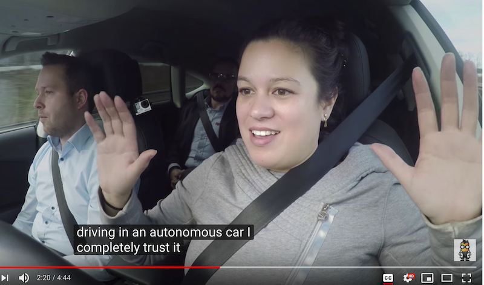

[Nvidia GPU, Audi autonomous driving](https://www.youtube.com/watch?v=DjAJnQoNdMA)   
Cool comparison of learning rate of Brain vs. CPU vs. GPU around 50 second mark

Notes:

* [Nvidia GPU, Audi autonomous driving](https://www.youtube.com/watch?v=DjAJnQoNdMA)


---


## Hardware - TPU (Tensor Processing Unit)

 

 * A [Tensor processing unit (TPU)](https://en.wikipedia.org/wiki/Tensor_processing_unit) is an AI accelerator application-specific integrated circuit (ASIC) developed by Google specifically for neural network machine learning

 * More capable the CPUs / GPUs in certain tasks

 * Designed for [Tensorflow](https://github.com/tensorflow/tensorflow)

 * Designed for high volume computes

     - A TPU can process 100 million photos a day

 * Available in Google Cloud platform
 


Notes:

https://en.wikipedia.org/wiki/Tensor_processing_unit
https://github.com/tensorflow/tensorflow


---

## Video - TPU


[Google TPU](https://www.youtube.com/watch?v=UsDhVx6cOrw)  
(up to 5 min mark)


Notes:

https://www.youtube.com/watch?v=UsDhVx6cOrw


---


## Incredible Growth of AI Power

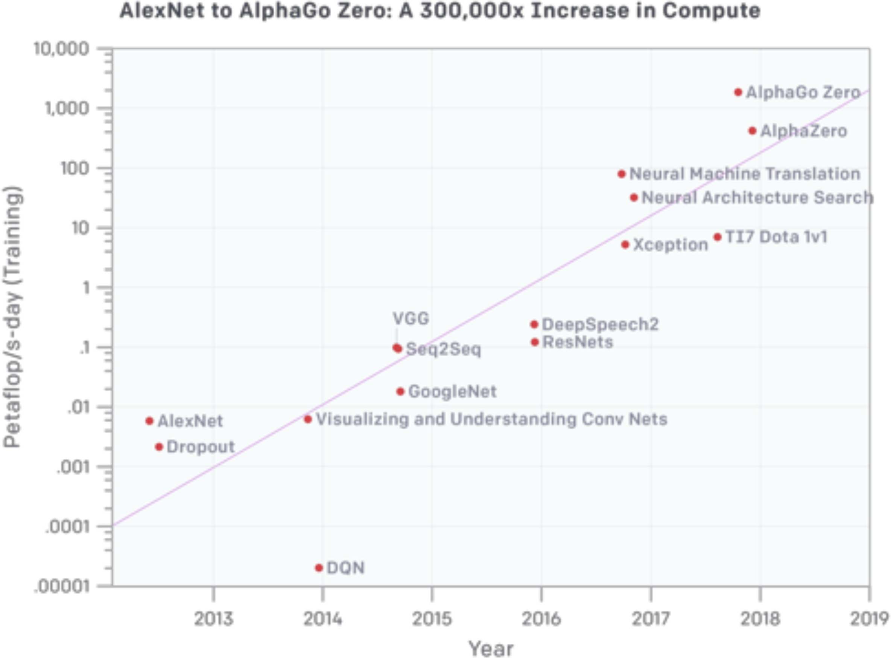


Notes:


---

## Incredible Growth of AI Power


 * Since 2012, the amount of compute used in the largest AI training runs has been increasing exponentially with a 3.5 month-doubling time (by comparison, Moore's Law had an 18-month doubling period)Source: (https://blog.openai.com/ai-and-compute/)
 * Phases:
     - Before 2012: It was uncommon to use GPUs for ML, making any of the results in the graph difficult to achieve.
     - 2012 to 2014: Infrastructure to train on many GPUs was uncommon, so most results used 1-8 GPUs rated at 1-2 TFLOPS for a total of 0.001-0.1 pfs-days.
     - 2014 to 2016: Large-scale results used 10-100 GPUs rated at 5-10 TFLOPS, resulting in 0.1-10 pfs-days. Diminishing returns on data parallelism meant that larger training runs had limited value.
     - 2016 to 2017: Approaches that allow greater algorithmic parallelism such as huge batch sizes, architecture search, and expert iteration, along with specialized hardware such as TPU's and faster interconnects, have greatly increased these limits, at least for some applications.

Notes:

https://blog.openai.com/ai-and-compute/


---
## Advances in Deep Learning Research

- In recent years, lot of money is chasing Deep Learning

- Companies like Google / Facebook / Amazon are in an 'arms race' to hire the best talent in AI

- Lot of research going on in public / private sectors

- Organizations like OpenAI are fostering research in public domain

---
## Creating Deep Learning Models Have Become Easier

- Historically, neural network models had to be coded from scratch
    - Converting math into code, testing and debugging
    - This could take weeks or months

- **Now tooling and libraries have gotten so much better**
    - High level tools like Keras and efficient libraries like Tensorflow, allow us to code complex models very quickly

---
## Availability of Pre-Trained Models

> "If I have seen further it is by standing on the shoulders of giants"  
>  -- Isaac Newton


- Creating complex models takes lot of data and lot of training
    - this can take huge amount of compute power (days or weeks of training)

- Now, we don't have to start from scratch

- There are lot of high quality models that are open source.  We can start with them and tweak them to fit our needs

- _This is probably the biggest reason DL has become mainstream_

- See example on next slide

---

## Model Zoos


- Building and training complex models from scratch takes a lot of effort and compute

- Luckily, there are lot models available publicly  
    - Computer vision models : LeNet, AlexNet, ZFNet, GoogLeNet, VGGNet, Inception

- Available model zoos
    - [Tensorflow model zoo](https://github.com/tensorflow/models)
    - [Caffe model zoo](https://github.com/BVLC/caffe/wiki/Model-Zoo)


---


## Building on Other Models

- Say we want to develop a model that can classify people into male / female

- Rather than starting from scratch, we can start with a model that can recognize peopole

- And then train it more to classify them into male/female


---


## AI History


 * [Video](https://www.youtube.com/watch?v=056v4OxKwlI)

Notes:

https://www.youtube.com/watch?v=056v4OxKwlI


---

# End of Part 1 : State of AI

---

# Part 2 : AI Technologies

---

## Demo: Machine Learning Basics


[Link](https://www.youtube.com/watch?v=HcqpanDadyQ)

Notes:

https://www.youtube.com/watch?v=HcqpanDadyQ


---

# AI Vocabulary


---
## AI Vocabulary : AI / Machine Learning / Deep Learning


 *  **Artificial Intelligence (AI):** Broader concept of "making machines smart"

 *  **Machine Learning:** Current application of AI that machines learn from data using mathematical, statistical models

 *  **Deep Learning: (Hot!)** Using Neural Networks to solve some hard problems


Notes:


---

## AI / Machine Learning / Deep Learning


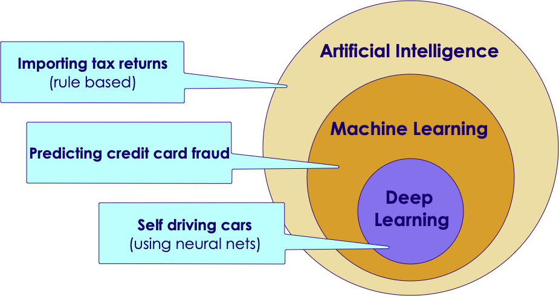

Notes:


---

## AI Vocabulary: Data Science 


- **Data Science** : Deriving intelligence from data 

- For example, a real estate company can use data science to figure out which types of homes to build to maximize profits

- A machine learning algorithm can learn from the past data and predict house prices for new houses coming on market

| Bedrooms (input 1) | Bathrooms (input 2) | Size (input 3) | Sale Price (in thousands) (we are trying to predict) |
|--------------------|---------------------|----------------|------------------------------------------------------|
| 3                  | 1                   | 1500           | 230                                                  |
| 3                  | 2                   | 1800           | 320                                                  |
| 5                  | 3                   | 2400           | 600                                                  |
| 4                  | 2                   | 2000           | 500                                                  |
| 4                  | 3.5                 | 2200           | 550                                                  |


---

## Data Science vs. Machine Learning

- **Data Science** works with existing data and derive intelligence 

- **Machine Learning** learns from existing data and predicts on new/unseen data 

- The definitions are not clear-cut,  some people use these interchangeably

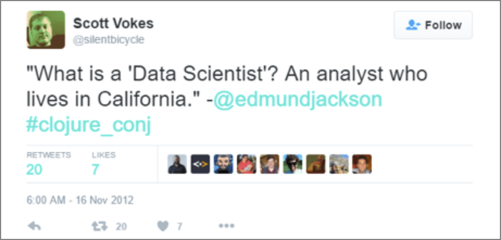

---

## AI Vocabulary : Neural Networks

 - Layers of parallel processing elements, working together to solve very complex tasks

 - Inspired by neurons from human brain

 - Used in Deep Learning

 - (More on this later)
 


Notes:

---

## AI Vocabulary : Training vs. Inference

*  **Training**
    - Feeding data to an algorithm to create a model
    - Computationally expensive (can take hours, days, weeks)
        - Google translate model trains on 3 billion+ words on 100+ GPUs for week+
*  **Prediction / Inference**
    - Created model answering questions (very fast)
    - "is this transaction fraud / not-fraud"
    - "What are the recommended movies for this user"


---

## Data Size Vs. Model Size

- An algorithm can train on small / large / huge amount of data (depending on problem complexity)
    - Since it can be computationally very intensive;  So we may use cluster of computers for training
    - Clusters can contain 100s (or 1000s) of CPUs/GPUs/TPUs

- The resulting model is orders of magnitude smaller in size 
    - it could fit in your phone!


---

## AI Vocabulary: Algorithm vs. Model

* **Algorithm**
    - Algorithms are 'generic' mathematical formulas 
* **Model**
    - algorithm + data ==> model 
* Often Algorithm and Model are used interchangeably

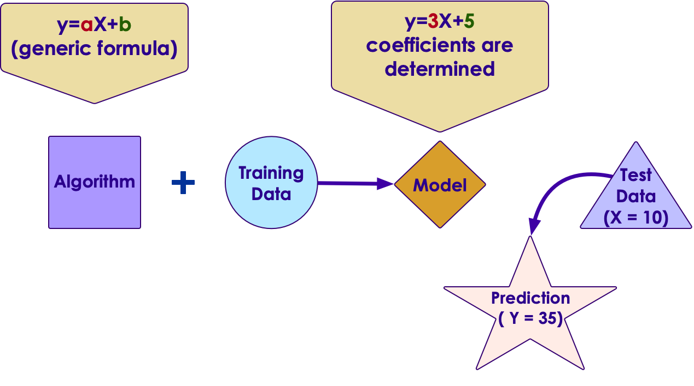
    
---

## Algorithm and Model

   
  
---


# AI and Data

---

## AI Starts with Data 

- Lot of AI algorithms learn from data 

- Generally, more data usually makes smarter algorithms 
    - There are exceptions to this 


---

## Learning From Data 

- Let's start with simple housing sales data 

| Bedrooms (input 1) | Bathrooms (input 2) | Size (input 3) | Sale Price (in thousands) (we are trying to predict) |
|--------------------|---------------------|----------------|------------------------------------------------------|
| 3                  | 1                   | 1500           | 230                                                  |
| 3                  | 2                   | 1800           | 320                                                  |
| 5                  | 3                   | 2400           | 600                                                  |
| 4                  | 2                   | 2000           | 500                                                  |
| 4                  | 3.5                 | 2200           | 550                                                  |

- An machine learning algorithm learns from the above data, and then tries to predict house prices on new data 


| Bedrooms (input 1) | Bathrooms (input 2) | Size (input 3) | Predicted Sale Price (in thousands) |
|--------------------|---------------------|----------------|-------------------------------------|
| 3                  | 2                   | 1900           | ???                                 |
| 4                  | 3                   | 2300           | ???                                 |

---
## Learning Process

 *  **Phase 1 : Training**
     - Algorithm learns from the data to create a model
     - This step can get computationally expensive.  
     Hours / days / weeks (this is why we use GPU / TPUs  and clusters of computers)
 *  **Phase 2 : Prediction / Inference**
     - Once a model is created it can answer questions 
        - "what would be the sale price for this house"
        - "is this transaction fraud / not-fraud"
    - Prediction is very fast (milli seconds)


Notes:


---
## Structured Data vs. Unstructured Data

| Structured Data                                          | Unstructured Data                             |
|----------------------------------------------------------|-----------------------------------------------|
| Data has well defined structure.                         | Structure is not well defined or non existing |
| Data in a database tables are well defined.  10 columns, first column is integer, second column is timestamp ..etc | videos, images                                             |


---

## Structured Data Examples

- Pretty much any data stored in a schema database

| Bedrooms | Bathrooms | Size | Sale Price (in thousands) |
|--------------------|---------------------|----------------|------------------------------------------------------|
| 3                  | 1                   | 1500           | 230                                                  |
| 3                  | 2                   | 1800           | 320                                                  |
| 5                  | 3                   | 2400           | 600                                                  |
| 4                  | 2                   | 2000           | 500                                                  |
| 4                  | 3.5                 | 2200           | 550                                                  |

- Text data (CSV, JSON) can have structure too

JSON data 

```json 
{   "name" : "Joe",
    "email" : "joe@gmail.com" }
```

CSV data (Comma Seperated Values)
```
joe,joe@gmail.com 
jane,jane@gmail.com
```

---

## Unstructured Data Examples


- Text
    - Documents : email, word documents 
    - Survey results (customer feedback)
    - customer support ticket notes 

- Binary data 
    - Audio (phone call recordings)
    - Images
    - Video (YouTube videos)
    


---

## Semi-Structured Data 

- This is 'between' structured and and unstructured

- Data has some structure, but it may not be well defined

- Example, tweet data

```json 
{   "user_id" : "user123", 
    "timestamp" : "2018-09-20 12:00:05 EST",
    "device" : "iPhone X",
    "location" : "34.893, 120.979",
    "tweet" : "Enjoying my first Pumpkin Spice Latte at Starbucks in Seattle downtown  #PSL, @Starbucks",
    "image_url" : "https://imgurl.com/1234"
}
```

**Question to the class: What data points you can extract from above tweet?      Which is structured / unstructured?**

---

## Data 

- Humanity is producing data at a rapid clip
    - 90% of data is generated in last 2 years!
    - 2.5 quintillion bytes of data per day
    
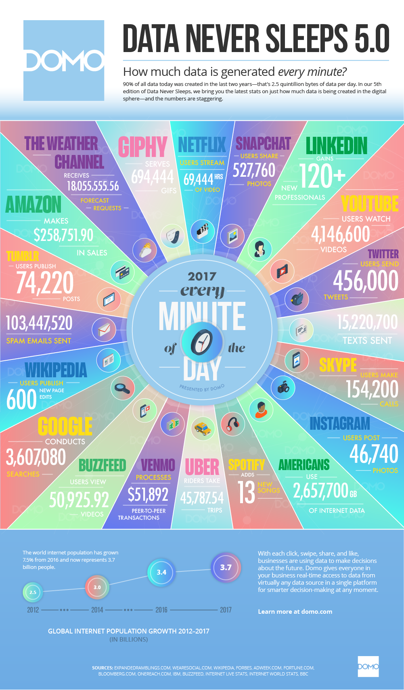
    
Notes: 

- [source: domo.com](https://www.domo.com/learn/data-never-sleeps-5?aid=ogsm072517_1&sf100871281=1)
- [Forbes article](https://www.forbes.com/sites/bernardmarr/2018/05/21/how-much-data-do-we-create-every-day-the-mind-blowing-stats-everyone-should-read/#61df751760ba)
    
---

## Data Growth Trends

- As you can see, unstructured data is growing rapidly 


Notes:

Source : https://www.dubber.net/unlocking-unstructured-data-voice-processing-power-zoe/


---

## Question For The Class 

**Q: Can you name some examples of structured/unstructured data is generated at your home/work ?**


| Structured Data | Unstructured Data |
|-----------------|-------------------|
| ???             | ???               |

---

## Data And AI 

- Majority of the machine learning projects use 'structured data'
    - predicting house prices, identifying credit card transactions ..etc.
    
- This will continue to grow as we get more and more data, and enterprises adopt more AI

- We are only able to make significant headways in processing unstructured data 
    - images , videos
    
- This is largely due to the advances of neural nets


---

## Scaling with Data


 * Deep Learning Algorithms scale better with data


Notes:


---

## 1980's and 1990's


Notes:

Source: Jeff Dean


---

## 1990+


Notes:

Source: Jeff Dean


---

## Now


Notes:


---

## Dos and Don'ts For Collecting Data for AI

AI starts with data, in this section we are going to look at some best practices 

- How to acquire data 

- How to curate/clean data 

- How to deal with 'big data'

---

## Acquiring Data

- Best data is the one you already have or  can collect on your own 
    - Data you already have in your database (e.g. customer data)
    - Website logs 
    
- Data can be acquired from 'data brokers'
    - e.g. Stock market data

- Some data is free 
    - e.g. Census data


---

## Data Responsibilities 

- Usually IT team is responsible building the data infrastructure

- AI team 'uses' data  (they are IT team's clients)

- Mistake:  Spend a lot of time gathering data and then involve AI team
    - Not all data may be useful.  
    - Involve AI team early on, so they can give feedback on data


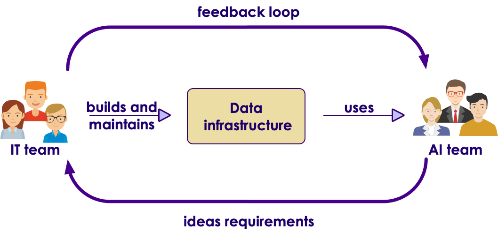


---

## Dealing With Big Data

- Most machine learning doesn't necessarily need 'Big Data'
    - Even modest data can yield surprisingly decent results
    
- However, more data can significantly produce better results

> "More data usually beats better algorithms"   
>     [Anand Rajaraman](https://anand.typepad.com/datawocky/2008/03/more-data-usual.html)  (Walmart Labs)

---

## Comprehending Data Sizes 

| Unit      | Acronym | Size       | Example                                                                                                                                                                                                                            |
|-----------|---------|------------|------------------------------------------------------------------------------------------------------------------------------------------------------------------------------------------------------------------------------------|
| byte      | b       | 1 b        | storing an integer in computer memory                                                                                                                                                                                              |
| Kilo byte | KB      | 1000 bytes | - a small text file <br/> - a typical tweet is about 200 bytes                                                                                                                                                                     |
| Mega byte | MB      | 1000 KB    | - a digital photo ~  2-5 MB <br/> - a song ~  1-5 MB                                                                                                                                                         |
| Giga byte | GB      | 1000 MB    | - a DVD ~ 4.7 GB <br/> - 1hr HD movie stream ~ 3 GB,  1hr 4K movie ~ 7 GB <br/> - typical laptops have 2-16 GB memory <br/> - typical phones have 32 - 256 GB storage <br/> - typical servers have 256 - 512 GB memory |
| Tera byte | TB      | 1000 GB    | - typical laptop hard drive ~ 1 TB <br/> - Now we are entering 'big data' territory                                                                                                                                                |
| Peta byte | PB      | 1000 TB    | - This is truly big data territory <br/> - Facebook generates 4 PB of data every day <br/> - Uber has 100+ PB data                                                                                                         |
| Exa Byte  | EB      | 1000 PB    |                                                                                                                                                                                                                                    |
| Zeta Byte | ZB      | 1000 EB    |                                                                                                                                                                                                                                    |

---

## Big Data

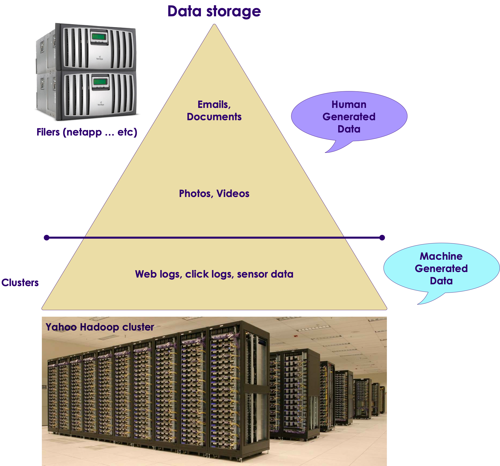

- Traditionally structured data has been stored in databases

- How ever databases have their limitations:
    - they don't scale to huge data sizes
    - or they can be incredibly expensive to store large amount of data 
    - they don't handle unstructured data well


---

## Big Data Systems 

- Storing big data requires large 'cluster' systems 

- Choices
    - On premise :  Hadoop 
    - Cloud storage : Amazon S3, Google Cloud Storage, Azure storage

---

## Hadoop

- Hadoop was developed at Yahoo and open sourced around 2006

- Became 'the' platform for Big Data -- namely on premise

- Hadoop provides **distributed storage** and **distributed computing**

- Can scale upto 1000s of nodes


---

## Hadoop Storage Cost 

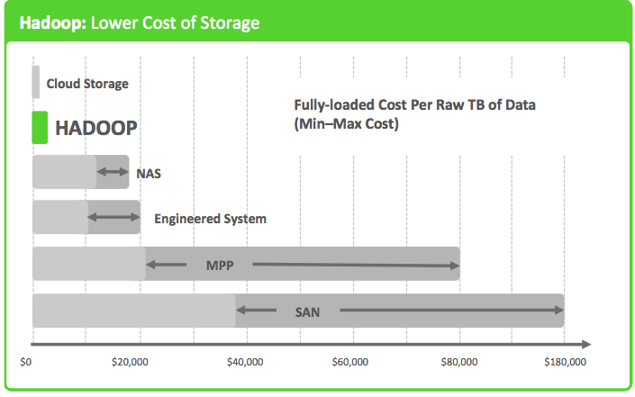

---

## Cloud Storage Cost

Cloud storage costs vary depending lot of factors (like volume, usage ..etc).  These are to give you an idea.  Plus the costs seem to go down each year.   
For accurate pricing, see the provided links

|                     | Amazon S3                                       | Google Cloud Storage                                  | Azure Storage                                                     |
|---------------------|-------------------------------------------------|-------------------------------------------------------|-------------------------------------------------------------------|
| Cost per TB / month | $23                                             |   $26                                                   | $20                                                               |
|                     | [More info](https://aws.amazon.com/s3/pricing/) | [More Info](https://cloud.google.com/storage/pricing) | [More info](https://azure.microsoft.com/en-us/pricing/calculator) |

---


# Doing AI Projects 

---

## What Problems Can AI Solve?

- Andrew Ng's  __"one second"__ rule  
"If you can do a task with less than ONE second of thought process, AI can do that easily"

- What AI can do now
    - Classifying email as spam / not spam
    - Translating english sentence to Japanese
    - Identifying an image (car vs boat)
    - Identify damaged products off assembly line
    - Customer support ticket routing
    - self driving car : figuring out what is in front of it
    - Identifying cancer cells from Xray image
    
 &nbsp; &nbsp;


---

## What AI Can not do 

- **Complex tasks that combines multiple skills**

- Do market research and write a report

- If you don't have enough data
    - if you train AI using 1000s of xray images it can learn to classify.  What if you only have handful of images?  
    AI may not be able to provide good results

- Understand human intension  
For example, if a construction worker is waving you to stop or continue?

 &nbsp; &nbsp;


---

## Some Thoughts on Evaluating  AI Projects

- AI can do 'certain tasks', it may not be able to automate the whole work flow

- For example, let's say we are deploying AI to handle customer tickets.

- AI can easily 'route' tickets to appropriate queues and priorities 
    - "Item arrived late, even though I paid for expedited shippping.  can I get a refund?" ==> Send it to 'refund' queue
    - "Item arrived damaged, can I return it?" ==> send it to 'return' queue
    
- What AI can not do  (the whole workflow):
    - Read the support ticket 
    - call customer to confirm the issue 
    - then issue a refund
    - update the sales register
---

## Some Thoughts on Evaluating  AI Projects

- Do you have enough data to get started?

- For example let's say you want to identify damaged products off the assembly line, do you have enough pictures of good items and damaged items?


---

## Some Thoughts on Evaluating  AI Projects

- An AI system can evaluate an MRI scan pretty quickly to determine if the patient has a tumor

- How ever it is not going to be able replace an trained oncologist, because they do lot of other things 
    - train interns 
    - consult with patients 
    - evaluate equipments and treatments
    
- So an oncologist may deploy an AI system to help him with reviewing MRI scans quickly.  
So he/she can focus on other 'higher order' functions

---
    
## Quiz For the Class: AI Projects


- Pick a couple of potential AI projects that is applicable to you 

- What kind of data do you need for machine learning?  
It may help to think along these lines 
    -  Data we already have
    - Data we can collect 
    - 3rd party data - FREE or minimal cost
    - 3rd party data - Premium 

- What kind of data infrastructure do you have now?  Can it scale to handle future growth?

    
---
# Machine Learning vs. Deep Learning

---

## Machine Learning / Deep Learning


---


## Machine Learning vs. Deep Learning

| Features                             | Machine Learning                                              | Deep Learning                                                    |
|--------------------------------------|---------------------------------------------------------------|------------------------------------------------------------------|
| Data size,(see next slide for graph) | Performs reasonably well on small / medium data               | Need large amount of data for reasonable performance             |
| Scaling                              | Doesn't scale with large amount of data                       | Scales well with large amount of data                            |
| Compute power                        | Doesn't need a lot of compute (works well on single machines) | Needs a lot of compute power (usually runs on clusters)          |
| CPU/GPU                              | Mostly CPU bound                                              | Can utilize GPU for certain computes (massive matrix operations) |
| Feature Engineering                  | Features needs to specified manually (by experts)             | DL can learn high level features from data automatically         |
| Execution Time                       | Training usually takes seconds, minutes, hours                | Training takes lot longer (days)                                 |
| Interpretability                     | Easy to interpret                                             | Hard to understand the final result                              |
| Data Formats                         | Structured data                                               | Can handle unstructured data                                     |


Notes:

https://www.analyticsvidhya.com/blog/2017/04/comparison-between-deep-learning-machine-learning/


---

## Deciding Between Machine Learning(ML) and Deep Learning(DL)

- This is not an easy decision, but here are some factors to think about 

- Have structured data?  Then both ML and DL can be used 

- Got unstructured data?  Probably deep learning 

- Do keep in mind, deep learning usually needs 
    - lot of data 
    - and lot of compute time   
    to produce good results

    
---

## AI Scaling with Data


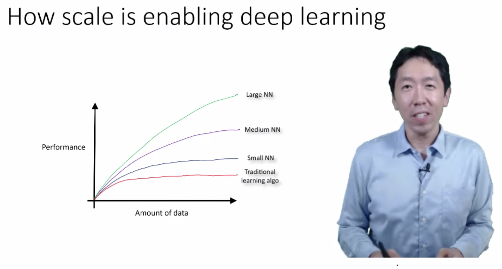


[Video by Andrew Ng](https://www.youtube.com/watch?v=LcfLo7YP8O4)

Notes:

https://www.youtube.com/watch?v=LcfLo7YP8O4

---

# Machine Learning

---

## Types of Machine Learning

 *  **Supervised Machine Learning:**

     - Model learns from labeled training data

     - And predicts on new data

 *  **Unsupervised Machine Learning**

     - Model tries to find natural patterns in the data

 *  **Semi-Supervised Learning**

     - Model is trained with a training set which contains unlabeled (usually lot) and labeled (usually little) data

     - Example: Large images archive only a few of them are labeled (cat, dog, person) and majority are unlabelled

 *  **Reinforcement Learning**

     - Based on 'game play'  (rewards vs penalties)

Notes:


---

## Machine Learning Popular Algorithms

| Category            	| Sub Category    	| Example                                                                          	| Algorithms                                                         	|
|---------------------	|-----------------	|----------------------------------------------------------------------------------	|--------------------------------------------------------------------	|
| **Supervised**      	| Regressions     	| -Predict house prices<br/>-Predict stock price                                       	| -Linear Regression<br/>-Polynomial<br/>|
|                     	| Classifications 	| -Cancer or not <br/>-Spam or not                                                      	| -Logistic Regression<br/>-SVM<br/>-Naive Bayes<br/>-K Nearest Neighbor (KNN)<br/>   	|
| **Unsupervised**    	| Clustering      	| -Group Uber trips<br/>-Cluster DNA data                                              	| -Kmeans<br/>-Hierarchical clustering                                   	|
|                     	|                 	| Dimensionality reduction                                                         	| PCA                                                                	|
|                     	|                 	| Text mining                                                                      	| Topic discovery                                                    	|
| **Recommendations** 	|                 	| Recommend movies                                                                 	| Collaborative Filtering                                            	|

Notes:

http://machinelearningmastery.com/supervised-and-unsupervised-machine-learning-algorithms/


---

# ML Algorithms: Supervised

---

## Machine Learning Types: Supervised

 * Model learns from (training) data

 * Then predicts on 'unseen' data

| Algorithms     | Description                                                            | Applications                                |
|----------------|------------------------------------------------------------------------|---------------------------------------------|
| Classification | Categorize things into groups                                          | -Spam classification,Fraud / no fraud       |
| Regression     | Dealing with numbers and calculate the probability something happening | -Predict house prices,-Predict stock market |


Notes:

Image credit (Creative Commons): Pexels.com


---

## Supervised Learning Example - Regression

 * Predicting stock market

 * Train the model using training data (already known)

 * Test performance using test data (already known)

 * Predict no new data (unseen)


Notes:


---

## Supervised Learning Methodology

 * Split the data set into

     - Training set: Train model(Training set should represent data well enough)

     - Test set: Validate the model

 * Training / Test split is traditionally  70% - 30%  or 80% - 20%
    - These are randomly sampled

 * Tweak the dials to increase or decrease the proportion


Notes:

Facebook used 95%/5% `Understanding text from scratch`


---

## Supervised Learning - Classification


 * Classification is a model that predicts data into "buckets"

 * Examples:

     - Email is  **SPAM**  or  **HAM**  (not-SPAM)

     - A cell is  **cancerous**  or  **healthy**

     - Hand-written numbers --> any digits 0, 1, 2,..., 9

 * Classification algorithm learns from training data
 
 * Then predicts on new/unseen data


Notes:


---

## Classification Applications


 * Web

     - Email is spam or not

     - Website is authentic or fraudulent

 * Medicine

     - Is this cell cancerous or not?

 * Finance

     - Credit card transaction fraudulent or not

 * OCR

     - Recognizing characters and symbols

Notes:


---

## AI Created Art Sold for $400k @ Christie's


 * [Link](https://www.vox.com/the-goods/2018/10/29/18038946/art-algorithm)

 * [obvious-art.com](http://obvious-art.com/)


Notes:

https://www.vox.com/the-goods/2018/10/29/18038946/art-algorithm

http://obvious-art.com/


---

# ML Algorithms: Unsupervised

---

## Machine Learning Types: Un Supervised

 * No training needed

 * Algorithm tries to find patterns in data


| Algorithms               | Description                             | Applications                                                 |
|--------------------------|-----------------------------------------|--------------------------------------------------------------|
| Clustering               | Find naturally present patterns in data | -Identify news stories (sports / business),-Gnome clustering |
| Association              | Find similar patterns                   | -people who buy A also buy B                                 |
| Dimensionality Reduction | Reduces number of features              | -Reducing 1000s of variables into manageable size            |


Notes:


---


## Clustering Use Cases: Fraud / Anomaly Detection


 * Anomaly detection

     - Find fraud

     - Detect network intrusion attack

     - Discover problems on servers

 * Clustering does not necessarily detects fraud

     - But it points to unusual data

     - And the need for further investigation


Notes:


---

## Unsupervised Example: Google News


 * Google News algorithm automatically groups **related news stories**  into sections

* **Question to class** : Why is this not a 'classification' problem, but instead a clustering problem?


Notes:


---

## Clustering


 * Clustering finds natural groupings in data

 * Humans naturally cluster data we encounter

     - Categorizing, organizing, etc.

     - Our brains seek patterns

 * Why do we cluster?

     - To understand our data

     - To find "more like this"


Notes:


---

## Clustering Applications


 * Biology
     - Genomics grouping
 * Medicine
     - Xray/CAT image analysis
 * Marketing
     - Consumer grouping ("soccer mom"...etc.) and behavior analysis
 * Web
     - Search result grouping
     - News article grouping (Google news)
 * Computer Science
     - Image analysis
 * Climatology
     - Weather pattern analysis (high pressure/warm regions)

Notes:

https://en.wikipedia.org/wiki/Cluster_analysis


---

## Clustering Use Case: Customer Purchases @ Walmart


 * Here is how Walmart is segmenting customer purchases
     * Pharmacy Runs
     * Strictly Grocery
     * Grocery and General Merchandise
     * Michaels Run
     * Party Trip
     * Toys
     * Electronics
     * Baby
     * Gallon of Milk
     * Booze and Calories
     * and more ...

 * **Question for class**: What is the use case for this?


Notes:

https://www.kaggle.com/c/walmart-recruiting-trip-type-classification


---

## Machine Learning: Semi-Supervised


 * We are still learning, but not all data points are 'labelled'

 * But by grouping data points together, the algorithm can 'infer' information, even when labels are missing


Notes:


---

## Semi-Supervised Learning Video


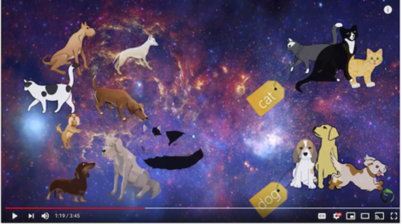


[Link](https://www.youtube.com/watch?v=b-yhKUINb7o)

Notes:

https://www.youtube.com/watch?v=b-yhKUINb7o


---

## Reinforcement Learning


 * Imagine you are playing a new video game.  You have no idea how to play it.How will you learn?

 * Try a few things:

- Open a door --> get more money / ammo
- Jump from a cliff --> got hurt.. Loose health points .. Ouch!


 * This is how 'Reinforcement Learning' works.

     - Algorithm tries a few moves.. And learns automatically

Notes:


---

## Reinforcement Learning


 * Here the robot gets rewarded for 'food' and penalized for walking into fire

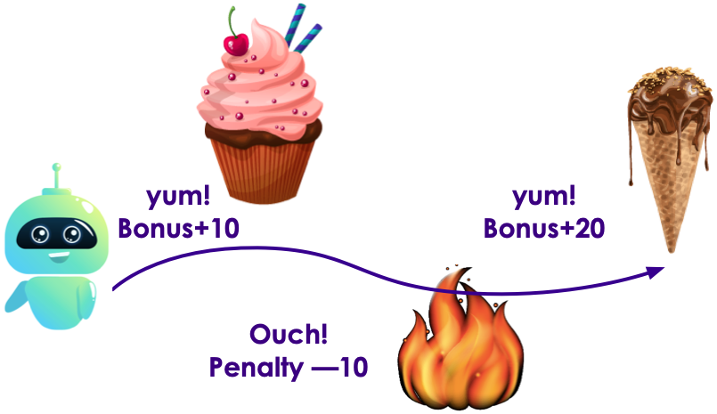


Notes:


---

## Reinforcement Learning Demo: Atari Breakout


[Link](https://www.youtube.com/watch?v=V1eYniJ0Rnk)

Notes:

https://www.youtube.com/watch?v=V1eYniJ0Rnk


---

## Reinforcement Learning Demo: Open AI Bots Playing Dota


 [Link](https://www.youtube.com/watch?v=eHipy_j29Xw)

Notes:

https://www.youtube.com/watch?v=eHipy_j29Xw


---

# Deep Learning

---

## Machine Learning / Deep Learning


Notes:


---

## Machine Learning vs. Deep Learning


 * Deep Learning Algorithms scale better with data


Notes:


---

## A Brief History: Modelling After Neurons in Brain


 * The human brain is a bunch of interconnected neurons.
 * The neuron is like a "gate" - produces an output
 * Some neurons will only 'fire' if they see color red 
 * Some neurons will only fire if they detect a shape of 'hexagon'
 * If both of these cells fire together the brain can intrepret that I am seeing a red stop sign


Notes:


---

## History: 1943: McCulloch Pitts Neural Model


 * McCulloch and Pitts defined a simple model of a Neuron
 * It consisted of N inputs In and N Weights
 * Go to a transfer (sum) function, Apply a threshold to an output
 * Limitations:
     - Binary Output
     - No way to automatically train weights Wn


Notes:


---

## History: 1957: Frank Rosenblatt


 * Frank Rosenblatt invented the Perceptron:
 	- Simplest type of feedforward neural network


Notes:


---

## Perceptron (Single Layer Perceptron)


 *  **The perceptron is a linear model used for binary classification with a simple input - output relationship**

 * Mark 1 Perceptron

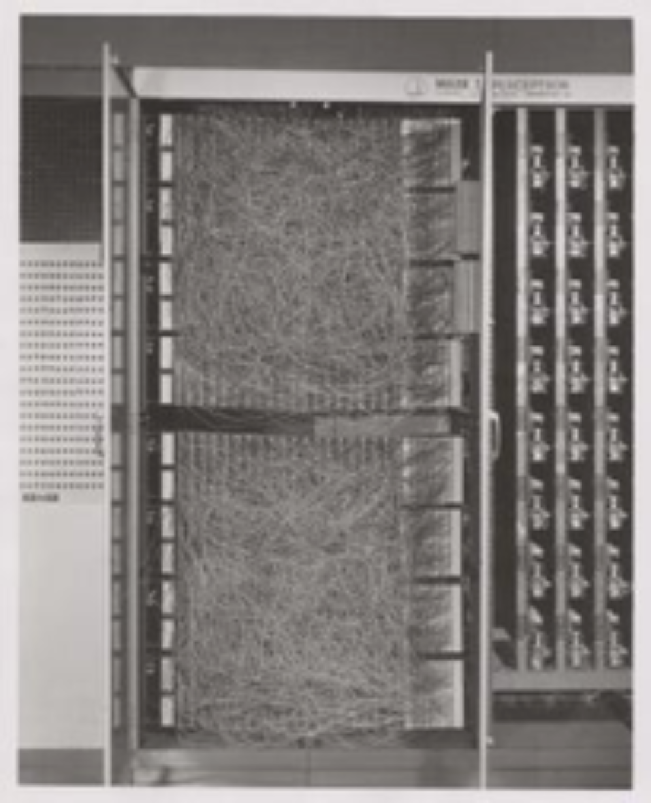


Notes:


---

## A Very Simple Perceptron


 * Here this perceptron is deciding if I should go to a concert.

 * It considers various inputs (weather , friend will join)

 * And different weights

 * If the final score is > 50, then the answer is YES


Notes:


---

## A Very Simple Perceptron


 * What is the outcome if
    * Weather is good
    * And a friend can join?

 * What is the outcome if
    * You can go by public transit
    * And a friend can


Notes:


---

## Perceptron (Generalized)


 * Perceptron will have multiple inputs and an output

| Terminology | Explanation                                                                       |
|-------------|-----------------------------------------------------------------------------------|
| Xi          | input                                                                             |
| Wi          | Weight for the input                                                              |
| x.w         | Dot product of inputs and weights `xi.wi`                                         |
| N           | number of inputs                                                                  |
| b           | Bias term (does not depend on input values, shifts decision boundary from origin) |


Notes:


---

## Constructing Neural Networks


 * We add multiple layers

 * Each layer can have many neurons


Notes:


---


## Power of Neural Networks 

- Think of Neurons like 'legos'

- Each neuron will do a little bit work   
But when you stack them and combine them together, they can model some really complex functions 

- This is what makes them incredibly powerful

 &nbsp;  &nbsp;


---


## 'Deep' Neural Networks


 * If the network has more than ONE hidden layer, it is called DEEP network (or more than 3 layers total including input an output)

 * More layers gives the network the ability to adopt complex data

 * How ever more layers take more time to train

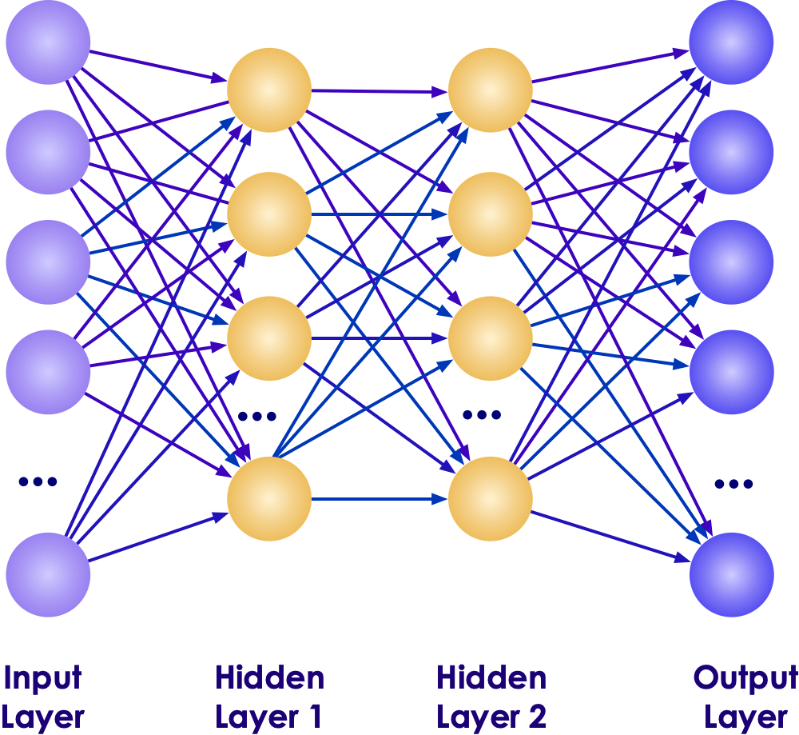


Notes:


---

## Neural Network Example 

- Say we are trying to build a neural net to predict house prices

- Given a few inputs (Bedrooms, Bathrooms ..etc)  the network has to learn to predict the price

- If we provide enough data to the network, it will automatically learn the functions of each neuron !!


---

## Deep Neural Network - Face Recognition


Notes:

Image credit : Facebook research
Source: https://deeplearning4j.org/neuralnet-overview


---

## 'Deep' Neural Networks Simulation


Notes:


---

## Examples of 'Deep' Neural Networks


 * Image Recognition: ResNet (from 2015) with 152 layers


Notes:


---

## DL Application Demo: Digit Recognition


 
[Link](http://myselph.de/neuralNet.html)

Notes:


---

## DL Application Demo: Digit Recognition


[Link](http://scs.ryerson.ca/~aharley/vis/conv/flat.html)

Notes:

http://myselph.de/neuralNet.html


---

## Types of Neural Networks (see next slides for details)


 *  **Convolutional Neural Networks (CNN)** Image recognition

 *  **Recurrent Neural Networks (RNN)** Natural language processing

 *  **Long Short Term Memory (LSTM)** Speech recognition, translation


Notes:


---

## Convolutional Neural Networks (CNN)


 * CNNs are primarily used for image recognition

 * "Celebrity Face Recognition" challenge

     - 4 million labeled images of 4000 celebs

     - 97% accuracy!

     - [Link](https://research.fb.com/publications/)


Notes:

Source: Yaniv Taigman, Ming Yang, Marc'Aurelio Ranzato, Lior Wolf - https://research.fb.com/publications/


---

## CNN Demo: Happy Net


 * Detect facial emotions in real time

 * [Link](https://www.youtube.com/watch?v=MDHtzOdnSgA)


Notes:

https://www.youtube.com/watch?v=MDHtzOdnSgA


---

## Recurrent Neural Networks (RNN)


 * Applications:

     - Natural language processing (Predict the next word in sentence)

     - Machine translation


Notes:

Source: Rowel Atienza - https://towardsdatascience.com/lstm-by-example-using-tensorflow-feb0c1968537


---

## RNNs (translation)


Notes:

Source: https://www.analyticsindiamag.com/overview-of-recurrent-neural-networks-and-their-applications/


---

## Combining Neural Networks


 * Here is an example of combining CNN and RNN

     - It recognizes the image (CNN)

     - And captions it (RNN)


Notes:

Source: Source: Andrej Karpathy, Li Fei-Fei - https://cs.stanford.edu/people/karpathy/deepimagesent/


---

## Video - Advances in Hardware


 * [Google TPU](https://www.youtube.com/watch?v=UsDhVx6cOrw) (up to 5 min mark)


Notes:

https://www.youtube.com/watch?v=UsDhVx6cOrw


---

## DL Application Demo: Google Draw


Quick-drew-01.png

 * https://quickdraw.withgoogle.com/


Notes:


---

# AI Workflow / Process

---

## AI Workflow


Notes:


---

## How to do Machine Learning


 *  **1 - Problem Definition:** What are we trying to solve

 *  **2 - Collect data** More data we have, the better the algorithms become.  This data can come from internal logs (clickstreams) or external sources (credit scores of customers)

 *  **3 - Prepare Data** Raw data is hardly in a form to be used.  It needs to be cleansed, tagged and curated before ready to use

 *  **4 - Train a model** Feed the training data to model so it can learn

 *  **5 - Evaluate the model** Test the model accuracy

 *  **6 - Improve the model** Either by adding more training data, choosing a different algorithm

 *  **7 - Deploy the model**

Notes:


---

## 1 - Problem Definition


 * This may not be as easy as it seems

 * Known Knowns

     - Daily web traffic

 * Known Unknowns

     - What are most popular pages?

     - Do big connectors matter in a social graph?

 * Unknown Unknowns

     - Is there a connection between X and Y

Notes:


---

## Class Discussion:


 * What are some of the problems you are facing that Data Science / Machine Learning might be a solution?

Notes:


---

## 2 - Collecting Data


 * Data Sources can be

     - External: government data, public data,...

     - Internal: collected data (clickstream etc.)

 * External Data challenges

     - Compliance, security concerns,...

     - How much can we get? API throttling.

     - Is the data in useable format?

 * May need to bring data from different systems and in usually in different formats.

     - Clicklogs are text files.

     - Customer data can be from a database.


Notes:

---

## Class Discussion: Data Collection Challenges


 * What are some of the problems you are facing / anticipating for collecting data?

Notes:


---

## 3 - Data Preparation / Cleaning


 * Problems with raw data sets

     - Non-usable format (say in Excel spreadsheet format)

     - Contains errors & wrong values

     - Missing values

     - Data is spread across multiple silos

 * Data scientists spend a lot of time cleaning and massaging raw data, to get them ready for analysis.

 * Crucial part of data science

 * Can consume a lot of time (50% - 80%  of the project!!!)

 * Least sexy


Notes:


---

## Class Discussion: Data Cleanup


 *  **What do you think involves in cleaning up data?**

Notes:


---

## 3.5 - Exploratory Data Analysis (EDA)


 * Before doing `machine learning` on data, understand the data.

 * Basic questions

     - Is there a pattern?

     - Are there lot of outliers?  (May skew analysis. Should we keep these or throw them away?)

 *  **Visualizations**  can help greatly!

     - Just do some quick & dirty graphs.

 * Identify `interesting segments`

 * Need to sample?  Or process entire data set?


Notes:


---

## 4 - Model Building


 * Don't do this until you have a good understanding of data.(See previous section.)

 * Pick right modeling technique

     - Clustering

     - Classifications

     - Etc.

 * Pick the right model for data

     - Don't get 'hung up' on one model.

     - Try a few to identify the best fitting model.

     - Experience counts!


Notes:


---

## 4.5 - Experiment to Production ('Mind the Gap')


 * Data Scientists develop their models on laptops with small data

 * There is a 'deployment gap' when it comes time to go to production

 * Solutions:

     - Frameworks like Spark are solving this

     - Cloud vendors are providing solution


Notes:


---
## Streamlining Prototyping --> deploy


 * Language neutral

 * Same model - no need to re-implement

 * Fast deploy!


Notes:

https://www.slideshare.net/julesdamji/apache-spark-mllib-2x-how-to-productionize-your-machine-learning-models

---

## 5 - Model Validation
 

 * Models need to be `verified`  / `validated`

 * Split the data set into

     - Training set: build / train model

     - Test set: validate the model

 * Initially 70% training,  30% test

 * Tweak the dials to decrease training and increase validation.

 * Training set should represent data well enough.


Notes:


---

## 6 - Improving the Model


 * Sometimes we don't get desired accuracy from the model

     - Say we need 90% accuracy, but the model is only at 70%

 * How to improve?

     - Can we find more training data?

     - Tune model parameters

     - Or even choose another model


Notes:


---

## 7 - Deploy Model


 * We are happy with the model's performance

 * So we deploy the model on production / live system where it can start predicting / inferring

 * Monitor the model in production


Notes:


---

## Class Discussion : AI Life Cycle


 * Do you have any stories to share about AI work flow?

     - Issues

     - Best practices?
     


Notes:


---

## Reinforcement / Neural Net Demo: Alpha GO


[Link](https://www.youtube.com/watch?v=9xlSy9F5WtE)


Notes:

- https://www.youtube.com/watch?v=9xlSy9F5WtE
- https://money.cnn.com/2017/09/29/technology/future/alphago-movie/index.html


---

## Reinforcement/ Neural Net Demo: Alpha GO Explained


 [Link](https://deepmind.com/blog/alphago-zero-learning-scratch/)

Notes:

https://deepmind.com/blog/alphago-zero-learning-scratch/


---

# AI Software Ecosystem

---

## AI Software Eco System

|             | Machine Learning          | Deep Learning               |
|-------------|---------------------------|-----------------------------|
| Java        | -Weka<br/>-Mahout             | DeepLearning4J              |
| Python      | -SciKit<br/>-Numpy, Pandas  | -Tensorflow<br/>-Pytorch<br/>-Caffe |
| R           | -Many libraries           | -Deepnet<br/>-Darch             |
| Distributed | Spark                     | Spark                       |
| Cloud       | -AWS<br/>-Azure<br/>-Google Cloud | -AWS<br/>-Azure<br/>-Google Cloud   |


Notes:


---

## AI and Big Data

 * Until recently most of the AI work is done on `single computer`

 * Most R/Python/Java libraries are `single machine based`

 * Now Big Data tools make it possible to run AI algorithms at massive scale-distributed across a cluster


Notes:


---

## Machine Learning vs. Big Data

| Traditional ML                                 | ML on Big Data                               |
|------------------------------------------------|----------------------------------------------|
| All (or most) data fits into single machine    | Data is distributed across multiple machines |
| Data almost / always in memory                 | Memory is scarce                             |
| Optimized for heavy iterative computes         | Optimized for single pass computes           |
| Maintains state between stages                 | stateless                                    |
| CPU bound                                      | IO bound (disk / network).                   |
| GPU (Graphical Processing Unit) seldom engaged | GPUs are utilized increasingly               |

Notes:


---

## AI Ecosystem and Tools


Notes:

Anaconda:
Python and R distribution for machine learning and data science. Simplifies package management and deployment supporting Windows, Linux and MacOS.

Python:
Interpreted programming language supporting multiple programming paradigms. Popular for data science due to code readability, ease of data manipulation and many libraries aimed at data science needs.

R:
Programming language and environment for statistical computing with powerful graphical and modeling features.

Scala:
Functional programing language with language interoperability with Java. Scala code runs on a Java Virtual Machine. Many data science frameworks that are built on are written in Scala.

cuDDN:
Deep Neural Network library for high-performance GPU acceleration.

NCCL:
The NVIDIA Collective Communications Library (NCCL) implements multi-GPU and multi-node collective communication primitives that are performance optimized for NVIDIA GPUs.

NumPy:
Scientific computing library for Python and is the foundation for important data science libraries including Pandas, Matplotlib and Scikit-learn.

Pandas:
Data structure and analysis library for Python. Allows you to do data cleaning and preparation for data science in addition to analysis.

Matplotlib:
Plotting library for creating plots, histograms, power spectra, bar charts, errorcharts, scatterplots, etc. Used heavily in Jupyter notebooks to visualize data.

Scikit-learn:
ML python library featuring many popular ML algorithms

WEKA:
Java ML visualization tools and algorithms.

TensorFlow:
Most popular dataflow programing framework used heavily for ML/DL. Has good visualization, monitoring and debugging features which make it good for production.

Pytorch:
The second most popular ML/DL framework which does not have as many production features as TensorFlow but is more intuitive and uses dynamic computation graphs which makes it extremely popular for research.

Keras:
Is a widely used DL python library/high level API which front ends ML frameworks like TensorFlow to make it building and deploying Neural Networks easier. Keras also allows you to import Python DL Models into DL4J.

DL4J:
DL framework for Java which has tight integration with Java based distributed computing frameworks such as Hadoop and Spark. Uses Keras as a Python API.


Jupyter:
Browser-based notebook interface with support for code, text, mathematical expressions, inline plots and other media. Jupyter has a larger community and is a better stand alone tool when compared to Apache Zeppelin. Jupyter is a more natural fit for use with Python Based ML/DL frameworks.

Apache Zeppelin:
Browser-based notebook interface with support for code, text, mathematical expressions, inline plots and other media. Zeppelin has tight integration with Hadoop eco system technologies and Spark plus has better out of box multi-user features when compared to Jupyter.


---
## Deep Learning Libraries

- **Java**
    - [DL4J (Deep Learning 4J)](https://deeplearning4j.org/)
- **Python**
    - [TensorFlow](https://www.tensorflow.org/)
    - [Theano](http://deeplearning.net/software/theano/)
    - [Caffe2](https://caffe2.ai/)
    - [Keras](https://keras.io/)
- **R**
    - Deepnet
    - Darch
- **Mobile**
    - [CoreML](https://developer.apple.com/documentation/coreml) - by Apple
    - [Tensorflow Lite](https://www.tensorflow.org/lite) - by Google


---

## Deep Learning Libraries

|     Library    |          API         |              Platforms              |               Started by              | Year |
|:--------------:|:--------------------:|:-----------------------------------:|:-------------------------------------:|:----:|
| Caffe          | Python, C++, Matlab  | Linux, macOS, Windows               | Y.Jia, UC Berkeley(BVLC)              | 2013 |
| Deeplearning4j | Java, Scala, Clojure | Linux, macOS, Windows, Android      | A. Gibson, J.Patterson                | 2014 |
| H2O            | Python, R            | Linux, macOS, Windows               | H2O.ai                                | 2014 |
| MXNet          | Python, C++, others  | Linux, macOS, Windows, iOS, Android | DMLC                                  | 2015 |
| TensorFlow     | Python, C++          | Linux, macOS, Windows, iOS, Android | Google                                | 2015 |
| Theano         | Python               | Linux, macOS, iOS                   | University of Montreal                | 2010 |
| Torch          | C++, Lua             | Linux, macOS, iOS, Android          | R.Collobert, K.Kavukcuoglu, C.Farabet | 2002 |
 


---
   
## Tools for Deep Learning - Tensorflow

 - [Tensorflow](https://www.tensorflow.org/) is an open source DL framework by Google

 - Became very popular in a very short period of time

 - Based on data flow graphs

 - Language support: Python, C++

 - Supports both CPU and GPU runtimes

 


Notes:

---
## Tools for Scalable Deep Learning - Spark

- Spark is very popular BigData processing platform (distributed compute engine)

- Massively scalable (100s of TBs to PB of data)

- Can cache data in memory for very fast iterations

- Spark ML now supports Tensorflow and Keras as backends

- Language support: Scala, Java, Python, R


---
## Tools for Scalable Deep Learning - BigDL

- BigDL is a scalable Deep Learning framework developed and open sourced by Intel

- Built on Spark, so is very scalable

- Can import models built with other frameworks (Torch, Caffe, TensorFlow)

- Uses [Intel MKL Libraries](https://software.intel.com/en-us/intel-mkl) for  high performance

- https://bigdl-project.github.io


---

## Commercial DL Software


 *  **H2O**
     - Easy to use API
     - Friendly UI
     - Works on top of Spark ("Sparkling Water")
     - Works on cloud platforms
     - Commercially supported
     - Vendor: 0xData

 * SkyMind SKIL
     - Java based ML stack (DJ4J)
     - Native Big Data support (Hadoop/Spark)
     - Runs on bare metal, containers and VMs
     - Commercially supported

  &nbsp;  &nbsp;


Notes:

---
## Image Recognition API Services

- [Clarifai](https://www.clarifai.com/) : winner of the 2013 ImageNet Large Scale Visual Recognition Challenge (ILSVRC) classification

- [Microsoft Cognitive Services](https://azure.microsoft.com/en-us/services/cognitive-services/) : Microsoft won seven tasks at the ImageNet Large Scale Visual Recognition Challenge (ILSVRC) in 2015 with ResNet-152 (a 152 layer network)

- [Google Cloud Vision](https://cloud.google.com/vision/) - Google won 2014 ImageNet Large Scale Visual Recognition Challenge (ILSVRC) with GoogLeNet (22 layers)

- [Amazon Rekognition](https://aws.amazon.com/rekognition/)

- [IBM Watson Visual Recognition](https://www.ibm.com/watson/services/visual-recognition/)


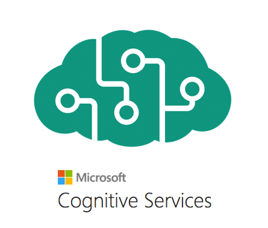


---
## Deep Learning in Mobile

- Why do DL on mobile?
- **Privacy** : so no data leaves the device.  This is important with PII (Personaly Identifiable Information) and Europe's GDPR (General Data Protection Regulation)
- **Reducing Cloud Cost** : By doing DL on the device and minimizing sending data to cloud, we can save time and money
- **Speed** : Sending data to cloud and getting an answer back can take several seconds
    - 10 seconds : user's keep their focus on a screen
    - 1 second : to keep workflow going
    - 0.1 second : users perceive system is working 'instantaneously'


---

## Deep Learning Mobile Libraries

- [CoreML](https://developer.apple.com/documentation/coreml) - by Apple
    - only supported on IOS (Apple) devices
    - supports models from  Keras, Caffe, XGBoost, Scikit-learn

- [Tensorflow Lite](https://www.tensorflow.org/lite) by Google
    - works on IOS and Android

- [MobileNets](https://arxiv.org/abs/1704.04861) - Optimized Convolutional Neural Networks for Mobile Vision Applications


Notes:  
- https://developer.apple.com/documentation/coreml
- https://www.tensorflow.org/lite

---

## Model Benchmarks

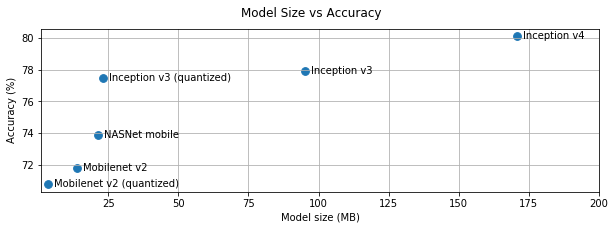


Notes:  
Source : https://www.tensorflow.org/lite/performance/best_practices

---


## Infrastructure Tools


Notes:


---

## Kubeflow

 * Kubeflow = Kubernetes + ML

 * Deploy ML workflows on Kubernetes

 * Portable and scalable

 * Supports all major libraries:Tensorflow, Pytorch, Jupyter

 * Cloud friendly

 * (https://www.kubeflow.org/)


Notes:


---

## Big Data Infrastructure - Hadoop


 * Hadoop is the popular on-premise Big Data platform

 * Hadoop v3.0 offers support for Machine Learning

 * Native support for

     - GPU

     - Docker containers

     - AI frameworks : Tensorflow, Pytorch ..etc.

 * HDFS improvements

     - 1.7 copies instead of 3 copies (reducing storage overhead)

* See next slide for a sample Hadoop reference architecture

Notes:

---

## A Hadoop 3 Reference Architecture


Notes:
- [Source: Hortonworks](https://hortonworks.com/blog/trying-containerized-applications-apache-hadoop-yarn-3-1/)
---

## Big Data Infrastructure - Spark


 * Spark is a distributed framework

 * Can run on Hadoop and Cloud environments

 * Spark has become a very popular framework for Machine Learning and Deep Learning

 * Massively scalable

 * Can use memory (caching) effectively for iterative algorithms

 * Multi Language support: Scala, Java, Python, R


Notes:


---

## Distributed Data Processing


 * Hadoop distributes data across many node

 * Processing also happens on multiple nodes (distributed processing)

 * Data is processed on the node it is located


Notes:


---

## Scalable Machine Learning Systems


 * Actual ML is a small part of overall system!

 * In the diagram below, you can see all the infrastructure goes into building a large scale ML system


Notes:


---

## A Reference Scalable AI Infrastructure


Notes:


---

## A Reference Scalable AI Infrastructure Explained


 *  **HDFS**  is our data lake, it can store huge amount of data, distributed across nodes

 *  **Spark**  is our processing engine, it runs in a distributed fashion on all nodes

 *  **Jupyter**  notebook is used interactively explore data

 *  **Kafka**  does streaming

Notes:


---

## AI in the Cloud


 * Pretty much all cloud vendors have a cloud based AI offering

 * 'AI as Service'

 * Benefits of cloud

     - Not having to worry about infrastructure

     - Scalable infrastructure (start small, grow as needed)

     - Pay per use model

     - 'Deployment gap' is no longer an issue

 * Go from experiment to production very quickly

Notes:


---

## AI Cloud Offerings


| AWS                       | Azure                             | Google Cloud               |
|---------------------------|-----------------------------------|----------------------------|
| -AI as service,'Sagemaker | -AI as service,-'Azure ML Studio' | -AI as service,-'Cloud ML' |


Notes:


---

## Video: Advances in Robotics


[Link](https://www.youtube.com/watch?v=8vIT2da6N_o)

Notes:

https://www.youtube.com/watch?v=8vIT2da6N_o


---

## Demo: Human Powered AI


 * Hive is paying 600,000 strangers to help him build human-powered AI that's 'whole orders of magnitude better than Google'

 * Users are paid a small amount of money to tag images

 * [Link](https://finance.yahoo.com/news/ceo-paying-600-000-strangers-150000655.html)


Notes:

https://finance.yahoo.com/news/ceo-paying-600-000-strangers-150000655.html


---

# AI Gone Wrong

---

## AI Gone Wrong


 * Here we are going look at some cases where AI experiments haven't gone well

 * Links

     - [link1](https://www.zdnet.com/pictures/im-sorry-dave-9-real-times-ai-has-given-us-the-creeps/2/)


Notes:

https://www.zdnet.com/pictures/im-sorry-dave-9-real-times-ai-has-given-us-the-creeps/2/


---

## Facebook's Bots Invent their own language


 * Facebook designed to chat bots to talk to each other

 * They were communicating with each other freely

 * After a year


       - `Bob: "I can can I I everything else."`

       - `Alice: "Balls have zero to me to me to me to me  
        to me to me to me to me to."`


 * This indecipherable language is actually a 'new bot language'

 * Bots developed this on their own

 * FB discontinued the experiment

 * [Link](https://www.independent.co.uk/voices/facebook-shuts-down-robots-ai-artificial-intelligence-develop-own-language-common-a7871341.html)


Notes:

https://www.independent.co.uk/voices/facebook-shuts-down-robots-ai-artificial-intelligence-develop-own-language-common-a7871341.html


---

## Facebook Bots


Notes:


---

## Target Algorithm Predicts Young Woman's Pregnancy 


 * Target's Data Scientists identified 25 products that, when purchased together, predict a woman's pregnancy
 
 * Target started sending out targeted coupons to women shoppers who they have identified as being pregnant
 
 * One angry man walked into Target store and complained to the manager :  
  " *Why are you sending these baby coupons to my daughter, she is still in high school* "
  
 * Few days later, the same man called the manager and apologized  
 " *Sorry, I just learned that my daughter is pregnant* "
 
 * Links : [link1](https://www.zdnet.com/pictures/im-sorry-dave-9-real-times-ai-has-given-us-the-creeps/6/), [link2](https://www.nytimes.com/2012/02/19/magazine/shopping-habits.html?mtrref=www.google.com)

---


## Tesla AutoPilot Crashes Car


 * A Tesla driving on AutoPilot crashes into a truck (2017, Florida)

 * NTSB investigation revealed that AutoPilot system thought the truck was a brightly lit sky, and kept going!

 * Links : [link1](https://www.theregister.co.uk/2017/06/20/tesla_death_crash_accident_report_ntsb/)


Notes:

https://www.theregister.co.uk/2017/06/20/tesla_death_crash_accident_report_ntsb/


---

## AI Mis-Identifying Dogs as Wolfs


 * Farmers used an algorithm to identify dogs vs wolves

 * Algorithm worked great in Summer months

 * In Winter months, it started mis-classifying dogs as wolves

 * Algorithm was rewrote to explain what part of picture it was paying attention to

     -  **The SNOW!**

 * [Link](https://www.youtube.com/watch?v=TRzBk_KuIaM)

 * [Video](http://innovation.uci.edu/2017/08/husky-or-wolf-using-a-black-box-learning-model-to-avoid-adoption-errors/
)(@ 2:30 min)


Notes:

https://www.youtube.com/watch?v=TRzBk_KuIaM
http://innovation.uci.edu/2017/08/husky-or-wolf-using-a-black-box-learning-model-to-avoid-adoption-errors/


---

## Amazon uses AI to Identify Job Applicants


 * Amazon tried an AI algorithm to short-list candidates

 * The algorithm was trained by job applications submitted in 10 year period

 *  **The algorithm was selecting mostly men for technical positions**

     - Because the training data had male bias

 * Links : [link1](https://www.theladders.com/career-advice/amazon-reportedly-scraps-ai-recruiting-tool-biased-against-women
), [link2](https://www.reuters.com/article/us-amazon-com-jobs-automation-insight/amazon-scraps-secret-ai-recruiting-tool-that-showed-bias-against-women-idUSKCN1MK08G)


Notes:

https://www.theladders.com/career-advice/amazon-reportedly-scraps-ai-recruiting-tool-biased-against-women
https://www.reuters.com/article/us-amazon-com-jobs-automation-insight/amazon-scraps-secret-ai-recruiting-tool-that-showed-bias-against-women-idUSKCN1MK08G


---

## Class Discussion


 * Do you know of any cases where AI failed / gone wrong?Please share with the class.

Notes:


---

# AI, Ethics, and Humanity

---

## Elon Musk: "AI will take over humanity"


Notes:


---

## Class Discussion : Ethical AI


 * Let's discuss some the topics

 * AI replacing humans in jobs (e.g. truck drivers)

 * Weaponizing AI (killer drones)

 * Any thing else?

Notes:


---

# Final Thoughts

---

## Design an AI Project


 *  **Class Project**

 * Let's design an AI project that is from your company

Notes:


---

## Anything Else We Want to Discuss?


Notes:


---
## Closing Demo: Everybody Dance Now


 [Link](https://www.youtube.com/watch?v=PCBTZh41Ris)


Notes:

https://www.youtube.com/watch?v=PCBTZh41Ris


---
## Summary


 *  **We covered the following**

 * AI use cases in industry

 * Recent advances in AI

 * Hardware innovations

 * Machine Learning

 * Deep Learning and Neural Networks

 * Software stacks

 * Cloud offerings

Notes:


---

## Further Reading


 * [Great AI Awakening](https://www.nytimes.com/2016/12/14/magazine/the-great-ai-awakening.html) - New York Times profile of on Google Brain and the people behind it

 * [Gentle Intro to Machine Learning](https://monkeylearn.com/blog/a-gentle-guide-to-machine-learning/)

 * [Machine Learning Basics](https://www.analyticsvidhya.com/blog/2015/06/machine-learning-basics/)

Notes:

https://www.nytimes.com/2016/12/14/magazine/the-great-ai-awakening.html
https://monkeylearn.com/blog/a-gentle-guide-to-machine-learning/
https://www.analyticsvidhya.com/blog/2015/06/machine-learning-basics/


---

# Backup Slides

---
