# AI Primer
---

## Lesson Objectives

 * See the potential of AI

 * Understand the basic AI vocabulary

 * Understanding ML / AI

 * Learn industry use cases

 * Learn about AI software & hardware

 * Building Data Science teams

 * Any thing else you want to cover


Notes:


---

## About You and Me


 * About you

     - Your name

     - Your background (developer, admin, manager, etc.)

     - Technologies you are familiar with

     - Familiarity with Machine Learning and AI  **(scale of 1-4; 1-new, 4-expert)**

     -  **Something non-technical about you!**  **(favorite ice cream flavor, hobby, etc.)**

   


Notes:


---

# Part 1: State of AI

Notes:

Primer is pronounced `primmer`
---

## Question for Audience

 * Think of something you did today / this week that is AI powered?

Notes:

---

## Demo - Gmail AI Helper


Notes:


---

## AI - Google Assistant


 * Google Assistant Making phone calls

 * [Link](https://ai.googleblog.com/2018/05/duplex-ai-system-for-natural-conversation.html)

 * Also

     - Google Voice has gotten a lot better in recent years

     - (Story about automatically calling a restaurant)


Notes:

https://ai.googleblog.com/2018/05/duplex-ai-system-for-natural-conversation.html


---

# Why AI Matters?

Notes:

Primer is pronounced `primmer`

---

## AI is a Huge Disruptor / Enabler

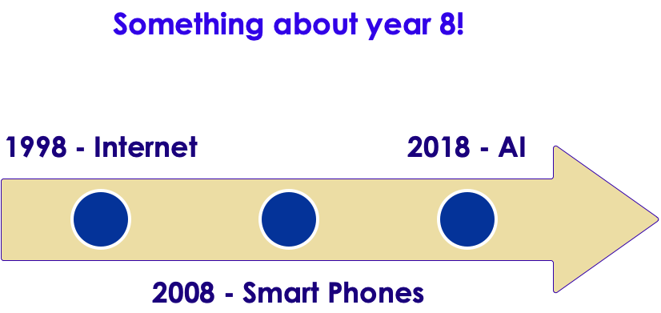


Notes:


---

## AI Growing at a Phenomenal Rate


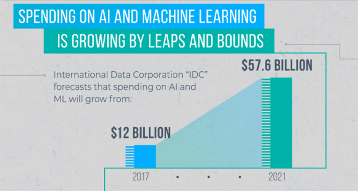

Notes:

https://mapr.com/blog/ai-ml-2018-and-beyond/


---

## Question for Class: Are We in a AI Hype Cycle?


Notes:


---

## Case for AI


Notes:

Image credit: coursera

---

## How Important is AI ?


 * "8 out of 10 companies are already implementing, or planning to adopt AI by 2020"
      - [Oracle](https://www.oracle.com/webfolder/s/delivery_production/docs/FY16h1/doc35/CXResearchVirtualExperiences.pdf)

 * AI is no longer 'novel'

 * Companies are expected to have some AI in their products

     - Just like they are expected to have website that works on a phone

     - Or having an 'app'

Notes:

Stat: 8 out of 10 - Oracle - https://www.oracle.com/webfolder/s/delivery_production/docs/FY16h1/doc35/CXResearchVirtualExperiences.pdf


---

# AI Use Cases

Notes:

Primer is pronounced `primmer`

---

## AI Use Cases at a Glance

| Finance                                                 	| Healthcare                                          	| Retail                               	| Manufacturing                                 	| Network & Security                              	|
|---------------------------------------------------------	|-----------------------------------------------------	|--------------------------------------	|-----------------------------------------------	|-------------------------------------------------	|
| -Fraud Detection -Algorithmic trading -Credit approvals 	| -Diagnosis -Patient care -Treatment recommendations 	| -Recommendations -Customer retention 	| -Identify defects -Fully automated assemblies 	| -Identify security breaches -Facial recognition 	|


Notes:


---

## Use Case - Uber Eats


 * [Link](https://www.youtube.com/watch?v=AiinFkL-pmw&feature=youtu.be)

Notes:

https://www.youtube.com/watch?v=AiinFkL-pmw&feature=youtu.be


---

## Use Case - Uber Eats


 * 6 Billion in Revenue (Uber Eats alone!) within 4 years of launching!

 * UberEats is built with AI from ground up


Notes:

https://venturebeat.com/2018/10/02/uber-eats-and-the-6b-bookings-run-rate-the-ai-success-story-no-one-is-talking-about/


---

## Uber Eats - AI


 * When users are ordering, first step is to choose a restaurant

 * Restaurant Recommendations

     - Recommend restaurants based on past orders

     - Location based

     - Balance new restaurants vs. established restaurants

     -  **Question for class** : What other factor Uber might consider when recommending a restaurant?

 * Once a restaurant is chosen, recommend food items

     - Based on past orders

     - Most popular items

     -  **Question for class** : What other factor Uber might consider when recommending a food item?

Notes:


---

## UberEats - Recommender System


 * Keeping users happy and restaurants happy


Notes:


---

## UberEats - AI Architecture / Workflow


Notes:

Source : https://www.youtube.com/watch?v=AiinFkL-pmw&feature=youtu.be


---

## Use Case - AirBnB - Customer Service

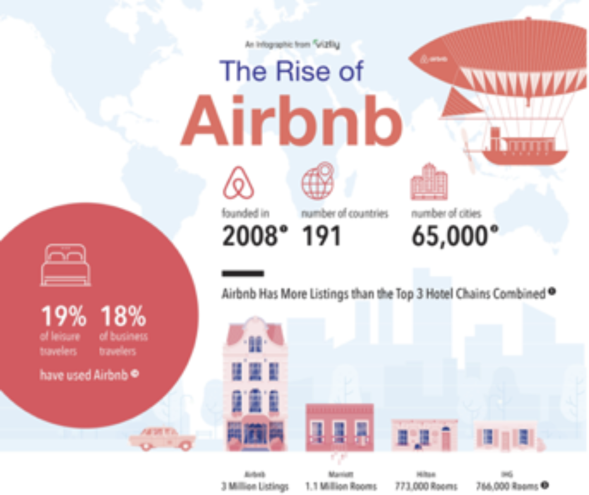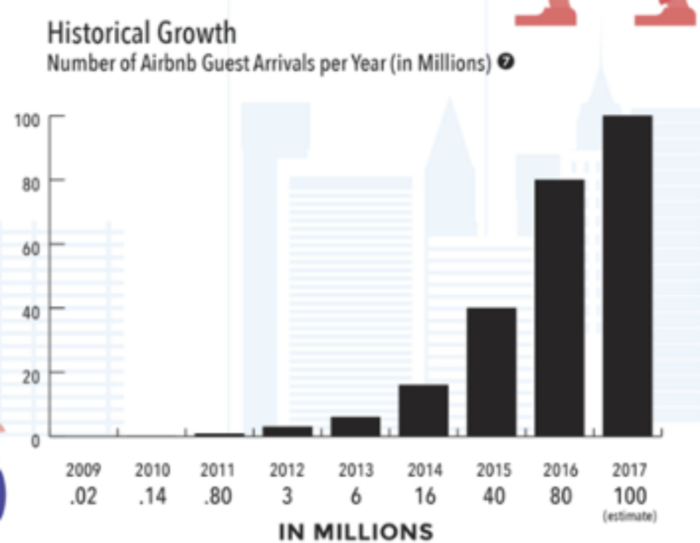


Notes:


---

## Use Case AirBnB


 * Problem

     - 5000 support engineers

     - Needs to scale

 * Solution

     - Deploy AI to handle customer queries

     - AI is smart enough to understand customer questions and provide answers"how do I verify my ID?"

 * [Link](http://bigdatausecases.info/entry/airbnb-driving-a-higher-level-of-customer-support-with-machine-learning)

Notes:

http://bigdatausecases.info/entry/airbnb-driving-a-higher-level-of-customer-support-with-machine-learning


---

## Use Case in Finance: Capitol One - Credit Card Fraud Prevention


 * Capitol ONE:

     - 365 Billion in assets,

     - 8th largest bank, 4th largest credit issuer

 * Huge volume

     - 20 million transactions a day

     - Keep history for 60 days

---
## Use Case in Finance: Capitol One - Credit Card Fraud Prevention

 * Used machine learning to reduce credit card fraud.. by flagging suspicious charges

 * Links

     - [Info](http://bigdatausecases.info/entry/a-machine-learning-approach-recommendation-engine-for-real-time-processing-use-case-at-capital-one)

     - [video](https://vimeo.com/274801502)


Notes:

http://bigdatausecases.info/entry/a-machine-learning-approach-recommendation-engine-for-real-time-processing-use-case-at-capital-one
https://vimeo.com/274801502


---

## AI in Customer Service @ Bank of America


 * Bank of America virtual assistant

 * Searching through transactions ("show me my total expenses to Disneyland trip")

 * Bill pay ("Pay $50 to PTA")

 * Link : [story](https://www.zdnet.com/article/bank-of-america-debuts-its-ai-powered-assistant-erica/),[video](https://www.youtube.com/watch?v=Ajhd8iBUMAQ)


Notes:

https://www.zdnet.com/article/bank-of-america-debuts-its-ai-powered-assistant-erica/


---

## Chatbots @ Lyft (A personal story)

 * Scenario: I ordered a Lyft car, but the driver went to a wrong location. So I cancelled the ride, but charged a $5 cancellation fee.

 * So I go to Lyft app's help and start a chat with 'customer service'

        - `Me : "Hi, My driver went to a wrong location.  So I had to cancel.  But I was charged a cancellation fee.Can that be refunded"`

	- `Customer Service: "I see, this is your first cancellation in past 2 months.  We will refund you the money.Have a nice day!"`


 * Resolution time:  **about 20 seconds!**

 * No phone calls,

 * No wait time


Notes:


---

## AI in Healthcare

 * [DeepMind's AI can detect over 50 eye diseases as accurately as a doctor](https://www.theverge.com/2018/8/13/17670156/deepmind-ai-eye-disease-doctor-moorfields)


Notes:

https://www.theverge.com/2018/8/13/17670156/deepmind-ai-eye-disease-doctor-moorfields


---

# Data Science

---

## What is "Data Science"?


 *  **Question for the class:** What comes to your mind when you hear the term "Data Science"?

Notes:


---

## What is 'Data Science'

 * From Mike Conway: A practice spanning multiple disciplines


Notes:

http://drewconway.com/zia/2013/3/26/the-data-science-venn-diagram


---

## What Is Data Science?


 * "Data-driven application development"

 * A new breed of discipline fueled by

     - Big data  (we have lot more data these days)

     - Lot of intelligence can be mined from this data

     - Technology revolutions like Hadoop & NoSQL that enabled Big Data processing possible

 * Involves multiple disciplines

     - Computer Science

     - Statistics etc.

 * "**More (quality) data** usually beats **better algorithms**"

 * Jeff Hammerbacher invented the term in 2012 while at Facebook

Notes:

https://www.linkedin.com/in/jhammerb/
https://en.wikipedia.org/wiki/Jeff_Hammerbacher


---

## Who is "Data Scientist"?


 *  **Question for the class:** What comes to your mind when you think of "Data Scientist"?


Notes:


---

## Who is "Data Scientist"?


 *  **Question for the class:** What comes to your mind when you hear the term "Data Science"?


Notes:


---

## So Here Is Data Scientist


Notes:


---

## Data Scientist Profile

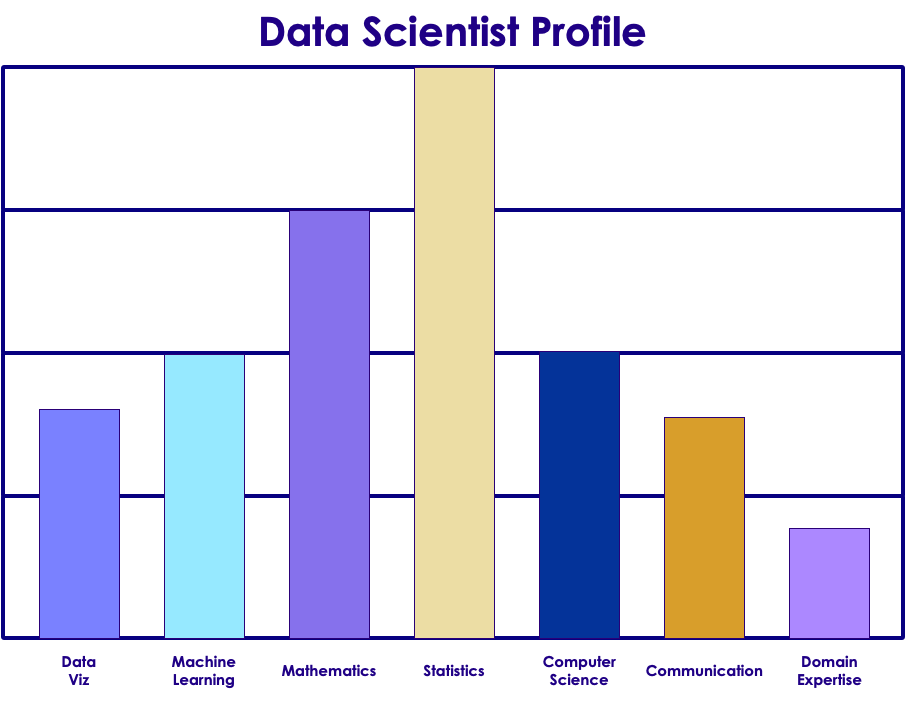


Notes:

Image from "Doing Data Science"


---

## Class Exercise: Asses Your Data Scientist Profile


 *  **Overview:** You are going to asses your DS profile

 *  **Instructions:**

     - Instructor will provide 'Data-Scientist-Skill-Matrix'  Excel file

     - Download it and enter your scores.

Notes:


---

## Visualizations


 * How you tell the results - Very very important part!!

 * Good visualizations convey the point to the audience.

 * A good data scientist must learn good visualization techniques.

 * Standard graphs: line, bar, pie, ...

 * Modern visualizations: Heat maps, Animations (D3JS etc.)

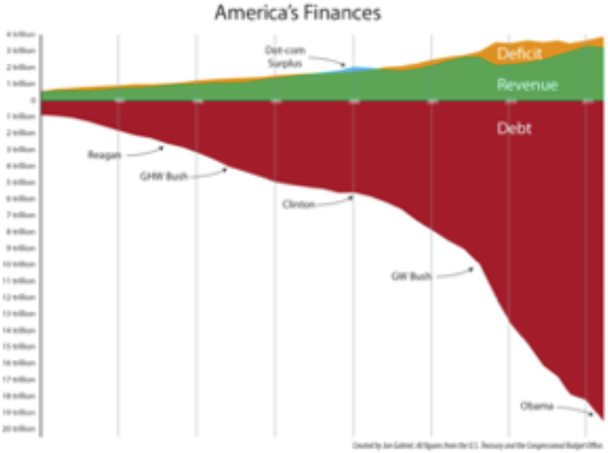


Notes:

US population heatmap : https://www.someka.net/excel-template/usa-heat-map-generator/
National debt visualization: https://ricochet.com/archives/problem-no-one-dc-wants-talk/


---

## Visualizations Demo: Google Music Trends


Notes:

http://research.google.com/bigpicture/music/


---

## Visualizations Demo: American Workday


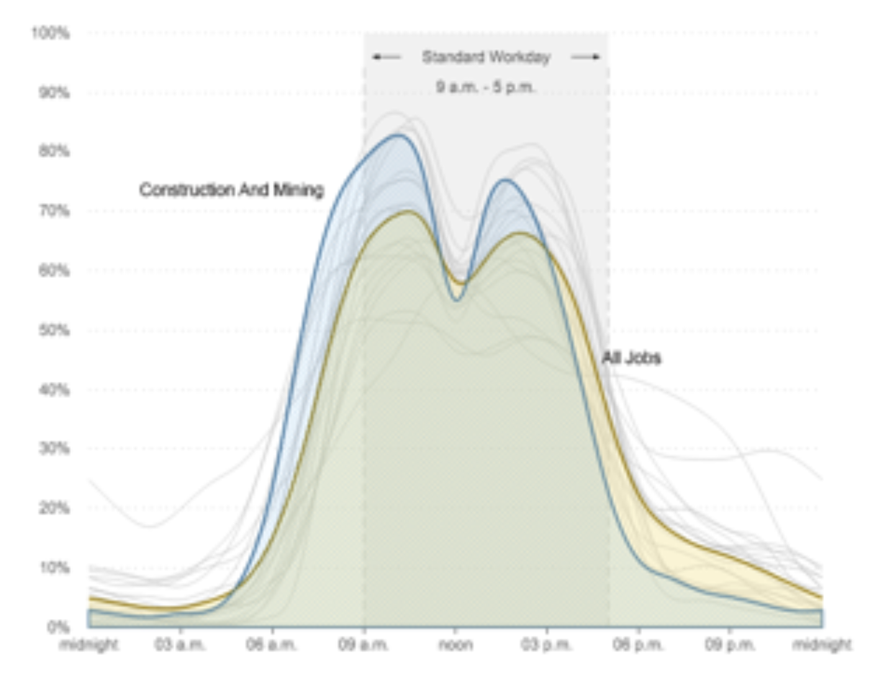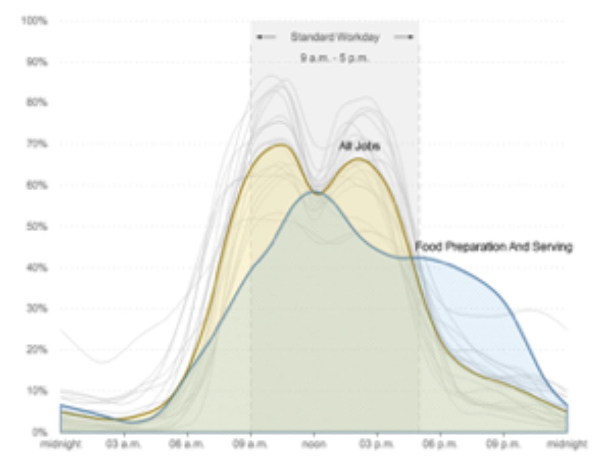


 * [Link to NPR story](https://www.npr.org/sections/money/2014/08/27/343415569/whos-in-the-office-the-american-workday-in-one-graph?/templates/story/story_php=)


Notes:

https://www.npr.org/sections/money/2014/08/27/343415569/whos-in-the-office-the-american-workday-in-one-graph?/templates/story/story_php=


---

## Visualizations Demo: National Debt Visualized


 * [Link to Demonocracy](http://demonocracy.info/infographics/usa/us_debt/us_debt.html)


Notes:

http://demonocracy.info/infographics/usa/us_debt/us_debt.html


---

## Visualizations Demo: US Budget


 * [Link to NYTimes article](https://archive.nytimes.com/www.nytimes.com/interactive/2012/02/13/us/politics/2013-budget-proposal-graphic.html)


Notes:

https://archive.nytimes.com/www.nytimes.com/interactive/2012/02/13/us/politics/2013-budget-proposal-graphic.html


---

## Visualizations Tools

| Eco system 	| Package    	| Description                                                                     	|
|------------	|------------	|---------------------------------------------------------------------------------	|
| Python     	| Matplotlib 	| -Powerful, portable -Very versatile and capable -Default library for many tools 	|
|            	| Seaborn    	| -Higher level API based on Matplotlib -Stylish graphs by default                	|
|            	| Bokeh      	| -Streaming data -Interactive, web ready plots                                   	|
|            	| Plotly     	| -Online and python -Interactive graphs                                          	|
| JavaScript 	| D3         	| -online, web ready -interactive                                                 	|
| R          	| Ggplot2    	| -powerful, very capable -Can be complex                                         	|
|            	| GgVis      	| -Web ready graphs                                                               	|


Notes:


---

# What is AI

Notes:

Primer is pronounced `primmer`

---
## Informal Definition of Machine Learning

 * Arthur Samuel

     -  "**The field of study that gives computers the ability to learn without being explicitly programmed.**"

 * Example: Self-driving cars

     - Tell the car the rules, or

     - Let it record the scenery and your reactions

     - Let it predict the next reaction


Notes:


---

## Spam Detection - Traditional (Rule Based) Approach


 * Computers follow explicit instructions (code)

 * Can be tens of millions code lines but still explicit instructions, something like this:

```text
// explicitly coding the rules

if (email.from_ip.one_of("ip1", "ip2", "ip3")) {
	result = "no-spam"
}
else if ( email.text.contains ("free loans", "cheap degrees"))
{
	result = "spam"
}

```

Notes:


---

## Spam Detection - AI Approach


 * Show the algorithm with spam and non-spam emails

 * Algorithm 'learns' which attributes are indicative of spam

 * Then algorithm predicts spam/no-spam on new email


Notes:


---

## How is AI Different from Rule Based Systems


 * Rule based systems are static

     - They are programmed in

     - They don't learn from data

 * AI can learn from data

     - It gets better every day with more data it sees


Notes:


---

# Understanding AI Vocabulary

Notes:

Primer is pronounced `primmer`

---

## AI / Machine Learning / Deep Learning


 *  **Artificial Intelligence (AI):** Broader concept of "making machines smart"

 *  **Machine Learning:** Current application of AI that machines learn from data using mathematical, statistical models

 *  **Deep Learning: (Hot!)** Using Neural Networks to solve some hard problems

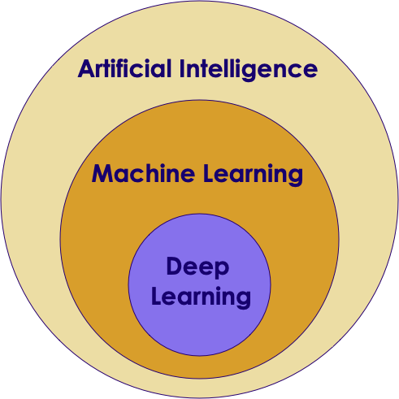

Notes:


---

## AI / Machine Learning / Deep Learning


Notes:


---

## AI Vocabulary


 *  **Training**

     - Feeding data to an algorithm to create a model

     - Computationally expensive

 *  **Prediction / Inference**

     - Created model answering questions (very fast)

     - "is this transaction fraud / not-fraud"

     - "What are the recommended movies for this user"


Notes:


---

## AI Vocabulary


 *  **(Artificial) Neural Networks**

     - Layers of parallel processing elements, working together to solve very complex tasks

     - Inspired by neurons from human brain

     - Used in Deep Learning

     - (More on this later)

Notes:


---

# A Brief History of AI

Notes:

Primer is pronounced `primmer`

---

## AI Evolution


 * Initial AI thinking was TOP DOWN (or symbolic logic)

 * Write a  **big, comprehensive**  program

     - Program  **all the rules**  (expert systems)

 * Problem:

     - Too many rules

     - Works only for specific domain, e.g. math theorems or chess

 * Success stories: playing chess at the grand master level

     - Domains with limited, clear rules

 * Not so successful: image recognition

Notes:


---

## Another AI Approach - Bottom Up


 * Computers can learn from `ground up` (data-driven)

 * E.g. how babies learn to talk:

     - Learn from example

     - They don't know the 'whole dictionary' or 'grammatical rules'

 * The focus shifts from  **logic to data**

 * More data --> smarter systems

 * Success stories

     - Image recognition

     - Language translation

     - Self-driving cars

Notes:


---

## Translation - Early Approach

 * Creating a translation system from English <--> Japanese

 * Code in the following:

     - English dictionary + grammar rules

     - Japanese dictionary + grammar rules

     - Translation rules

 * Now the system is ready to translate

 * But this approach really doesn't work well:

     - Rules have too many exceptions

     - Context and subtle meanings are lost

 * "Minister of agriculture" --> "Priest of farming"

Notes:


---

## Translation - 'Bottom Up' Approach (Google Translate)


 * Google Translate has been ported to 'Google Brain' on Sept 2016

 * System learned from 'data'

 * AI based system improved the accuracy many times over

 * [Link to case study](https://www.nytimes.com/2016/12/14/magazine/the-great-ai-awakening.html)


Notes:

https://en.wikiquote.org/wiki/Jorge_Luis_Borges
https://www.nytimes.com/2016/12/14/magazine/the-great-ai-awakening.html


---

## Bottom Up AI Success Stories

 * Image recognition

 * Translation

 * Self driving cars


Notes:

Image credit : Wikimedia: CCZero license : https://commons.wikimedia.org/wiki/File:Driver_free_car.jpg
Image credit : WikiMedia: (Creative Commons) : https://commons.wikimedia.org/wiki/File:Face_detection.jpg


---

## AI Success Story : Image Recognition: Cats & Dogs


Notes:

All images are used with  'creative common zero-CCZero' permissions  from Pexels.com
https://www.pexels.com/photo/silver-tabby-cat-lying-on-brown-wooden-surface-126407/
https://www.pexels.com/photo/grey-and-white-short-fur-cat-104827/
https://www.pexels.com/photo/tabby-cat-side-view-26511/
https://www.pexels.com/photo/cat-whiskers-kitty-tabby-20787/
https://www.pexels.com/photo/animal-dog-pet-brown-5018/
https://www.pexels.com/photo/light-golden-retriever-puppy-close-up-photography-159541/
https://www.pexels.com/photo/brown-and-black-belgian-shepherd-on-green-grassy-field-200008/

---

## Kaggle Competition

 * Recognize dogs & cats

 * Given 25,000 sample images to train

 * Then tested on 15,000 test images

 * Winning algorithm correctly classified 98.9% time !

 * https://www.kaggle.com/c/dogs-vs-cats


Notes:

All images are used with 'creative common zero -  cc-zero' permissions from  Pexels.com
https://www.pexels.com/photo/silver-tabby-cat-lying-on-brown-wooden-surface-126407/
https://www.pexels.com/photo/brown-and-black-belgian-shepherd-on-green-grassy-field-200008/
https://www.pexels.com/photo/dogs-pets-puppies-animals-38008/
https://www.pexels.com/photo/orange-tabby-cat-beside-fawn-short-coated-puppy-24104/


---

## A Glimpse of AI History

 * Sixties

     - Commercial computers & mainframes

     - Computers play chess

 * Eighties

     - Artificial intelligence (AI) get  **'oversold** ', doesn't live up to the promise and gets a bad rap

 * 21st century

     - Big Data changes it all

Notes:


---

## The Great AI Revival - 21st century (2010 on)


 * AI is going through a resurgence now

 *  **'Big Data** ' - now we have so much data to train our models

 *  **'Big Data ecosystem** ' - excellent big data platforms (Hadoop, Spark, NoSQL) are available as open source

 *  **'Big Compute** ' - **cloud**  platforms significantly lowered the barrier to massive compute power

     - $1 buys you 16 core + 128 G + 10 Gigabit machine for 1 hr on AWS!
     - So running a 100 node cluster for 5 hrs --> $500

 *  **Advances in hardware** - CPU / GPUs

Notes:

https://www.nytimes.com/2016/12/14/magazine/the-great-ai-awakening.html


---

## Hardware - GPU


 * Recently GPUs - Graphics Processing Units - have become popular (especially in Deep Learning)

 * GPU cores are good at compute intensive calculations (math, matrix operations)

 * Each GPU core is capable of executing small set instructions, but there are 1000s of core per GPU

     - Running in parallel


Notes:


---

## Latest GPU Technology - Nvidia

 * Tesla V100 GPU

     - Has 5,120 cores!

 * Computation @ 120 Tera Flops!

 * Bandwidth using NVLink: 300 GB/s

 * [Video](https://www.youtube.com/watch?v=3aAEKRDhrj8)


Notes:

https://www.youtube.com/watch?v=3aAEKRDhrj8


---

## Tesla V100 Benchmarks


Notes:


---

## Hardware - Modern CPU


 * Modern Intel Xeon CPUs (E5 or later) have vectorized linear algebra

     - Properly optimized, approaches speed of GPUs

     - And offers faster I/O performance for Big Data.

 * Intel Math Kernel Library - highly optimized, threaded, and vectorized math functions that maximize performance on each processor family


Notes:


---

## Hardware - TPU (Tensor Processing Unit)


 * A [Tensor processing unit (TPU)](https://en.wikipedia.org/wiki/Tensor_processing_unit) is an AI accelerator application-specific integrated circuit (ASIC) developed by Google specifically for neural network machine learning

 * More capable the CPUs / GPUs in certain tasks

 * Designed for [Tensorflow](https://github.com/tensorflow/tensorflow)

 * Designed for high volume computes

     - A TPU can process 100 million photos a day

 * Available in Google Cloud platform

Notes:

https://en.wikipedia.org/wiki/Tensor_processing_unit
https://github.com/tensorflow/tensorflow


---

## Google TPU System in Data Center


Notes:

Image credit: NY Times: https://www.nytimes.com/2018/02/12/technology/google-artificial-intelligence-chips.html


---

## Incredible Growth of AI Power


Notes:


---

## Incredible Growth of AI Power


 * Since 2012, the amount of compute used in the largest AI training runs has been increasing exponentially with a 3.5 month-doubling time (by comparison, Moore's Law had an 18-month doubling period)Source: (https://blog.openai.com/ai-and-compute/)

 * Phases:

     - Before 2012: It was uncommon to use GPUs for ML, making any of the results in the graph difficult to achieve.

     - 2012 to 2014: Infrastructure to train on many GPUs was uncommon, so most results used 1-8 GPUs rated at 1-2 TFLOPS for a total of 0.001-0.1 pfs-days.

     - 2014 to 2016: Large-scale results used 10-100 GPUs rated at 5-10 TFLOPS, resulting in 0.1-10 pfs-days. Diminishing returns on data parallelism meant that larger training runs had limited value.

     - 2016 to 2017: Approaches that allow greater algorithmic parallelism such as huge batch sizes, architecture search, and expert iteration, along with specialized hardware such as TPU's and faster interconnects, have greatly increased these limits, at least for some applications.

Notes:

https://blog.openai.com/ai-and-compute/


---

## Video - CPU vs GPU Demonstration


 * [Video](https://www.youtube.com/watch?v=-P28LKWTzrI)

Notes:

https://www.youtube.com/watch?v=-P28LKWTzrI


---

## Video - Advances in Hardware - Nvidia


 * [Nvidia Self Driving DL](https://www.youtube.com/watch?v=0rc4RqYLtEU)


Notes:

* Nvidia Self Driving DL - https://www.youtube.com/watch?v=0rc4RqYLtEU


---

## Video - Advances in Hardware - Nvidia


 * [Nvidia GPU, Audi autonomous driving](https://www.youtube.com/watch?v=DjAJnQoNdMA)

    - Cool comparison of learning rate of Brain vs. CPU vs. GPU around 50 second mark


Notes:

* Nvidia Self Driving DL - https://www.youtube.com/watch?v=0rc4RqYLtEU
* Nvidia GPU, Audi autonomous driving :  https://www.youtube.com/watch?v=DjAJnQoNdMA
 * cool comparison of learning rate of Brain vs. CPU vs. GPU  around 50 second mark
https://www.youtube.com/watch?v=UsDhVx6cOrw


---

## Video - Advances in Hardware


 * [Google TPU](https://www.youtube.com/watch?v=UsDhVx6cOrw)

    - (up to 5 min mark)


Notes:

https://www.youtube.com/watch?v=UsDhVx6cOrw


---

## AI History


 * [Video](https://www.youtube.com/watch?v=056v4OxKwlI)

Notes:

https://www.youtube.com/watch?v=056v4OxKwlI


---

# End of Part 1 : State of AI

---

# Part 2 : AI Technologies

---

# Machine Learning vs. Deep Learning

---

## AI / Machine Learning / Deep Learning


 *  **Artificial Intelligence (AI):** Broader concept of "making machines smart"

 *  **Machine Learning:** Current application of AI that machines learn from data using mathematical, statistical models

 *  **Deep Learning: (Hot!)** Using Neural Networks to solve some hard problems


Notes:


---

## Structured Data vs. Unstructured Data

| Machine Learning                                                    | Deep Learning                                             |
|---------------------------------------------------------------------|-----------------------------------------------------------|
| Usually done with structured data,(database data, CSV files ..etc.) | Can handle unstructured data,(video, images, audio, text) |


Notes:


---

## Unstructured Data Growth


Notes:

Source : https://www.dubber.net/unlocking-unstructured-data-voice-processing-power-zoe/


---

## Machine Learning vs. Deep Learning


 * Deep Learning Algorithms scale better with data

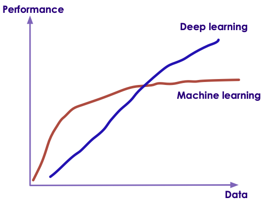

Notes:


---

## 1980's and 1990's


Notes:

Source: Jeff Dean


---

## 1990+

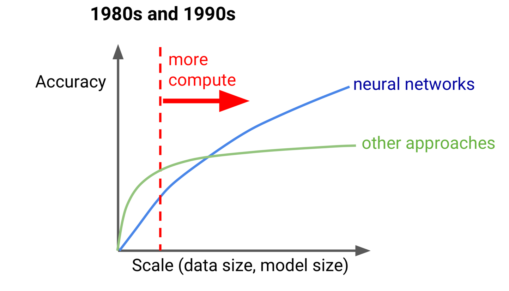


Notes:

Source: Jeff Dean


---

## Now

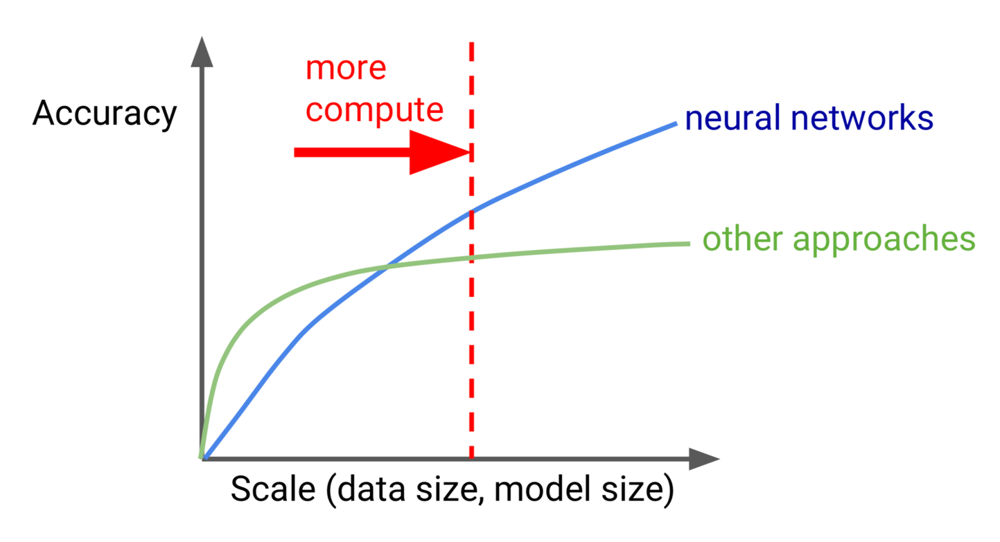


Notes:


---

## Machine Learning vs. Deep Learning

| Features                             | Machine Learning                                              | Deep Learning                                                    |
|--------------------------------------|---------------------------------------------------------------|------------------------------------------------------------------|
| Data size,(see next slide for graph) | Performs reasonably well on small / medium data               | Need large amount of data for reasonable performance             |
| Scaling                              | Doesn't scale with large amount of data                       | Scales well with large amount of data                            |
| Compute power                        | Doesn't need a lot of compute (works well on single machines) | Needs a lot of compute power (usually runs on clusters)          |
| CPU/GPU                              | Mostly CPU bound                                              | Can utilize GPU for certain computes (massive matrix operations) |
| Feature Engineering                  | Features needs to specified manually (by experts)             | DL can learn high level features from data automatically         |
| Execution Time                       | Training usually takes seconds, minutes, hours                | Training takes lot longer (days)                                 |
| Interpretability                     | Easy to interpret                                             | Hard to understand the final result                              |
| Data Formats                         | Structured data                                               | Can handle unstructured data                                     |


Notes:

https://www.analyticsvidhya.com/blog/2017/04/comparison-between-deep-learning-machine-learning/


---

## ML vs DL Explanation by Andrew Ng

* One picture explaining the rise of Deep Learning


 * [link](https://www.youtube.com/watch?v=LcfLo7YP8O4)

Notes:

https://www.youtube.com/watch?v=LcfLo7YP8O4


---

# Machine Learning Algorithms

---

## Types of Machine Learning

 *  **Supervised Machine Learning:**

     - Model learns from labeled training data

     - And predicts on new data

 *  **Unsupervised Machine Learning**

     - Model tries to find natural patterns in the data

 *  **Semi-Supervised Learning**

     - Model is trained with a training set which contains unlabeled (usually lot) and labeled (usually little) data

     - Example: Large images archive only a few of them are labeled (cat, dog, person) and majority are unlabelled

 *  **Reinforcement Learning**

     - Based on 'game play'  (rewards vs penalties)

Notes:


---

## Machine Learning Popular Algorithms

| Category            	| Sub Category    	| Example                                                                          	| Algorithms                                                         	|
|---------------------	|-----------------	|----------------------------------------------------------------------------------	|--------------------------------------------------------------------	|
| **Supervised**      	| Regressions     	| -Predict house prices,-Predict stock price                                       	| -Linear Regression,-Polynomial,-Stepwise,-Ridge, Lasso, ElasticNet 	|
|                     	| Classifications 	| -Cancer or not,-Spam or not                                                      	| -Logistic Regression,-SVM,-Naive Bayes,-K Nearest Neighbor (KNN)   	|
|                     	| Decision Trees  	| -Classification (credit card fraud detection),-Regression (predict stock prices) 	| -Decision Trees,-Random Forests                                    	|
| **Unsupervised**    	| Clustering      	| -Group Uber trips,-Cluster DNA data                                              	| -Kmeans,-Hierarchical clustering                                   	|
|                     	|                 	| Dimensionality reduction                                                         	| PCA                                                                	|
|                     	|                 	| Text mining                                                                      	| Topic discovery                                                    	|
| **Recommendations** 	|                 	| Recommend movies                                                                 	| Collaborative Filtering                                            	|

Notes:

http://machinelearningmastery.com/supervised-and-unsupervised-machine-learning-algorithms/


---

# ML Algorithms: Supervised

---

## Machine Learning Types: Supervised

 * Model learns from (training) data

 * Then predicts on 'unseen' data

| Algorithms     | Description                                                            | Applications                                |
|----------------|------------------------------------------------------------------------|---------------------------------------------|
| Classification | Categorize things into groups                                          | -Spam classification,Fraud / no fraud       |
| Regression     | Dealing with numbers and calculate the probability something happening | -Predict house prices,-Predict stock market |


Notes:

Image credit (Creative Commons): Pexels.com


---

## Supervised Learning Example - Regression

 * Predicting stock market

 * Train the model using training data (already known)

 * Test performance using test data (already known)

 * Predict no new data (unseen)


Notes:


---

## Supervised Learning Methodology

 * Split the data set into

     - Training set: Train model(Training set should represent data well enough)

     - Test set: Validate the model

 * Initially 70% training, 30% test

 * Sometimes, 60% training, 20% cross-validation, 20% test

 * Tweak the dials to increase or decrease the proportion


Notes:

Facebook used 95%/5% `Understanding text from scratch`


---

## Supervised Learning - Classification


 * Classification is a model that predicts data into "buckets"

 * Examples:

     - Email is  **SPAM**  or  **HAM**  (not-SPAM)

     - A cell is  **cancerous**  or  **healthy**

     - Hand-written numbers --> any digits 0, 1, 2,..., 9

 * Classification algorithm learns from training data

     - Supervised learning

 * Also predicted classes are " **discrete** " or " **qualitative** "


Notes:


---

## Classification Applications


 * Web

     - Email is spam or not

     - Website is authentic or fraudulent

 * Medicine

     - Is this cell cancerous or not?

 * Finance

     - Credit card transaction fraudulent or not

 * OCR

     - Recognizing characters and symbols

Notes:


---

## AI Created Art Sold for $400k @ Christie's


 * [Link](https://www.vox.com/the-goods/2018/10/29/18038946/art-algorithm)

 * [obvious-art.com](http://obvious-art.com/)


Notes:

https://www.vox.com/the-goods/2018/10/29/18038946/art-algorithm

http://obvious-art.com/


---

# ML Algorithms: Unsupervised

---

## Machine Learning Types : Un Supervised

 * No training needed

 * Algorithm tries to find patterns in data


| Algorithms               | Description                             | Applications                                                 |
|--------------------------|-----------------------------------------|--------------------------------------------------------------|
| Clustering               | Find naturally present patterns in data | -Identify news stories (sports / business),-Gnome clustering |
| Association              | Find similar patterns                   | -people who buy A also buy B                                 |
| Dimensionality Reduction | Reduces number of features              | -Reducing 1000s of variables into manageable size            |


Notes:


---

## Unsupervised Machine Learning


 * Draw inference from input data without "labeled responses"

 * Common clustering algorithms

     - K-means: Group data points into cluster

     - Hidden Markov Model: State transitions

 * Example applications:

     - Find patterns in data

     - Gene expression analysis

     - Recover states from results of random transitions

Notes:

https://www.mathworks.com/discovery/unsupervised-learning.html


---

## Clustering Use Cases: Fraud / Anomaly Detection


 * Anomaly detection

     - Find fraud

     - Detect network intrusion attack

     - Discover problems on servers

 * Clustering does not necessarily detects fraud

     - But it points to unusual data

     - And the need for further investigation


Notes:


---

## Unsupervised Example: Google News


 * Google News algorithm automatically groups **related news stories**  into sections


Notes:


---

## Clustering


 * Clustering finds natural groupings in data

 * Humans naturally cluster data we encounter

     - Categorizing, organizing, etc.

     - Our brains seek patterns

 * Why do we cluster?

     - To understand our data

     - To find "more like this"

Notes:

Clustering allows us to group similar objects or events or data sets.
This is a method of unsupervised learning.


---

## Clustering Applications


 * Biology

     - Genomics grouping

 * Medicine

     - Xray/CAT image analysis

 * Marketing

     - Consumer grouping ("soccer mom"...etc.) and behavior analysis

 * Web

     - Search result grouping

     - News article grouping (Google news)

 * Computer Science

     - Image analysis

 * Climatology

     - Weather pattern analysis (high pressure/warm regions)

Notes:

https://en.wikipedia.org/wiki/Cluster_analysis


---

## Clustering Use Case: Customer Purchases @ Walmart


 * Here is how Walmart is segmenting customer purchases

 * Question: What is the use case for this?

 * Pharmacy Runs

 * Strictly Grocery

 * Grocery and General Merchandise

 * Michaels Run

 * Party Trip

 * Toys

 * Electronics

 * Baby

 * Gallon of Milk

 * Booze and Calories


Notes:

https://www.kaggle.com/c/walmart-recruiting-trip-type-classification


---

## Machine Learning: Semi-Supervised


 * We are still learning, but not all data points are 'labelled'

 * But by grouping data points together, the algorithm can 'infer' information, even when labels are missing


Notes:


---

## Semi-Supervised Learning Video


 * [Link](https://www.youtube.com/watch?v=b-yhKUINb7o)


Notes:

https://www.youtube.com/watch?v=b-yhKUINb7o


---

## Demo: Machine Learning Basics


 * [Link](https://www.youtube.com/watch?v=HcqpanDadyQ)

Notes:

https://www.youtube.com/watch?v=HcqpanDadyQ


---

# Reinforcement Learning

---

## Reinforcement Learning


 * Imagine you are playing a new video game.  You have no idea how to play it.How will you learn?

 * Try a few things:

- Open a door --> get more money / ammo
- Jump from a cliff --> got hurt.. Loose health points .. Ouch!


 * This is how 'Reinforcement Learning' works.

     - Algorithm tries a few moves.. And learns automatically

Notes:


---

## Reinforcement Learning


 * Here the robot gets rewarded for 'food' and penalized for walking into fire


Notes:


---

## Reinforcement Learning Demo: Atari Breakout

 * [Link](https://www.youtube.com/watch?v=V1eYniJ0Rnk)

Notes:

https://www.youtube.com/watch?v=V1eYniJ0Rnk


---

## Reinforcement Learning Demo: Open AI Bots Playing Dota

 * [Link](https://www.youtube.com/watch?v=eHipy_j29Xw)

Notes:

https://www.youtube.com/watch?v=eHipy_j29Xw


---

# Deep Learning

---

## AI / Machine Learning / Deep Learning


 *  **Artificial Intelligence (AI):** Broader concept of "making machines smart"

 *  **Machine Learning:** Current application of AI that machines learn from data using mathematical, statistical models

 *  **Deep Learning: (Hot!)** Using Neural Networks to solve some hard problems


Notes:


---

## Machine Learning vs. Deep Learning


 * Deep Learning Algorithms scale better with data


Notes:


---

## A Brief History: Modelling After Neurons in Brain


 * The human brain is a bunch of interconnected neurons.

 * The neuron is like a "gate" - produces an output


Notes:


---

## History: 1943: McCulloch Pitts Neural Model


 * McCulloch and Pitts defined a simple model of a Neuron

 * It consisted of N inputs In and N Weights

 * Go to a transfer (sum) function, Apply a threshold to an output

 * Limitations:

       - Binary Output

       - No way to automatically train weights Wn


Notes:


---

## History: 1957: Frank Rosenblatt


 * Frank Rosenblatt invented the Perceptron:

 	- Simplest type of feedforward neural network


Notes:


---

## Perceptron (Single Layer Perceptron)


 *  **The perceptron is a linear model used for binary classification with a simple input - output relationship**

 * Mark 1 Perceptron


Notes:


---

## A Very Simple Perceptron


 * Here this perceptron is deciding if I should go to a concert.

 * It considers various inputs (weather , friend will join)

 * And different weights

 * If the final score is > 50, then the answer is YES


Notes:


---

## A Very Simple Perceptron


 * What is the outcome if

 * Weather is good

 * And a friend can join?

 * What is the outcome if

 * You can go by public transit

 * And a friend can


Notes:


---

## Perceptron (Generalized)


 * Perceptron will have multiple inputs and an output

| Terminology | Explanation                                                                       |
|-------------|-----------------------------------------------------------------------------------|
| Xi          | input                                                                             |
| Wi          | Weight for the input                                                              |
| x.w         | Dot product of inputs and weights `�xi.wi`                                         |
| N           | number of inputs                                                                  |
| b           | Bias term (does not depend on input values, shifts decision boundary from origin) |


Notes:


---

## Constructing Neural Networks


 * We add multiple layers

 * Each layer can have many neurons


Notes:


---

## 'Deep' Neural Networks


 * If the network has more than ONE hidden layer, it is called DEEP network (or more than 3 layers total including input an output)

 * More layers gives the network the ability to adopt complex data

 * How ever more layers take more time to train


Notes:


---

## Deep Neural Network - Face Recognition


Notes:

Image credit : Facebook research
Source: https://deeplearning4j.org/neuralnet-overview


---

## 'Deep' Neural Networks Simulation


Notes:


---

## Examples of 'Deep' Neural Networks


 * Image Recognition: ResNet (from 2015) with 152 layers


Notes:


---

## DL Application Demo: Digit Recognition

 * Neural Net for Handwritten Difit

      - Draw a digit in the box blow click "recognize" button.

 * [Link](http://myselph.de/neuralNet.html)


Notes:

http://myselph.de/neuralNet.html


---

## DL Application Demo: Digit Recognition


 * [Link](http://scs.ryerson.ca/~aharley/vis/conv/flat.html)

Notes:

http://scs.ryerson.ca/~aharley/vis/conv/flat.html


---

## Types of Neural Networks (see next slides for details)


 *  **Convolutional Neural Networks (CNN)** Image recognition

 *  **Recurrent Neural Networks (RNN)** Natural language processing

 *  **Long Short Term Memory (LSTM)** Speech recognition, translation


Notes:


---

## Convolutional Neural Networks (CNN)


 * CNNs are primarily used for image recognition

 * "Celebrity Face Recognition" challenge

     - 4 million labeled images of 4000 celebs

     - 97% accuracy!

     - [Link](https://research.fb.com/publications/)


Notes:

Source: Yaniv Taigman, Ming Yang, Marc'Aurelio Ranzato, Lior Wolf - https://research.fb.com/publications/


---

## CNN Demo: Happy Net


 * Detect facial emotions in real time

 * [Link](https://www.youtube.com/watch?v=MDHtzOdnSgA)


Notes:

https://www.youtube.com/watch?v=MDHtzOdnSgA


---

## Recurrent Neural Networks (RNN)


 * Applications:

     - Natural language processing (Predict the next word in sentence)

     - Machine translation


Notes:

Source: Rowel Atienza - https://towardsdatascience.com/lstm-by-example-using-tensorflow-feb0c1968537


---

## RNNs (translation)


Notes:

Source: https://www.analyticsindiamag.com/overview-of-recurrent-neural-networks-and-their-applications/


---

## Combining Neural Networks


 * Here is an example of combining CNN and RNN

     - It recognizes the image (CNN)

     - And captions it (RNN)


Notes:

Source: Source: Andrej Karpathy, Li Fei-Fei - https://cs.stanford.edu/people/karpathy/deepimagesent/


---

## Video - Advances in Hardware


 * [Google TPU](https://www.youtube.com/watch?v=UsDhVx6cOrw) (up to 5 min mark)


Notes:

https://www.youtube.com/watch?v=UsDhVx6cOrw


---

## DL Application Demo: Google Draw


 * https://quickdraw.withgoogle.com/


Notes:


---

# AI Workflow / Process

---

## AI Workflow


Notes:


---

## How to do Machine Learning


 *  **1 - Problem Definition:** What are we trying to solve

 *  **2 - Collect data** More data we have, the better the algorithms become.  This data can come from internal logs (clickstreams) or external sources (credit scores of customers)

 *  **3 - Prepare Data** Raw data is hardly in a form to be used.  It needs to be cleansed, tagged and curated before ready to use

 *  **4 - Train a model** Feed the training data to model so it can learn

 *  **5 - Evaluate the model** Test the model accuracy

 *  **6 - Improve the model** Either by adding more training data, choosing a different algorithm

 *  **7 - Deploy the model**

Notes:


---

## 1 - Problem Definition


 * This may not be as easy as it seems

 * Known Knowns

     - Daily web traffic

 * Known Unknowns

     - What are most popular pages?

     - Do big connectors matter in a social graph?

 * Unknown Unknowns

     - Is there a connection between X and Y

Notes:


---

## Class Discussion:


 * What are some of the problems you are facing that Data Science / Machine Learning might be a solution?

Notes:


---

## 2 - Collecting Data


 * Data Sources can be

     - External: government data, public data,...

     - Internal: collected data (clickstream etc.)

 * External Data challenges

     - Compliance, security concerns,...

     - How much can we get? API throttling.

     - Is the data in useable format?

 * May need to bring data from different systems and in usually in different formats.

     - Clicklogs are text files.

     - Customer data can be from a database.

Notes:

---

## Class Discussion: Data Collection Challenges


 * What are some of the problems you are facing / anticipating for collecting data?

Notes:


---

## 3 - Data Preparation / Cleaning


 * Problems with raw data sets

     - Non-usable format (say in Excel spreadsheet format)

     - Contains errors & wrong values

     - Missing values

     - Data is spread across multiple silos

 * Data scientists spend a lot of time cleaning and massaging raw data, to get them ready for analysis.

 * Crucial part of data science

 * Can consume a lot of time (50% - 80%  of the project!!!)

 * Least sexy


Notes:


---

## Class Discussion: Data Cleanup


 *  **What do you think involves in cleaning up data?**

Notes:


---

## 3.5 - Exploratory Data Analysis (EDA)


 * Before doing `machine learning` on data, understand the data.

 * Basic questions

     - Is there a pattern?

     - Are there lot of outliers?  (May skew analysis. Should we keep these or throw them away?)

 *  **Visualizations**  can help greatly!

     - Just do some quick & dirty graphs.

 * Identify `interesting segments`

 * Need to sample?  Or process entire data set?


Notes:


---

## 4 - Model Building


 * Don't do this until you have a good understanding of data.(See previous section.)

 * Pick right modeling technique

     - Clustering

     - Classifications

     - Etc.

 * Pick the right model for data

     - Don't get 'hung up' on one model.

     - Try a few to identify the best fitting model.

     - Experience counts!

Notes:


---

## 4.5 - Experiment to Production ('Mind the Gap')


 * Data Scientists develop their models on laptops with small data

 * There is a 'deployment gap' when it comes time to go to production

 * Solutions:

     - Frameworks like Spark are solving this

     - Cloud vendors are providing solution


Notes:


---
## Streamlining Prototyping --> deploy


 * Language neutral

 * Same model � no need to re-implement

 * Fast deploy!


Notes:

https://www.slideshare.net/julesdamji/apache-spark-mllib-2x-how-to-productionize-your-machine-learning-models

---

## 5 - Model Validation


 * Models need to be `verified`  / `validated`

 * Split the data set into

     - Training set: build / train model

     - Test set: validate the model

 * Initially 70% training,  30% validation.

 * Tweak the dials to decrease training and increase validation.

 * Training set should represent data well enough.

Notes:


---

## 6 - Improving the Model


 * Sometimes we don't get desired accuracy from the model

     - Say we need 90% accuracy, but the model is only at 70%

 * How to improve?

     - Can we find more training data?

     - Tune model parameters

     - Or even choose another model

Notes:


---

## 7 - Deploy Model


 * We are happy with the model's performance

 * So we deploy the model on production / live system where it can start predicting / inferring

 * Monitor the model in production


Notes:


---

## Class Discussion : AI Life Cycle


 * Do you have any stories to share about AI work flow?

     - Issues

     - Best practices?

Notes:


---

## Reinforcement / Neural Net Demo: Alpha GO


 * [Link](https://www.youtube.com/watch?v=9xlSy9F5WtE)

Notes:

https://www.youtube.com/watch?v=9xlSy9F5WtE
 https://money.cnn.com/2017/09/29/technology/future/alphago-movie/index.html


---

## Reinforcement / Neural Net Demo : Alpha GO


 * [Link](https://deepmind.com/blog/alphago-zero-learning-scratch/)

 * AlphaGO explained


Notes:

https://deepmind.com/blog/alphago-zero-learning-scratch/


---

# AI Software Ecosystem

---

## AI Software Eco System

|             | Machine Learning          | Deep Learning               |
|-------------|---------------------------|-----------------------------|
| Java        | -Weka,-Mahout             | DeepLearning4J              |
| Python      | -SciKit,-(Numpy, Pandas)  | -Tensorflow,-Pytorch,-Caffe |
| R           | -Many libraries           | -Deepnet,-Darch             |
| Distributed | Spark                     | Spark                       |
| Cloud       | -AWS,-Azure,-Google Cloud | -AWS,-Azure,-Google Cloud   |


Notes:


---

## AI and Big Data

 * Until recently most of the AI work is done on `single computer`

 * Most R/Python/Java libraries are `single machine based`

 * Now Big Data tools make it possible to run AI algorithms at massive scale-distributed across a cluster


Notes:


---

## Machine Learning vs. Big Data

| Traditional ML                                 | ML on Big Data                               |
|------------------------------------------------|----------------------------------------------|
| All (or most) data fits into single machine    | Data is distributed across multiple machines |
| Data almost / always in memory                 | Memory is scarce                             |
| Optimized for heavy iterative computes         | Optimized for single pass computes           |
| Maintains state between stages                 | stateless                                    |
| CPU bound                                      | IO bound (disk / network).                   |
| GPU (Graphical Processing Unit) seldom engaged | GPUs are utilized increasingly               |

Notes:


---

## AI Ecosystem and Tools


Notes:

Anaconda:
Python and R distribution for machine learning and data science. Simplifies package management and deployment supporting Windows, Linux and MacOS.

Python:
Interpreted programming language supporting multiple programming paradigms. Popular for data science due to code readability, ease of data manipulation and many libraries aimed at data science needs.

R:
Programming language and environment for statistical computing with powerful graphical and modeling features.

Scala:
Functional programing language with language interoperability with Java. Scala code runs on a Java Virtual Machine. Many data science frameworks that are built on are written in Scala.

cuDDN:
Deep Neural Network library for high-performance GPU acceleration.

NCCL:
The NVIDIA Collective Communications Library (NCCL) implements multi-GPU and multi-node collective communication primitives that are performance optimized for NVIDIA GPUs.

NumPy:
Scientific computing library for Python and is the foundation for important data science libraries including Pandas, Matplotlib and Scikit-learn.

Pandas:
Data structure and analysis library for Python. Allows you to do data cleaning and preparation for data science in addition to analysis.

Matplotlib:
Plotting library for creating plots, histograms, power spectra, bar charts, errorcharts, scatterplots, etc. Used heavily in Jupyter notebooks to visualize data.

Scikit-learn:
ML python library featuring many popular ML algorithms

WEKA:
Java ML visualization tools and algorithms.

TensorFlow:
Most popular dataflow programing framework used heavily for ML/DL. Has good visualization, monitoring and debugging features which make it good for production.

Pytorch:
The second most popular ML/DL framework which does not have as many production features as TensorFlow but is more intuitive and uses dynamic computation graphs which makes it extremely popular for research.

Keras:
Is a widely used DL python library/high level API which front ends ML frameworks like TensorFlow to make it building and deploying Neural Networks easier. Keras also allows you to import Python DL Models into DL4J.

DL4J:
DL framework for Java which has tight integration with Java based distributed computing frameworks such as Hadoop and Spark. Uses Keras as a Python API.


Jupyter:
Browser-based notebook interface with support for code, text, mathematical expressions, inline plots and other media. Jupyter has a larger community and is a better stand alone tool when compared to Apache Zeppelin. Jupyter is a more natural fit for use with Python Based ML/DL frameworks.

Apache Zeppelin:
Browser-based notebook interface with support for code, text, mathematical expressions, inline plots and other media. Zeppelin has tight integration with Hadoop eco system technologies and Spark plus has better out of box multi-user features when compared to Jupyter.


---

## Deep Learning Libraries


 *  **TensorFlow**

     - Open sourced by Google

     - Based on `data flow graphs`

     - Language support: Python, C++

     - Run time: CPU, GPU

     - Very popular

 *  **Pytorch**

     - Open sourced from Facebook

     - Python

     - BSD License

     - GPU + CPU supported

     - Community supported


Notes:

https://pytorch.org/
https://www.tensorflow.org/


---

## Deep Learning Libraries


 *  **Cafe'2**

     - Modular framework for DL

     - Python based

     - Open source

 *  **DL4J**

     - Java based

     - Works well in Java / BigData environments (Spark / Hadoop)

     - Apache 2.0 License

     - Commercial support available

 *  **Intel BigDL**

     - Deep learning library

     - Built on Apache Spark

     - Language support: Python, Scala

     - CPU support


Notes:

https://caffe2.ai/


---

## Deep Learning Libraries


 * And many more


Notes:


---

## Noteworthy Mentions


 *  **H2O**

     - Easy to use API

     - Friendly UI

     - Works on top of Spark ("Sparkling Water")

     - Works on cloud platforms

     - Commercially supported

     - Vendor: 0xData

 * SkyMind SKIL

     - Java based ML stack (DJ4J)

     - Native Big Data support (Hadoop/Spark)

     - Runs on bare metal, containers and VMs

     - Commercially supported


Notes:


---

## Infrastructure Tools


Notes:


---

## Kubeflow


 * Kubeflow = Kubernetes + ML

 * Deploy ML workflows on Kubernetes

 * Portable and scalable

 * Supports all major libraries:Tensorflow, Pytorch, Jupyter

 * Cloud friendly

 * (https://www.kubeflow.org/)

Notes:


---

## Big Data Infrastructure - Hadoop


 * Hadoop is the popular on-premise Big Data platform

 * Hadoop v3.0 offers support for Machine Learning

 * Native support for

     - GPU

     - Docker containers

     - AI frameworks : Tensorflow, Pytorch ..etc.

 * HDFS improvements

     - 1.7 copies instead of 3 copies (reducing storage overhead)


Notes:


---

## Big Data Infrastructure - Spark


 * Spark is a distributed framework

 * Can run on Hadoop and Cloud environments

 * Spark has become a very popular framework for Machine Learning and Deep Learning

 * Massively scalable

 * Can use memory (caching) effectively for iterative algorithms

 * Language support: Scala, Java, Python, R


Notes:


---

## Distributed Data Processing


 * Hadoop distributes data across many node

 * Processing also happens on multiple nodes (distributed processing)

 * Data is processed on the node it is located


Notes:


---

## Scalable Machine Learning Systems


 * Actual ML is a small part of overall system!

 * In the diagram below, you can see all the infrastructure goes into building a large scale ML system


Notes:


---

## A Reference Scalable AI Infrastructure


Notes:


---

## A Reference Scalable AI Infrastructure Explained


 *  **HDFS**  is our data lake, it can store huge amount of data, distributed across nodes

 *  **Spark**  is our processing engine, it runs in a distributed fashion on all nodes

 *  **Jupyter**  notebook is used interactively explore data

 *  **Kafka**  does streaming

Notes:


---

## AI in the Cloud


 * Pretty much all cloud vendors have a cloud based AI offering

 * 'AI as Service'

 * Benefits of cloud

     - Not having to worry about infrastructure

     - Scalable infrastructure (start small, grow as needed)

     - Pay per use model

     - 'Deployment gap' is no longer an issue

 * Go from experiment to production very quickly

Notes:


---

## AI Cloud Offerings


| AWS                       | Azure                             | Google Cloud               |
|---------------------------|-----------------------------------|----------------------------|
| -AI as service,'Sagemaker | -AI as service,-'Azure ML Studio' | -AI as service,-'Cloud ML' |

Notes:


---

## Video: Advances in Robotics


 * [Link](https://www.youtube.com/watch?v=8vIT2da6N_o)


Notes:

https://www.youtube.com/watch?v=8vIT2da6N_o


---

## Demo: Human Powered AI


 * Hive is paying 600,000 strangers to help him build human-powered AI that's 'whole orders of magnitude better than Google'

 * Users are paid a small amount of money to tag images

 * [Link](https://finance.yahoo.com/news/ceo-paying-600-000-strangers-150000655.html)


Notes:

https://finance.yahoo.com/news/ceo-paying-600-000-strangers-150000655.html


---

# AI Gone Wrong

---

## AI Gone Wrong


 * Here we are going look at some cases where AI experiments haven't gone well

 * Links

     - [link1](https://www.zdnet.com/pictures/im-sorry-dave-9-real-times-ai-has-given-us-the-creeps/2/)

Notes:

https://www.zdnet.com/pictures/im-sorry-dave-9-real-times-ai-has-given-us-the-creeps/2/


---

## Facebook's Bots Invent their own language


 * Facebook designed to chat bots to talk to each other

 * They were communicating with each other freely

 * After a year


       - `Bob: "I can can I I everything else."`

       - `Alice: "Balls have zero to me to me to me to me to me to me to me to me to."`


 * This indecipherable language is actually a 'new bot language'

 * Bots developed this on their own

 * FB discontinued the experiment

 * [Link](https://www.independent.co.uk/voices/facebook-shuts-down-robots-ai-artificial-intelligence-develop-own-language-common-a7871341.html)


Notes:

https://www.independent.co.uk/voices/facebook-shuts-down-robots-ai-artificial-intelligence-develop-own-language-common-a7871341.html


---

## Facebook Bots


Notes:


---

## Target Algorithm Predicts Young Woman's Pregnancy (Here AI is spot on!)


 * Target's Data Scientists identified 25 products that, when purchased together, predict a woman's pregnancy

 * Target started sending out targeted coupons to women shoppers who they have identified as being pregnant

 * One angry man walked into Target store and complained to the manager : " *Why are you sending these baby coupons to my daughter, she is still in high school* "

 * Few days later, the same man called the manager and apologized" *Sorry, I just learned that my daughter is pregnant* "

 * Links :[link1](https://www.zdnet.com/pictures/im-sorry-dave-9-real-times-ai-has-given-us-the-creeps/6/),
          [link2](https://www.nytimes.com/2012/02/19/magazine/shopping-habits.html?mtrref=www.google.com)


Notes:

https://www.zdnet.com/pictures/im-sorry-dave-9-real-times-ai-has-given-us-the-creeps/6/
https://www.nytimes.com/2012/02/19/magazine/shopping-habits.html?mtrref=www.google.com


---

## Tesla AutoPilot Crashes Car


 * A Tesla driving on AutoPilot crashes into a truck (2017, Florida)

 * NTSB investigation revealed that AutoPilot system thought the truck was a brightly lit sky, and kept going!

 * Links : [link1](https://www.theregister.co.uk/2017/06/20/tesla_death_crash_accident_report_ntsb/)


Notes:

https://www.theregister.co.uk/2017/06/20/tesla_death_crash_accident_report_ntsb/


---

## AI Mis-Identifying Dogs as Wolfs


 * Farmers used an algorithm to identify dogs vs wolves

 * Algorithm worked great in Summer months

 * In Winter months, it started mis-classifying dogs as wolves

 * Algorithm was rewrote to explain what part of picture it was paying attention to

     -  **The SNOW!**

 * [Link](https://www.youtube.com/watch?v=TRzBk_KuIaM)

 * [Video](http://innovation.uci.edu/2017/08/husky-or-wolf-using-a-black-box-learning-model-to-avoid-adoption-errors/
)(@ 2:30 min)


Notes:

https://www.youtube.com/watch?v=TRzBk_KuIaM
http://innovation.uci.edu/2017/08/husky-or-wolf-using-a-black-box-learning-model-to-avoid-adoption-errors/


---

## Amazon uses AI to Identify Job Applicants


 * Amazon tried an AI algorithm to short-list candidates

 * The algorithm was trained by job applications submitted in 10 year period

 *  **The algorithm was selecting mostly men for technical positions**

     - Because the training data had male bias

 * Links : [link1](https://www.theladders.com/career-advice/amazon-reportedly-scraps-ai-recruiting-tool-biased-against-women
), [link2](https://www.reuters.com/article/us-amazon-com-jobs-automation-insight/amazon-scraps-secret-ai-recruiting-tool-that-showed-bias-against-women-idUSKCN1MK08G)


Notes:

https://www.theladders.com/career-advice/amazon-reportedly-scraps-ai-recruiting-tool-biased-against-women
https://www.reuters.com/article/us-amazon-com-jobs-automation-insight/amazon-scraps-secret-ai-recruiting-tool-that-showed-bias-against-women-idUSKCN1MK08G


---

## Class Discussion


 * Do you know of any cases where AI failed / gone wrong?Please share with the class.

Notes:


---

# AI, Ethics, and Humanity

---

## Elon Musk:  "AI will take over humanity"


Notes:


---

## Elon Musk: "Zuck doesn't understand AI"


Notes:


---

## Class Discussion : Ethical AI


 * Let's discuss some the topics

 * AI replacing humans in jobs (e.g. truck drivers)

 * Weaponizing AI (killer drones)

 * Any thing else?

Notes:


---

# Final Thoughts

---

## Design an AI Project


 *  **Class Project**

 * Let's design an AI project that is from your company

Notes:


---

## Anything Else We Want to Discuss?


Notes:


---
## Closing Demo: Everybody Dance Now


 * [Link](https://www.youtube.com/watch?v=PCBTZh41Ris)


Notes:

https://www.youtube.com/watch?v=PCBTZh41Ris


---
## Summary


 *  **We covered the following**

 * AI use cases in industry

 * Recent advances in AI

 * Hardware innovations

 * Machine Learning

 * Deep Learning and Neural Networks

 * Software stacks

 * Cloud offerings

Notes:


---

## Further Reading


 * [Great AI Awakening](https://www.nytimes.com/2016/12/14/magazine/the-great-ai-awakening.html) - New York Times profile of on Google Brain and the people behind it

 * [Gentle Intro to Machine Learning](https://monkeylearn.com/blog/a-gentle-guide-to-machine-learning/)

 * [Machine Learning Basics](https://www.analyticsvidhya.com/blog/2015/06/machine-learning-basics/)

Notes:

https://www.nytimes.com/2016/12/14/magazine/the-great-ai-awakening.html
https://monkeylearn.com/blog/a-gentle-guide-to-machine-learning/
https://www.analyticsvidhya.com/blog/2015/06/machine-learning-basics/


---

# Backup Slides

---

## AI is a Huge Disruptor / Enabler


Notes:


---
