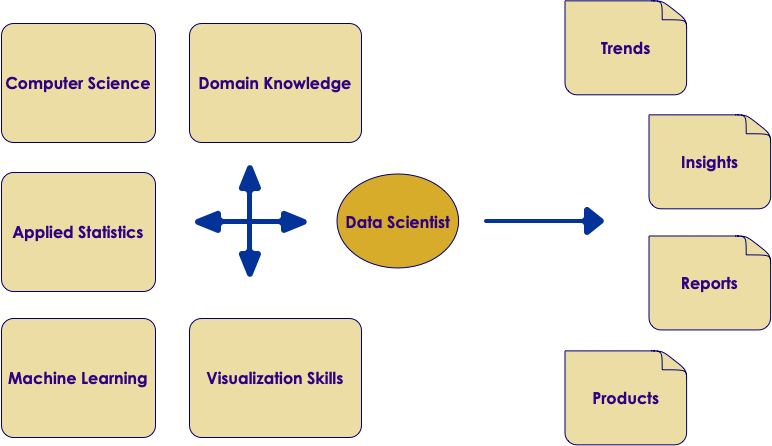
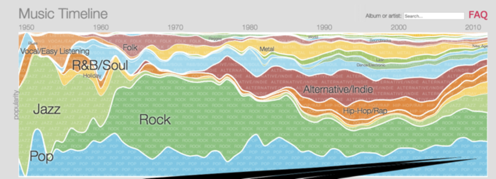
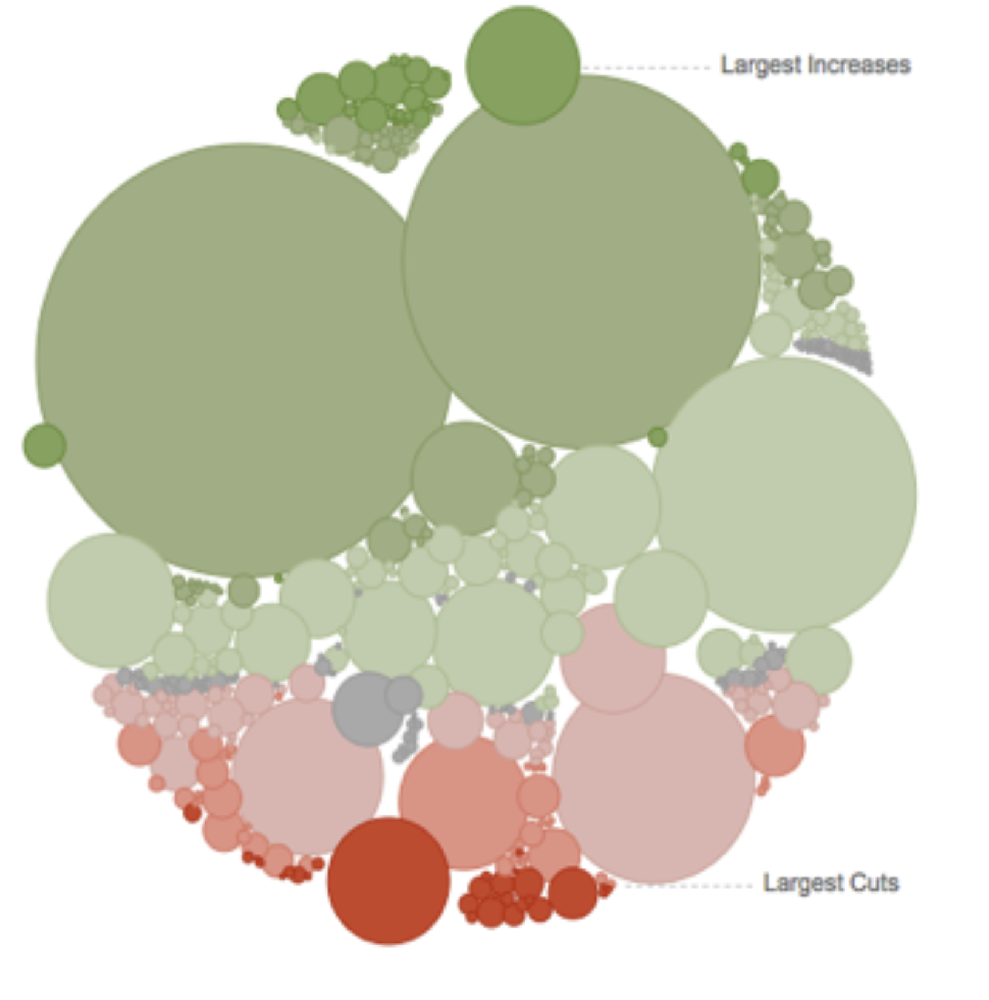

# Data Science

---

## What is "Data Science"?

 *  **Question for the class:** What comes to your mind when you hear the term "Data Science"?

Notes:

---

## What is 'Data Science'

 * From Mike Conway: A practice spanning multiple disciplines

Notes:

http://drewconway.com/zia/2013/3/26/the-data-science-venn-diagram

---

## What Is Data Science?

 * "Data-driven application development"

 * A new breed of discipline fueled by

     - Big data  (we have lot more data these days)

     - Lot of intelligence can be mined from this data

     - Technology revolutions like Hadoop & NoSQL that enabled Big Data processing possible

 * Involves multiple disciplines

     - Computer Science

     - Statistics etc.

 * "**More (quality) data** usually beats **better algorithms**"

 * Jeff Hammerbacher invented the term in 2012 while at Facebook

Notes:

https://www.linkedin.com/in/jhammerb/
https://en.wikipedia.org/wiki/Jeff_Hammerbacher

---

## Who is "Data Scientist"?

 *  **Question for the class:** What comes to your mind when you think of "Data Scientist"?

Notes:

---

## Who is "Data Scientist"?

 *  **Question for the class:** What comes to your mind when you hear the term "Data Science"?

Notes:

---

## So Here Is Data Scientist

Notes:

---

## Data Scientist Profile

Notes:

Image from "Doing Data Science"

---

## Class Exercise: Asses Your Data Scientist Profile

 *  **Overview:** You are going to asses your DS profile

 *  **Instructions:**

     - Instructor will provide 'Data-Scientist-Skill-Matrix'  Excel file

     - Download it and enter your scores.

Notes:

---

## Visualizations

 * How you tell the results - Very very important part!!

 * Good visualizations convey the point to the audience.

 * A good data scientist must learn good visualization techniques.

 * Standard graphs: line, bar, pie, ...

 * Modern visualizations: Heat maps, Animations (D3JS etc.)

Notes:

US population heatmap : https://www.someka.net/excel-template/usa-heat-map-generator/
National debt visualization: https://ricochet.com/archives/problem-no-one-dc-wants-talk/

---

## Visualizations Demo: Google Music Trends

Notes:

http://research.google.com/bigpicture/music/

---

## Visualizations Demo: American Workday

 * [Link to NPR story](https://www.npr.org/sections/money/2014/08/27/343415569/whos-in-the-office-the-american-workday-in-one-graph?/templates/story/story_php=)

Notes:

https://www.npr.org/sections/money/2014/08/27/343415569/whos-in-the-office-the-american-workday-in-one-graph?/templates/story/story_php=

---

## Visualizations Demo: National Debt Visualized

 * [Link to Demonocracy](http://demonocracy.info/infographics/usa/us_debt/us_debt.html)

Notes:

http://demonocracy.info/infographics/usa/us_debt/us_debt.html

---

## Visualizations Demo: US Budget

 * [Link to NYTimes article](https://archive.nytimes.com/www.nytimes.com/interactive/2012/02/13/us/politics/2013-budget-proposal-graphic.html)

Notes:

https://archive.nytimes.com/www.nytimes.com/interactive/2012/02/13/us/politics/2013-budget-proposal-graphic.html

---

## Visualizations Tools

| Eco system 	| Package    	| Description                                                                     	|
|------------	|------------	|---------------------------------------------------------------------------------	|
| Python     	| Matplotlib 	| -Powerful, portable -Very versatile and capable -Default library for many tools 	|
|            	| Seaborn    	| -Higher level API based on Matplotlib -Stylish graphs by default                	|
|            	| Bokeh      	| -Streaming data -Interactive, web ready plots                                   	|
|            	| Plotly     	| -Online and python -Interactive graphs                                          	|
| JavaScript 	| D3         	| -online, web ready -interactive                                                 	|
| R          	| Ggplot2    	| -powerful, very capable -Can be complex                                         	|
|            	| GgVis      	| -Web ready graphs                                                               	|

Notes:

---
