# Athena Lab Session

---

## Objectives
  * Importing Data to S3
  * Creating table in Athena
  * Executing Queries in Athena


## Step 1 - Importing Data to S3

### 1.1 - Create bucket in S3

  * Login to the AWS Console using the credentials

  * Goto Service Tab. Click on S3 service

  * Click on Create bucket

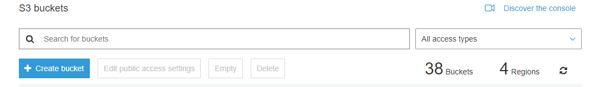

  * A dialog box appears.Provide the bucket name and the region to be created

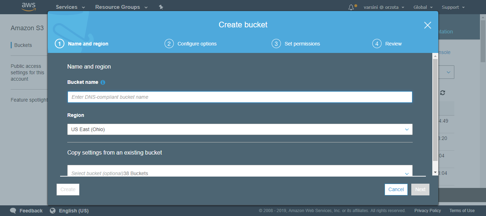

  * Then click Create button

  * Now the created bucket will be listed in the Table

---

### 1.2 - Uploading data to Bucket

  * Click on the Created bucket and select Upload button

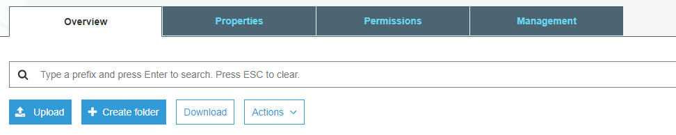

  * The Upload dialog box appears as shown below

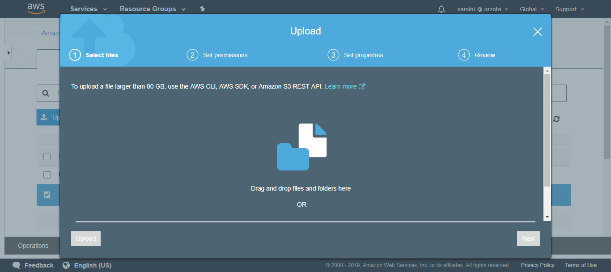

  * Drag and drop the file(prosper-loan-data.csv) that needs to be uploaded into the dialog box and click the upload button

  * Once uploaded, the file will be listed in the table

  * Right Click the File and select Make Public option.So that it can be used from Athena

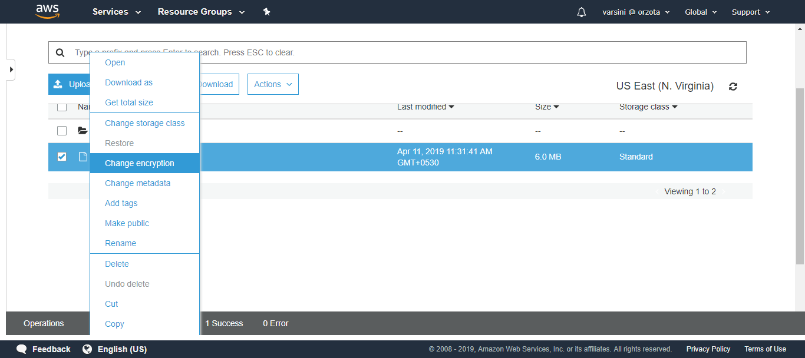

  * Now the file is Imported to the Bucket

---

## Athena Initial Procedures

---

  * Login to the AWS Console using the credentials

  * Goto Services Tab. Click on the Athena Services

  * If you already used Athena, it will show the Query Editor page. Otherwise, you will see the Getting started page. Click on the *Getting started* button

  You should see following screen:

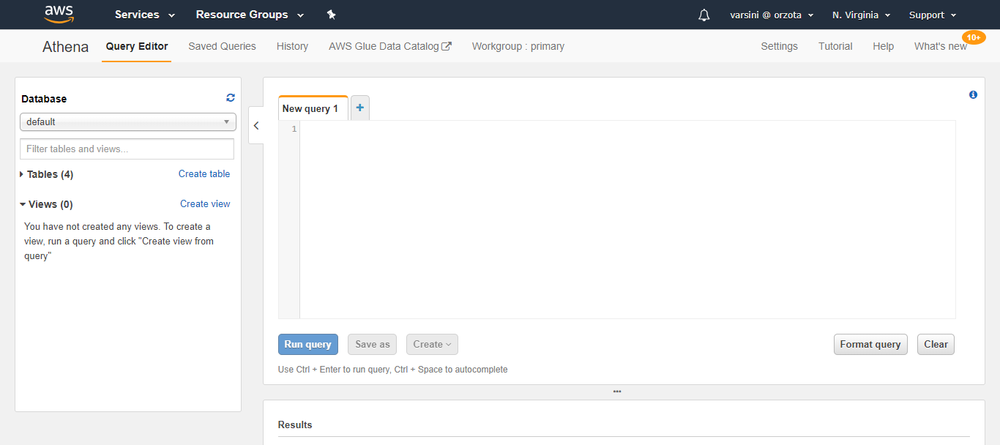

---

# Database creation

---

  * List of available databases and table can be viewed in the Left side tab

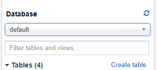

  * To create a Database, type the following in the console
  ```sql
	-- create database <database_name>;
	create database athena_test;
  ```

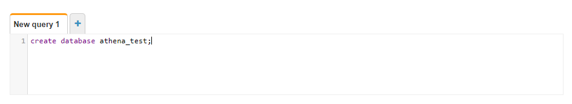

  * Select the newly created database from the left pane.

---

# Table Creation

---

  * Click on Create Table and select "from S3 bucket data"

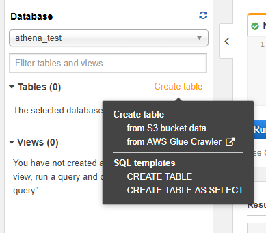

The following screen appears

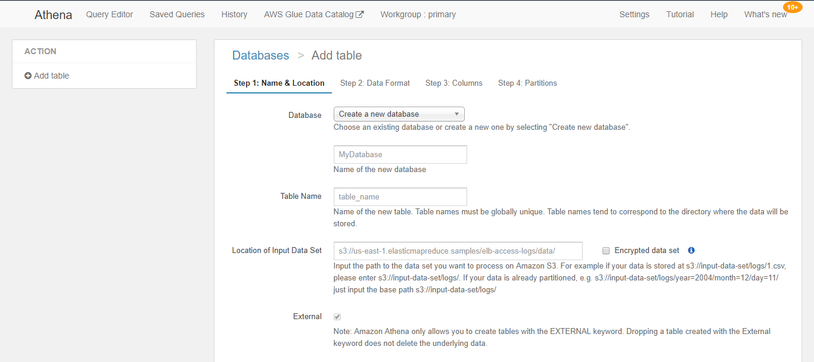

  * Provide the database name, table name and S3 location
    - database name : `athena_test`
    - table name : `prosper_test`
	- You can find the S3 location by clicking on the uploaded file in the S3 bucket.
        - The path should be stated only upto the folder location (don't add actual filename to the path)
        - And don't forget the training slash (/)
		- e.g. `s3://bucket_name/folder_containing_file/`

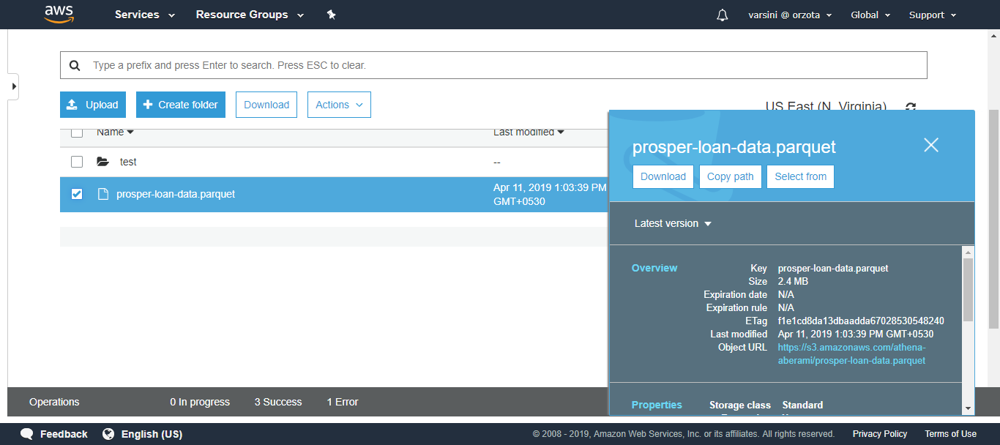

  * Click on Next. Specify the necessary Data Format.

 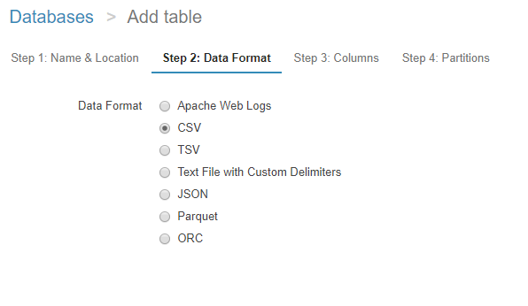

  * Click on Next. Add the necessary column names and their types.Selct Bulk Add Column Option if more than one needs to be added
    - column name : `term`  
      column type : int
    - column name : `loanstatus`  
      column type : int

 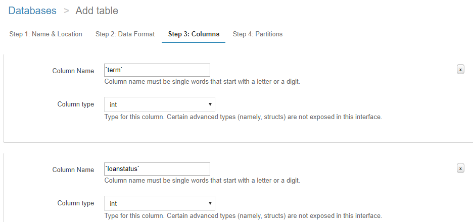

  * Click Next. Partition adding is optional.If necessary, it can be used

  * Click on Create Table button. Once the table is created, you should see the following screen:

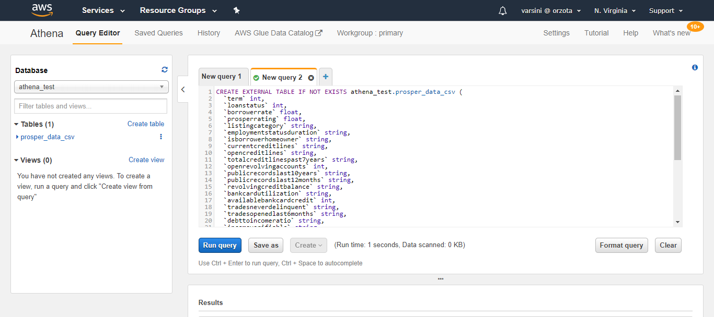

---

# Query Execution

---

  * Select the required Database and Table from the left pane

  * Enter the query to be executed on the query pane

```sql
SELECT term, count(*) as cnt FROM "sujee1"."prosper" group by term;
```

Try another one
```sql
SELECT loanstatus, count(*) as cnt FROM "prosper" group by loanstatus;
```

This image shows the executed Query Results

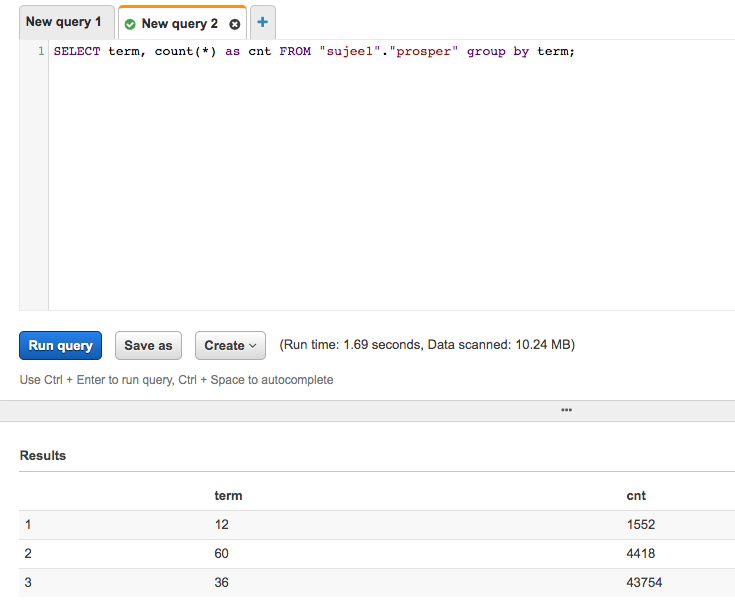


## Create a Prosper table with all the attributes
The prosper dataset has over 50+ attributes.  Specifying all in the UI is not very tenable.  Try this

In the following statement, you need to update the S3 location (at the bottom).

It is easier if you copy this into a text editor and make changes.

```sql
CREATE EXTERNAL TABLE prosper (
  `term` int,
  `loanstatus` int,
  `borrowerrate` int,
  `prosperrating` int,
  `prosperscore` int,
  `listingcategory` string,
  `borrowerstate` string,
  `employmentstatus` string,
  `employmentstatusduration` int,
  `isborrowerhomeowner` boolean,
  `creditscore` int,
  `currentcreditlines` int,
  `opencreditlines` int,
  `totalcreditlinespast7years` int,
  `openrevolvingaccounts` int,
  `openrevolvingmonthlypayment` int,
  `inquirieslast6months` int,
  `totalinquiries` int,
  `currentdelinquencies` int,
  `amountdelinquent` int,
  `delinquencieslast7years` int,
  `publicrecordslast10years` int,
  `publicrecordslast12months` int,
  `revolvingcreditbalance` int,
  `bankcardutilization` int,
  `availablebankcardcredit` int,
  `totaltrades` int,
  `tradesneverdelinquent` int,
  `tradesopenedlast6months` int,
  `debttoincomeratio` int,
  `incomeverifiable` string,
  `statedmonthlyincome` int,
  `totalprosperloans` int,
  `totalprosperpaymentsbilled` int,
  `ontimeprosperpayments` int,
  `prosperpaymentslessthanonemonthlate` int,
  `prosperpaymentsonemonthpluslate` int,
  `prosperprincipalborrowed` int,
  `prosperprincipaloutstanding` int,
  `loanoriginalamount` int,
  `monthlyloanpayment` int,
  `recommendations` int,
  `investmentfromfriendscount` int,
  `investmentfromfriendsamount` int,
  `investors` int,
  `yearswithcredit` int)
ROW FORMAT DELIMITED
  FIELDS TERMINATED BY ','
STORED AS INPUTFORMAT
  'org.apache.hadoop.mapred.TextInputFormat'
OUTPUTFORMAT
  'org.apache.hadoop.hive.ql.io.HiveIgnoreKeyTextOutputFormat'
LOCATION
  's3://TODO-location_of_bucket/'
TBLPROPERTIES (
  'has_encrypted_data'='false',
  'transient_lastDdlTime'='1554978556')
  
```

## Sample Query

Find prosper score distribution 

```sql 
select ProsperScore, count(*) as cnt 
FROM prosper 
GROUP BY ProsperScore
ORDER BY ProsperScore
-- ORDER BY cnt DESC
```

```sql
SELECT ProsperScore, EmploymentStatus, IsBorrowerHomeowner, CreditScore, COUNT(*) as total
FROM prosper
WHERE LoanStatus = 0
GROUP BY ProsperScore, EmploymentStatus, IsBorrowerHomeowner, CreditScore
```

---

## TODO  1

Find loan defaults status by home ownership.  
`LoanStatus = 0` indicates defaulted loan.

Start with the following template 
```sql
SELECT IsBorrowerHomeowner, count(*) as cnt,
FROM prosper
WHERE ?
GROUP BY ? 
```

## TODO 2 

Build a profile of borrowers who are most delinquent (`AmountDelinquent`)

You may consider these attributes
- `EmploymentStatus`
- `ProsperScore`
- `IsBorrowerHomeowner`

## TODO 3 

Build a profile of borrowers  who have not had any delay in payments

Following might be of interest 
- `ProsperPaymentsOneMonthPlusLate`  
   e.g.   `SUM(ProsperPaymentsOneMonthPlusLate) as num_late_payments`
- `OnTimeProsperPayments`
- `ProsperPaymentsLessThanOneMonthLate` 

Include the following attributes in your query 
- `IsBorrowerHomeowner`
- `EmploymentStatus`
- `ProsperScore`
- Any thing else you consider important

Answer the following questions:
- What is the most reliable indicator of a 'good borrower' (people who pay back the loans on time)?  
Is it home ownership, employment status or prosper score or credit score


## Class Discussion 

Discuss your findings and queries with the class.
