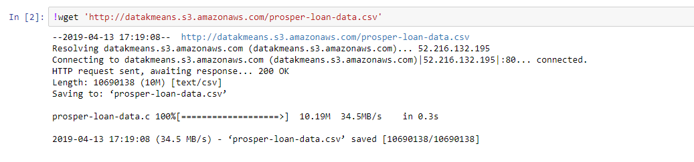
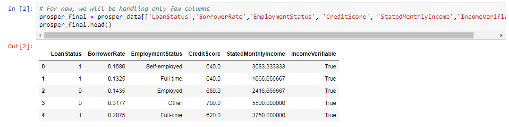
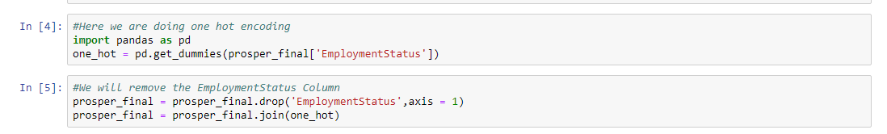
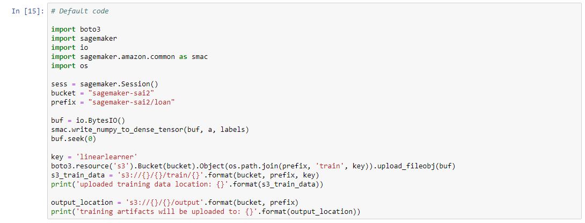
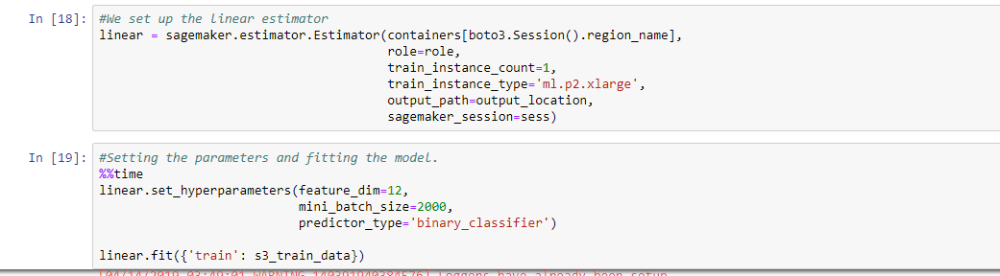

# Logistic Regression

## Downloading S3 Data into Jupyter Notebook

First, we need to upload the data required to run the lab into an S3 bucket.

Next, we need to create another empty S3 bucket starting with the name “Sagemaker”. This bucket is for storing the model, results, etc., after running the algorithm.

Download the data file <give path here> from S3 - you should see a message like this:

---

## Preparing the data for Training

* The data has more than 50 columns. We will simplify it by just taking 6 columns. We will use the following columns: 'LoanStatus','BorrowerRate','EmploymentStatus', 'CreditScore', 'StatedMonthlyIncome','IncomeVerifiable' alone.

* Convert the categorical values into numeric by using one-hot encoding.
Pandas library provides in-built functions for encoding the data. Let's do this for the "Employment Status" column.

* Convert "IncomeVerifiable" column into integer values. We will assign 1 for True and 0 for False.

 

Now, all the columns are float variables. So, we can proceed for training the data.

---

Before, giving input to the algorithm, we divide the data into features and labels. Labels is the prediction column. In this case, it is the "LoanStatus" column.
Features are all the columns except the "LoanStatus" column.

Next, we create a bucket in S3 that begins with the letters "sagemaker". Then Amazon will create the subfolders, which in needs, which in this case are sagemaker/grades and others. It is important that we create the S3 buckets in the same Amazon region as our notebook. Otherwise Amazon will throw an error saying it cannot find the data. See the note below on that.
Copy this text into a notebook cell and then run it.

We will get an output displaying the location where the training data and artifacts will be stored.

Next, we create a docker container in the same region where our notebook is created. In our case, it is " us-east-1"

---

## Setting up the Logistic Regression Estimator

Now we begin to set up the Estimator. Amazon will not let you use any of their smaller (i.e. less expensive) images, so here we use a virtual machine of size ml.p2.xlarge.

Now we provide hyperparameters. There are many, like which loss function to use. Here we put only the most important ones:

feature_dim—is the number of columns in our feature array. In this case it is 12.
mini_batch_size—is the number of batches into which to split the data. This number should be smaller than the number of records in our training set. We only have 20000 records, so we take 2000 as batch size.
predictor_type—we use binary_classifier, which means logistic regression.

When you run the fit() method Amazon will kick off this job. This will take several minutes to run.

a.x(a1, b1)

# Calculate precision by calling x and passing it ...
a.x (?? , ??)
---

## Deploying the Model

When the training model is done, deploy it to an endpoint. Remember that Amazon is charging you money now. So when you get done delete your endpoints unless you want to be charged.

---

## Validating the Dataset

Now we run the prediction. We just take some 10 data points and run the prediction.  

That's the end of Logistic Regession session. You can try with different data and observe the results. You can also find the accuracy of the model using some techniques like Pseudo-R², precision, recall etc.,

## ToDo

To find the accuracy of the model,
Calculate,
1. Precision
2. Recall
