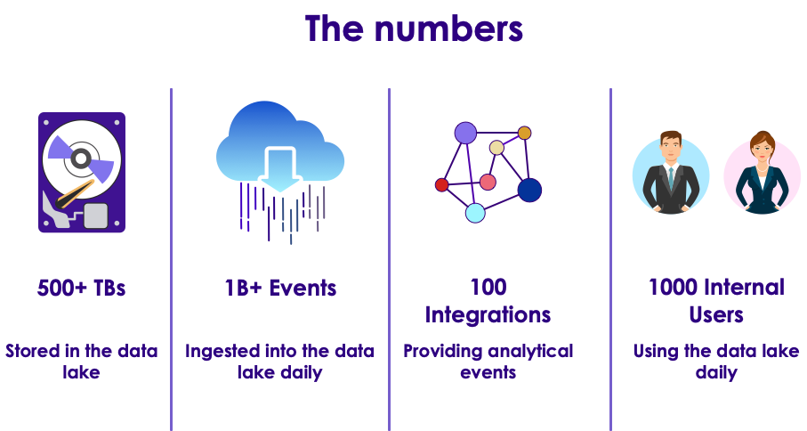
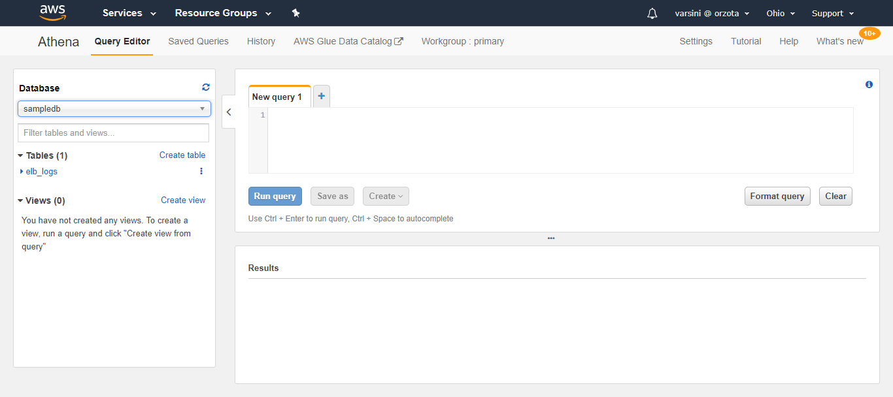
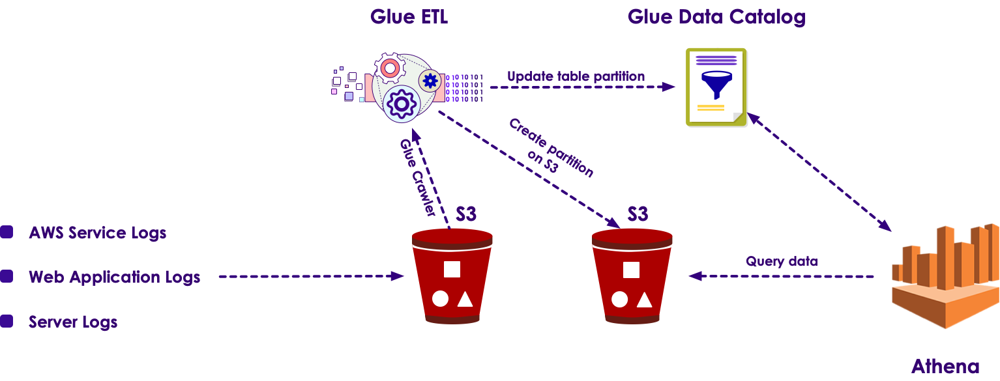
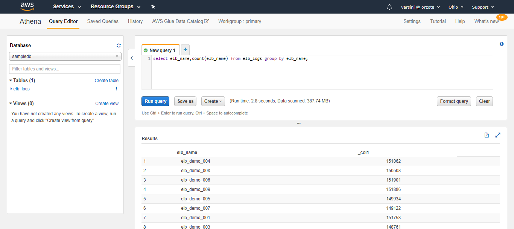

# AWS Athena

---

## Lesson Objectives
  * Learn about AWS Athena
  * Learn Athena Integrating Services
  * Learn Glue Integration to Athena
  * Learn Basic DDL statements

---

## Athena

  * A Server-less Interactive Query Editor

  * Uses Simple Standard SQL

  * Fast, parallel Query Execution

  * Helps analyze data in Amazon S3 Storage using SQL

---

## Purpose

  * For analyzing unstructured, semi-structured and structured data in S3

  * To create overall reports or to explore data using business insight tools

  * Integrates with Amazon QuickSight (for visualization) and AWS Glue Data Catalog

---

## Athena Case Study - Movable Ink
  * Goal
    - Create real-time customized and targeted email marketing campaigns
  * Problem
    - 7 years of historical customer/prospect database - 100 GB/day
    - Add contextual data about devices, weather, current conditions
    - Capture user interactive data
  * Solution
    - Store all data in Amazon EMR / S3
    - Use Athena for interactive querying, eliminating complex ETL, multiple databases
  * Benefit
    - Saved $15,000/month with 50% better performance

---

## Athena Case Study - Atlassian
  * Goal
    - Create a data lake with ad-hoc query capability from diverse data
  * Problem
    - Large data store, large streaming data, large number of users



  * Solution
    - Athena for analysis

  * Athena Advantages
    - Ability to attribute costs
    - Bucket security policies
    - Less infrastructure/operational overhead
    - Pay for what we use only

Notes:
[Reference] (https://www.slideshare.net/AmazonWebServices/abd318architecting-a-data-lake-with-amazon-s3-amazon-kinesis-aws-glue-and-amazon-athena)

---

## Ways to access Athena

  * Via JDBC or ODBC Drivers

  * Athena API

  * AWS CLI Tools

  * AWS Console




---

## AWS Glue Integration

  * Glue is an ETL service to integrate various data sources.
  * Glue's Crawler handles the databases and tables
    - created in Athena
    - stores the metadata in Data Catalog


  * AWS Glue Data Catalog central metadata repository
    - integrates with S3, RDS, Redshift, EMR, etc



---

## Security

* Athena uses IAM policies for authorization and access

* Athena uses encryption to access S3 locations and decrypt files

* Athena workgroups isolate users, groups, apps, etc.

---

## Athena Query

  * Athena supports both DDL and ANSI SQL procedures

  * Partitioning the data can improve query execution times
    - partition by time for typical analytics queries

  * Athena is case-sensitive. Athena allows only underscore special character

---

# Athena DDL  Examples

---

## To create a database

```sql
CREATE (DATABASE|SCHEMA) [IF NOT EXISTS] database_name
  [COMMENT 'database_comment']
  [LOCATION 'S3_loc']
  [WITH DBPROPERTIES ('property_name' = 'property_value') [, ...]]
```

---

## To create Table

```sql
CREATE [EXTERNAL] TABLE [IF NOT EXISTS]
 [db_name.]table_name [(col_name data_type [COMMENT col_comment] [, ...] )]
 [COMMENT table_comment]
 [PARTITIONED BY (col_name data_type [COMMENT col_comment], ...)]
 [ROW FORMAT row_format]
 [STORED AS file_format]
 [WITH SERDEPROPERTIES (...)] ]
 [LOCATION 's3_loc']
 [TBLPROPERTIES ( ['has_encrypted_data'='true | false',] ['classification'='aws_glue_classification',] property_name=property_value [, ...] ) ]
 
```

---

## To describe Table

```sql
DESCRIBE [EXTENDED | FORMATTED] [db_name.]table_name [PARTITION partition_spec] [col_name ( [.field_name] | [.'$elem$'] | [.'$key$'] | [.'$value$'] )]
```

---

## To view the contents

```sql
SHOW TABLES [IN database_name] ['regular_expression']
```

A screenshot showing the Query Executed by Athena



---

## Lab: Analyze Data using Athena

*  **Overview** :

   Load data in a csv file into S3 bucket
   Analyze the data using Athena

*  **Approximate time** :

   30 mins

*  **Instructions** :
    - SQL-With-Athena


---

# BACKUP SLIDES

---

# Column Storage Format

  * Column storage such as Apache Parquet and ORC are considered to be the fastest retrieval of data

  * Characteristics of columnar storage format

        - Compression by Column reduces space in S3, disk space, and I/O during query processing

        - Predicate pushdown in Parquet and ORC scans only the required Columns thereby improving the performance

        - Splitting data in Parquet and ORC increases the parallelism during query processing

        - By default, Parquet will access column by name and ORC by index. This behavior can be changed by

			* ORC - WITH SERDEPROPERTIES ('orc.column.index.access'='false')

			* Parquet - WITH SERDEPROPERTIES ('parquet.column.index.access'='false')

        - CSV and TSV formats do not allow renaming and adding initial columns

---
