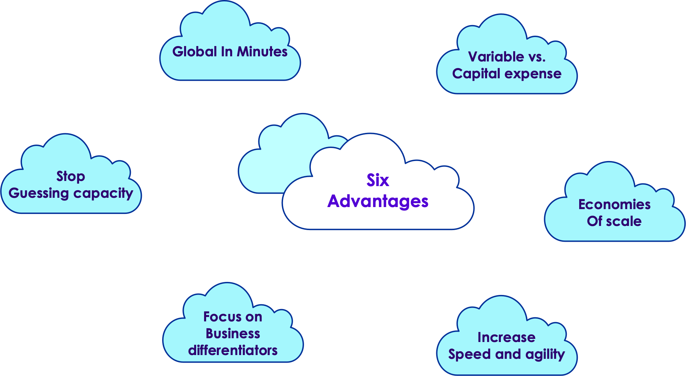
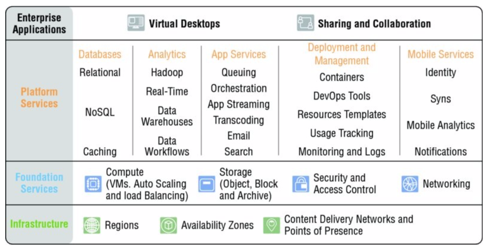
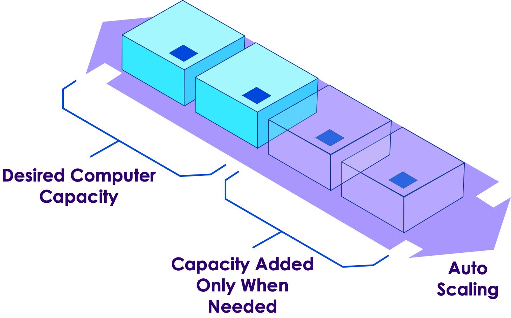
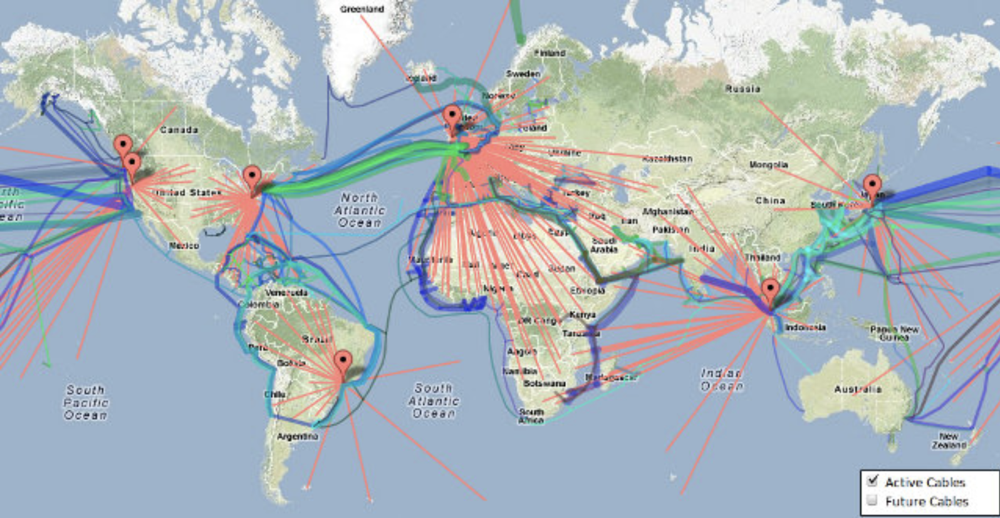
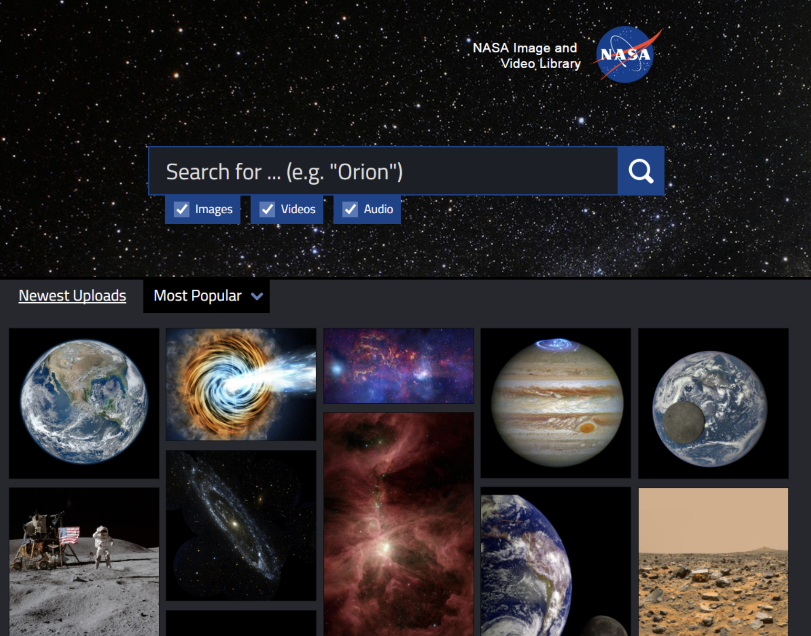
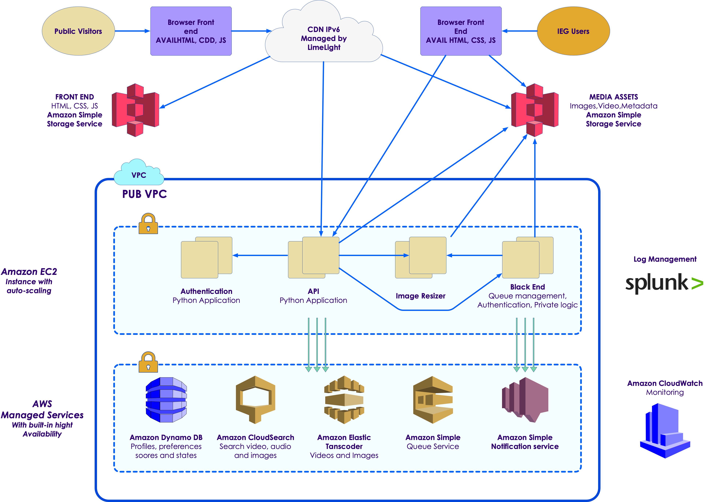
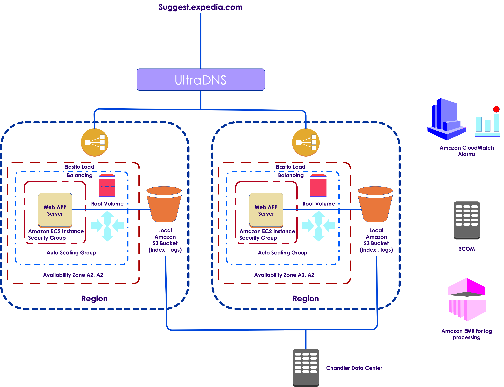
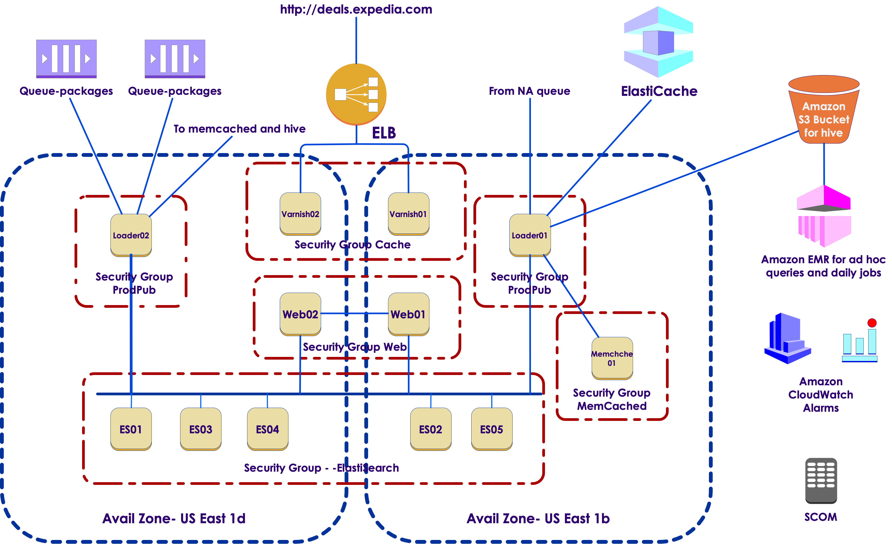

# AWS Overview

---

## What Is Cloud Computing?
* IT resources and applications
* Delivered to you on demand
* Via Internet
* On a pay-as-you-go model
* In simple terms
  - get as many resources as you need
  - in a matter of minutes
  - only pay for what you use

---
## Cloud Computing Advantages
* Revolutionary shift in how technology
  - obtained
  - used
  - managed
  
* You can
  - Reconfigure the environment
  - Scale capacity up and down
  
---

## Advantages
 

---

## Advantages in Detail
* Variable vs. Capital Expense
   - Trade capital expenses for variable operational expense
   
* Economies of Scale
  - Usage from hundreds of thousands of customers is aggregated
  
* Stop guessing capacity
  - Instead, put this into your architecture
  - Scale up and down as required
  
---
## Advantages in Detail Cont'd

* Increase speed and agility
  - You can develop and experiment faster and cheaper
  - Just think of testing at full production load!
  
* Focus on Business Differentiators
  - Spend on what you do well, not on running data centers
  
* Go global in minutes
  - Deployments of any size or scope
  
---
## Cloud Computing Deployment Models
* "All-in" cloud-based
  - From low-level components
  - From services (serverless computing)
  
* Hybrid
  - connect infrastructure and applications
  - combine cloud-based resources with the existing ones in the data centers

---
## AWS Cloud Platform

 

---

## Compute and Networking Services
* Elastic Computer Cloud (EC2)
  - Resizable compute capacity 
  - Virtual servers with configurable RAM, CPU, storage
* AWS Lambda
  - Serverless, milliseconds latency
  - Runs your code in (almost) any language
* Auto scaling
  - Automatically scales EC2 capacity up and down
  
---
## Auto Scaling
 

---
## AWS Datacenters Mashup
 

---
## AWS Use Case: NASA
* About NASA
  - Established in 1958
  - National Aeronautics and Space Administration (NASA) has been working around the world
  - and off of it
  - trying to answer some basic questions: 
    - What’s out there in space? 
    - How do we get there? 
    - What will we find? 
    
---
## NASA Goals
* NASA Image and Video Library 
* Launched in March 2017
* Decades of NASA Achievements
* All in One Place
   
---
## NASA Video Library
 
---

## NASA Video Library Key Features
* A user interface that automatically scales for PCs, tablets, and mobile phones

* A search interface that lets people easily find what they’re looking for

* The ability to easily download any media found on the site—or share it on Pinterest, Facebook, Twitter, or Google+.

* Access to the metadata associated with each asset

* An application programming interface (API) for automated uploads of new content

---
## NASA App Architecture
* Amazon Elastic Compute Cloud (Amazon EC2)
  - provides secure, resizable compute capacity in the cloud

* Elastic Load Balancing (ELB)
  - used to distribute incoming traffic across multiple Amazon EC2 instances

* Amazon Simple Storage Service (Amazon S3)
  - supports object storage for incoming (uploaded) media, metadata, and published assets

* Amazon Simple Queue Service (SQS)
  - decouple incoming jobs from pipeline processes.

* Amazon Relational Database Service (Amazon RDS)
  - automatic synchronization and failover

---
## NASA App Architecture, cont'd
* Amazon DynamoDB
  - fast and flexible NoSQL database service
  - track incoming jobs, published assets, and users

* Amazon Elastic Transcoder
  - transcode audio and video to various resolutions

* Amazon CloudSearch
  - support searching by free text or fields

---
## NASA App Architecture, cont'd

* Amazon Simple Notification Service (SNS)
  - trigger the processing pipeline when new content is uploaded

* AWS CloudFormation
  - automated creation, updating, and destruction of AWS resources
  - InfoZen also used the Troposphere library
  - enables the creation of objects via AWS CloudFormation

* Amazon CloudWatch
  - monitoring service for AWS cloud resources and the applications running on AWS
  
---
## NASA Architecture Diagram
 

---
## AWS Use Case: Expedia
* Expedia 
  - Increases Agility and Resiliency
  - Going All In on AWS
  - 2017
  
---
## About Expedia
* Leading online travel company
  - providing leisure and business travel to customers worldwide
  
* Brands
  - Expedia.com
    - one of the world’s largest full service online travel agency
    - with sites localized for more than 20 countries
  - Hotels.com
    - hotel specialist with sites in more than 60 countries
  - Hotwire.com
    - the hotel specialist with sites in more than 60 countries
  - other travel brands
  
---
## Expedia Challenge
* Continuous innovation
* Technology, and platform improvements 
* to create a great experience for its customers. 
* Expedia Worldwide Engineering (EWE) 
  - supports all websites under the Expedia brand
  - began using Amazon Web Services (AWS) 
  - 2010 Expedia Suggest Service (ESS)
    - typeahead suggestion service 
    - helps customers enter travel, search, and location information correctly
    - hard task. latency very important
    
---
## Why Amazon Web Services
* Error page is the main reason for site abandonment    
* Key factors
  - infrastructure
  - automation
  - proximity to the customer

---
## Launching ESS on AWS

 

---
## Running Critical Applications on AWS

 
---
