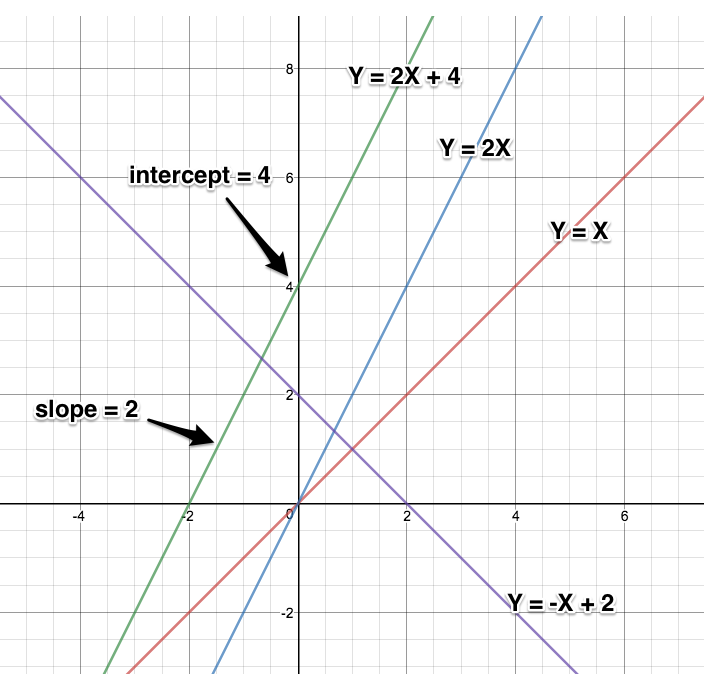
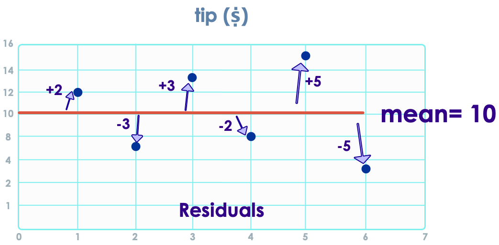

# Regression in Sagemaker

---

## Lesson Objectives
  * Learn about Regression algorithms
  * Learn how to implement them in SageMaker

---

# Regression Overview
  * Statistical models to estimate relationship between
    - One or more independent variables (X)

      AND

    - A dependent variable (Y)

---

## Regression Algorithms

| Algorithm           	| Description                                                                                                                                                        	| Use Case                                                	|
|---------------------	|--------------------------------------------------------------------------------------------------------------------------------------------------------------------	|---------------------------------------------------------	|
| Linear Regression   	| Establishes  a best fit 'straight line'         **Advantages:**     -  Simple, well understood     -  Scales to large datasets         **Disadvantages**   -  Prone to outliers 	| -  House prices    -  Stock market 	|
| Logistic Regression 	| -  Calculates  the probability of outcome (success or failure)    -  Used for **'classification'**  ;)     -  Needs large sample sizes for accurate prediction       	| -  Loan approval   	|

---

# Linear Regression
  * Y is a linear combination of the coefficients of X
  * Single Linear Regression
    - Y = aX + b  (e.g. Tip = a * bill + b)

  

---

## Graph Review!

*  **Y = aX + b**

 * Y = 2X + 4

 * 2 - slope of line

 * 4 - intercept

 

|   |                                   |
|---|-----------------------------------|
| Y | Dependent variable (depends on X) |
| X | Independent variable              |
| a | Slope of line                     |
| b | Intercept (line meets y-axis)     |

Notes:

---

## Linear Regression Vocabulary

### **Y = aX + b &nbsp;&nbsp;&nbsp;&nbsp; Y = b0 + b1X**

| Term                   | Description                                                                   | Synonyms                                         |
|------------------------|-------------------------------------------------------------------------------|--------------------------------------------------|
| **Independent Variable**   | The variable used to predict the response.                                    | -X-variable  -Feature  -attribute                  |
| **Response**               | The variable we are trying to predict.                                        | -Y-variable  -Dependent variable  -Target  -Outcome |
| **Intercept**              | The intercept of the regression line - that is, the predicted value when X= 0 | -b , b0 , β0                                     |
| **Regression coefficient** | The slope of the regression line.                                             | -Slope  -parameter estimates  -Weights  -a , b1     |

---

# Residuals / Errors

  * Let's say my algorithm predicted tip is $10

  *  **Residual**  = difference between  *actual tip* and  *predicted tip*

  * Sum of all residuals  =  **ZERO**

---

# Sum of Squared Errors (SSE)

  * Squaring residuals
    - To make them positive
    - To amplify 'outliers' (large deviations)

  * Goal is to minimize SSE

  * SageMaker metric *test:objective_loss* reports SSE       

Notes:

---

# Multiple Linear Regression
## Problem: House Prices

| Sale Price $ | Bedrooms | Bathrooms | Sqft_Living | Sqft_Lot |
|--------------|----------|-----------|-------------|----------|
| 280,000      | 6        | 3         | 2,400       | 9,373    |
| 1,000,000    | 4        | 3.75      | 3,764       | 20,156   |
| 745,000      | 4        | 1.75      | 2.06        | 26,036   |
| 425,000      | 5        | 3.75      | 3,200       | 8,618    |
| 240,000      | 4        | 1.75      | 1,720       | 8,620    |
| 327,000      | 3        | 1.5       | 1,750       | 34,465   |
| 347,000      | 4        | 1.75      | 1,860       | 14,650   |

 * Multiple factors decide house prices

 * Y = b0 + b1X1 + b2X2 + ...

---

# Logistic Regression
  * Linear Algorithm BUT used for classification
    - Credit card application approval: YES or NO?
  * Log-odds for label '1' is a *linear* combination of independent variables (X)

  * Credit Card Approval based on FICO score

---

## Multiple Logistic Regression

 * We can have multiple factors (independent variables) determining an outcome as well

     - This is called 'multiple logistic regression'

Notes:

---

## Math Behind Multiple Logistic Regression

 * Let's say  
     - β represents parameters

     - X is independent variable (we have more than one)

 * Log(odds) = ln (y / (1-y)) = β0 + β1* X1 + β2* X2 + .... + βn* Xn   

 * Log (odds) or log-odds ration = 

 * Where p is the probably the event will occur

---

# Preparing Data for Logistic Regression

*  **Binary Output Variable**

  Set the label column to 0 or 1 in training data

* **Remove Noise**

  Remove outliers from input data

* **Remove Correlated Output**

  Remove highly correlated inputs to avoid overfitting

* **Gaussian Distribution**

  Shaping the data into a Gaussian distribution (Logarithmic, etc.) will yield better results

---

## Regression in SageMaker: Linear Learner
  * Implements both Linear and Logistic regression

  * **Input data: (x, y)**
    - x: vector of features
    - y: label
      - For linear regression, y is a real Number
      - For logistic regression, y is 0 or 1 (binary classifier)

  * **Input formats**
     - recordIO wrapped protobuf 
     - CSV

  * **Self-tuning**
    - Tunes many models in parallel and picks best one!
    - No need for user tuning (unless you really want to)

Notes:
      https://docs.aws.amazon.com/sagemaker/latest/dg/linear-learner.html

---

## Hyper Parameters for Linear learner
| Parameter      | Meaning          | Value(s)              |
|----------------|------------------|-----------------------|
| feature_dim    | No. of features  |                       |
| predictor_type | regression or classifier| binary_classifier,   multiclass_classifier, regressor             |

  * [Hyper parameters documentation] (https://docs.aws.amazon.com/sagemaker/latest/dg/ll_hyperparameters.html)

---

## Lab: Predict Loan Defaults
  * **Overview**:
    - Learn to use Linear Learner for Logistic Regression

  * **Approximate Time**:
    - 30 mins.

  * **Instructions**:
    - Follow appropriate Sagemaker lab Instructions

---
