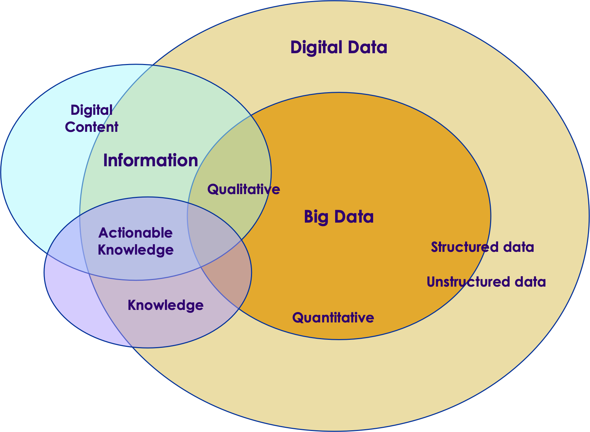
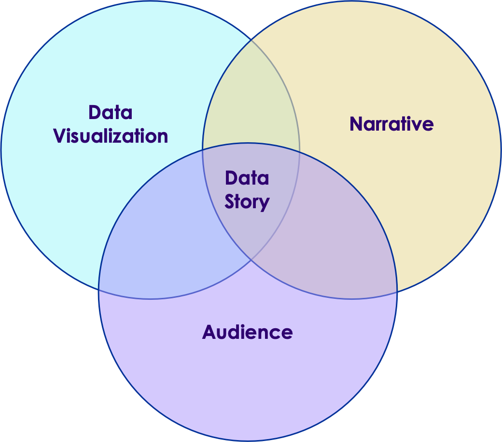
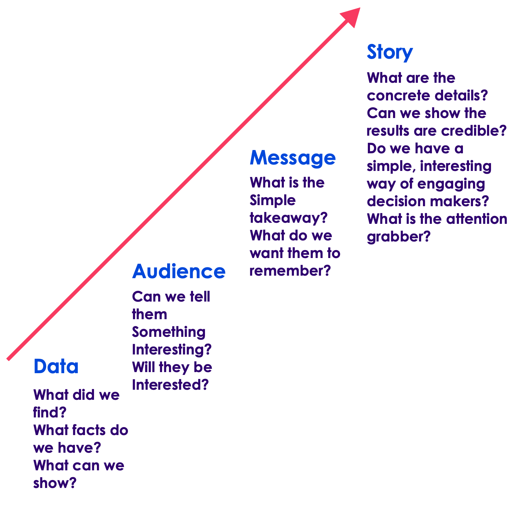

# DDDM Details

---

# About DDDM

---

## Data Concept
 * What is data?
 * What are types of data?

---

## Using Data

---

## Steps To Create

---

# History of DDDM

---

## Education

 * The term DDDM Became popular in educational circles
   - Mainly because of the 2001 No Child Left Behind Act (now largely replaced)
 * NCLB Did introduce a focus on *data*
  - Data collection (through testing).
  - Decisions made on data and not on anecdotes or subjective criteria.
 * Education is now transformed by a focus on data
 
---

## Beyond Education
 
 * DDDM is now widely practiced in government and industry.
 * Many government agencies are now required to use DDDM as a methodology.
 * DDDM is also used widely in industry as companies have embraced a "silicon valley" approach to data assets.

---

## Applied Statitics
 * Statistics is a quantative science focused on data.
 * The *original* data science!
 * Statistics has much to inform DDDDM

# Data Storytelling

---

## Telling A Story

---

## Creating A story

---

