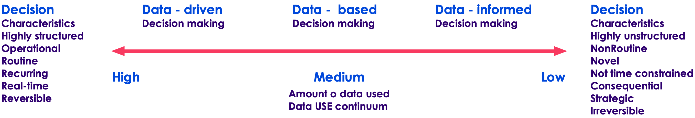

# Data Driven Decision Making
---

# DDDM Intro

## DDDM defined

* Many organizations must adapt to survive digital disruption. 
  * One approach is digital transformation. Th
  *  envision a data-centric organization and encourage data-based decision-making processes.

* Data-based decision making is an ongoing process of collecting and analyzing different types of data from diverse sources. 

* Digital disruption is like a tidal wave. Managers must learn to act quickly using data. 

* Middle managers using data-based decision-making are the key to successfully implementing a digital vision.

Notes:

* Many organizations must adapt to survive digital disruption. One approach is digital transformation. The quest for transformation is a ­journey and the destination is not fixed. Rather senior managers must envision a data-centric organization and encourage data-based ­decision-making processes.

* Data-based decision making is an ongoing process of collecting and analyzing different types of data from diverse sources. Building better ­decision support and using analytics is an enabler of more effective ­decision making and digital transformation. Digital transformation changes ­people’s behavior, organizational processes, and technologies to enhance performance and better meet customer needs. Using data becomes part of an organization’s culture and managers learn to use data and analytics appropriately for each decision situation. Analytics and decision support become pervasive and enhance data-based decision making.

* Digital disruption is like a tidal wave. Managers must learn to act quickly using data. To succeed in the long-run, managers must ensure that data is used ethically. Both data visualization and data story telling can assist managers in directing the digital journey. Algorithms, ­Artificial Intelligence, and Machine Learning are tools to make processes faster and smarter.

* Middle managers using data-based decision-making are the key to successfully implementing a digital vision.

---

## What is DDDM?

* Data Driven Decision Making
* "DDDM is the process of making decisions based on actual data rather than observations or intuition alone."

---

## Questions of DDDM
* Two Basic Questions
* What is it that we *actually* do?
  - versus what it is that we *think* we do.
* How well do we do it?
  - versus how well does our customers and partners think we do it.

---

## Research Studies

* According to McKinsey, companies that use DDDM outsmart their competitors in terms of profit.
* According to a survey conducted by the Business Application Research Center (BARC) on the BI trends, DDDM and Data Quality Management are the most important trend in 2020.

---

## Decision Making

* Companies use business analytics to enable faster and facts-based decision making.

* Data-driven organizations make better strategic decisions.

* Companies enjoy high operational efficiency, improved customer satisfaction, robust profit and revenue level.

---

## Culture Versus Activity
* DDDM is not primarily an activity
  - It certainly can influence our activities
  - But alone it's not enough.
* DDDM requires a *Cultural* change
  - Training should be provided for all stakeholders involved
  - Failure is often that not on "the same page

---

## Hypothesis
* DDDM starts with a hypothesis
* What is a Hypothesis?
  - A Hypothesis is a "proposed explanation made as a starting point for further investigation"
* A Hypothesis is:
  - Testable
  - Measurable
  - Understable
  - Contain one or more Independent (X) and Dependent (Y) variables.

---

## Data
* Above all, DDDM should be about confirming the *hypothesis* with data
* It's really about applying the scientific method.
* Does our hypothesis better fit the data, or the null hypothesis better fir the data.

---

## DDDM Lifecycle

1. Discovery: Learn about business domain and assess available resources
2. Data Preparation: Prepare and make data available
3. Perform Analysis: Identify Techniques and Data to Understand Variables' relationship
4. Modeling: Develop Analytical Models
5. Communicate Results: Identify Key findings, Business Values, and develop narratives for Stakeholders.
6. Operationalize: Deliver Final Reports, briefs, code, and techincal docuemtns.

---

## DDDM example

---

## Activity

* Draw a word cloud
* https://monkeylearn.com/word-cloud/

---

# Developing Effective KPIs

---

## What is a KPI?

* Measure your performance against key business objectives.

---

## What KPI measures

* a measurable value that 
* demonstrates how effectively a company is achieving key business objectives.  

Notes:

A Key Performance Indicator is a measurable value that demonstrates how effectively a company is achieving key business objectives. Organizations use KPIs at multiple levels to evaluate their success at reaching targets. High-level KPIs may focus on the overall performance of the business, while low-level KPIs may focus on processes in departments such as sales, marketing, HR, support and others.

---

## Here are some KPI examples

* Net profit

* Net profit margin

* Gross profit margin

* Operating profit margin

* EBITDA

* Revenue growth rate

* But are they good?

---

## What makes a KPI effective?

* KPI is only as valuable as the action it inspires.
* Organizations blindly adopt industry-recognized KPIs
* To develop a strategy for formulating KPIs
  * start with the basics 
  * understand what your organizational objectives are 
  * how you plan on achieving them
  *  who can act on this information

Notes:

* Now that we know KPI stands for key performance indicator it is only as valuable as the action it inspires. Too often, organizations blindly adopt industry-recognized KPIs and then wonder why that KPI doesn't reflect their own business and fails to affect any positive change. One of the most important, but often overlooked, aspects of KPIs is that they are a form of communication. As such, they abide by the same rules and best-practices as any other form of communication. Succinct, clear and relevant information is much more likely to be absorbed and acted upon.

* In terms of developing a strategy for formulating KPIs, your team should start with the basics and understand what your organizational objectives are, how you plan on achieving them, and who can act on this information. This should be an iterative process that involves feedback from analysts, department heads and managers. As this fact finding mission unfolds, you will gain a better understanding of which business processes need to be measured with a KPI dashboard and with whom that information should be shared.

---

## How to define a KPI

* What is your desired outcome?
* Why does this outcome matter?
* How are you going to measure progress?
* How can you influence the outcome?
* Who is responsible for the business outcome?
* How will you know you’ve achieved your outcome?
* How often will you review progress towards the outcome?

Notes:

* Defining key performance indicators can be tricky business. The operative word in KPI is “key” because every KPI should related to a specific business outcome with a performance measure. KPIs are often confused with business metrics. Although often used in the same spirit, KPIs need to be defined according to critical or core business objectives. Follow these steps when defining a KPI:  

---

## Sales Growth KPI

* To increase sales revenue by 20% this year
* Achieving this target will allow the business to become profitable
* Progress will be measured as an increase in revenue measured in dollars spent
* By hiring additional sales staff, by promoting existing customers to buy more product
* The Chief Sales Officer is responsible for this metric
* Revenue will have increased by 20% this year
* Will be reviewed on a monthly basis

Notes:

* As an example, let’s say your objective is to increase sales revenue this year. You’re going to call this your Sales Growth KPI. Here’s how you might define the KPI:

## Activity 1

* In your breakout rooms
  * Form your team
  * Study the KPI.pdf example, to see how KPI is analyzed  
  * Is it a KPI?
  * Which goals does it fulfill?
  
---

## What is a SMART KPI?

* Is your objective **Specific**?
* Can you **Measure** progress towards that goal?
* Is the goal realistically **Attainable**?
* How **Relevant** is the goal to your organization?
* What is the **Time-frame** for achieving this goal?

Notes:

One way to evaluate the relevance of a performance indicator is to use the SMART criteria. The letters are typically taken to stand for Specific, Measurable, Attainable, Relevant, Time-bound. In other words:

---

## Make sure the KPI is actionable

* Making your KPIs actionable is a five-step process:

1. Review business objectives
2. Analyze your current performance
3. Set short and long term KPI targets
4. Review targets with your team
5. Review progress and readjust

Notes:

* Most of this we’ve already gone over, but it’s worth focusing on the need to develop targets for both the short- and long-term. Once you’ve set a goal with a timeline that’s farther into the future (say the next few quarters, or your fiscal year) you can then work backwards and identify the milestones you’ll need to hit on the way there.

* Let’s say, for example, you want to sign up 1,500 newsletter subscribers in the first quarter of the year. You’ll want to set monthly, bi-weekly or even weekly targets to get there. That way you’ll be able to continually reassess and change course as needed on your way to achieving the longer-term goal.

* You could divide the targets up equally according to each month. In this case that would be 500 subscriptions in January, 500 in February and 500 in March. However you may want to get more specific. There are more days in January and March than February, so maybe you want to set a target of 600 for those months. Or maybe you typically get more website traffic in February (perhaps your business has a presence at a major trade show) so you decide to set a target of 800 in that month.

* Whatever it is, make sure you break up your KPI targets to set short-term goals.

---

## Activity 2

* Go into your breakout room
* Design a KPI for your project
* Explain what makes it smart

---

# Risk-Adjusted Benchmarking

---

## What Is a Risk-Adjusted Return?

* Calculation of the profit or potential profit from an investment that takes into account the degree of risk that must be accepted in order to achieve it.  

* a number or a rating

Notes:

* A risk-adjusted return is a calculation of the profit or potential profit from an investment that takes into account the degree of risk that must be accepted in order to achieve it. The risk is measured in comparison to that of a virtually risk-free investment—usually U.S. Treasuries.

* Depending on the method used, the risk calculation is expressed as a number or a rating. Risk-adjusted returns are applied to individual stocks, investment funds, and entire portfolios.

---

## Gist

* Takes into account the degree of risk 
* Methods: Sharpe ratio and Treynor ratio
* Help investors (or project manager) determine whether the risk taken it worth it

Notes:

* A risk-adjusted return measures an investment's return after taking into account the degree of risk that was taken to achieve it.
* There are several methods of risk-adjusting performance, such as the Sharpe ratio and Treynor ratio, with each yielding a slightly different result.
* In any case, the purpose of risk-adjusted return is to help investors determine whether the risk taken was worth the expected reward.

---

## To Risk-Adjust or Not to Risk-Adjust? Yes

* In the United States, the National Quality Forum (NQF) is considering when and how to use risk adjustment for sociodemographic factors to assess quality of care
* Risk adjustment is a statistical method that allows for comparison of outcomes when patient populations differ.

* http://www.ihi.org/communities/blogs/_layouts/15/ihi/community/blog/itemview.aspx?List=7d1126ec-8f63-4a3b-9926-c44ea3036813&ID=81

* Conclusion:
  * By tying payment to these poorer health outcomes, these organizations may not get the resources needed to continue to care for their high-risk populations.
  * It seems fair, just, and reasonable to account for sociodemographic factors
  
## Activity 3

* Calculate Sharpe ration
* https://miniwebtool.com/sharpe-ratio-calculator/
* Use your project
* Justify your numbers

---

# Presentation of Benchmarking Data

---

## What is benchmarking?

* A powerful tool many organizations use 
  * to measure and gauge their performance against competition,
  * to push themselves to be best-in-class.
  
Notes:

* Benchmarking is the process of comparing one’s business processes and performance metrics to industry bests and best practices from other companies. Dimensions typically measured are quality, time and cost. In the process of best practice benchmarking, management identifies the best firms in their industry, or in another industry where similar processes exist, and compares the results and processes of those studied (the “targets”) to one’s own results and processes. In this way, they learn how well the targets perform and, more importantly, the business processes that explain why these firms are successful.

* Also referred to as “best practice benchmarking” or “process benchmarking”, this process is used in management and particularly strategic management, in which organizations evaluate various aspects of their processes in relation to best practice companies’ processes, usually within a peer group defined for the purposes of comparison. This then allows organizations to develop plans on how to make improvements or adapt specific best practices, usually with the aim of increasing some aspect of performance. Benchmarking may be a one-off event, but is often treated as a continuous process in which organizations continually seek to improve their practices.

---

## Benchmarking Categories
1. Internal Benchmarking

2. Competitive Benchmarking

3. Functional Benchmarking

4. Generic Benchmarking

5. Collaborative Benchmarking

Notes:

* Internal Benchmarking

* This compares one particular operation within our organization with another. Internal benchmarking is by far the easiest—both to research and to implement. Productivity improvement achieved in this type is usually about 10%.

* Competitive Benchmarking

* This compares our operation with that of our direct competitors. This is the most difficult type of benchmarking to carry out successfully, and legal considerations must always be kept in mind. Productivity improvement achieved is usually about 20%.

* Functional Benchmarking

* The process of comparing an operation with that of similar ones within the broad range of our industry (e.g. copper mining techniques compared with coal mining techniques). Productivity improvement achieved type may be 35% or better.

* Generic Benchmarking

* This compares operations from unrelated industries. The advantage of to this is that the problems of competition do not apply, thereby increasing the access to information and reducing the possibility of legal problems. Productivity improvement achieved may be 35%+.

* Collaborative Benchmarking

* This is carried out collaboratively by groups of companies (e.g. subsidiaries of a multinational in different countries or an industry organization).  Groups of companies agree to share internal benchmarking data with each other.

---

## Approaches to Benchmarking

---

## Activity 4

* Benchmarking activity
* Example: [https://www.lucidchart.com/techblog/2012/11/14/ie10-how-does-it-really-stack-up/](https://www.lucidchart.com/techblog/2012/11/14/ie10-how-does-it-really-stack-up/)
* Use your favorite project
* Define your goals
* Create benchmarks for competing approaches

---

# Intro into anomaly detection

## Simple outliers questions

* https://www.howtogeek.com/400211/how-and-why-to-use-the-outliers-function-in-excel/

---

## Anomaly detection demo

* Azure Data Explorer
* https://docs.microsoft.com/en-us/azure/data-explorer/anomaly-detection

---

# Background materials

---

## Doing DDDM

* Problem Definition
  - e.g., better ad targeting to improve click-through-rate

* Identify appropriate data sources

  - e.g., impression data and social data

* Collect data

* Prepare data

  - ETL, Clean, Filter, Aggregate, etc.
  - Summary statistics and descriptive analytics

* Build/Train/Test model

* Show results

  - e.g., a dashboard
  - Or, a set of charts and graphs with query capability

Notes:

---

## Problem Definitions

* This may not be as easy as it seems

* Known Knowns
  - Daily web traffic

* Known Unknowns
  - What are most popular pages?
  - Do big connectors matter in a social graph?

* Unknown Unknowns
  - Is there a connection between ??? and ????

Notes:

---

## Collecting Data

* Data Sources can be
  - External: government data, public data, ...
  - Internal: collected data (clickstream etc.)

* External Data challenges
  - Compliance, security concerns, ...
  - How much can we get? API throttling.
  - Is the data in useable format?

* May need to bring data from different systems and in usually in different formats.
  - Clicklogs are text files.
  - Customer data can be from a database.

Notes:

---

## Data Pipelines

* Once the 'one time' analysis is successful, you may want to do analysis on new data routinely.

* Need a data pipeline to
  - Gather data from multiple sources
  - Bring them in to a central place (Hadoop, NoSQL, ... ) where analysis can happen
  - Can handle failures in data flow
  - Setup governance policies (masking, expiration, ... )

Notes:

---

## Data Preparation / Cleaning

* Problems with raw data sets
  - Non-usable format (say in Excel spreadsheet format)
  - Contains errors & wrong values
  - Missing values
  - Data is spread across multiple silos

* Data scientists spend a lot of time cleaning and massaging raw data, to get them ready for analysis.

* Crucial part of data science

* Can consume a lot of time (50% - 80%  of the project!!!)

* Least sexy

Notes:

---

## Understanding Data

<!-- {"left" : 6.15, "top" : 1.16, "height" : 2.67, "width" : 3.9} -->

* Before doing 'deep learning' of data, understand the data.

* Basic questions
  - Is there a pattern?
  - Are there a lot of outliers?  (May skew analysis. Should we keep these or throw them away?)

* **Visualizations** can help greatly!
  - Just do some quick & dirty graphs.

* Identify 'interesting segments'

* Need to sample?  Or process entire data set?

Notes:

---

## Model Building

* Don't do this until you have a good understanding of data.(See previous section.)

* Pick right modeling technique
  - Clustering
  - Classifications
  - Etc.

* Pick the right model for data
  - Don't get 'hung up' on one model.
  - Try a few to identify the best fitting model.
  - Experience counts!

Notes:

---

## Model Validation

* Models need to be 'verified'  / 'validated.'
* Split the data set into
  - Training set: build / train model
  - Test set: validate the model
* Initially 70% training, 30% validation.
* Tweak the dials to decrease training and increase validation.
* Training set should represent data well enough.

<!-- {"left" : 2.38, "top" : 5.39, "height" : 2.41, "width" : 5.49} -->

Notes:

---

## Visualizations

* How you tell the results

* Very very important part!!

* Good visualizations convey the point to the audience.

* A good data decision maker must learn good visualization techniques.

* Standard graphs: line, bar, pie, ...

* Modern visualizations

  - Heat maps
  - Animations (D3JS etc.)

Notes:

---

## DDDM Applications

* Risk analysis

* Predictive modeling
  - Stock market, home prices, ...

* Recommendations
  - Movies, books, shopping, ...

* Fraud detection
  - Credit card transactions, ...

* Social media
  - Network effects, connections, recommendations, ...

Notes:

---

## DDDM Methodology: Iterative Learning Process

<!-- {"left" : 0.55, "top" : 1.84, "height" : 5.38, "width" : 9.14} -->

Notes:

---

## Data Analytics Tools

* Traditional tools have good traction.
  - Easy to use UI
  - Commercial support

* Open source is catching up pretty fast!
  - Very big eco system
  - New libraries
  - Almost free

<!-- {"left" : 5.22, "top" : 3.41, "height" : 2.82, "width" : 4.6} -->

Notes:

---

## Open Source Tools

|                                  | R                            | Python                                           | Java                                                                     |
|----------------------------------|------------------------------|--------------------------------------------------|--------------------------------------------------------------------------|
| Popularity                       | Academicroots,  very popular | Very popular for  generic and data  science work | Very popular  generalpurposelanguage,  decent data science  capabilities |
| Opensource  libraries / routines | huge                         | Pretty good                                      | average                                                                  |
| Specific Libraries               | all                          | Scikit, SciPy, NumPy, Panda                      | Weka                                                                     |
| Big Data  Integration            | YES (spark)                  | YES (spark)                                      | YES (spark)                                                              |

<!-- {"left" : 0.26, "top" : 1.22, "height" : 3.65, "width" : 9.75, "columnwidth" : [2.44, 2.44, 2.44, 2.44]} -->

Notes:

---

## DDDM: The Future

* We are going to have more data

- Sensors, sensors everywhere
- Connected devices driving a deluge of data
- Most of our current devices will get "smarter" thanks to data

* Real-time data processing
- Able to process, analyze, and learn data in real-time
- Amazing applications in robotics and automated expert systems ("Google car")

* AI will dominate

Notes:

---

## Data Concept
* What is data?
* What are types of data?

---

## Using Data

---

## Steps To Create

---

## Education

* The term DDDM Became popular in educational circles
  - Mainly because of the 2001 No Child Left Behind Act (now largely replaced)
* NCLB Did introduce a focus on *data*
- Data collection (through testing).
- Decisions made on data and not on anecdotes or subjective criteria.
* Education is now transformed by a focus on data

---

## Beyond Education

* DDDM is now widely practiced in government and industry.
* Many government agencies are now required to use DDDM as a methodology.
* DDDM is also used widely in industry as companies have embraced a "silicon valley" approach to data assets.

---

## Applied Statistics
* Statistics is a quantitative science focused on data.
* The *original* data science!
* Statistics has much to inform DDDDM

---

## Telling A Story

---

## Creating A story

---

## Step 1: Defining Objectives and Information Needs

* What are our strategic aims?
* Based on those aims, what do we need to know?
* These questions:
  - Clearly articulate information needs
  - Clarify Who needs to know What/When/Why

---

## Step 2: Collecting Data

* Need to collect the relevant data.
* Organizations need :
  - assess whether the required data is already held somewhere in the organization
  - identify the best way to collect the data.

---

## Step 3: Analyzing Data

* Data must be turned into insights
* Data first must be analyzed
* Information must be extracted
* Insights must be gained from models.

---

## Step 4: Presenting Information

* Storytelling
  - Must
* Focus on:
  - Right Information
  - Right Format
  - Right People
  - Right Time

---

## Step 5: Making Data-Driven Decisions
* Turning Information Into Decisions
* Make sure information result in actions
* Requires a *Culture* shift
  - From making decision based on assumptions or "gut" instict
  - To: making decisions rooted in data-driven insights

---

## About Google

* Google’s mission:
* "To organize the world’s information and make it universally accessible and useful."
* And in pursuing this mission, the company is very serious about using information to inform their decisions.
* Founded by two engineers, Google is a company where:
  - data-driven insights are part of its DNA,
  - Googlers (employees in Google) speak the language of data as part of their culture.
* In fact, Google aims to make all decisions based on data and analytics.

---

## Defining objectives and information needs

Data can provide much-needed answers, but only if you are clear about the questions you need to answer
* Google aims to start with these questions and be very clear about the information it needs at the outset
* As the company’s former executive chairman, Eric Schmidt, has said, “We run the company by questions, not by answers.”
* Within its global HR function, Google has created a people analytics department that enables the organization to make data-driven people decisions
* One question Google wanted to answer was, “Do managers actually matter?” This is a question Google had been wrestling with for years; at one point, the company actually got rid of all managers and made everyone an individual contributor
* This did not really work, and managers were brought back in, but the suspicion lingered that managers perhaps were not that important.
* So, Google had identified a critical people-related question that it wanted to answer: Do managers matter?

---

## Collecting Data

* To start with, the people analytics team looked at the data sources that already existed: performance reviews (top-down reviews of managers) and employee surveys (bottom-up reviews of managers)
* The team took this data and plotted it on a graph that revealed that managers were generally perceived as good
* The problem was the data did not really show a lot of variation, so the team decided to split the data into the top and bottom quartiles
*  Using regression analysis, the team was able to show a big difference between these two groups in terms of team productivity, employee happiness, and employee turnover
* In other words, the teams with the better managers performed better, and employees were happier and more likely to stay.

--- 

## Collecting Data
* This answered the original question – clearly, managers did matter – but it did not really give much in terms of actionable insights
* So the team came up with a new question that needed answering: “What makes a good manager at Google?” To answer this new question, the team introduced two new data collection methods
* The first was a “Great Managers Award,” through which employees could nominate managers they felt were particularly good
* As part of the nomination, employees had to provide examples of behaviors they felt supported their good assessment of managers
* The second data set came from interviews with the managers in each of the two quartiles (bottom and top) to understand what they were doing or not doing (the managers did not know which quartile they were in.

---

## Analyzing Data

Data from the manager interviews and the Great Manager Award nomina- Step 3 tions was coded using text analysis to extract the top eight behaviors of a
high-scoring manager, as well as the top three reasons why managers were struggling in their role.
According to the findings, a high-scoring manager displayed the following eight characteristics:
*  a good coach
*  empowers the team, does not micromanage
*  expresses interest / concern for team members’ success and personal wellbeing
*  productive and results-oriented
*  a good communicator – listens and shares information
*  helps with career development
*  has a clear vision / strategy for the team
*  has important technical skills that help him / her to advise the team

---

## Analyzing Data

* Following are the three main factors causing managers to struggle:
  - has a tough transition (e.g., suddenly promoted, or hired from outside with little training)
  - lacks a consistent philosophy / approach to performance management and career development
  -  spends too little time on managing and communicating

---

## Presenting Information

* Google used different ways of sharing these insights with the relevant managers.
* The top level team received a newspaper-style report with headlines, graphs and narratives.
* Senior and middle managers received a more action-orientated analysis, outlining the findings and expectations for them as a manager.

---

## Making Data Driven Decisions

* Google started to measure people against these behaviors and introduced a new bi-annual feedback survey to help with this measurement.
* Google decided to continue with the Great Manager Award to further measure manager performance.
* Google revised the management training to support and promote the most desirable management behaviors.

---

## Another Key Strategic Priority: The Earth
* Google: fully carbon neutral since 2007
* Datacenters: 2% of global energy usage
* "How can we reduce energy used to cool datacenters?"
* Google Developed a Machine Learning Algorithm:
  - These algorithms can spot patterns across various systems
  - see how they impact the cooling infrastructure
  - make decisions on the best configuration of equipment.
* Result: 40% reduction in energy for cooling. 

---

## The Fallacy of the Gut Feeling

* Many individuals decide to make decisions based on intuition, or gut.
* There's a misconception that for the truly gifted, intuition gives them an edge over ordinary decision makers.
* It's undoubtedly true that some people make better intuitive decisions than others.
* Human nature is such that even the most gifted intuitive thinkers will be subject to bias that afflict human nature.

---

## Confirmation Bias

* Confirmation Bias means that humans naturally put their pre-existing beliefs first
  - It is human nature that a pre-existing belief will only be surrendered with difficulty (if at all) in the face of contradictory evidence.
* Example "A father and son are in a car crash and are rushed to the hospital. The father dies. The boy is taken to the operating room and the surgeon says:
  - "I can't operate on this boy, because he's my son."
* How is it possible?

---

## Confirmation Bias
* If you said, "She was his mother," congradulations! You passed the gender bias test!
* The point is that our pre-existing assumptions may be difficult to surrender.
* In the case of mixed data, humans tend to gravitate to towards the data that confirms their pre-existing beliefs.

---

## Anchor Bias
* Anchor Bias means that you make a decision based on an initial assumption (called the "anchor).
* Imagine that you are given a budget for a software purchase of $100,000.00
* You come across three proposals:
  - The first company proposes $110k
  - The second proposes $100k
  - The third solution costs $30k.
* Which do you select?

--- 

## Anchor Bias
* If you said the second ($100k), you should ask yourself:
  - Why did you select that one?
  - Because it was exactly within your budget?
* Perhaps the $110k has critical features that are needed!
* Perhaps the $30k meets all your requirements exactly.
* In this case, the "anchor" -- the budget amount of $100k, biased our chouice.

---

## Retrievability Bias
* This bias means we make decisions based on our most easily retrieved anecdote.
* Let's say that we want to implement policies to reduce employee turnover.
  - Naturally we think of a recent employee who left the company.
  - It may be that those who left suddenly or abruptly are the ones that are the most memorable.
  - This may cloud our judgement on addressing the broader scope.

---

## Regression Fallacy
* "Regression Fallacy" means the assumption that "regression to the mean" is the start of a larger trend.
* For example, let's say that an employee's performance is suffering, possibly due to personal reasons.
  - Her manager may criticize her performance and see how she responds to criticism.
  - If her performance improves, the manager may conclude that the criticism itself was the cause of the improvement.
* But is it?
  - It would be natural for a dipping performance to eventually return to the level it was before.
  - This is what statisticians call "regression to the mean."
* Here the manager made false assumptions!

---

## Hindsight Bias

* Hindsight Bias means we reward actions that had good results without considering that it could be random chance that achieved the results.
* Many financial analysts make their name by making bold predictions.
  - Stock Market Crashing in Q4!
  - Dow up 50% by EOY!
* Occasionally such bold predictions inevitably turn out correct.
  - The analyst writes books about how "Nobody else correctly called the last recession but me!"
  - When in fact, the law of averages is such that such bold predictions may eventually by random chance be proven correct.
* Gamblers in Vegas often fall victim to this fallacy of seeing a lucky streak as genius rather than simply probabilities that could change.

--- 

## Hyperbolic Discounting Bias
* Hyperbolic Discounting Bias is when we irrationally assess payoffs based on time.
* For example, lottery winners are often given a choice between;
  - a one-time payout
  - an annuity.
* There are many financial and economic tools to assess "the time value of money":
  - to determine whether the annuity or the payout are more valuable.
  - Financial products such as lines of credit could be issued against future winnings to help participants manage cash flow.
* However, people often make emotional decisions:
  - Give me the money now!
  - I don't want it all at once; I want it a little at a time.

---

## What to do about biases
* Realizing that one is subject to biases does not make one a worse person!
  - Actually acknowledging the possibility of bias is a sign of maturity!
  - "I do feel that XYZ is the right thing to do, but I acknowledge I could be influenced by biases."
* The *possibility* of bias should give us the humility to accept what the data "says" at face value.

---

## What is GroupThink?

* "Groupthink" is a phenomenon in which group decision making sometimes have worse outcomes than individual decision making.
* Groupthink is more than just a human desire for conformity
  - It is a organizational value that values concurrence-seeking above all else.
  - Takes group values uncritically and views attempts to question group values with suspicion.
* Causes
  - A group desire for harmony
  - Lack of Diversity
  - Assuming "silence is consent."

---

## Congrats on completion

---

