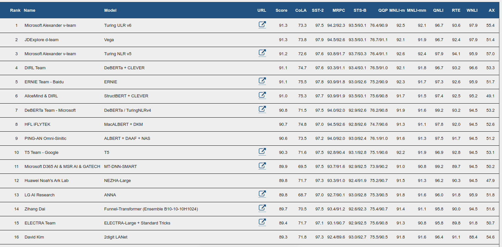

# Fine-Tuning Models

---

# Introduction

---

## What we'll cover

* How to prepare a large dataset from the Hub
* How to use the high-level Trainer API to fine-tune a model
* How to use a custom training loop
* How to leverage the Accelerate library to easily run that custom training loop on any distributed setup

---

# Processing the data

---

## Loading the dataset

* The Hub doesn’t just contain models
  * it also has multiple datasets in lots of different languages. 
  * You can browse the datasets here, 
  * and we recommend you try to load and process a new dataset 
  * once you have gone through this section

## SuperGLUE Leaderboard

---

## Lab
[https://github.com/elephantscale/huggingface-labs/blob/main/11-Processing-the-Data/README.md](https://github.com/elephantscale/huggingface-labs/blob/main/11-Processing-the-Data/README.md)

---

# Fine-tuning API

---

# A full training

---

# Fine-tuning, Check!

---

# Chapter quiz

---

## Quiz 1

* The emotion dataset contains Twitter messages labeled with emotions. Search for it in the Hub, and read the dataset card. Which of these is not one of its basic emotions?
  * A. Joy
  * B. Love
  * C. Confusion
  * D. Surprise

Notes:

* C. The dataset contains 6 basic emotions: anger, fear, joy, love, sadness, and surprise.
* Confusion is not one of the six basic emotions.

---

## Quiz 2

* Search for the ar_sarcasm dataset in the Hub. Which task does it support?
  * A. Sentiment classification 
  * B. Machine translation
  * C. Named entity recognition
  * D. Question answering

Notes:

* A. You can tell thanks to the tags.

---

## Quiz 3

* How does the BERT model expect a pair of sentences to be processed?
   * A. Tokens_of_sentence_1 [SEP] Tokens_of_sentence_2
   * B. [CLS] Tokens_of_sentence_1 Tokens_of_sentence_2
   * C. [CLS] Tokens_of_sentence_1 [SEP] Tokens_of_sentence_2 [SEP] 
   * D. [CLS] Tokens_of_sentence_1 [SEP] Tokens_of_sentence_2
   

Notes:
* C. 

---

## Quiz 4

* What are the benefits of the Dataset.map() method? Select all that apply.
  * A. The results of the function are cached, so it won't take any time if we re-execute the code.
  * B. It can apply multiprocessing to go faster than applying the function on each element of the dataset.
  * C. It does not load the whole dataset into memory, saving the results as soon as one element is processed.

Notes:

* A., B., C.

---

## Quiz 5

* What does dynamic padding mean?
  * A. It's when you pad the inputs for each batch to the maximum length in the whole dataset.
  * B. It's when you pad your inputs when the batch is created, to the maximum length of the sentences inside that batch.
  * C. It's when you pad your inputs so that each sentence has the same number of tokens as the previous one in the dataset.   
   
   
Notes:
* B. The "dynamic" part comes from the fact that the size of each batch is determined at the time of creation, and all your batches might have different shapes as a result.

---

## Quiz 6

* What is the purpose of the collate function?
  * A. It ensures all the sequences in the dataset have the same length.
  * B. It puts together all the samples in a batch.
  * C. It preprocesses the whole dataset.
  * D. It truncates the sequences in the dataset.
 
Notes:
* B. You can pass the collate function as an argument of a DataLoader. We used the DataCollatorWithPadding function, which pads all items in a batch so they have the same length.

---

## Quiz 7

* What happens when you instantiate one of the AutoModelForXxx classes with a pretrained language model (such as bert-base-uncased) that corresponds to a different task than the one for which it was trained?
  * A. Nothing, but you get a warning.
  * B. The head of the pretrained model is discarded and a new head suitable for the task is inserted instead.
  * C. The head of the pretrained model is discarded.
  * D. Nothing, since the model can still be fine-tuned for the different task.
   
Notes:
* B. For example, when we used AutoModelForSequenceClassification with bert-base-uncased, we got warnings when instantiating the model. The pretrained head is not used for the sequence classification task, so it's discarded and a new head is instantiated with random weights.

---

## Quiz 8

* What’s the purpose of TrainingArguments?
   * A. It contains all the hyperparameters used for training and evaluation with the Trainer.
   * B. It specifies the size of the model.
   * C. It just contains the hyperparameters used for evaluation.
   * D. It just contains the hyperparameters used for training.
  
Notes:
* A. 

---

## Quiz 9

* Why should you use the Accelerate library?
   * A. It provides access to faster models.
   * B. It provides a high-level API so I don't have to implement my own training loop.
   * C. It makes our training loops work on distributed strategies
   * D. It provides more optimization functions.

Notes:
* C.

---