# Introduction to Transformers

---

# What to Expect

---

## Tutorials

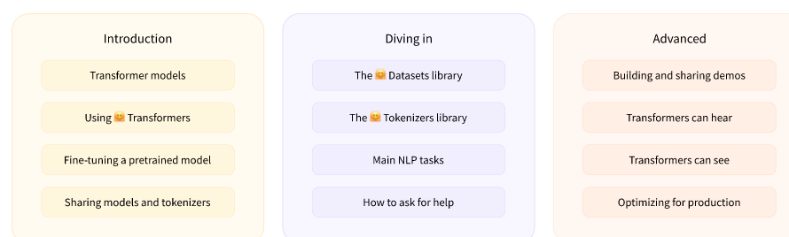


Notes:

* [How Transformers Work](https://huggingface.co/course/chapter1/4?fw=pt)

---


# NLP

---

## What is NLP?

* NLP is a field of linguistics and machine learning focused on understanding everything related to human language. The aim of NLP tasks is not only to understand single words individually, but to be able to understand the context of those words.

* The following is a list of common NLP tasks, with some examples of each:

---

## NLP Tasks

* Classifying whole sentences: 
  * Getting the sentiment of a review, detecting if an email is spam, determining if a sentence is grammatically correct or whether two sentences are logically related or not
* Classifying each word in a sentence: 
  * Identifying the grammatical components of a sentence (noun, verb, adjective), or the named entities (person, location, organization)
* Generating text content: 
  * Completing a prompt with auto-generated text, filling in the blanks in a text with masked words
* Extracting an answer from a text: 
  * Given a question and a context, extracting the answer to the question based on the information provided in the context
* Generating a new sentence from an input text: 
  * Translating a text into another language, summarizing a text
* More
  * Generating a transcript of an audio sample or a description of an image.
---

## Why is it challenging?

* Computers don’t process information in the same way as humans. 
* For example, when we read the sentence “I am hungry,” we can easily understand its meaning. 
* Similarly, given two sentences such as “I am hungry” and “I am sad,” we’re able to easily determine how similar they are. 
* For machine learning (ML) models, such tasks are more difficult. 
  * The text needs to be processed in a way that enables the model to learn from it. 
  * And because language is complex, we need to think carefully about how this processing must be done. There has been a lot of research done on how to represent text.

---

# Transformers benefits

---

## Transformers are everywhere!

* Transformer models are used to solve all kinds of NLP tasks, like the ones mentioned in the previous section. Here are some of the companies and organizations using Hugging Face and Transformer models, who also contribute back to the community by sharing their models:

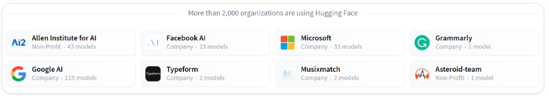

---

## Pipeline

* The most basic object in the Transformers library is the pipeline() function. It connects a model with its necessary preprocessing and postprocessing steps, allowing us to directly input any text and get an intelligible answer:

* We will continue with Lab 03
* We will do it section by section

---

# How Transformers Work

* In this section, we will take a high-level look at the architecture of Transformer models.


---

## A bit of Transformer history

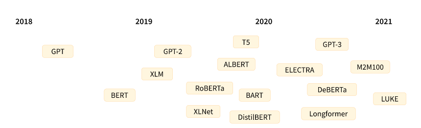

---

## The years

* June 2018: GPT, the first pretrained Transformer model, used for fine-tuning on various NLP tasks and obtained state-of-the-art results

* October 2018: BERT, another large pretrained model, this one designed to produce better summaries of sentences (more on this in the next chapter!)

* February 2019: GPT-2, an improved (and bigger) version of GPT that was not immediately publicly released due to ethical concerns

* October 2019: DistilBERT, a distilled version of BERT that is 60% faster, 40% lighter in memory, and still retains 97% of BERT’s performance

* October 2019: BART and T5, two large pretrained models using the same architecture as the original Transformer model (the first to do so)

* May 2020, GPT-3, an even bigger version of GPT-2 that is able to perform well on a variety of tasks without the need for fine-tuning (called zero-shot learning)

---

## Major categories

* GPT-like (also called auto-regressive Transformer models)
* BERT-like (also called auto-encoding Transformer models)
* BART/T5-like (also called sequence-to-sequence Transformer models)

---

## Transformers are language models

* All the Transformer models mentioned above (GPT, BERT, BART, T5, etc.) have been trained as language models. 
  * This means they have been trained on large amounts of raw text in a self-supervised fashion. Self-supervised learning is a type of training in which the objective is automatically computed from the inputs of the model. That means that humans are not needed to label the data!

* This type of model develops a statistical understanding of the language it has been trained on, but it’s not very useful for specific practical tasks. 
  * Because of this, the general pretrained model then goes through a process called transfer learning. During this process, the model is fine-tuned in a supervised way — that is, using human-annotated labels — on a given task.

---


##  Example of a task

* An example of a task is predicting the next word in a sentence having read the n previous words. This is called causal language modeling because the output depends on the past and present inputs, but not the future ones.

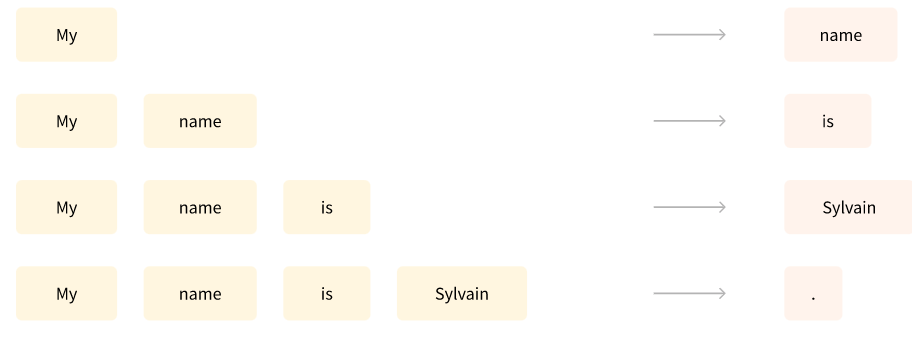

---

## Masked language modeling

* Another example is masked language modeling, in which the model predicts a masked word in the sentence.
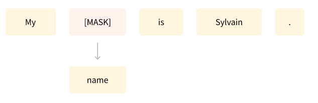

---

## Transformers are big models

* Apart from a few outliers (like DistilBERT), the general strategy to achieve better performance is by increasing the models’ sizes as well as the amount of data they are pretrained on.
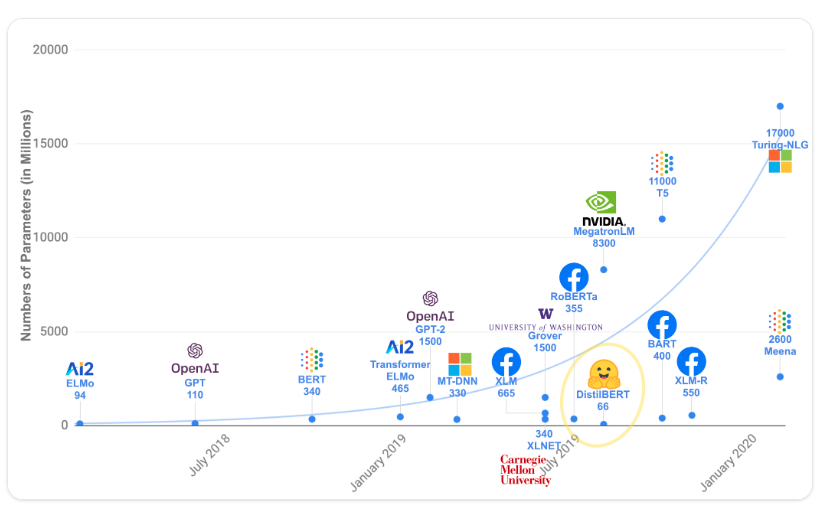

---

## Costs

* Unfortunately, training a model, especially a large one, requires a large amount of data. This becomes very costly in terms of time and compute resources. It even translates to environmental impact, as can be seen in the following graph.
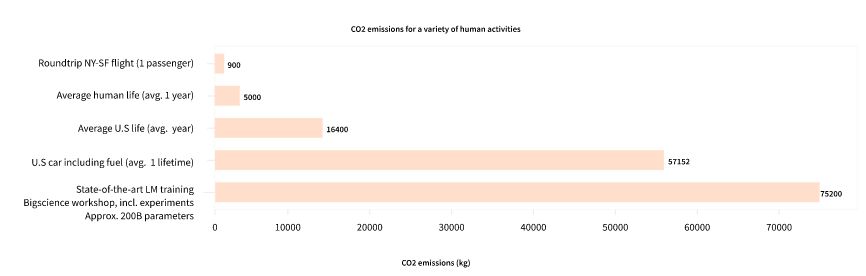

---

## Sharing models

* And this is showing a project for a (very big) model led by a team consciously trying to reduce the environmental impact of pretraining. The footprint of running lots of trials to get the best hyperparameters would be even higher.

* Imagine if each time a research team, a student organization, or a company wanted to train a model, it did so from scratch. This would lead to huge, unnecessary global costs!

* This is why sharing language models is paramount: sharing the trained weights and building on top of already trained weights reduces the overall compute cost and carbon footprint of the community.

---

## Carbon imprint

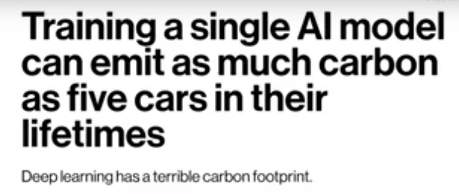

---

## Numbers

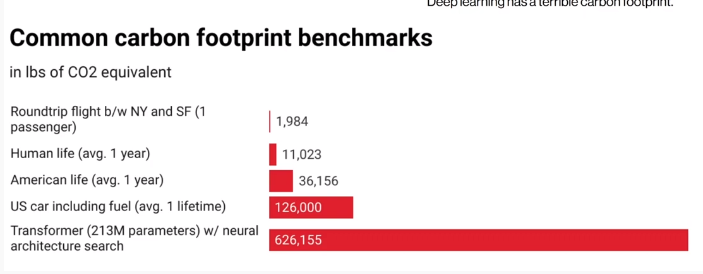

---

## Numbers

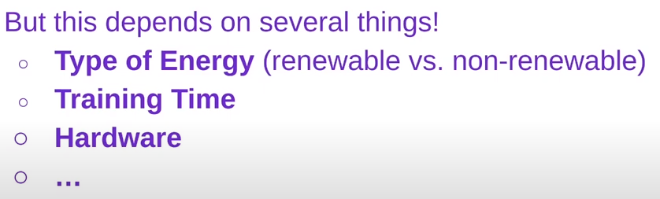

---

## Numbers


---


## Numbers

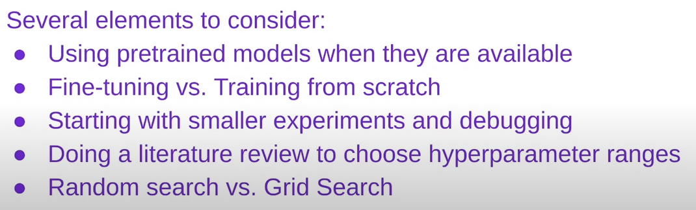

---

## Calculations

* https://mlco2.github.io/impact/

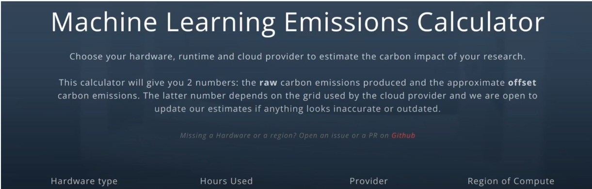


## Numbers


---


## Numbers

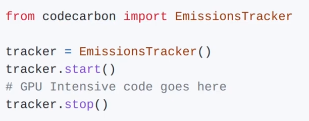

---


# Encoder Models

---

# Decoder Models

---

# Sequence-to-sequence Models


---

# Bias and limitations


---

# Summary

---


# Chapter quiz

---

## Quiz 1: 
* Explore the Hub and look for the roberta-large-mnli checkpoint. What task does it perform?
  * A. Summarization
  * B. Text classification
  * C. Text generation

Notes:
* B. Correct! More precisely, it classifies if two sentences are logically linked across three labels (contradiction, neutral, entailment) — a task also called natural language inference.

---

## Quiz 2:

* What will the following code return?

```python
from transformers import pipeline

ner = pipeline("ner", grouped_entities=True)
ner("My name is Sylvain and I work at Hugging Face in Brooklyn.")
```
* A. It will return classification scores for this sentence, with labels "positive" or "negative".
* B. It will return a generated text completing this sentence.
* C. It will return the words representing persons, organizations or locations.

Notes:

* C. Correct! The model will return the words representing persons, organizations or locations. Furthermore, with grouped_entities=True, it will group together the words belonging to the same entity, like "Hugging Face".

---

## Quiz 3: What was the generated text?

* What should replace … in this code sample?

```python
from transformers import pipeline

filler = pipeline("fill-mask", model="bert-base-cased")
result = filler("...")
```

* A. This <mask> has been waiting for you.
* B. This [MASK] has been waiting for you.
* C. This man has been waiting for you.

Notes:

* B. This model's mask token is [MASK].

---

## Quiz 4
* Why will this code fail?
```python
from transformers import pipeline
classifier = pipeline("zero-shot-classification")
result = classifier("This is a course about the Transformers library")
```
* A. This pipeline requires that labels be given to classify this text.
* B. This pipeline requires several sentences, not just one.
* C. The Transformers library is broken, as usual.
* D. This pipeline requires longer inputs; this one is too short.

Notes:
* A. The correct code needs to include candidate_labels=[...].

---

## Quiz 5

* What does “transfer learning” mean?
  * A. Transferring the knowledge of a pretrained model to a new model by training it on the same dataset.
  * B. Transferring the knowledge of a pretrained model to a new model by initializing the second model with the first model's weights.
  * C. Transferring the knowledge of a pretrained model to a new model by building the second model with the same architecture as the first model.

Notes:

* B. When the second model is trained on a new task, it *transfers* the knowledge of the first model.

---

## Quiz 6

* A language model usually does not need labels for its pretraining.
  * A. True
  * B. False

Notes:
* A. The pretraining is usually self-supervised, which means the labels are created automatically from the inputs (like predicting the next word or filling in some masked words).

---

## Quiz 7
* Select the sentence that best describes the terms “model,” “architecture,” and “weights.”
  * A. If a model is a building, its architecture is the blueprint and the weights are the people living inside.
  * B. An architecture is a map to build a model and its weights are the cities represented on the map.
  * C. An architecture is a succession of mathematical functions to build a model and its weights are those functions parameters.

Notes:
* C. The same set of mathematical functions (architecture) can be used to build different models by using different parameters (weights).

---


## Quiz 8
* Which of these types of models would you use for completing prompts with generated text?
  * A. An encoder model
  * B. A decoder model
  * C. A sequence-to-sequence model 

Notes:
* B. Decoder models are perfectly suited for text generation from a prompt.

---

## Quiz 9

* Which of those types of models would you use for summarizing texts?
  * A. An encoder model
  * B. A decoder model
  * C. A sequence-to-sequence model

Notes:

* C. Sequence-to-sequence models are perfectly suited for a summarization task.

---

## Quiz 10

* Which of these types of models would you use for classifying text inputs according to certain labels?
  * A. An encoder model
  * B. A decoder model
  * C. A sequence-to-sequence model

Notes:
* A. An encoder model generates a representation of the whole sentence which is perfectly suited for a task like classification.

---

## Quiz 11

* What possible source can the bias observed in a model have?
  * A. The model is a fine-tuned version of a pretrained model and it picked up its bias from it.
  * B. The data the model was trained on is biased.
  * C. The metric the model was optimizing for is biased.

Notes:

* B. This is the most obvious source of bias, but not the only one.
* A. The model is a fine-tuned version of a pretrained model and it picked up its bias from it.
* C. A less obvious source of bias is the way the model is trained. Your model will blindly optimize for whatever metric you chose, without any second thoughts.

---

