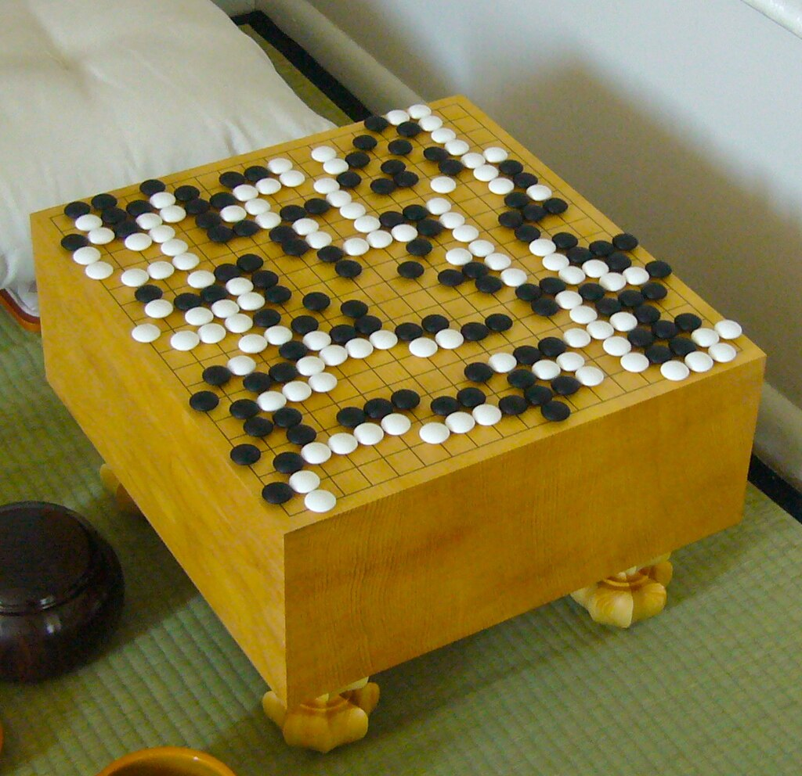
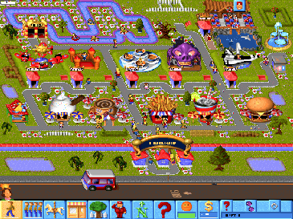
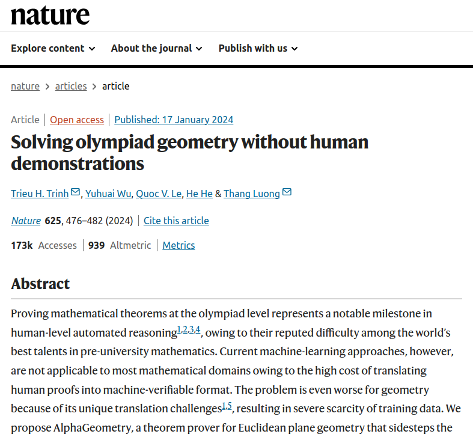
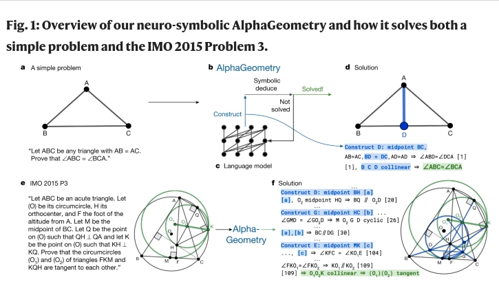
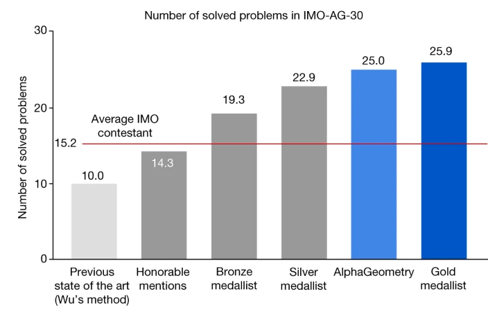
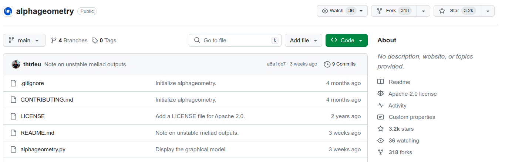
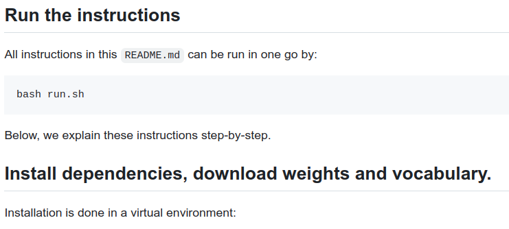

# Solving Geometry

---

# Google AI come back

## Background story
* AGI (ChatGPT) vs. specific AI (AlphaGo)
* Background ("Maniac" by Labatut)
* The story of Go
  * Emperor Yao invented the game of Go to enlighten his son, Danzhu
  * Lee Sedol, the most creative player of his generation
  * *"I have no confidence in this game. No confidence in losing, that is."*

---

## Demis Hassabis, a wunderkind from North London
* Learned chess moves at 4
* After two weeks, his father couldn't beat him
* Created games of Reversi AI at 11
* Won a place at Cambridge at 15 but had to wait for a year
* In that year, created "Theme Park"

---

## DeepMind
* Kasparov vs. Deep Blue (IBM, 1997)
* Lee Sedol vs AlphaGo (DeepBlue, 2016)
* AlphaGo Zero (2017)
* ChatGPT (OpenAI, 2023)
* AlphaGeometry (DeepMind, 2024)

---

## Article in Nature

* https://www.nature.com/articles/s41586-023-06747-5

---

## Proving mathematical theorems 
* Proving mathematical theorems at the olympiad level represents a notable milestone in human-level automated reasoning
* AlphaGeometry is a theorem prover for Euclidean plane geometry
* Sidesteps the need for human demonstrations by synthesizing millions of theorems and proofs
* AlphaGeometry is a neuro-symbolic system 
  * uses a neural language model
  * trained from scratch on our large-scale synthetic data
  * to guide a symbolic deduction engine through infinite branching points in challenging problems

---

## Performance
* On a test set of 30 latest olympiad-level problems
* AlphaGeometry solves 25
* Outperforms the previous best method that only solves ten problems
* Approaches the performance of an average International Mathematical Olympiad (IMO) gold medallist. 
* AlphaGeometry **produces human-readable proofs**
* Solves all geometry problems in the IMO 2000 and 2015

---
## Problem and solution
* Theorem proving is difficult for learning-based methods because training data of human proofs translated into machine-verifiable languages are scarce
* Very few proof examples in general-purpose mathematical languages such as Lean
* Current approaches to geometry, therefore, still primarily rely on symbolic methods and human-designed, hard-coded search heuristics
* AlphaGeometry uses an alternative method for theorem proving using synthetic data, thus sidestepping the need for translating human-provided proof examples.
---

## Solution cont'd
* By using existing symbolic engines on a diverse set of random theorem premises
* Extracted 100 million synthetic theorems and their proofs
* Many with more than 200 proof steps
* Four times longer than the average proof length of olympiad theorems.

---

## Solution explained
* Pretrain a language model on all generated synthetic data
* Fine-tune it to focus on auxiliary construction during proof search
  * delegating all deduction proof steps to specialized symbolic engines. 
* This follows standard settings in the literature, in which language models such as GPT-f
* [Paper](https://arxiv.org/abs/2009.03393)
---

## AlphaGeometry 

---

## Performance

---

## Code implementation
[Repo](https://github.com/google-deepmind/alphageometry)

---

## Run

