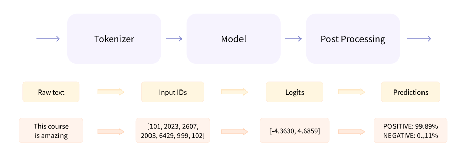
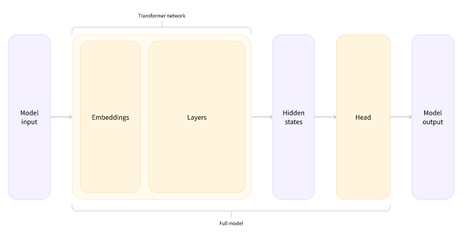

# Transformer Pipelines

---


# Introduction

---

# History

---

## Hugging Face company

* Started as a chat app for teenagers in 2017
  * Did not pan out
* Kept iterating Transformers on GitHub
  * 72.5k stars
  * 16.6K forks
  * 2,000 org users


---


# Behind the pipeline

---

## Pipeline 3 steps

1. preprocessing
2. passing the inputs through the model
3. and postprocessing



---

## Preprocessing with a tokenizer

* Like other neural networks, Transformer models can’t process raw text directly, so the first step of our pipeline is to convert the text inputs into numbers that the model can make sense of. To do this we use a tokenizer, which will be responsible for:

  * Splitting the input into words, subwords, or symbols (like punctuation) that are called tokens
  * Mapping each token to an integer
  * Adding additional inputs that may be useful to the model

---

## Going through the model

* We can download our pretrained model the same way we did with our tokenizer.
* Transformers provides an AutoModel class which also has a from_pretrained() method

---

## A high-dimensional vector

* The vector output by the Transformer module is usually large. It generally has three dimensions:

  * Batch size: The number of sequences processed at a time (2 in our example).
  * Sequence length: The length of the numerical representation of the sequence (16 in our example).
  * Hidden size: The vector dimension of each model input.
  * It is said to be “high dimensional” because of the last value. The hidden size can be very large (768 is common for smaller models, and in larger models this can reach 3072 or more).

---

## Model heads

* The model heads take the high-dimensional vector of hidden states as input and project them onto a different dimension. They are usually composed of one or a few linear layers:



---


# Models

---


# Tokenizers

---

# Handling multiple sequences

---

# Putting it all together

---


# Basic usage completed!

---

# Chapter quiz

---

## Quiz 1

* What is the order of the language modeling pipeline?
  * A. First, the model, which handles text and returns raw predictions. The tokenizer then makes sense of these predictions and converts them back to text when needed.
  * B. First, the tokenizer, which handles text and returns IDs. The model handles these IDs and outputs a prediction, which can be some text.
  * C. The tokenizer handles text and returns IDs. The model handles these IDs and outputs a prediction. The tokenizer can then be used once again to convert these predictions back to some text.

Notes:

* C. The tokenizer can be used for both tokenizing and de-tokenizing.

---

## Quiz 2

* How many dimensions does the tensor output by the base Transformer model have, and what are they?
  * A. The sequence length and the batch size
  * B. The sequence length and the hidden size
  * C. The sequence length, the batch size, and the hidden size

Notes:

* C.

---

## Quiz 3

* Which of the following is an example of subword tokenization? Select all that apply.
  * A. WordPiece
  * B. Character-based tokenization
  * C. Splitting on whitespace and punctuation
  * D. BPE
  * E. Unigram
  * F. None of the above

Notes:

* A, D, E

---

## Quiz 4

* What is a model head?
  * A. A component of the base Transformer network that redirects tensors to their correct layers
  * B. Also known as the self-attention mechanism, it adapts the representation of a token according to the other tokens of the sequence
  * C. An additional component, usually made up of one or a few layers, to convert the transformer predictions to a task-specific output

Notes:

* C. Adaptation heads, also known simply as heads, come up in different forms: language modeling heads, question answering heads, sequence classification heads...

---

## Quiz 5

* What is an AutoModel?
  * A. A model that automatically trains on your data
  * B. An object that returns the correct architecture based on the checkpoint
  * C. A model that automatically detects the language used for its inputs to load the correct weights

Notes:

* B. The AutoModel only needs to know the checkpoint from which to initialize to return the correct architecture.

---

## Quiz 6

* What are the techniques to be aware of when batching sequences of different lengths together?
   * A. Truncating
   * B. Returning tensors
   * C. Padding
   * D. Attention masking

Notes:

* A. Truncation is a correct way of evening out sequences so that they fit in a rectangular shape. 
* C. Padding is a correct way of evening out sequences so that they fit in a rectangular shape. 
* D. Attention masks are of prime importance when handling sequences of different lengths. 

---

## Quiz 7

* What is the point of applying a SoftMax function to the logits output by a sequence classification model?
  * A. It softens the logits so that they're more reliable.
  * B. It applies a lower and upper bound so that they're understandable.
  * C. The total sum of the output is then 1, resulting in a possible probabilistic interpretation.

Notes:

* B., C.

---

## Quiz 8
* What method is most of the tokenizer API centered around?
  * A. encode, as it can encode text into IDs and IDs into predictions
  * B. Calling the tokenizer object directly.
  * C. pad
  * D. tokenize

Notes:
* C. The __call__ method of the tokenizer is a very powerful method which can handle pretty much anything. It is also the method used to retrieve predictions from a model.

---

## Quiz 9

* What does the result variable contain in this code sample?

```python
from transformers import AutoTokenizer
tokenizer = AutoTokenizer.from_pretrained("bert-base-cased")
result = tokenizer.tokenize("Hello!")
```
  * A. A list of strings, each string being a token
  * B. A list of IDs
  * C. A string containing all of the tokens

Notes:

* A. Convert this to IDs, and send them to a model!

---

## Quiz 10

* Is there something wrong with the following code?

```python
from transformers import AutoTokenizer, AutoModel

tokenizer = AutoTokenizer.from_pretrained("bert-base-cased")
model = AutoModel.from_pretrained("gpt2")

encoded = tokenizer("Hey!", return_tensors="pt")
result = model(**encoded)
```

   * A. No, it seems correct.
   * B. The tokenizer and model should always be from the same checkpoint.
   * C. It's good practice to pad and truncate with the tokenizer as every input is a batch.

Notes:

* B.

---