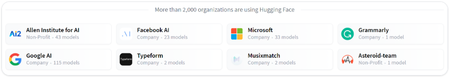

# Transformer Pipelines

---

# Introduction

---

# History

---

## Hugging Face company

* Started as a chat app for teenagers in 2017
  * Did not pan out
* Kept iterating Transformers on GitHub
  * 72.5k stars
  * 16.6K forks
  * 2,000 org users

---

# Behind the pipeline

---

# Models

---

# Tokenizers

---

# Handling multiple sequences

---

# Putting it all together

---

# Basic usage completed!

---

# Chapter quiz

---

## Quiz 1

* What is the order of the language modeling pipeline?
  * A. First, the model, which handles text and returns raw predictions. The tokenizer then makes sense of these predictions and converts them back to text when needed.
  * B. First, the tokenizer, which handles text and returns IDs. The model handles these IDs and outputs a prediction, which can be some text.
  * C. The tokenizer handles text and returns IDs. The model handles these IDs and outputs a prediction. The tokenizer can then be used once again to convert these predictions back to some text.

Notes:

* C. The tokenizer can be used for both tokenizing and de-tokenizing.

---

## Quiz 2

* How many dimensions does the tensor output by the base Transformer model have, and what are they?
  * A. The sequence length and the batch size
  * B. The sequence length and the hidden size
  * C. The sequence length, the batch size, and the hidden size

Notes:

* C.

---

## Quiz 3

* Which of the following is an example of subword tokenization? Select all that apply.
  * A. WordPiece
  * B. Character-based tokenization
  * C. Splitting on whitespace and punctuation
  * D. BPE
  * E. Unigram
  * F. None of the above

Notes:

* A, D, E

---

## Quiz 4

* What is a model head?
  * A. A component of the base Transformer network that redirects tensors to their correct layers
  * B. Also known as the self-attention mechanism, it adapts the representation of a token according to the other tokens of the sequence
  * C. An additional component, usually made up of one or a few layers, to convert the transformer predictions to a task-specific output

Notes:

* C. Adaptation heads, also known simply as heads, come up in different forms: language modeling heads, question answering heads, sequence classification heads...

---

