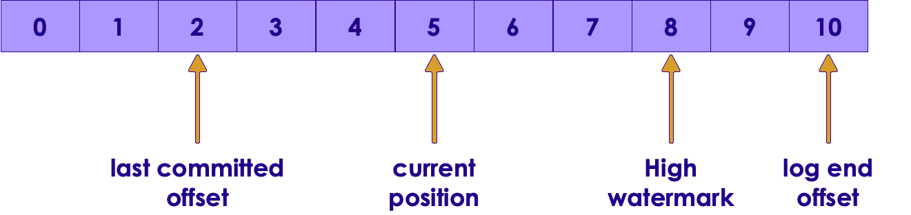
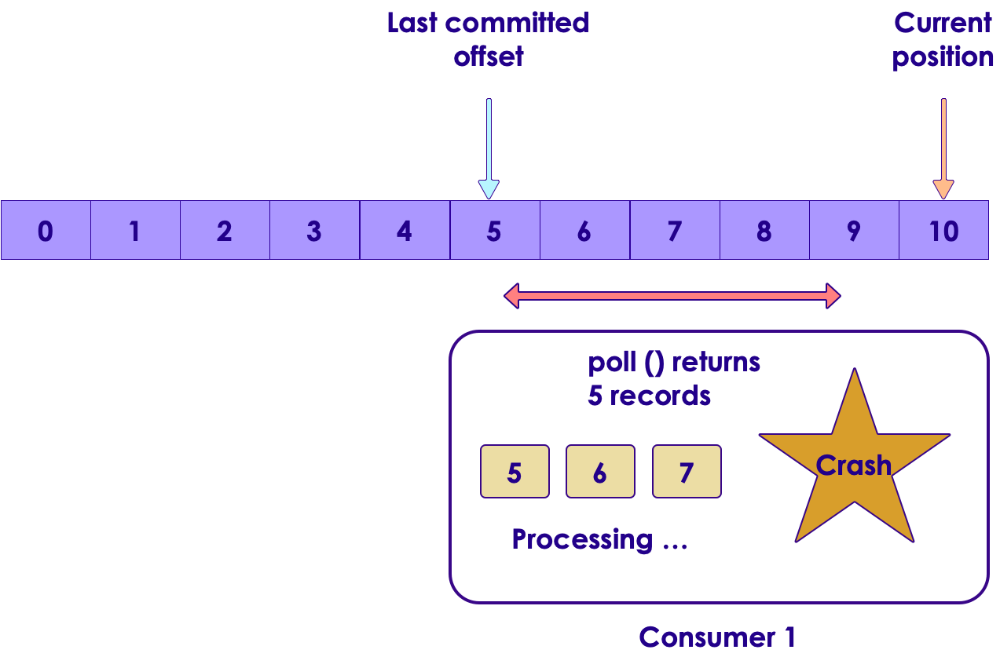
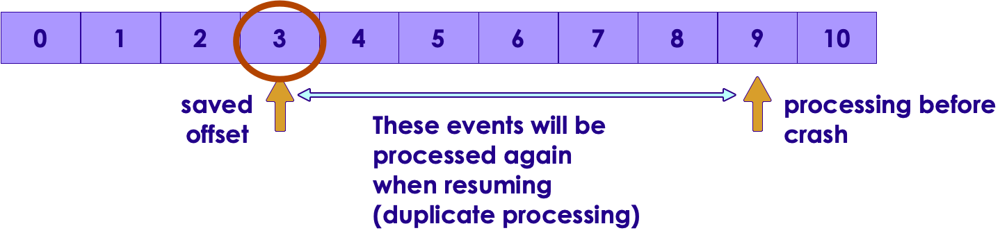
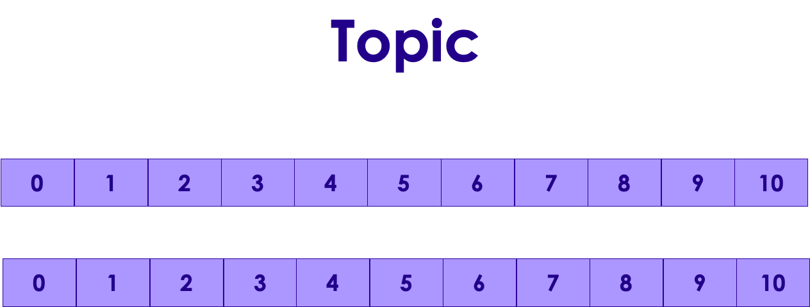

# Working With Kafka


---


## Lesson Objectives

 * Learn to use Kafka Java API

Notes: 


---

# Kafka API

---


## Kafka Clients


 * Java is the ‘first class’ citizen in Kafka

     - Officially maintained

 * Other language libraries are independently developed

     - may not have 100% coverage

     - May not be compatible with latest versions of Kafka

     - Do your home work!

 * Python seems to be on par with Java

     - Maintained by Confluent.io

 * REST proxy provides a language neutral way to access Kafka

 * Full list: https://cwiki.apache.org/confluence/display/KAFKA/Clients

Notes: 


---

## Kafka Java API


 * Rich library that provides high level abstractions

     - No need to worry about networking / data format ..etc

 * Write message / Read message

 * Supports native data types

     - String

     - Bytes 

     - Primitives (int, long ...etc.)

Notes: 


---

## Java Producer Code (Abbreviated)


```text
// ** 1 **
import java.util.Properties;
import org.apache.kafka.clients.producer.KafkaProducer;
import org.apache.kafka.clients.producer.ProducerRecord;
...

// ** 2 **
Properties props = new Properties();
props.put("bootstrap.servers", "localhost:9092");
props.put("client.id", "SimpleProducer");
props.put("key.serializer",   "org.apache.kafka.common.serialization.IntegerSerializer");
props.put("value.serializer", "org.apache.kafka.common.serialization.StringSerializer");

KafkaProducer<Integer, String> producer = new KafkaProducer<>(props);

// ** 3 **
String topic = "test";
Integer key = new Integer(1);
String value = "Hello world";
ProducerRecord<Integer, String> record = new ProducerRecord<> (topic, key, value);
producer.send(record);
producer.close(); 

```

Notes: 


---

## Producer Code Walkthrough

```text
// ** 2 **
Properties props = new Properties();
props.put("bootstrap.servers", "localhost:9092");
props.put("client.id", "SimpleProducer");
props.put("key.serializer",   "org.apache.kafka.common.serialization.IntegerSerializer");
props.put("value.serializer", "org.apache.kafka.common.serialization.StringSerializer");


KafkaProducer<Integer, String> producer = new KafkaProducer<>(props); 

```
 * We are using ‘KafkaProducer’ (org.apache.kafka.clients.producer.KafkaProducer)

 *  **bootstrap.servers**: “broker1:9092, broker2:9092”

     - Specify multiple servers, so no single point of failure

 * Using built in serializers for Integer / String


Notes: 


---

## Producer Code Walkthrough

```text
// ** 3 **
String topic = "test";
Integer key = new Integer(1);
String value = "Hello world";
ProducerRecord<Integer, String> record = new ProducerRecord<> (topic, key, value);
producer.send(record);
producer.close(); 
```

 * Each  **record**  represents a message

 * Here we have a <key,value> message

 * send() doesn’t wait for confirmation

 * We send in batches 

     - for increased throughput

     - Minimize network round trips


Notes: 


---

## Producer Properties


```text
Properties props = new Properties();
props.put("bootstrap.servers", "localhost:9092");
props.put("client.id", "SimpleProducer");
props.put("acks", "all");
props.put("retries", 0);
props.put("batch.size", 16384);  // 16k
props.put("linger.ms", 1);
props.put("buffer.memory", 33554432); // 32 M
props.put("key.serializer",
                   "org.apache.kafka.common.serialization.IntegerSerializer"); 
props.put("value.serializer",
                   "org.apache.kafka.common.serialization.StringSerializer"); 
KafkaProducer<Integer, String> producer = new KafkaProducer<>(props);

for(int i = 0; i < 100; i++) {
  producer.send(new ProducerRecord<String, String>(
      "my-topic", Integer.toString(i), Integer.toString(i)));
}
producer.close();  

```

Notes: 


---

## Producer Acknowledgements


| ACK                       	| Description                                                                                                                    	| Speed  	| Data safety                                             	|
|---------------------------	|--------------------------------------------------------------------------------------------------------------------------------	|--------	|---------------------------------------------------------	|
| acks=0                    	| - Producer doesn't wait for any acks from broker,</br>- Producer won't know of any errors                                         	| High   	| Low </br></br>No guarantee that broker received the message  	|
| acks=1,</br>(**default**) 	| - Broker will write the message to local log,</br>- Does not wait for replicas to complete                                       	| Medium 	| Medium</br></br>Message is at least persisted on lead broker 	|
| acks=all                  	| - Message is persisted on lead broker and in replicas,</br>- Lead broker will wait for in-sync replicas to acknowledge the write 	| Low    	| High</br></br>Message is persisted in multiple brokers       	|

Notes: 


---

## Producer Acknowledgements


Notes: 


---

## Consumer Code (Abbreviated)


```text
import org.apache.kafka.clients.consumer.ConsumerRecord;
import org.apache.kafka.clients.consumer.ConsumerRecords;
import org.apache.kafka.clients.consumer.KafkaConsumer;
...

Properties props = new Properties(); // ** 1 **
props.put("bootstrap.servers", "localhost:9092");
props.put("group.id", "group1");
props.put("key.deserializer",
"org.apache.kafka.common.serialization.StringDeserializer");
props.put("value.deserializer",
"org.apache.kafka.common.serialization.StringDeserializer");

KafkaConsumer<Integer, String> consumer = new KafkaConsumer<>(props);

consumer.subscribe(Arrays.asList("topic1")); // ** 2 **

try {
    while (true) {
      ConsumerRecords<Integer, String> records = consumer.poll(Duration.ofMillis(1000)); // ** 3 **
      System.out.println("Got " + records.count() + " messages");
      for (ConsumerRecord<Integer, String> record : records) {
      System.out.println("Received message : " + record);
     }
   }
}
finally {
  consumer.close(Duration.OfSeconds(60));
}   
```

Notes: 


---

## Consumer Code Walkthrough

```text
Properties props = new Properties(); // ** 1 **
props.put("bootstrap.servers", "localhost:9092");
props.put("group.id", "group1");
props.put("key.deserializer",
               "org.apache.kafka.common.serialization.StringDeserializer");
props.put("value.deserializer",
               "org.apache.kafka.common.serialization.StringDeserializer");

KafkaConsumer<Integer, String> consumer = new KafkaConsumer<>(props);

consumer.subscribe(Arrays.asList("topic1")); // ** 2 **  
 
```
 *  **bootstrap,servers**: “broker1:9092,broker2:9092”

     - Connect to multiple brokers to avoid single point of failure

 *  **group.id**: consumers belong in a Consumer Group

 * We are using standard serializers

 * Consumers can subscribe to one or more subjects  *// ** 2 ***   


Notes: 


---

## Consumer Code Walkthrough

```text
try {
   while (true) {
    ConsumerRecords<Integer, String> records = consumer.poll(Duration.ofMillis(1000); // ** 3 **
    System.out.println("Got " + records.count() + " messages");
    for (ConsumerRecord<Integer, String> record : records) { 
     System.out.println("Received message : " + record);
    }
  }
}
finally {
consumer.close();
} 
```

 * Consumers must subscribe to topics before starting polling

     - Consumer.subscribe (“test.*”) // wildcard subscribe

 * Poll: This call will return in 1000 ms, with or without records

 * Must keep polling, otherwise consumer is deemed dead and the partition is handed off to another consumer


Notes: 


---

## Consumer Poll Loop


 * Polling is usually done in an infinite loop. while (keepRunning) {  polling  }

 * First time poll is called

     - Finds the GroupCoordinator

     - Joining Consumer Group

     - Receiving partition assignment

 * Work done in poll loop

     - Usually involves some processing

     - Saving data to a store

     - Don’t do high latency work between polls; otherwise the consumer could be deemed dead.

     - Do heavy lifting in a seperate thread

Notes: 


---

## ConsumerRecord


 *  **org.apache.kafka.clients.consumer.ConsumerRecord**  **<K,V>** 

 *  **K  key()** : key for record (type K), can be null

 *  **V  value()** : record value (type V – String / Integer ..etc)

 *  **String topic()** : Topic where this record came from

 *  **int**  **partition()** : partition number

 *  **long offset()** : long offset in

```text
ConsumerRecords<Integer, String> records = consumer.poll(Duration.ofMillis(1000)); 
for (ConsumerRecord<String, String> record : records) {
     System.out.printf("topic = %s, partition = %d, offset = %d,
            key= %s, value = %s\n",
            record.topic(), record.partition(), record.offset(),
            record.key(), record.value());
} 

```

Notes: 


---

## Configuring Consumers

```text
Properties props = new Properties(); // ** 1 **

...
props.put("session.timeout.ms", 30000); // 30 secs
props.put("max.partition.fetch.bytes", 5 * 1024 * 1024); // 5 M

KafkaConsumer<Integer, String> consumer = new KafkaConsumer<>(props); 
```
 

 *  **max.partition.fetch.bytes**   (default : 1048576  (1M))

     - Max message size to fetch.  Also see  **message.max.bytes**  broker config

 *  **session.timeout.ms**  (default : 30000  (30 secs))

     - If no heartbeats are not received by this window, consumer will be deemed dead and a partition rebalance will be triggered


Notes: 


---

## Clean Shutdown Of Consumers


 * Consumers poll in a tight, infinite loop

 * Call  **'**  **consumer.wakeup**  **()** ' from another thread

 * This will cause the poll loop to exit with  **'**  **WakeupException** ' 

```text
try {
  while (true) {
   ConsumerRecords<Integer, String> records = consumer.poll(100);
    // handle events
 }
}
catch (WakeupException ex) {
   // no special handling needed, just exit the poll loop
}
finally {
   // close will commit the offsets
   consumer.close(); } 

```

Notes: 


---

## Signaling Consumer To Shutdown


 * Can be done from another thread or shutdown hook

 *  **'**  **consumer.wakeup**  **()** '  is safe to call from another thread

```text
Runtime.getRuntime().addShutdownHook(new Thread() {
   public void run() {
      System.out.println("Starting exit...");
      consumer.wakeup(); // signal poll loop to exit
      try {
           mainThread.join(); // wait for threads to shutdown
      } catch (InterruptedException e) {
           e.printStackTrace();
  }
 }
} 
```

Notes: 


---

## Lab 3: Kafka Producer / Consumer


 *  **Overview**: Use Kafka Java API to write Producer and Consumer

 *  **Builds on previous labs**: 1-install Kafka

 *  **Approximate Time**: 30 – 40 mins

 *  **Instructions**: 

     - Please follow: 3.1,    3.2,   3.3

 *  **To Instructor**: 


Notes: 


---

# Producer Send Modes

---


## Producer Send Modes


 * 1: Fire and Forget

     - Send message, doesn’t wait for confirmation from Kafka

     - Writes messages to broker in batches (minimize network round

     - trips)

     - Risk of some messages being lost

     - Default and fastest

 * 2: Sync

     - Send message and wait for confirmation from Kafka

     - Each message is sent out individually

     - Usually lowest throughput

 * 3: Async

     - Registers a callback function while sending

     - Does not wait for confirmation

     - Kafka will call this function with confirmation or exception

     -  Higher throughput

Notes: 


---

## Producer Send Mode:  Fire and Forget

```text
String topic = "test";
Integer key = new Integer(1);
String value = "Hello world";
ProducerRecord<Integer, String> record = 
		new ProducerRecord<> (topic, key, value);
producer.send(record); // <-
```

 * The ‘record’ is placed in the send buffer

 * It will be sent to Kafka in a separate thread

 * Send() returns a Java Future object (that we are not checking) 

 * Some messages can be dropped

 * Use cases:

     - Metrics data

     - Low important data


Notes: 


---

## Producer Send Mode:  Sync

```text
ProducerRecord<Integer, String> record = 
	new ProducerRecord<> (topic, key, value);

Future<RecordMetadata> future = producer.send(record); // <- 
RecordMetadata recordMetaData = future.get(); // <-
 

```

 * Send() returns a Java Future object 

 * FutureObject.get() returns  a RecordMetaData

 * Inspect RecordMetaData for success / error


Notes: 


---

## Producer Send Mode:  Async


```text
class KafkaCallback implements Callback {
  @Override
  public void onCompletion(RecordMetadata meta, Exception ex) {
    if (ex != null) // error
      ex.printStackTrace();

    if (meta != null) // success
      System.out.println("send success");
  }
}
...
producer.send(record, new KafkaCallback());  // <- 
```

* Kafka will callback with meta or exception  (only one of them will be non-Null)

 * Note : This code is for demonstration purposes only.  Do not create new callback objects in production.

     - You could be creating millions of objects

     - Can induce intense garbage collection

Notes: 


---

## Lab 4.1: Kafka Producer Benchmark


 *  **Overview**: Try different send methods in Producer

 *  **Builds on previous labs**: lab 3

 *  **Approximate Time**: 20 – 30 mins

 *  **Instructions**: 

     - Please follow: lab 4.1

 *  **To Instructor**: 


Notes: 


---

# Message Compression

---


## Compression Basics


 * Kafka supports compression of  messages

     - Especially effective on batches

     - Covers the full batch – larger == better compression

 * Supported compression codecs

     - Gzip, Snappy, LZ4, Zstd (Zstandard)

 * Configured via Producer properties:

     - compression.type

 * Kafka API will automatically

     - Compress messages on producer side

     - De-compress messages on consumer side

     - Messages remain in compressed state in partitions

Notes: 


---

## Compression codecs comparison

| Codec               	| Compression Ratio 	| Compressed Size 	| De-compressed Size 	|
|--------------------	|-------------------	|-----------------	|--------------------	|
| Zstd 1.3.4 --fast=1 	| 2.431             	| 530 MB/s        	| 1770 MB/s          	|
| Lz4 1.8.1           	| 2.101             	| 750 MB/s        	| 3700 MB/s          	|
| Snappy 1.1.4        	| 2.091             	| 530 MB/s        	| 1820 MB/s          	|

 * https://cwiki.apache.org/confluence/display/KAFKA/KIP-110%3A+Add+Codec+for+ZStandard+Compression

Notes: 

https://cwiki.apache.org/confluence/display/KAFKA/KIP-110%3A+Add+Codec+for+ZStandard+Compression


---

## Lab 4: Compression Benchmark


 *  **Overview**: Try different compression codecs in Producer

 *  **Builds on previous labs**: lab 4.1

 *  **Approximate Time**: 20 – 30 mins

 *  **Instructions**: 

     - Please follow: lab 4.2

 *  **To Instructor**: 


Notes: 


---

# Advanced Consumers

---


## Advanced Consumer Properties

| Property                      	| Description                                                           	| Default Value 	|
|-------------------------------	|-----------------------------------------------------------------------	|---------------	|
| fetch.min.bytes               	| Min. data to fetch.                                                   	|               	|
| fetch.max.wait.ms             	| Max. wait time                                                        	| 500 ms        	|
| Session.timeout.ms            	| Time after which consumer is deemed dead if it doesn’t contact broker 	| 3 seconds     	|
| Heartbeat.interval.ms         	| Intervals in which heartbeats are sent                                	| 1 second      	|
| Auto.offset.reset             	| Offset value to use when no committed offset exists                   	| “latest”      	|
| Partition.assignment.strategy 	| Assign partitions by range or round-robin (next slide)                	| RangeAssignor 	|
| Max.poll.records              	| Max. number of records poll can return                                	| &nbsp;              	|

Notes: 

Broker will wait until fetch.min.bytes data accumulates before sending to consumer
Auto.offset.reset other valid value is “earliest” – meaning read entire partition from start


---

## Consumer Partition Assignment


 * Kafka can have multiple topics

 * Each topic can have multiple partitions

 * Consumers belong to “Consumer Groups”

 * A consumer can read from multiple topics

 * How are partitions assigned to consumers?

     - Based on “partition.assignment.strategy”

     - Default value is RangeAssignor

Notes: 


---

## Range Partition Assignment – 1 Topic


 * Default assignment

 * Each consumer is assigned a range – on a per-topic basis


Notes: 

https://medium.com/@anyili0928/what-i-have-learned-from-kafka-partition-assignment-strategy-799fdf15d3ab


---

## Range Partitions – 2 Topics


Notes: 

https://medium.com/@anyili0928/what-i-have-learned-from-kafka-partition-assignment-strategy-799fdf15d3ab


---

## Range Partitions Problems


 * Drawbacks

     - Partitions assigned to consumers on a per-topic basis

     - Consumers can read from multiple topics

     - Imbalance of load

Notes: 


---

## Round-robin Assignment


 *  Set partition.assignment.strategy to RoundRobinAssignor


Notes: 


---

## Round-robin Assignment – 2 Topics


Notes: 


---

# Commits And Offsets

---


## Understanding Offsets




 *  **Last committed offset**: from client commit (auto or manual)

 *  **Current position**: where client is reading from

 *  **High watermark**: latest replicated offset.

 *  **Log End**: offset of last message

 * Consumers can only read up to  **high watermark** 

     - Otherwise consumers will read un-replicated data, might result in data loss


Notes: 


---

## Commits And Offsets


 * Kafka doesn't track 'read acknowledgements' of messages like other JMS systems

 * It tracks the consumer progress using an  **offset** 

 * When a Consumer calls Poll() it gets  **new records** from the offset 

 * Offsets are stored in Kafka (in a special topic :  **__**  **consumer_offsets**  **)** 

     - Used to be stored in ZK, but now stored in Kafka for performance reasons

 * When a consumer crashes..

     - Partitions of that consumer are assigned to another consumer

     - New ‘partition owner’ consumer  resumes from current offset


Notes: 


---

## Offset Management


 * Offsets can be 'moved' automatically by consumer API

     - Convenient 

     - But doesn't give full control to developer

 * Manual offset management

     - Clients handle offset

     - Complete control

Notes: 


---

## Updating Offset: Auto Commit


 * If `’enable.auto.commit=true’` the client will save the offset when poll()

 * Frequency controlled by `‘auto.commit.interval.ms’` (default 5 secs)

 * auto.commit is enabled by default

 * When poll() is called it will commit the  **latest offset** returned by the  **last poll()** 

 * During each poll, consumer checks if the  **auto.commit.interval.ms**  interval has expired; if yes it commits the offset

 * Commit produces a special message to a special Kafka topic called  **_consumer_offsets** 

     - Offsets are saved in this topic

Notes: 


---

## Auto Commit 


Notes: 


---

## Auto Commit 


Notes: 


---

## Auto Commit 


Notes: 


---

## Auto Commit 


Notes: 


---

## Auto Commit & Duplicate Processing


 * Consumer 1 reads records, but crashes in the middle of processing (after processing messages 5, 6  and 7)



Notes: 


---

## Auto Commit & Duplicate Processing


 * Replacement consumer2 starts reading from `'saved offset'` (committed offset).

 * And processes messages 5, 6 and 7 again. This is duplicate processing


Notes: 


---

## Auto Commit & Skipped Events


 * Consumer1 polls the events and hands them off to another thread for processing


Notes: 


---

## Auto Commit & Skipped Events


 * Before 'processing thread' has a chance to finish processing all messages, main polling thread initiates another poll

 * This commits the offset to 8


Notes: 


---

## Auto Commit & Skipped Events


 * Consumer1 crashes


Notes: 


---

## Auto Commit & Skipped Events


 * A new consumer2 starts processing

 * But when it polls, it is retrieving messages from last-committed-offset (8 onwards)

 * Messages 6 & 7 are skipped


Notes: 


---

## Auto Commit Best Practices


 * Auto commit can lead to duplicate processing or skipped events

 * Duplicate Events

     - This is ok if processing is  **'idempotent** ' (duplicate processing doesn't have any side effects)

        * e.g. saving an event to a database that over-writes the previous record (does not create duplicate records)

     - Not ok if we are 'counting events' (duplicate counts will result)

 * Skipped Events

     - Before calling poll() make sure all events returned from previous poll are processed

Notes: 


---

## Duplicate Processing vs. Skipped Events

 *  **Processed but Offset not updated -> Duplicate processing** 

 *  **Offset updated but not processed -> Skipped events** 




Notes: 


---

## Manual Commit 


```text
Properties props = new Properties();
...
props.put("enable.auto.commit", "false"); // must disable 
KafkaConsumer<Integer, String> consumer = new KafkaConsumer<>(props);

while (true) {
  ConsumerRecords<Integer, String> records = consumer.poll(100);
  for (ConsumerRecord<Integer, String> record : records)
  {
     System.out.println(String.format(
	"topic = %s, partition = %s, offset = %d“, 
	record.topic(), record.partition(), record.offset()));
  }
  try {
    consumer.commitSync(); // ** 1 ** 
    consumer.commitASync(); // or  ** 2 ** 
  
  } catch (CommitFailedException e) {
    e.printStackTrace();
  }
}

```


Notes: 


---

## Commit


 * commitSync() will wait for confirmation

     - Might slow down processing

 * commitAsync() is ‘fire and forget’

     - Commits can be lost

     - But the next calls can catchup

 * Both will commit the  **latest offset** returned by  **last poll** ()

 * To explicitly set an offset, supply offset to commitSync() or commitAsync() calls

     - (see documentation)

Notes: 


---

## At-most Once Consumer


 * Processes each message 0 or 1 time

 * Achieved by setting:

     - enable.auto.commit = true

     - auto.commit.interval.ms = <small_value>

     - Poll frequently

Notes: 


---

## At-least Once Consumer


 * Processes each message one or more times 

 * Achieved by setting:

     - enable.auto.commit = false

     - Manually commit offset using consumer.commitSync();

Notes: 


---

## Exactly Once Processing in Kafka


 * Producer  send can be  **idempotent** 

     - Set in producer via   *“*  *enable.idempotence*  *=true”* 

 * Producer can write a batch  **_atomically_** 

```text
      producer.initTransactions(); 

      try { 

         producer.beginTransaction(); producer.send(record1);
         producer.send(record2); producer.commitTransaction(); 

     } catch(ProducerFencedException e) { 

         producer.close(); 

     } catch(KafkaException e) { 

         producer.abortTransaction(); 

     }
```
Notes: 

An idempotent operation is one which can be performed many times without causing a different effect than only being performed once.


---

## Exactly Once Processing in Kafka


 * Kafka Streams API implements Exactly Once Processing

     -  *“*  *processing.guarantee*  *=*  *exactly_once*  *”* 

 * Processing happens once

 * No messages are missed

 * No duplicate processing

 * Details: https://www.confluent.io/blog/exactly-once-semantics-are-possible-heres-how-apache-kafka-does-it/

Notes: 

With idempotency and transactions support on producer, Streams API can support exactly once


---

## Lab 3: Consumer Commits


 *  **Overview**: Try different commit methods in Consumers

     - At-most once, At-least once

 *  **Builds on previous labs**: lab 3

 *  **Approximate Time**: 20 – 30 mins

 *  **Instructions**: 

     - Please follow: lab 3.4, 3.5

 *  **To Instructor**: 


Notes: 


---

## Committing Specific Offsets


 * Both commitSync and commitAsync can take a Map of partitions & offsets

```text
org.apache.kafka.clients.consumer.KafkaConsumer
   commitAsync(Map<TopicPartition,OffsetAndMetadata> offsets)
   commitSync(Map<TopicPartition,OffsetAndMetadata> offsets)

org.apache.kafka.common.TopicPartition (String topic, int partition)

org.apache.kafka.clients.consumer.OffsetAndMetadata(long offset)
org.apache.kafka.clients.consumer.OffsetAndMetadata(long offset, String meta)
```
Notes: 


---

## Committing Specific Offsets


```text
import org.apache.kafka.common.TopicPartition; import org.apache.kafka.clients.consumer.OffsetAndMetadata;

Map<TopicPartition, OffsetAndMetadata> currentOffsets = new HashMap<>();
int count = 0;

while (true) {
   ConsumerRecords<Integer, String> records = consumer.poll(100);
   for (ConsumerRecord<Integer, String> record : records)
   {
      count++;
      System.out.println("Received message : " + record);
      
      // process message
      // and update offset map
      currentOffsets.put(
          new TopicPartition(record.topic(), record.partition()),
          new OffsetAndMetadata(record.offset()+1, "no metadata"));
  
      // commit every 1000 records
      if (count % 1000 == 0) {
          consumer.commitAsync(currentOffsets, null);
    }
  }
} 

```

Notes: 


---

## Seeking To An Offset


 * Use cases:

     - Catching up to latest events first  (and then processing the backlog).See demo at : https://sematext.com/blog/2015/11/04/kafka-real-time-stream-multi-topic-catch-up-trick/

 * To go to end of partition

     - Consumer.seekToEnd()

 * To go to beginning

     - Consumer.seekToBeginning()

 * Seek to any offset

     - Consumer.seek (partition, offset)

Notes: 

https://sematext.com/blog/2015/11/04/kafka-real-time-stream-multi-topic-catch-up-trick/


---

## Lab 5: Jumping Offsets


 *  **Overview**: Seek and read various offsets in  a partition

 *  **Builds on previous labs**: 

 *  **Approximate Time**: 20 – 30 mins

 *  **Instructions**: 

     - Please follow: lab 5

 *  **To Instructor**: 


Notes: 


---

# Kafka Connect

---


## Kafka Connect


 * Kafka Connect is a framework included in Apache Kafka that integrates Kafka with other systems. 

 * It's goal is to make it easy to add new systems to your scalable and secure stream data pipelines.


Notes: 


---

## Kafka Connectors (Supported by Confluent)

| Connector      	| Description         	| Supported by 	|
|----------------	|--------------------	|------------	|
| ActiveMQ       	| Source only         	| Confluent    	|
|                	|                     	|              	|
| Amazon S3      	| Sink                	| Confluent    	|
|                	|                     	|              	|
| Elastic Search 	| Sink                	| Confluent    	|
|                	|                     	|              	|
| HDFS           	| Sink (Hadoop, Hive) 	| Confluent    	|
|                	|                     	|              	|
| IBM MQ         	| Source              	| Confluent    	|
|                	|                     	|              	|
| JDBC           	| Source and Sink     	| Confluent    	|
|                	|                     	|              	|
| JMS            	| Source              	| Confluent    	|


Notes: 

More information at : https://www.confluent.io/product/connectors/


---

## Kafka Connectors (Supported by Vendors)


| Connector      	   | Description         	| Supported by 	|
|----------------	   |--------------------	|------------	|
| Azure IoT                | Source, IoT                | Microsoft    	|
|                	   |                     	|              	|
| Couchbase                | Source and Sink          	| Couchbase     |
|                	   |                     	|              	|
| SAP Hana                 | Source and Sink            | SAP    	|
|                	   |                     	|              	|
| Vertica           	   | Source and Sink  	        | HP    	|
|                	   |                     	|              	|
| VoltDB                   | Sink              	        | VoltDB        |


Notes: 

More information at : https://www.confluent.io/product/connectors/


---

## Kafka Connectors (Supported by Community)

| Connector      	   | Description         	                    | Supported by 	     |
|----------------	   |--------------------	                    |------------	     |
| Amazon Kinesis           | Sink (Amazon's managed queue service           | Community    	     |
|                	   |                     	                    |              	     |
| Apache Ignite            | Source and Sink (File System)                  | Community              |
|                	   |                     	                    |              	     |
| Blockchain               | Source </br>Bitcoin,Blockchain                 | Community              |
|                	   |                     	                    |              	     |
| Cassandra           	   | Sink </br>NoSQL                                | Community              |
|                	   |                     	                    |              	     |
| Github                   | Source              	                    | Community              |
|                	   |                     	                    |               	     |
| Many more                |              	                            |&nbsp;                  |


Notes: 

More information at : https://www.confluent.io/product/connectors/


---

## Kafka Connect Concepts

| Concept       	   | Description         	                                              |
|----------------	   |--------------------	                                              |
| Connectors               |‫-‬ Defines the source and destination of data </br>‫-‬ Coordinates Tasks     |
| Tasks               	   |‫-‬ Implementations of data transfer </br>‫-‬ Introduces parallelism         |
| Workers                  |Connectors and tasks are logical units and are scheduled in workers       |
| Converters          	   |Convert data formats to bytes and vice versa 	                      |
| Transforms          	   |Does simple modification to Kafka messages                                |


Notes: 


---

## Standalone vs Distributed Workers


 * Standalone Worker

     - Single process that executes all connectors and tasks

     -  Simple to configure

     -  Use for simple use cases or initial testing

 * Distributed Worker

     - Provides more scalability and fault tolerance

     - Connectors and tasks are distributed between the workers automatically. 

Notes: 


---

## Connect File Streaming Example


 * Kafka Connect example - stream a file through Kafka




Notes: 


---

## Standalone configuration


 * key.converter=org.apache.kafka.connect.storage.StringConverter

 * value.converter=org.apache.kafka.connect.storage.StringConverter

 * #Converter-specific settings can be passed in by prefixing the Converter's setting with the converter we want to apply

 * key.converter.schemas.enable=false

 * value.converter.schemas.enable=false

 * #The internal converter used for offsets and config data is configurable and must be specified. Can use the built-in default
---

## Standalone configuration

 * #Offset and config data is never visible outside of Kafka Connect in this format.

 * internal.key.converter=org.apache.kafka.connect.storage.StringConverter

 * internal.value.converter=org.apache.kafka.connect.storage.StringConverter

 * internal.key.converter.schemas.enable=false

 * internal.value.converter.schemas.enable=false

Notes: 

Can be found at

config/connect-standalone.properties


---

## Source file Configuration and Execution

```text
    name=local-file-source
    connector.class=File Stream Source
    tasks.max=1
    file=test.log
    topic=test_log
```

 * The file stream can be run by executing  *connect-standalone.sh* with standalone configuration and source file configuration as given below

```text
bin/connect-standalone.sh /
    config/connect-standalone.properties /
    config/connect-file-source.properties
```


Notes: 

bin/connect-standalone.sh config/connect-standalone.properties config/connect-file-source.properties


---

## HFDS Connector


 * The HDFS connector  exports data from Kafka into HDFS.

 * Can also integrate with Hive, so data is readily available for querying using HiveQL

     - Hive tables are partitioned by Kafka topic

 * Features

     - Exactly one delivery: Each Kafka message is only exported to HDFS once

     - Supports Avro and Parquet format

     - Secure data transport using Kerberos

Notes: 


---

## HDFS Connector – Sample Usage


```text
# hdfs-connector.properties

name=hdfs-sink
connector.class=io.confluent.connect.hdfs.HdfsSinkConnector
tasks.max=1
topics=test_hdfs
hdfs.url=hdfs://localhost:9000
flush.size=3

```

```text
$  confluent load hdfs-sink -d hdfs-connector.properties

```

```text
$ hadoop fs -ls /topics/test_hdfs/partition=0

/topics/test_hdfs/partition=0/test_hdfs+0+0000000000+0000000002.avro

```

Notes: 


---

## Lab 10: Kafka Connect


 *  **Overview**: Use Kafka Connect to read data from a file

 *  **Builds on previous labs**: 

 *  **Approximate Time**: 20 – 30 mins

 *  **Instructions**: 

     - Please follow: lab 10

 *  **To Instructor**: 


Notes: 


---

# Kafka & Spark

---


## Lambda Streaming Architecture


 * Spark Streaming process the data and saves it two places

     - Master data store for batch queries

     - Real-time data store for interactive queries


 *  *Source:*  *http://lambda-architecture.net/* 

Notes: 


---

## Kafka Direct Example


```text
object DirectKafkaWordCount {  
   def main(args: Array[String]) {    
      val Array(brokers, topics) = args    

      // Create context with 2 second batch interval    
       val sparkConf = new SparkConf().setAppName("DirectKafkaWordCount")    
       val ssc = new StreamingContext(sparkConf, Seconds(2))    

       // Create direct kafka stream with brokers and topics    
       val topicsSet = topics.split(",").toSet    
       val kafkaParams = Map[String, String](
				"metadata.broker.list" -> brokers)    

       val messages = KafkaUtils.createDirectStream
                [String, String, StringDecoder, StringDecoder](
                    ssc, kafkaParams, topicsSet)    
       
// Get the lines, split them into words, count the words and print
       val lines = messages.map(_._2)    
       val words = lines.flatMap(_.split(" "))    
       val wordCounts = words.map(x => (x, 1L)).reduceByKey(_ + _)
       wordCounts.print()    

// Start the computation    
       ssc.start()    
       ssc.awaitTermination()
  }
}

```


Notes: 

Taken with thanks from: https://github.com/apache/spark/blob/master/examples/src/main/scala/org/apache/spark/examples/streaming/DirectKafkaWordCount.scala


---

## Kafka Structured Streaming Example


```text
val s1 = spark.
          readStream.
          format("kafka").
          option("kafka.bootstrap.servers",
                "localhost:8082,host2:port2").
          option("subscribe", "topic1,topic2").
          load()

...


```


Notes: 

Taken with thanks from: https://github.com/apache/spark/blob/master/examples/src/main/scala/org/apache/spark/examples/streaming/DirectKafkaWordCount.scala


---

# Streaming Workshop

---


## Analyzing Clickstream Data


 * We are going to be analyzing Clickstream data

```text
{ "timestamp" :1451635200055, 
"session":"session_57" , 
"domain":"twitter.com" ,
"cost":24, 
"user":"user_31", 
"campaign": "campaign_1", 
"ip":"ip_64","action": 
"blocked" }
```

 * Process the data and keep a running total of `‘domain-count’`

     - Twitter.com: 10

     - Facebook.com: 12

Notes: 


---

## Lab 6: Clickstream Lab


 *  **Overview**: Process clickstream data

 *  **Builds on previous labs**: 

 *  **Approximate Time**: 30 – 40 mins

 *  **Instructions**: 

     - Please follow: lab 6

 *  **To Instructor**: 


Notes: 


---

## Review Questions


 * How would you ensure that a message has been written durably in your Producer?

 * True or False: Each Consumer reads from a single topic

 * How does a Consumer retrieve messages?

 * How does the Consumer do a `‘clean shutdown’`?

     - Why is this important?

 * How is compression enabled for messages?

Notes: 


---

## Lesson Summary


Notes: 


