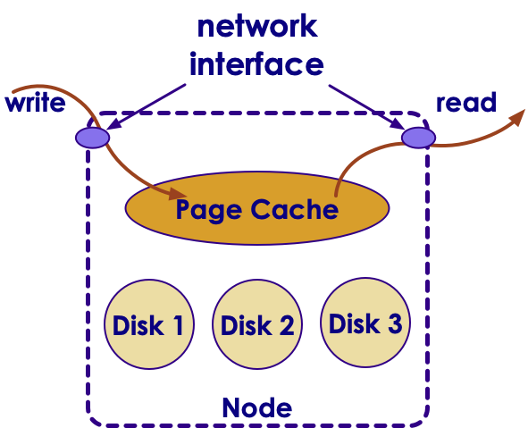

# Kafka Best Practices and Case Studies 


---


## Lesson Objectives


 * Learn to use Kafka effectively

 * Learn from published use cases of Kafka

Notes: 


---

# Kafka Best Practices

---


## Kafka Eco System

| Product          	| Description                                                                  	|
|------------------	|------------------------------------------------------------------------------	|
| Kafka Streams    	| Build streaming applications easily                                          	|
|                  	|                                                                              	|
| Kafka Connect    	| Move data between Kafka and other systems (DB / file system)                 	|
|                  	|                                                                              	|
| Kafka Registry   	| Metadata /schema store for data                                              	|
|                  	|                                                                              	|
| Kafka REST Proxy 	| REST interface into Kafka cluster.,Produce / </br>Consume using RESTFUL APIs 	|
|                  	|                                                                              	|
| Camus            	| Kafka / HDFS integration                                                     	|

Notes: 


---

## Best Practices: Use latest Java & Modern GC


 * Use Java 8

 * Use G1 garbage collector

 * Jvm heap: 8G – 32 G

```text
Conf/kafka-env.sh

export KAFKA_HEAP_OPTS="-Xmx16g -Xms16g"

export KAFKA_JVM_PERFORMANCE_OPTS="-XX:MetaspaceSize=96m -XX:+UseG1GC -XX:MaxGCPauseMillis=20 -XX:InitiatingHeapOccupancyPercent=35
-XX:G1HeapRegionSize=16M
-XX:MinMetaspaceFreeRatio=50
-XX:MaxMetaspaceFreeRatio=80"

```

Notes: 

https://community.hortonworks.com/articles/80813/kafka-best-practices-1.html


---

## Best Practices: OS Setting


 * Give rest of the memory (minus JVM heap) to Page Cache

     - So throughput is fastest

 * Kafka keeps many files open

     - Set open file descriptors to 128k

     - Use `'ulimits –a'` to verify



Notes: 


---

## Best Practices : Disks 


 * Disks tend to be first bottleneck to be hit

 * Never, never, never use shared drives (NFS / SAN)

 * More disks -> better throughput

 * RAIDs are usually more trouble than they are worth

     - Just use individual disks (JBOD – Just a Bunch of Disks)

 * Kafka will stripe data across disks using a round-robin fashion

 * Highly recommended to monitor disk usage

     - And create alerts if disks are getting full


Notes: 


---

## Best Practices: SSD Drives?


 * SSDs don't offer remarkable boost in performance

 * Kafka writes/reads data sequentially to/from commit logs 

     - No random seeks

     - Modern spinning disks can provide very good scan performance

     - Also Linux and Linux file systems are optimized for good sequential IO

 * In Kafka write to disks are asynchronous

     - No waiting for disk ops to complete

 * Zookeeper can benefit from SSD drives

Notes: 

https://blog.cloudera.com/blog/2015/07/deploying-apache-kafka-a-practical-faq/


---

## Best Practices: File System


 * Never, never, never use shared file systems (SAN / NFS)

 * Always use MULTIPLE, LOCAL spindles

 * Recommended file systems : EXT4  or XFS

 * XFS probably better

 * Formatting TB disk drives with XFS is significantly faster  

Notes: 


---

## Best Practices : Zookeeper


 *  **Do not co-locate**  Zookeeper and Kafka brokers on same nodes

 * ZK and Kafka has very different IO patterns

     - Kafka is very disk IO heavy

     - ZK doesn't need a lot of horsepower, it needs to stay alive

 * Dedicate one ZK ensemble to Kafka,  do not share this ZK with other applications (e.g. Hadoop)

     - Kafka uses ZK pretty heavily

     - Can benefit from a dedicated ZK cluster

 * Make sure ZK has sufficient memory (4G+)

 * Monitor memory usage of ZK using JMX or other monitoring programs

Notes: 


---

## Best Practices: Topics / Partitions


 * Number of partitions correspond parallelism

 * Higher the partitions -> more consumers can be added

 * How to calculate optimal number of partitions?

     - Let's say Producer throughput to a single partition as P

     - Say Consumer throughput from a single partition as C

     - Target throughput T

     - Required partitions = Max (T/P,  T/C)

 * Ensure number of partitions >= number of brokers

     -  **Quiz** : Why?

 * Partitions can always be increased later but not decreased

 * Altering number of partitions in a KEY-VALUE topic is a little tricky?

     - Keys have to be re-hashed to partitions

Notes: 


---

## Best Practices: Partitions & Memory


 * More partitions also need more memory on brokers & clients

 * Producer side

     - New Kafka client buffers messages on producer side before sending to brokers

        * To reduce network round-trips

     - The message buffer is maintained for partition

        * More partitions -> more buffer memory needed

 * Consumer side

     - Consumers fetch messages in batches per partitions

     - More partitions -> more batches -> more memory needed

Notes: 


---

## Best Practices: Compression


 * Enabling compression 

     - reduces the data size goes on network

        * Faster throughput

     - Reduces data footprint on disk

        * Less data to write to disk -> faster

 * Compression is performed on a batch

     - Larger batch size -> better compression

 * Compression uses CPU

     - More threads can speed up throughput with compression 

 * Compression types: none, gzip, snappy, or lz4

     - See comparisons in next slides

Notes: 


---

## Compression Comparisons


Notes: 


---

## Best Practices: Use Batching


 * Batching will dramatically increase throughput, specially in producers

 * Batching will increase latency

     - Producer will accumulate messages until desired batch size is attained, before sending it to broker

 * Too small a batch size may not be effective

 * Choose the batch size that gives best   **latency vs. throughput** for your application

 * Larger batch sizes will use more memory for buffering

Notes: 


---

## Best Practices: Message Sizing


 * Kafka is engineered for moving small messages

     - Few KB / message

 * Max message size by default is 1 MB

 * If sending large messages set the following properties:

     -  **messages.max.bytes**  (on broker) 

     -  **fetch.message.max.bytes**  (on consumer)

Notes: 

https://blog.cloudera.com/blog/2015/07/deploying-apache-kafka-a-practical-faq/


---

## Best Practices: Monitor, Monitor, Monitor


 * Kafka exposes lot of metrics

     - Collect them via JMX plugin

     - Or use any of the open source collectors 

 * Send metrics to a collector (graphite, open TSDB ..etc.)

 * Use a nice graphic tool to slice & dice metrics (Grafana)

 * Some important metrics to keep an eye on

     - Log flush latency (95th percentile)

     - Under Replicated Partitions

     - Messages in / sec per broker and per topic

     - Bytes in / sec per broker 

     - Bytes in / sec per topicBytes / message

     - End-to-End time for a message

Notes: 

https://www.confluent.io/blog/how-we-monitor-and-run-kafka-at-scale-signalfx/


---

## Best Practices: Monitor, Monitor, Monitor


 *  **Log flush latency** 

     - How long does it take to flush to disk

     - Longer it takes, longer the write pipeline backs up!

 *  **Under Replicated Partitions** 

     - Replication is lagging behind

     - Messages are being written at very high speed

     - Consumers won't get data that isn't replicated

        * Consumers lag behind as well

     - Chance of data loss is high, when the lead broker fails

 *  **End-to-End time** 

     - How long does it take for a message to arrive from Producer to Consumer

     - Indicates overall speed / latency of kafka pipeline

Notes: 

https://www.confluent.io/blog/how-we-monitor-and-run-kafka-at-scale-signalfx/


---

## Monitoring Consumer Lag


 * Consumer Lag = Size of Partition (last offset) – Consumer offset (last committed)

 * Large offsets means consumers can't  keep up with data

 * Burrow - https://github.com/linkedin/Burrow 

     - Open sourced by LinkedIn

     - Keeps track of committed offsets by consumers and last offsets for partitions

     - Provides REST API for query

Notes: 


---

## Best Practices : Recommendations from Netflix


 * Prefer multiple modest sized Kafka clusters rather than one giant Kafka cluster.   This will simplify operations

 * Number of partitions per cluster around 10,000.This improves availability and latency

 * Use dedicated Zookeeper cluster for each Kafka cluster

Notes: 

https://medium.com/netflix-techblog/kafka-inside-keystone-pipeline-dd5aeabaf6bb


---

# Kafka Case Studies

---


## Kafka Case Studies


 * We will be discussing some published use cases 

 * To instructor:The URLs are in 'Notes' section

Notes: 


---

## Zendesk


 * (http://bigdatausecases.info/entry/kafka-used-at-scale-to-deliver-real-time-notifications)

 * Highlight / Discuss

     - Click on ' **slides** '

     - Slide #6 – architecture diagram

     - Slide #7: Partition keys

     - Slide #10: stats

Notes: 

http://bigdatausecases.info/entry/kafka-used-at-scale-to-deliver-real-time-notifications


---

## WalmartLabs


 * http://bigdatausecases.info/entry/apache-kafka-use-cases-within-search-system-atwalmartlabs

 * Highlight / Discuss

     - Slide #44: 

     - Slide #46: use cases

     - Slide #47: stats

     - Slide #48: architecture 

     - Slide #50: architecture 

Notes: 

http://bigdatausecases.info/entry/apache-kafka-use-cases-within-search-system-atwalmartlabs


---

## Netflix


 * http://bigdatausecases.info/entry/from-three-nines-to-five-nines-a-kafka-journey

 * Highlight / Discuss

     - Slide #1 - #3: data sizes

     - Slide #5: architecture

     - Slide #9: configuration

     - Slide #10: data loss

     - Slide #20: production tips

Notes: 

http://bigdatausecases.info/entry/from-three-nines-to-five-nines-a-kafka-journey


---

## Grid Dynamics Template


 * Blueprint

     - Kafka

     - Spark

     - Cassandra

     - ZooKeeper

     - Redis

     - HDFS

 *  https://blog.griddynamics.com/in-stream-processing-service-blueprint 

 * Highlight

     - architecture

Notes: 

https://blog.griddynamics.com/in-stream-processing-service-blueprint 


---

## In-Stream Processing Reference Impl


 * http://apps.griddynamics.com/realtime-twitter-sentiment-analysis-example


Notes: 

Source: Grid Dynamics
http://apps.griddynamics.com/realtime-twitter-sentiment-analysis-example


---

# Troubleshooting Kafka

---


## Kafka Troubleshooting


 * We are going to do these as a class / group exercise!

 * Show a problem

 * Class to suggest solution

Notes: 


---

## Troubleshooting:  Issue


 * Consumer errors with Out of Memory error

 * (answer next slide)

Notes: 


---

## Troubleshooting Possible Solutions


 * Too many partitions

     - More partitions consume more memory

 * Messages are large

     - Increase Java Heap size

Notes: 


---

## Troubleshooting: Issue


 * Consumer seems to stuck on one offset, can not go beyond that message.

 * Gets InvalidMessageSizeException

 * (answer next slide)

Notes: 


---

## Troubleshooting Possible Solutions


 * Message size is too large

 * Double check  **messages.max.bytes**  (on broker) 

 * And match  **fetch.message.max.bytes**  (on consumer)

Notes: 


---

## Troubleshooting:  Issue


 * Some consumers are not receiving any messages

 * (answer next slide)

Notes: 


---

## Troubleshooting Possible Solutions


 * Probably have more consumers than number of partitions

 * Solutions:

     - Match  # consumers = # partitions  in a consumer group

     - Increase number of partitions

     - Decrease number of consumers

Notes: 


---

## Troubleshooting: Issue


 * Producer is getting QueueFullException 

 * (answer next slide)

Notes: 


---

## Troubleshooting Possible Solutions


 *  **Reason** 

 * Producer is sending events faster than Kafka brokers can handle

 * Fixes:

 * Slow down producer sending

     - Switch `ack` setting to 1 or `all` to Producer will wait for acknowledgement from Broker

 * Expand Kafka capacity

     - Add more partitions if possible

     - Add more broker nodes to handle the load

Notes: 


---

## Troubleshooting: Issue


 * Number of Under Replicated partitions are going up

 * (answer next slide)

Notes: 


---

## Troubleshooting Possible Solutions


 *  **Reason** 

 * Creating replicas is lagging behind

 * IO throughput between brokers is not keeping up with incoming data

 * This is  **serious issue** , as it will 

     - backup write pipeline

     - Increase probability of loosing data

     - And slow down consumers! (why ?)

 * Fixes:

 * Inspect disk bottleneck on replica machines

     - Are the disks slow / full?

 * Check IO throughput between brokers

     - Is the NIC saturated?

Notes: 


---

# Kafka Design Exercises

---


## Problem: Transporting Existing Log Files Via Kafka


 * We have an application that generates log files on disk

 * Each file size is about 1G

 * Each file contains approximately a few hundred thousands to million log entries

 * Q1: We have hundreds of these log files accumulated, first we need to send them via Kafka

 * Q2: Then, we want to continuously monitor the output log file as it is produced and send to Kafka

 *  **Answer next slide** 

Notes: 


---

## Solution: Transporting Existing Log Files Via Kafka


 * Option1: Kafka Connect

 * Option2: Write a (Java) program to read files

 * Extract events 

 * Push individual events into Kafka

 * Write in batch mode for increased throughput

 *  **Question for class:** 

     - What would we use for key?

Notes: 


---

## Problem: Monitor log files and send logs into Kafka


 * Programs writes log files to disk

 * We want to transport these logs via Kafka

 * Need to continuously monitor the log files and send logs to Kafka

 *  **Answer next slide** 

Notes: 


---

## Solution: Monitor log files and send logs into Kafka


 * Kafka Connect

 * [LogStash](https://www.elastic.co/products/logstash)

     - Can parse pretty much any log files

     - And send them to any 'stash'

     - Has input / output plugins for Kafka(can read from / write to  Kafka)

 * [Log4J](https://logging.apache.org/log4j/)

     - Log4j has appenders to Kafka

 * Roll your Own

     - Apache Commons has a [Tailor](https://commons.apache.org/proper/commons-io/javadocs/api-2.4/org/apache/commons/io/input/Tailer.html) class

Notes: 

https://www.elastic.co/products/logsta
https://logging.apache.org/log4j/2.0/manual/appenders.htmlsh
https://commons.apache.org/proper/commons-io/javadocs/api-2.4/org/apache/commons/io/input/Tailer.html


---

## Problem: Sending Large Video Files Through Kafka


 * We have video files that are of size from 100s of MB in size to few Gigs.

 * We want to send these files using Kafka

 * And assemble the files on the other end


Notes: 


---

## Solution: Sending Large Video Files Through Kafka


   * Chop the file into smaller chunks and send them with SAME key (so all chunks of one file will be written to ONE partition,  and a consumer can re-construct the file on the other end)

   * **Questions for class** 

        -  What can we use for key?

        - How do we make sure the files aren't corrupted?

   * **Instructor:** 

        - Draw out the payload send order

Notes: 


---

## Problem: Too Many Partitions Making Kafka Cluster Unstable


 * We have a  **created**  topic with 1000 partitions

 * And we have been sending data to the topic.  All partitions have data

 * But this is proving to be too many partitions for our little kafka cluster.

 * We want to cut down the number of partitions to 100

 * How can we accomplish this?Remember, number of partitions can not be reduced!

 *  **Answer next slide** 

Notes: 


---

## Solution: Reducing Number of Partitions


Notes: 


---

## Problem: How to Capture Events From an IOT device and push it to Kafka?


 * Imagine we have IOT devices sending data 'home'

 * These devices are outside our firewall!

 * Capture the data in Kafka

 * Design a system do this

 * We want to award badges to users who accomplish certain milestonese.g.  Fitbit send "well done" when a user completes 10,000 steps a day

     - These awards are sent via email & mobile app push notifications

 *  **Answer next slide** 

Notes: 


---

## Solution: IOT Data Capture


 * Kafka REST

Notes: 


---


## Review Questions


Notes: 


---

## Lesson Summary


Notes: 

