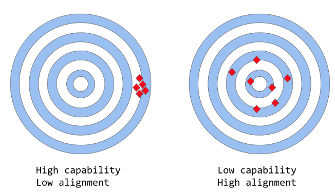

# How LLMs work

---

## ChatGPT

* Latest language model from OpenAI
* Significant improvement over its predecessor GPT-3
* Used a combination of both Supervised Learning and Reinforcement Learning to fine-tune ChatGPT
* **it is the Reinforcement Learning component specifically that makes ChatGPT unique**

---

## Human feedback

* The creators use a particular technique called
  * Reinforcement Learning from Human Feedback **(RLHF)**
  * Uses human feedback in the training loop
  * to minimize harmful, untruthful, and/or biased outputs.

---

## Investigation plan

* Look at GPT-3's limitations 
  * how they stem from its training process
* Learn how RLHF works
* Understand how ChatGPT uses RLHF to overcome these issues
* Conclude by looking at some limitations of RLHF

---

## Capability vs Alignment 

---

## Capability vs Alignment

* Capability 
  * a model's ability to perform a specific task
  * typically evaluated by **how well it is able to optimize its objective function**
* Alignment
  * Concerned with what we actually want the model to do versus what it is being trained to do
  * How model's goals and behavior align with human values and expectations

---

## Example
* train a bird classifier to classify birds as either "sparrows" or "robins"
* use _log loss_ (which measures the difference between the predicted probability distribution of the model and the true distribution) as the training objective
* The model might have **low log loss**, i.e. the model’s capability is high, 
* but **poor accuracy** on the test set.

---

## Models like the original GPT-3 are misaligned

* trained on vast amounts of text data from the internet
* **capable of generating human-like text**
* may not always produce output that is consistent with human expectations or desirable values.
* their objective function is a probability distribution over word sequences 
* allows them to predict what the next word is in a sequence 

---

## Problem
* **these models are intended to perform some form of valuable cognitive work**
* there is a clear divergence between the way these models are trained 
  * and the way we would like to use them
* machine calculated statistical distribution of word sequences might be very effective choice to model language
* we as humans generate language by choosing text sequences that are best for the given situation

---

## Alignment problem
* Lack of helpfulness: 
  * not following the user's explicit instructions.
* Hallucinations: 
  * model making up non-existing or wrong facts.
* Lack of interpretability: 
  * it is difficult for humans to understand how the model arrived at a particular decision or prediction.
* Generating biased or toxic output: 
  * a language model that is trained on biased/toxic data may reproduce that in its output, even if it was not explicitly instructed to do so.

---

# Misalignment

## Core techniques of training

* Core techniques used for training language models, such as **transformers**
  * Next-token-prediction
  * masked-language-modeling

---

## Next-token-prediction
* the model is given a sequence of words
* asked to predict the next word in the sequence
* Example
  * "The cat sat on the"
* Possible answers
  *  "mat", "chair", or "floor"
* Model can even estimate the likelihood of each possible word

---

## masked-language-modeling
* "The [MASK] sat on the"
* Model might predict the next word as "cat", "dog", or "rabbit"
* learn the statistical structure of language
* but not capable of distinguishing between an important error and an unimportant one

---

## Example
* "The Roman Empire [MASK] with the reign of Augustus."
* it might predict "began" or “ended”
* misalignment
  * trained to predict the next word
  * may not necessarily be learning some higher-level representations of its meaning

---

##  ChatGPT based on GPT-3
* has been further trained by using human feedback 
* guide the learning process with the specific goal of mitigating the model’s misalignment issues
* Reinforcement Learning from Human Feedback (RLHF)
* ChatGPT - the **first case of use of this technique for a model put into production**

## How exactly to RLHF?
1. Supervised fine-tuning step
2. “Mimic human preferences” step
3. Proximal Policy Optimization (PPO) step

---

## Supervised fine-tuning

* pre-trained language model is fine-tuned on a relatively small amount of demonstration data curated by labelers, to learn a supervised policy (the SFT model) that generates outputs from a selected list of prompts. This represents the baseline model.

---

## “Mimic human preferences”

* Labelers are asked to vote on a relatively large number of the SFT model outputs, this way creating a new dataset consisting of comparison data. A new model is trained on this dataset. This is referred to as the **reward model (RM)**.

---

## Proximal Policy Optimization (PPO) 

* the reward model is used to further fine-tune and improve the SFT model. The outcome of this step is the so-called **policy model**.

---

## Source for us

[https://arxiv.org/pdf/2203.02155.pdf?ref=news-tutorials-ai-research](https://arxiv.org/pdf/2203.02155.pdf?ref=news-tutorials-ai-research)

---

## Evaluation the result

* Helpfulness: 
  * judging the model’s ability to follow user instructions, as well as infer instructions.
* Truthfulness: 
  * judging the model’s tendency for hallucinations (making up facts) on closed-domain tasks. The model is evaluated on the TruthfulQA dataset.
* Harmlessness: 
  * the labelers evaluate whether the model’s output is appropriate, denigrates a protected class, or contains derogatory content. The model is also benchmarked on the RealToxicityPrompts and CrowS-Pairs datasets.

---

## Shortcomings

* The preferences of the labelers who produce the demonstration data.
* The researchers who design the study and write the labeling instructions.
* The choice of prompts crafted by the developers or provided by the OpenAI customers.
* The labelers bias is both included in the reward model training (by ranking outputs) and in the model evaluation.

---

## Also
* Lack of control study
* Lack of ground truth for the comparison data
* Human preferences are just not homogeneous
* Prompt-stability testing for the reward model (RM)
* Wireheading-type issues

---