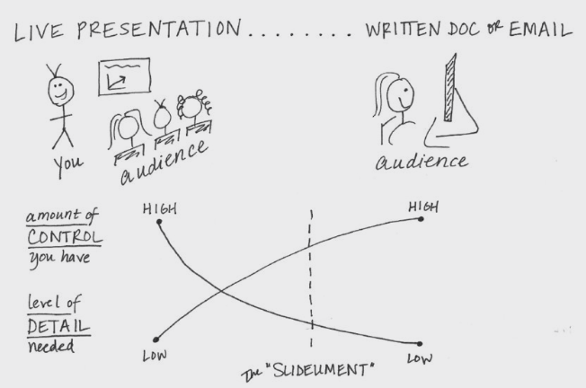

# Storytelling with data

---

# Aspects/Drivers

---

## Jeff Bezos's Email

---

## Make your presentation 

* Exercise: we think through the presentation, then practice it in breakout rooms. 
* What is the presentation? - Talk about yourself

---

## My story

* How I started
* Let's look at one example

---

## Unfaithful wife

* https://mkerzner.blogspot.com/2015/11/sotah-15-sacrifice-of-jealousy.html

---

## Now - you

* Did you ever hold your audience's attention?

---

## Your presentation

* Shelling oysters or giving the pearls

---

## Your audience

* Who do I think **you** are?

* Avoid the generic qualifiers
* Exclude outliers
* Of course, know about your audience

---

## Who am I?

* What puts you in the center?
* Ask for feedback

Notes:

* You are the presenter
* You studied the subject
* So recommend - even incorrectly 

---

## Slideument

Notes:

* What I am going to do next: psychology, technical, storytelling
* Do not use slides as a teleprompter

---

## Teleprompter slides

---

## Finally, bring in your data as evidence

* 3-minute story
* Big Idea

Notes:

* What was our 3-minute story?
* What was the big idea?

---

## Storyboarding

Notes:

* Advice:
  * Don't start with presentation software

---

## Clutter is your enemy
* Imagine a blank page - that would be heaven!
* Clutter leads to "ugh" moment
* Gestalt principles give an answer

---

## Proximity

---

## Proximity

---

## Similarity

Notes:

You naturally group similar things together

---

## Similarity

Notes:

* You see rows due to similarity in color

---

## Enclosure

Notes:

* Simple enclosure will do

---

## Enclosure

Notes:

*  The shaded area separates the forecast from actual data

---

## Closure

  
Notes:

* People see constructs
* Chart borders and background shading - these are not needed

---

## Continuity

Notes:

---

## Application of continuity

Notes:

* Reduce clutter - no need for Y axis

---

## Connection

Notes:

---

## Application of connection

Notes:

* We frequently leverage the connection principle is in line graphs, to help our eyes see order in the data

---

## These were the Gestalt principles

* What principles did I use to introduce them?

Notes:

* Avoid clutter
* Avoid the obvious
* Love your audience

---

## White space

Notes:

* Say "Death to pie charts"
* Then pause for 15 seconds

---

## Unsolicited feedback

Notes:

* Are you open to receiving feedback?
* Ask your colleague for feedback instead. - But actually listen to it
* If you are a boss and should give feedback, do it in private
* What if it is commonplace? - Still better wait to be asked for it

---

# Psychology/Expressive

---

## Phlegmatic personality

[Phlegmatic dance](https://www.youtube.com/watch?v=lfBAuacklfA)

https://www.youtube.com/watch?v=lfBAuacklfA

---

## Choleric personality

[Choleric dance](https://www.youtube.com/watch?v=nMjotRBK6-Q})

https://www.youtube.com/watch?v=nMjotRBK6-Q

---

## Sanguine personality

[Sanguine dance](https://www.youtube.com/watch?v=nMjotRBK6-Q)

https://www.youtube.com/watch?v=nMjotRBK6-Q

---

## Melancholic personality

[Melancholic dance](https://www.youtube.com/watch?v=G1yEyHqc2eU})

https://www.youtube.com/watch?v=G1yEyHqc2eU}

---

## The Merrill-Reid Personality Types

---

# Technical/Analytical

---

## (Big) data analysis tools

---

## Big Data Tools

* [Exploring Data with Looker](https://www.cloudskillsboost.google/quests/165)
* [Understanding LookML in Looker](https://www.cloudskillsboost.google/quests/170)
* [Insights from Data with BigQuery](https://www.cloudskillsboost.google/quests/123)
* [Power BI](https://powerbi.microsoft.com/en-us/)
* [Tableau](https://www.tableau.com/)

---

## Technical/Analytical

* Data Science, Many Skills
* Follow the Data
  * Where to store it, how to process?
* Rows and Columns, Variables, Attributes
* Pictures vs Numbers
  * What to do when pictures are too large and too slow
* Big Data? Big Deal!
  * Overview of Big Data tools with examples and exercises
* init(),service(),destroy()
  * Like a servlet

---

## When to use images?

Notes:

* Leverage how people see

---

## Where are the eyes drawn?

---

## Focus the attention

---

# Amiable/Philosophy

---
## Storytelling is the trend

---

## The Storytelling classic

---

## The Storytelling hero

---

## McKee students

* 63 Academy Award 
* 164 Emmy Award winners
* Quincy Jones, Diane Keaton, Gloria Steinem, Julia Roberts, John Cleese and David Bowie

---

## How to tell a story

Notes:

* A multipede parable
* Relying on intuition
* Getting confused
* Learning the art of storytelling

---

## Major storytelling principle

---

## Why do we tell stories?

Notes:

* There are several universal discourse modes: narrative, exposition, reporting… etc. We tend to shift between modes in a discourse in order to communicate effectively, often in response to our listener not understanding what we are communicating.
* Narrative is the first mode learned by all people since it is actually tied to processing in the visual system. It is also the mode we tend to revert to in order to clarify or consolidate data.
* From a cognitive perspective, short term memory can only absorb so much information. In a class, students reach a threshold of retention after which no new information is learned.
* The brain has to consolidate all of the new information into a “clump” or structure to put it into long term memory and to free up short term memory for new information.
* Since this mechanism is not employed when processing a story, the insertion of stories into a class gives students a chance to consolidate what they have been taught, as well as providing a context for consolidation. The story becomes an exemplar of the presented material, sort of like a mental index entry.
* The most effective mechanism for learning is to do something that requires the application of material. In some cases this is not possible, but following a narrative has a similar effect.

---

## Storyteller should be specific

Notes:

* Anecdotal evidence works the best
* Avoid "typical", like she is a typical soccer mom
* Say, divorce in the Bayou, in Manhattan, or infidelity on potato farm

---

## Learn to cut

Notes:

* Demo Trello

---

## Nabokov wrote on card

# Tips and tricks

---

## Rehearse

---

## What you don't see

Notes:

* Months of expert planning
* And coaching
* At first: shaky hands, wavering voice, many filler words

---

## Dirty secret of training

Notes:

* The first delivery of a class is never perfect
* Neither is the second

---

## Make a powerful closing statement

--- 

## Make a powerful closing statement

---

