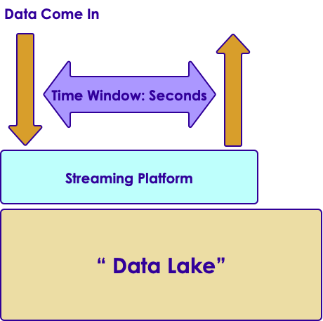
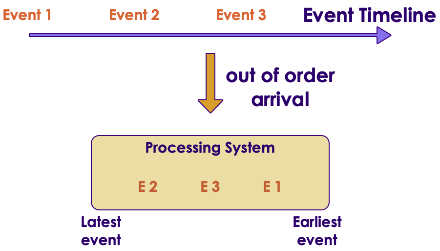
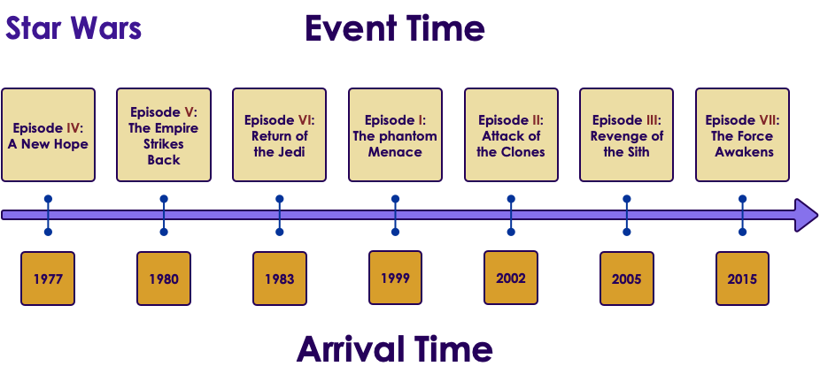
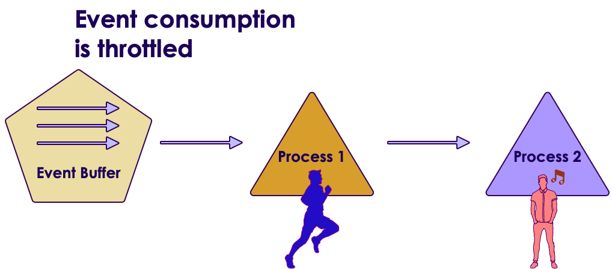

# Streaming Primer

---

## Lesson Objectives

 * Understand streaming use cases
 * Learn about streaming concepts
 * Gain insight on streaming architectures

Notes: 

---

# Why Streaming?

---

## Big Data Evolution: Version 1

  * Decision times: batch ( hours / days)
  * Use cases:
    - Modeling 
    - ETL 
    - Reporting

Notes: 

---

## Moving Towards Fast Data: Version 2

  * Decision time: (near) real time
    - Seconds (or milliseconds)
  * Use Cases
    - Alerts (medical/security)
    - Fraud detection
  * Streaming is becoming more prevalent
    - Connected Devices
    - Internet of Things
  * Beyond Batch
    - We need faster processing and analytics

Notes: 

---

## Streaming Volumes: Texas Utilities Smart Meter Data

Notes: 

---

## Spark Streaming Use Cases

  * Netflix
    - Recommendations
    - 450 billion events/day
  
  * Weather Company
    - Analyze weather sensor data
    - Billions of events/day
    - Multi-Petabyte (PB) traffic daily

  * More use cases at [BigDataUseCases.info](www.BigDataUseCases.info)

Notes: 

---

# Streaming Concepts

---

## Real Time / Near Real Time

  * The ’real’ real time is in milliseconds order
    - DB query returns in 2 ms
  * ‘near real time’ is seconds
    - We can process an event within 3 seconds of its generation time

| ‘Name’                             	| Time                                                	| Example                       	|
|------------------------------------	|-----------------------------------------------------	|-------------------------------	|
| Hard real time                     	| Single order ms,sub milli seconds   1 ms,0.5 ms 	| Space shuttle control systems 	|
| Credit card transaction processing 	| 50 ms, 300 ms                                       	| Db queries                    	|
| Sending Emails                     	| 2 secs +                                            	| Stream processing latency     	|
|                                    	| 1 min +                                             	| Mini batch queries            	|

Notes: 

---
## Streaming Concepts

  * Processing model
    - Event based or micro batch based
  * Processing guarantees
    - At least once
    - At most once
    - Exactly once
  * State management
  * Event time vs. Arrival time
  * Window Operations
  * Back-pressure adjustment

Notes: 

---
## Streaming Processing Model

  * Two major modes:
    - Event based , Micro Batch
  * Event Based:
    - Events are processed, individually,  as they come in
    - Usually low latency
    - Frameworks: Storm, Flink, Nifi, Samza
  * Micro-Batch
    - Events arrived during a particular time frame (5 secs) are processed as a batch
    - Slightly higher latency (due to batching)
    - Frameworks: Spark Streaming

Notes: 

---
## Event Based Vs. Batch

Notes: 

---

## Processing Guarantees

  * In the order of effort required:
    - At-most-once <  At-least-once  < exactly-once
  * At-most-once
    - Simplest implementation
    - No duplicate processing
    - Events can be dropped due to crashes or heavy load
    - E.g.  Web requests (if the web server is busy, requests are dropped)

  * At-least-once
    - All events are guaranteed to be processed (no dropped events)
    - An event can be processed more than once.    - In case of failure recovery, events can be re-played and processed again.
    - Needs a ‘durable buffer’ that enables ‘re-play’
    - OK for idempotent operations like saving events.    - Duplicate processing will just over-write previous values.
    - Not OK for counting (how many events came in in last 10 mins)
    - **Most common** implementation
    - Frameworks: All (Storm, Spark, NiFi, Samza, Flink)

Notes: 

---
## Processing Guarantees

* Exactly-Once
- Events are guaranteed to be processed exactly-once
- No dropped events
- No duplicate processing
- Needs ’re-playable buffer’ **plus** an external storage system to track state
- Frameworks: Storm (with Trident), Flink, Spark, Samza
* See Example below:
- When applying a new ‘batch’ of counts, how can we make sure we are not duplicate counting?

Notes: 

---

## Processing Guarantees Summary

| Application                        	| Processing                                                                                                                                          	|
|------------------------------------	|-----------------------------------------------------------------------------------------------------------------------------------------------------	|
| GPS routing app                    	| -At most once. We can skip past events to catch up to latest events ('next turn' is more important than past data)  -At least once can work too 	|
| Credit card transaction processing 	| -Exactly once we don't want to charge credit cards twice due to duplicate processing                                                                	|
| Sending Emails                     	| -At least once We don't want drop any emails.,Duplicate processing is OK (we might send duplicate emails)                                           	|

Notes: 

---

## State Management

  * Can the framework remember state associated with events?
  * Per event processing (filter , transformation) don’t need state
    - Filter #hashtags from tweets
  * However, complex operations like joining, grouping, aggregating (counts) require state
    - What is the max temperature reported in last one hour
  * SQL analogy
    - Select,  and where clauses don’t need state.
    - JOIN / Group BY usually require state
  * Support varies according framework

Notes: 

---

## State Management

  * See next slide for diagrams
  * Store state in memory:
    - Lost if node crashes
    - All types of events have to go to a particular node to compare state
  * Store state in an external store (DB)
    - State can be maintained across nodes
    - Queries can increase latencies and become bottle neck and limit speed of processing
  * Store state along with the event (piggy packing)
    - Event has ‘complete payload’ with state
    - Efficient, no need for external storage
    - Increases event size (need high throughput IO)

Notes: 

---
## State Management Strategies

Notes: 

---

## Window Operations

  * Some operations can be done at message level
    - e.g. Sentiment analysis (happy / sad / neutral)
  * Some operations require a bunch of messages and ‘time window’
    - E.g.  How much AAPL  stock has gone up in last 10 minutes?
    - We need to previous values to calculate rate of change.
  * Window based operations:
    - Group a bunch of messages by time (usually)
  * Some frameworks support window operations natively
    - E.g.  Spark, Flink
    - Storm does this with Trident

Notes: 

---

## Event Time and Arrival Time

  * Event Time:    - When the event occurred / generated
  * Arrival Time:    - When event arrives for processing 
  * Event Time < Arrival Time
  * Some times events may arrive ‘out of order’ 

Notes: 

---

## Event Time vs. Arrival Time Illustrated

Notes: 

---

## Back Pressure

  * Some times processing lags behind 
    - Processing system is too busy
    - Temporary spike in input data (Twitter stream exploding after an election results is announced)
  * Events pile up
    - May lead to events being dropped.-> un-acceptable in most of the situations
  * Solutions
    - signal ‘upstream’ processors to slow down?
    - Leave events in the persistent buffer longer

Notes: 

---

## Back Pressure

Notes: 

---

# Streaming Architecture

---

## Streaming Architecture – Over Simplified

Notes: 

---
## Streaming Architecture – Data Bucket

  * ‘data bucket’ 
    - Captures incoming data
    - Acts as a ‘buffer’ – smoothes out bursts
    - So even if our processing offline, we won’t loose data
  * Data bucket choices
    - Kafka
    - MQ (RabittMQ ..etc)
    - Amazon Kinesis 

Notes: 

---

## Streaming Architecture – Processing Engine

* Need to process events with low latency
* So many to choose from!
* Choices
- Storm
- Spark
- NiFi
- Flink

Notes: 

---
## Streaming Frameworks Feature Comparison

| Feature              	| Storm                                             	| Spark Streaming 	| Flink                            	| NiFi            	|
|----------------------	|---------------------------------------------------	|-----------------	|----------------------------------	|-----------------	|
| Processing Model     	| Event-based by default,(Micro Batch using Trident 	| Micro Batch     	| Event-based,+,Micro Batch- based 	| Event-based (?) 	|
| Windowing operations 	| Supported by Trident                              	| Yes             	| ?                                	| ?               	|
| Latency              	| Milliseconds                                      	| Seconds         	| Milliseconds                     	|                 	|
|                      	|                                                   	|                 	|                                  	|                 	|
| At-least-once        	| YES                                               	| YES             	| YES                              	| YES             	|
| At-most-once         	| ?                                                 	| ?               	| ?                                	| ?               	|
| Exactly-once         	| ?                                                 	| ?               	| ?                                	| ?               	|

Notes: 

---
## Streaming Architecture – Data Store

  * Where processed data ends up
  * Two requirements:
    - Real time store
    - ‘archival’ store
  * Real Time Store
    - Need to absorb data in real time
    - Usually a NoSQL storage HBase, Cassandra, many more
  * ‘Archival store’
    - Needs to store massive amounts of data
    - Support analytics (usually batch)
    - Hadoop / HDFS

Notes: 

---

## Lambda Architecture

Notes: 

---
## Lambda Architecture explained

  * All new data is sent to both batch layer and  speed layer
  * Batch layer
    - Holds master data set (immutable , append-only)
    - Answers batch queries
  * Serving layer
    - updates batch views so they can be queried adhoc
  * Speed Layer
    - Handles new data
    - Facilitates fast / real-time queries
  * Query layer
    - Answers queries using batch & real-time views

Notes: 

---
## Incorporating Lambda Architecture

Notes: 

---
## Streaming Stack

Notes: 

---
# Streaming Frameworks
---

## Streaming Frameworks

  * Storm
  * Spark Streaming  
  * NiFi
  * Flink
  * Samza

Notes: 

---

## Storm

* ‘Original’ stream processing platform
* Open sourced by Twitter around 2010
* Integrates with multiple systems: MQ, Kafka
* Trident is a high level framework on top of Storm

| Feature                         	| Storm                  	| Storm + Trident     	|
|---------------------------------	|------------------------	|---------------------	|
| Processing Model                	| Event batch            	| Event + micro batch 	|
| Processing guarantee            	| At-least-once          	| Exactly-once        	|
| State                           	| Yes starting with 1.0  	|                     	|
| Supports window based functions 	| Yes starting with 1.0  	| Yes                 	|
| Latency                         	| Sub seconds to seconds 	| Yes                 	|
| Caching                         	| no                     	|                     	|
| Supported languages             	| Java, Python           	|   &nbsp;                  	|

Notes: 

---
## Spark Streaming

  * Based on popular Spark framework

| Feature                         	| NiFi                   	   |
|---------------------------------	|------------------------	   |
| Processing Model                	| Micro batch                      |
| Processing guarantee            	| At-least-once,  exactly-once     |
| Supports window based functions 	| yes                     	   |
| Latency                         	| seconds                	   |
| Caching                         	| yes                     	   |
| Supported languages             	| Java, Scala, Python    	   |

Notes: 

---
## Flink

  * A new framework, that is gaining momentum
  * Developed by consortium of German universities

| Feature                         	| NiFi                   	   |
|---------------------------------	|------------------------	   |
| Processing Model                	| Event based & batch based        |
| Processing guarantee            	| At-least-once, exactly-once      |
| Supports window based functions 	| ?                      	   |
| Latency                         	| Sub seconds to seconds 	   |
| Caching                         	| ?                      	   |
| Supported languages             	| Java, Scala, Python    	   |

Notes: 

---
## NiFi

  * Event flow and processing system
  * Open sourced by National Security Agency (NSA)
  * A startup (Onviya) was acquired by Horton Works
  * Hortonworks’  ‘data flow’ product 

| Feature                         	| NiFi                   	|
|---------------------------------	|------------------------	|
| Processing Model                	| Event based            	|
| Processing guarantee            	| At-least-once,?        	|
| Supports window based functions 	| ?                      	|
| Latency                         	| Sub seconds to seconds 	|
| Caching                         	| ?                      	|
| Supported languages             	| Java, Scala, Python    	|

Notes: 

---

## Samza

  * Another new framework
  * Developed by LinkedIn
  * Tight integration with Kafka (also developed at LinkedIn)

| Feature                         	| Samza                  	|
|---------------------------------	|------------------------	|
| Processing Model                	| Event based            	|
| Processing guarantee            	| At-least-once          	|
| Supports window based functions 	| ?                      	|
| State                           	| Yes                    	|
| Latency                         	| Sub seconds to seconds 	|
| Caching                         	| ?                      	|
| Supported languages             	| Java, Scala, Python    	|

Notes: 

---

## Streaming Frameworks At A Glance

| Feature                  	| Storm                                                  	| Spark Streaming 	| Flink                                    	| NiFi            	| Samza       	|
|--------------------------	|--------------------------------------------------------	|-----------------	|------------------------------------------	|-----------------	|-------------	|
| **Processing Model**     	| Event based by default (micro batch using Trident) 	| Micro Batch     	| Event based, +  MicroBatch based 	| Event Based (?) 	| Event based 	|
| **Windowing operations** 	| Yes (from 1.0)                                         	| Yes             	| Yes                                      	| ?               	| ?           	|
| **State**                	| Yes (from 1.0)                                         	| Yes             	| Yes                                      	| Yes             	| Yes         	|
| **Latency**              	| Sub seconds                                            	| Seconds         	| Sub seconds                              	| Sub seconds     	| Sub seconds 	|
| **Back Pressure**        	| Yes                                                    	|                 	| Yes                                      	|                 	|             	|
|                          	|                                                        	|                 	|                                          	|                 	|             	|
| **At-least-once**        	| YES                                                    	| YES             	| YES                                      	| YES             	| YES         	|
| **At-most-once**         	|                                                        	|                 	|                                          	|                 	|             	|
| **Exactly-once**         	|                                                        	|                 	|                                          	|                 	|       &nbsp;          |

Notes: 

---
## Class Discussion

  * What are your streaming uses cases ?
