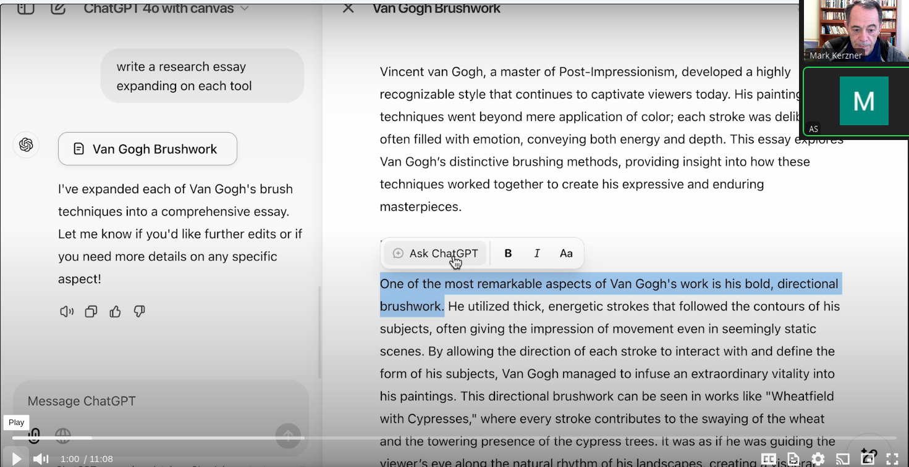
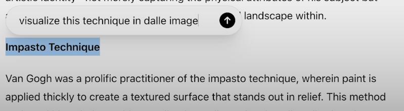
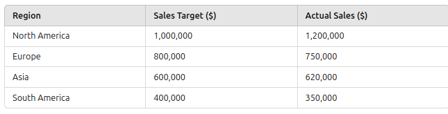

# Trailer

---

## Painting

---

## Steps

* In Canvas
  * Search the web to list out Van Gogh's brushing techniques in bullet points
  * Note that we are using a web search tool by just asking for it
  * Write a research essay expanding on each technique

## Highlight and ask for explanation

* Select and ask to use the web to verify the claim
* Note that it gives the sources

---

# Note the audience slider on the right

---

## Ask for pictures

* Select text
* Ask to visualize it in DALL-E image

---

## Practical planning with diagrams

* Start a new Canvas
* Give AI a picture
* Ask it reason through the plot and write a research report

* 

---