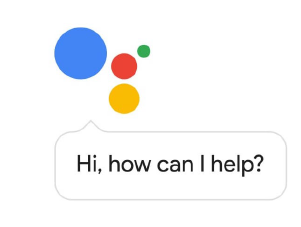
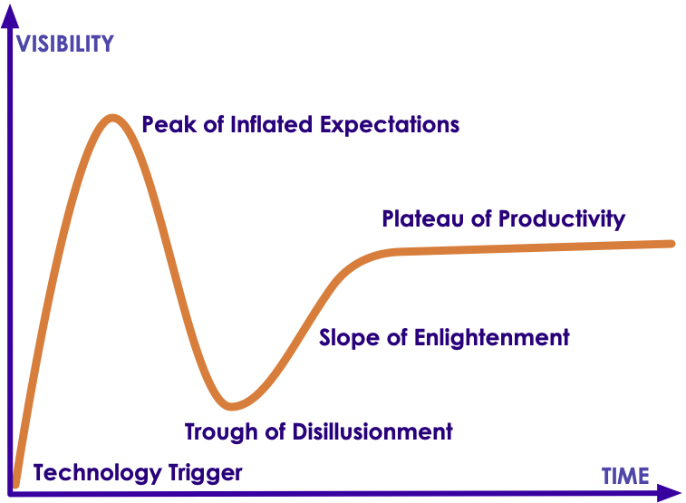
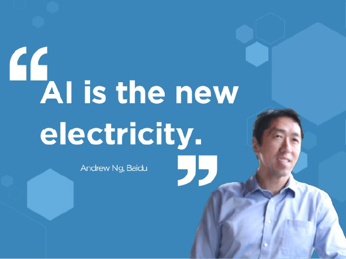
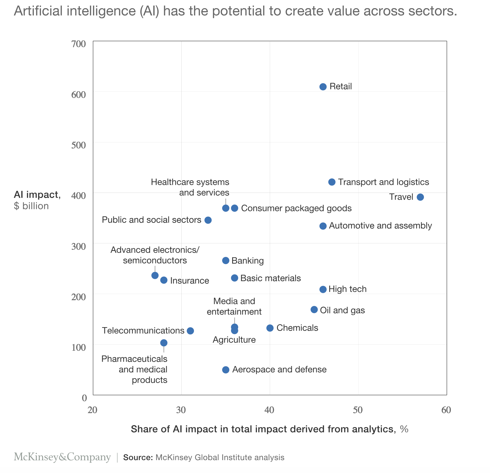
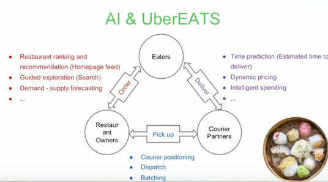
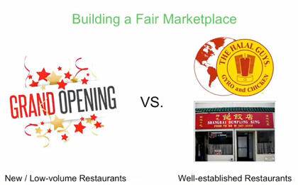
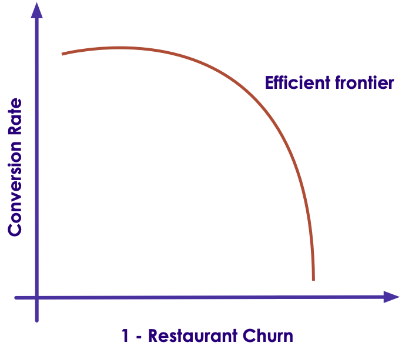
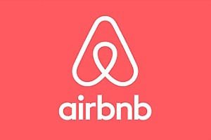

# AI Primer - Part 1

---

## Lesson Objectives

<!-- {"left" : 5.51, "top" : 1.25, "height" : 3.32, "width" : 4.43} -->

 * See the potential of AI

 * Learn from industry use cases

 * Understand the problems AI can solve

 * Understand the basic AI vocabulary

Notes:


---

## About You and Me

 * About you

     - Your name

     - Your background (developer, admin, manager, etc.)

     - Technologies you are familiar with

     - Familiarity with Machine Learning and AI  **(scale of 1-4; 1-new, 4-expert)**

     -  **Something non-technical about you!**  **(favorite ice cream flavor, hobby, etc.)**


 &nbsp; <!-- {"left" : 0.81, "top" : 5.96, "height" : 2.12, "width" : 2.4} --> &nbsp; <!-- {"left" : 3.24, "top" : 5.99, "height" : 2.05, "width" : 3.78} --> &nbsp; <!-- {"left" : 7.04, "top" : 5.96, "height" : 2.12, "width" : 2.4} -->

Notes:

---
## Recommended Resources:

- [AI for Everyone](https://www.coursera.org/learn/ai-for-everyone) - A very good course (free!) by Professor Andrew Ng

* [AI Tranformation Playbook](https://landing.ai/ai-transformation-playbook/) - Another great free ebook by Andrew Ng

---

## Question for Audience

 * Think of something you did today / this week that is AI powered?

Notes:

---

## Demo - Gmail AI Helper

<!-- {"left" : 0.35, "top" : 1.87, "height" : 2.68, "width" : 9.55} -->

<!-- {"left" : 1.3, "top" : 4.49, "height" : 3.29, "width" : 7.67} -->


Notes:


---

## AI - Google Assistant


 * Google Assistant Making phone calls


 * Also Google Voice has gotten a lot better in recent years

* [Source](https://ai.googleblog.com/2018/05/duplex-ai-system-for-natural-conversation.html)


<!-- {"left" : 2.06, "top" : 2.94, "height" : 4.63, "width" : 6.14} -->


Notes:

---

# Why AI Matters?


---

## AI is a Huge Disruptor / Enabler

<!-- {"left" : 0.8, "top" : 2.48, "height" : 4.1, "width" : 8.66} -->


Notes:


---

## AI Growing at a Phenomenal Rate


<!-- {"left" : 0.54, "top" : 2.09, "height" : 4.9, "width" : 9.17} -->

* [Source](https://mapr.com/blog/ai-ml-2018-and-beyond/)

Notes:


---

## Question for Class: Are We in a AI Hype Cycle?

<!-- {"left" : 1.18, "top" : 1.93, "height" : 5.78, "width" : 7.89} -->


Notes:


---

## Case for AI

<!-- {"left" : 1.38, "top" : 2.01, "height" : 5.63, "width" : 7.5} -->


Notes:

Image credit: coursera

---
## How Important is AI ?

* **"AI will create US$13 Trillion value by year 2030"  -- McKinsey Global Institute**

* [Source](https://www.mckinsey.com/featured-insights/artificial-intelligence/notes-from-the-ai-frontier-applications-and-value-of-deep-learning)

<!-- {"left" : 2.33, "top" : 2.96, "height" : 5.32, "width" : 5.59} -->


Notes:  

---

## How Important is AI

<!-- {"left" : 1.89, "top" : 1.7, "height" : 6.25, "width" : 6.48} -->

* [Source](https://www.mckinsey.com/featured-insights/artificial-intelligence/notes-from-the-ai-frontier-applications-and-value-of-deep-learning)

Notes:  


---

## How Important is AI?

 * **"8 out of 10 companies are already implementing, or planning to adopt AI by 2020"**  -- Source [Oracle](https://www.oracle.com/webfoder/s/delivery_production/docs/FY16h1/doc35/CXResearchVirtualExperiences.pdf)

 * AI is no longer 'novel'

 * Companies are expected to have some AI in their products

     - Just like they are expected to have website that works on a phone

     - Or having an 'app'

Notes:


---

# AI Use Cases

Notes:


---

## AI Use Cases at a Glance

|       Finance       |         Healthcare        |        Retail       |        Manufacturing       |    Network & Security    |
|:-------------------:|:-------------------------:|:-------------------:|:--------------------------:|:------------------------:|
| Fraud Detection     | Diagnosis                 | Recommendations     | Identify defects           | Identify security breach |
| Algorithmic trading | Patient care              | Customer retentions | Fully automated assemblies | Facial recognition       |
| Credit Approvals    | Treatment recommendations |                     |                            |                          &nbsp;|

<!-- {"left" : 0.25, "top" : 1.43, "height" : 3.05, "width" : 9.75} -->


Notes:


---


## Use Case - Uber Eats
<!-- {"left" : 8.75, "top" : 0.98, "height" : 1.28, "width" : 1.28} -->


<!-- {"left" : 1.91, "top" : 1.75, "height" : 4.47, "width" : 6.44} -->


<!--  -->


[AI @ Uber Eats Video](https://www.youtube.com/watch?v=AiinFkL-pmw&feature=youtu.be)

Notes:

https://www.youtube.com/watch?v=AiinFkL-pmw&feature=youtu.be


---

## Use Case - Uber Eats


 * 6 Billion in Revenue (Uber Eats alone!) within 4 years of launching!

 * UberEats is built with AI from ground up

<!-- {"left" : 1.4, "top" : 3.6, "height" : 4.14, "width" : 7.44} -->


Notes:

https://venturebeat.com/2018/10/02/uber-eats-and-the-6b-bookings-run-rate-the-ai-success-story-no-one-is-talking-about/


---

## Uber Eats - AI

Here are the actions in Uber Eats

- Step 1: When user launches the app, need to display restaurants

- Step 2: Choose menu items from a restaurant

- Step 3: Uber to dispatch a courier to pick up the food and deliver
    - Plan the optimal route for pick and up delivery

- Step 4 : Gather feedback from user (ratings / reviews)

---

## Uber AI: Step 1: Recommending Restaurants

<!-- {"left" : 5.28, "top" : 1.21, "height" : 3.27, "width" : 4.92} -->


 * **Question for class**     
    - What factors Uber might consider when recommending a restaurant?

(Answer next slide)

---

## Uber AI: Step 1: Recommending Restaurants

- Recommend restaurants based on past orders

- Location based

- Balance new restaurants vs. established restaurants

<!-- {"left" : 0.47, "top" : 4.4, "height" : 2.31, "width" : 3.72} --> &nbsp; &nbsp; <!-- {"left" : 5.3, "top" : 3.73, "height" : 3.64, "width" : 4.2} -->

<!--  -->


---
## Uber Eats AI: Step 2: Recommend Menu Items

<!-- {"left" : 5.53, "top" : 1.37, "height" : 3.06, "width" : 4.59} -->


 * **Question for class:**   
    - What factors Uber might consider when recommending a items from a restaurant?

(Answer next slide)

---

## Uber Eats AI: Step 2: Recommend Menu Items

<!-- {"left" : 7.21, "top" : 1.27, "height" : 3.69, "width" : 2.65} -->


- Based on past orders

- Most popular items

- 'Specials'

 * **"Don't order fish at restaurants on Mondays"  -- Anthony Bourdain, Chef and Author "Kitchen Confidentials"**


Notes:


---


## UberEats - AI Architecture / Workflow

<!-- {"left" : 0.75, "top" : 3.24, "height" : 2.58, "width" : 8.74} -->


Notes:

Source : https://www.youtube.com/watch?v=AiinFkL-pmw&feature=youtu.be


---

## Use Case : Uber driver verification

- To increase passenger safety, Uber drivers have to verify their identity before accepting rides

- Uber uses [Microsoft Cognitive Services](https://azure.microsoft.com/en-us/services/cognitive-services/) to recognize 7 million+ drivers in milli seconds

- [Link](https://venturebeat.com/wp-content/uploads/2016/09/uberids.gif?resize=343%2C600&strip=all)

<!-- {"left" : 1.35, "top" : 4.82, "height" : 1.77, "width" : 2.44} --> &nbsp; &nbsp;  <!-- {"left" : 4.3, "top" : 4.97, "height" : 1.48, "width" : 2.63} --> &nbsp; &nbsp; <!-- {"left" : 7.44, "top" : 4.43, "height" : 2.56, "width" : 1.46} -->


---

## Use Case: Photobucket

- [Photobucket](http://photobucket.com/) is a image / video hosting service

- They want to identify and tag NSFW (Not Safe For Work) images and offensive images

- Previously, their human moderation team was only able to monitor about 1% of content

- Now AI system (Using [Clarify](https://www.clarifai.com/)), screens images and tags them properly.  
Illegal images (child pornography ..etc) are flagged for law enforcement

- [Link](https://blog.clarifai.com/how-photobucket-uses-image-recognition-to-protect-its-community-from-unwanted-content)

<!-- {"left" : 0.64, "top" : 5.94, "height" : 0.87, "width" : 4.6} --> &nbsp;&nbsp; <!-- {"left" : 6.16, "top" : 6.01, "height" : 0.73, "width" : 3.45} -->


Notes:  
- https://blog.clarifai.com/how-photobucket-uses-image-recognition-to-protect-its-community-from-unwanted-content

---

## Use Case: Staples

- [Staples](https://www.staples.com) relies on organic search traffic to drive sales

- One way the ways to score high on search engine results is put meaningful ALT tags for each product images

- Doing it manually was an expensive proposition

- They use  [Clarify](https://www.clarifai.com/) to automatically tag images

- [Link](https://clarifai.com/customers/staples)

<!-- {"left" : 1.12, "top" : 5.4, "height" : 0.7, "width" : 3.54} --> &nbsp;  &nbsp; <!-- {"left" : 5.6, "top" : 5.37, "height" : 0.75, "width" : 3.54} -->


Notes:  
- https://clarifai.com/customers/staples

---

## Use Case - AirBnB Customer Service

<!-- {"left" : 0.54, "top" : 2.82, "height" : 3.42, "width" : 4.08} --> &nbsp; &nbsp; <!-- {"left" : 5.3, "top" : 2.82, "height" : 3.42, "width" : 4.41} -->

Notes:

---

## Use Case AirBnB

<!-- {"left" : 0.54, "top" : 2.82, "height" : 3.42, "width" : 4.08} --> 

* Problem
  - AirBnB is growing at an exponential rate

  - With growth, the customer support also increased

  - They had 5000 support agents, and still falling behind!

  - Needed a way to scale

* Solution

  - Deploy AI to handle customer queries

  - AI is smart enough to understand customer questions and provide answers"how do I verify my ID?"

* [Case study](http://bigdatausecases.info/entry/airbnb-driving-a-higher-level-of-customer-support-with-machine-learning)

Notes:

---

## Use Case in Finance: Capitol One - Credit Card Fraud Prevention

<!-- {"left" : 6.35, "top" : 1.45, "height" : 1.23, "width" : 3.5} -->

 * Capitol ONE:
     - 365 Billion in assets,
     - 8th largest bank, 4th largest credit issuer

* Challenge:
    - minimize fraudulent credit card transactions
    - Huge volume, 20 million transactions a day
    - Keep history for 60 days

* Solution
     - Used machine learning to reduce credit card fraud
     - Increased accuracy significantly over legacy methods
     - minimize fraud loss --> more profit

Notes:

- [case study](http://bigdatausecases.info/entry/a-machine-learning-approach-recommendation-engine-for-real-time-processing-use-case-at-capital-one)
- [video](https://vimeo.com/274801502)


---

## Bank of America Customer Service Bot

<!-- {"left" : 6.26, "top" : 1.33, "height" : 1.43, "width" : 3.67} -->
<!-- {"left" : 6.08, "top" : 4.59, "height" : 3.13, "width" : 4.04} -->

* Bank of America virtual assistant can handle a variety of customer queries

* Examples:
  - Easy: "Pay $50 to Bill"
  - Complex: "show me my total expenses to Disneyland trip"

* Can understand both text / voice query

* References
  - [Meet Erica, Bank Of America's New Voice AI Banking System - Forbes](https://www.forbes.com/sites/quora/2016/10/28/meet-erica-bank-of-americas-new-voice-ai-banking-system/#655fa71f50db)
  - [Bank of America launches AI chatbot Erica - CNBC](https://www.cnbc.com/2016/10/24/bank-of-america-launches-ai-chatbot-erica--heres-what-it-does.html)


---

## Customer Service Chatbots @ Lyft 

<!-- {"left" : 8.33, "top" : 1.09, "height" : 1.66, "width" : 1.71} -->


```text
User:
    Hi, My driver went to a wrong location.  
    So I had to cancel.  
    But I was charged a cancellation fee.
    Can that be refunded"

Customer Service:
    I see, this is your first cancellation in past 2 months.  
    We will refund you the money.Have a nice day!"
```
<!-- {"left" : 0, "top" : 3.62, "height" : 0.99, "width" : 5.6} -->

- Hightlighs
  - Resolution time:  **about 20 seconds!**
  - No phone calls,
  - No wait time


Notes:


---

## AI in Healthcare

<!-- {"left" : 5.86, "top" : 1.17, "height" : 2.77, "width" : 4.15} -->

* DeepMind's AI can detect over 50 eye diseases as accurately as a doctor

* Case study at London's Morefield's Hospital

* Typical eye diagnosis took 2 weeks

* AI can diagnose it in a flash

* How?
    - The AI system was trained on hundreds of thousands of previous eye scans and their diagnosis
    - Once it has learned enough then when it sees a new image, it can predict the outcome
    - 90%+ accuracy

* [Source](https://www.theverge.com/2018/8/13/17670156/deepmind-ai-eye-disease-doctor-moorfields)


Notes:


---

## Clarifai Demo

- Go to [Clarify model gallery](https://www.clarifai.com/model-gallery)

- Upload an image (or give a image URL)

- Examine the output.  
Have fun :-)

<!-- {"left" : 1.77, "top" : 3.45, "height" : 4.29, "width" : 6.71} -->

Notes:  

https://clarifai.com/demo

---

# What is AI

---

# What is Machine Learning?

[ML-What-is-ML.md](../../machine-learning/generic/ML-What-is-ML.md)

---

## Expert Systems

* **An expert system is a computer system emulating the decision-making ability of a human expert**

* They reason through scenarios using the built-in knowledge

* Expert systems are **rule based**

* Rules are **static** and created by domain experts

<!-- {"left" : 0.78, "top" : 4.13, "height" : 3.28, "width" : 8.7} -->

---

## Expert Systems vs. Machine Learning

| Expert System                                  | Machine Learning                                                |
|------------------------------------------------|-----------------------------------------------------------------|
| Rules are statically created by domain experts | Rules are 'learned' from data                                   |
| Uses rules / if-then to provide answers        | Uses models created from learning                               |
| Updating rules is an involved process          | Newer/better models can be created by training on more/new data |
| Not very scalable                              | Scales well with data                                           |
| Popular in 1980s                               | Currently popular approach                                      |

<!-- {"left" : 0.78, "top" : 4.13, "height" : 3.28, "width" : 8.7} -->


Notes:


---

# A Brief History of AI


[../../machine-learning/generic/AI-brief-history.md](../../machine-learning/generic/AI-brief-history.md)

---

# AI Vocabulary

[../../machine-learning/generic/AI-vocabulary.md](../../machine-learning/generic/AI-vocabulary.md)

---

## Review and Q&A

<!-- {"left" : 8.56, "top" : 1.21, "height" : 1.15, "width" : 1.55} -->
<!-- {"left" : 6.53, "top" : 2.66, "height" : 2.52, "width" : 3.79} -->


* Let's go over what we have covered so far

* Any questions?
