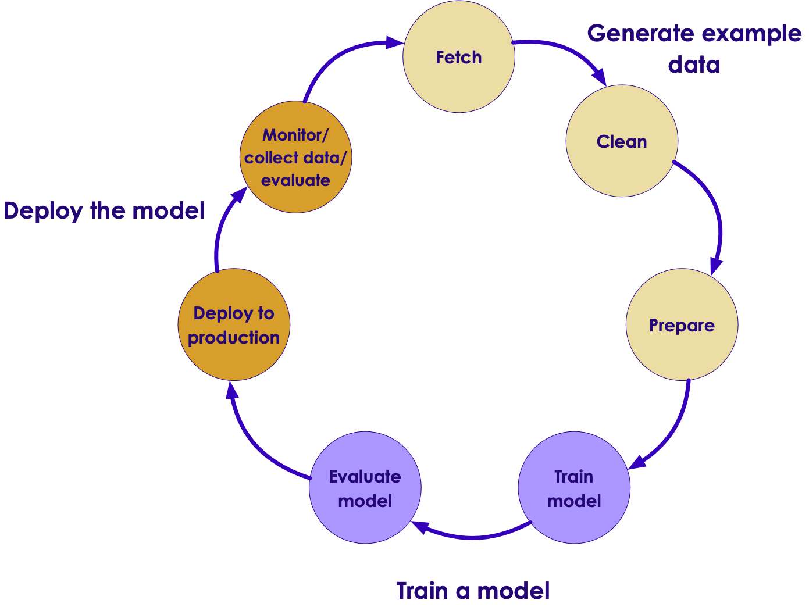
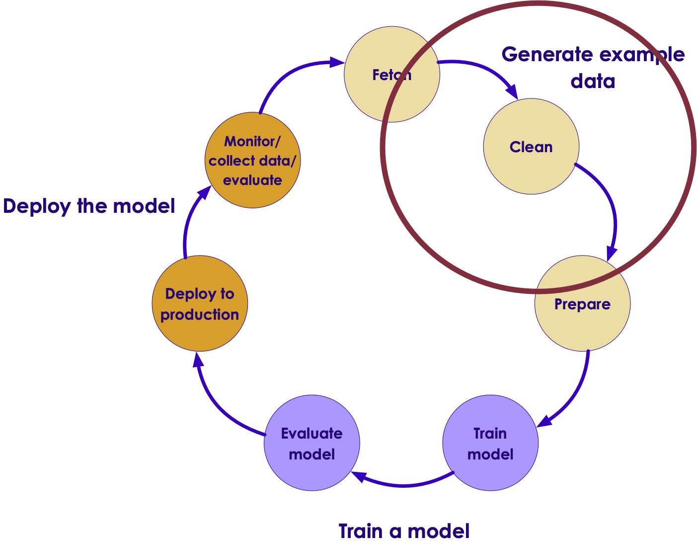
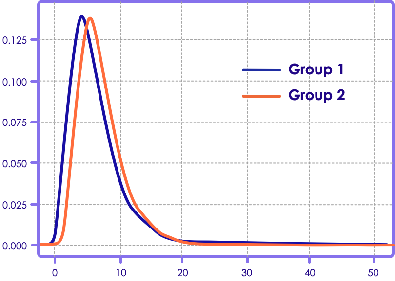
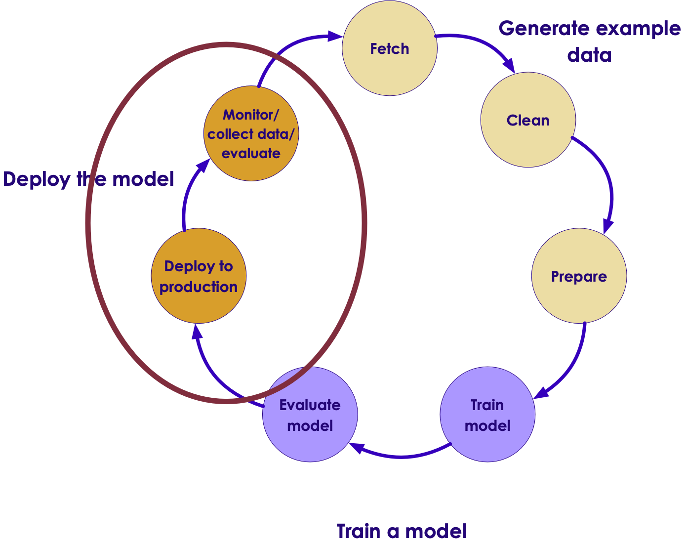
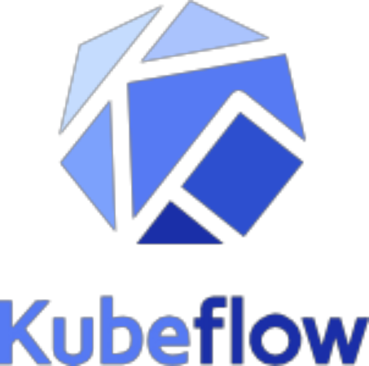
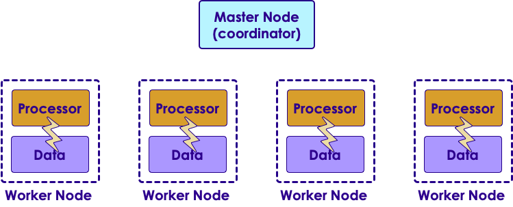
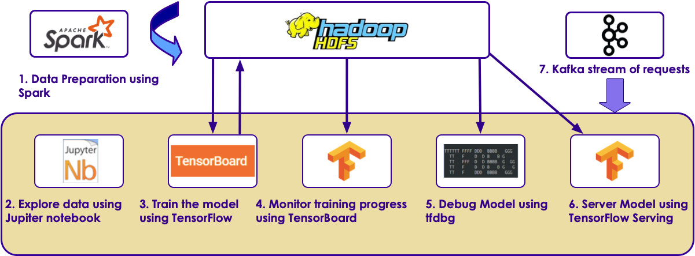
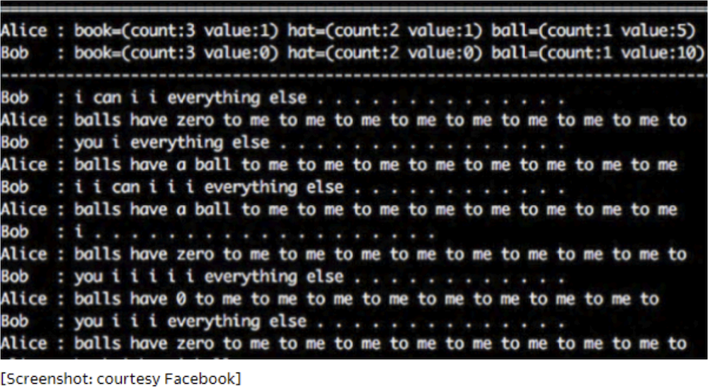

# AI Primer - Part 3
---

## Lesson Objectives 2

<!-- {"left" : 5.51, "top" : 1.25, "height" : 3.32, "width" : 4.43} -->

 * Learn about AI software & hardware

 * Running an AI project

 * Building Data Science teams

 * Any thing else you want to cover

Notes:

---

# Doing AI Projects

---

## What Problems Can AI Solve?

<!-- {"left" : 7.33, "top" : 1.29, "height" : 1.16, "width" : 1.75} -->

<!-- {"left" : 6.53, "top" : 3.1, "height" : 2.21, "width" : 3.35} -->

- Andrew Ng's  __"one second"__ rule  
"If you can do a task with less than ONE second of thought process, AI can do that easily"

- What AI can do now
    - Classifying email as spam / not spam
    - Translating english sentence to Japanese
    - Identifying an image (car vs boat)
    - Identify damaged products off assembly line
    - Customer support ticket routing
    - self driving car : figuring out what is in front of it
    - Identifying cancer cells from Xray image

---

## What AI Can not do

- **Complex tasks that combines multiple skills**
  - Do market research and write a report
- If you don't have enough data
    - if you train AI using 1000s of xray images it can learn to classify.  What if you only have handful of images?  
    AI may not be able to provide good results
- Understand human intension  
For example, if a construction worker is waving you to stop or continue?

 &nbsp; &nbsp; <!-- {"left" : 0.86, "top" : 5.29, "height" : 2.7, "width" : 3.48} --> <!-- {"left" : 5.33, "top" : 5.29, "height" : 2.7, "width" : 4.06} -->

---

## Some Thoughts on Evaluating  AI Projects

- AI can do 'certain tasks', it may not be able to automate the whole work flow

- For example, let's say we are deploying AI to handle customer tickets.

- AI can easily 'route' tickets to appropriate queues and priorities
    - "Item arrived late, even though I paid for expedited shippping.  can I get a refund?" ==> Send it to 'refund' queue
    - "Item arrived damaged, can I return it?" ==> send it to 'return' queue

- What AI can not do  (the whole workflow):
    - Read the support ticket
    - call customer to confirm the issue
    - then issue a refund
    - update the sales register
---

## Some Thoughts on Evaluating  AI Projects

- Do you have enough data to get started?

- For example let's say you want to identify damaged products off the assembly line, do you have enough pictures of good items and damaged items?

<!-- {"left" : 3.11, "top" : 4, "height" : 2.68, "width" : 4.04} -->

---

## Some Thoughts on Evaluating  AI Projects

- An AI system can evaluate an MRI scan pretty quickly to determine if the patient has a tumor

- How ever it is not going to be able replace an trained oncologist, because they do lot of other things
    - train interns
    - consult with patients
    - evaluate equipments and treatments

- So an oncologist may deploy an AI system to help him with reviewing MRI scans quickly.  
So he/she can focus on other 'higher order' functions

---

## Quiz For the Class: AI Projects
<!-- {"left" : 6, "top" : 1.13, "height" : 2.78, "width" : 4.16} -->

- Pick a couple of potential AI projects that is applicable to you

- What kind of data do you need for machine learning?  
It may help to think along these lines
    -  Data we already have
    - Data we can collect
    - 3rd party data - FREE or minimal cost
    - 3rd party data - Premium

- What kind of data infrastructure do you have now?  Can it scale to handle future growth?

---

# How to do AI

---

## What do you need to get Started?

* 0 - Budget!

* 1 -  A tangible problem to solve

* 2 -  Relevant data

* 3 -  Team with right skills

---
## Building an AI Team

* Building an effective AI team is **not trivial**

* Competition is fierce for experienced Machine Learning scientists

* We recommend **up-skilling** your current team
    - They know your business
    - You know them!
    - Equip them with the tools and technologies, so they can build the solutions

* Impact hiring:
    - If you need a 5 person team...
    - Hire an experienced ML Engineer
    - And upskill the rest 4 from your current team

---

## Implementing AI

* Choices are: **Buy, Rent, Build**

* **Buy**:  
    - If there is a commercial solution that solves exactly your problem, may be you might consider buying it
    - Question for class:  What are the pros/cons

* **Rent**:
    - Lot of vendors are providing **AI as service**
    - Might worth considering
    - Question for class:  What are the pros/cons

* **Build**:
    - Often times, your problem is unique, you have to build your own solution
    - Question for class:  What are the pros/cons

---

# AI Workflow / Process

---

## AI Workflow

<!-- {"left" : 1.48, "top" : 1.8, "height" : 5.47, "width" : 7.29} -->

Notes:

---

## How to do Machine Learning

 *  **1 - Problem Definition:** What are we trying to solve

 *  **2 - Collect data** More data we have, the better the algorithms become.  This data can come from internal logs (clickstreams) or external sources (credit scores of customers)

 *  **3 - Prepare Data** Raw data is hardly in a form to be used.  It needs to be cleansed, tagged and curated before ready to use

 *  **4 - Train a model** Feed the training data to model so it can learn

 *  **5 - Evaluate the model** Test the model accuracy

 *  **6 - Improve the model** Either by adding more training data, choosing a different algorithm

 *  **7 - Deploy the model**

Notes:

---

## 1 - Problem Definition

 * This may not be as easy as it seems

 * Known Knowns

     - Daily web traffic

 * Known Unknowns

     - What are most popular pages?

     - Do big connectors matter in a social graph?

 * Unknown Unknowns

     - Is there a connection between X and Y

Notes:

---

## Class Discussion:

<!-- {"left" : 5.2, "top" : 1.39, "height" : 3.33, "width" : 4.99} -->

 * What are some of the problems you are facing that Data Science / Machine Learning might be a solution?

Notes:

---

## 2 - Collecting Data

<!-- {"left" : 5.18, "top" : 1.23, "height" : 3.82, "width" : 4.89} -->

 * Data Sources can be

     - External: government data, public data,...

     - Internal: collected data (clickstream etc.)

 * External Data challenges

     - Compliance, security concerns,...

     - How much can we get? API throttling.

     - Is the data in useable format?

---

## 2 - Collecting Data

<!-- {"left" : 5.31, "top" : 1.26, "height" : 3.74, "width" : 4.79} -->

 * May need to bring data from different systems and in usually in different formats.

     - Clicklogs are text files.

     - Customer data can be from a database.

Notes:

---

## Class Discussion: Data Collection Challenges

<!-- {"left" : 5.55, "top" : 1.22, "height" : 3.09, "width" : 4.64} -->

 * What are some of the problems you are facing / anticipating for collecting data?

Notes:

---

## 3 - Data Preparation / Cleaning

<!-- {"left" : 5.55, "top" : 1.19, "height" : 3.51, "width" : 4.49} -->

 * Problems with raw data sets

     - Non-usable format (say in Excel spreadsheet format)

     - Contains errors & wrong values

     - Missing values

     - Data is spread across multiple silos

 * Data scientists spend a lot of time cleaning and massaging raw data, to get them ready for analysis.

 * Crucial part of data science

 * Can consume a lot of time (50% - 80%  of the project!!!)

 * Least sexy

Notes:

---

## Class Discussion: Data Cleanup

<!-- {"left" : 5.77, "top" : 1.06, "height" : 2.97, "width" : 4.46} -->

 *  **What do you think involves in cleaning up data?**

Notes:

---

## 3.5 - Exploratory Data Analysis (EDA)

<!-- {"left" : 6.22, "top" : 1.22, "height" : 2.65, "width" : 3.72} -->

 * Before doing `machine learning` on data, understand the data.

 * Basic questions

     - Is there a pattern?

     - Are there lot of outliers?  (May skew analysis. Should we keep these or throw them away?)

 *  **Visualizations**  can help greatly!

     - Just do some quick & dirty graphs.

 * Identify `interesting segments`

 * Need to sample?  Or process entire data set?

Notes:

---

## 4 - Model Building

<!-- {"left" : 5.32, "top" : 1.07, "height" : 3.87, "width" : 4.88} -->

 * Don't do this until you have a good understanding of data.(See previous section.)

 * Pick right modeling technique

     - Clustering

     - Classifications

     - Etc.

 * Pick the right model for data

     - Don't get 'hung up' on one model.

     - Try a few to identify the best fitting model.

     - Experience counts!

Notes:

---

## 5 - Model Validation

 <!-- {"left" : 5.9, "top" : 1.22, "height" : 3.38, "width" : 4.27} -->
<!-- {"left" : 5.55, "top" : 6.63, "height" : 1.97, "width" : 4.48} -->

* Models need to be `verified`  / `validated`

* Split the data set into
  - Training set: build / train model
  - Test set: validate the model
  
* Initially 70% training,  30% test

* Tweak the dials to decrease training and increase validation.

* Training set should represent data well enough.

Notes:

---

## 6 - Improving the Model

<!-- {"left" : 5.09, "top" : 1.22, "height" : 4.15, "width" : 4.86} -->

 * Sometimes we don't get desired accuracy from the model

     - Say we need 90% accuracy, but the model is only at 70%

 * How to improve?

     - Can we find more training data?

     - Tune model parameters

     - Or even choose another model

Notes:

---

## 7 - Deploy Model

<!-- {"left" : 5.19, "top" : 1.45, "height" : 3.69, "width" : 4.66} -->

 * We are happy with the model's performance

 * So we deploy the model on production / live system where it can start predicting / inferring

 * Monitor the model in production

Notes:

---

## Class Discussion : AI Life Cycle

<!-- {"left" : 6.55, "top" : 1.28, "height" : 2.41, "width" : 3.62} -->

 * Do you have any stories to share about AI work flow?

     - Issues

     - Best practices?

<!-- {"left" : 2.64, "top" : 4.97, "height" : 3.72, "width" : 4.96} -->

Notes:

---

## Reinforcement / Neural Net Demo: Alpha GO

<!-- {"left" : 1.02, "top" : 1.32, "height" : 4.64, "width" : 8.21} -->

[Link](https://www.youtube.com/watch?v=9xlSy9F5WtE)

Notes:

- https://www.youtube.com/watch?v=9xlSy9F5WtE
- https://money.cnn.com/2017/09/29/technology/future/alphago-movie/index.html

---

## Reinforcement/ Neural Net Demo: Alpha GO Explained

<!-- {"left" : 0.33, "top" : 2.81, "height" : 3.23, "width" : 4.1} --> &nbsp; &nbsp; <!-- {"left" : 4.77, "top" : 3.27, "height" : 2.32, "width" : 5.15} -->

 [Link](https://deepmind.com/blog/alphago-zero-learning-scratch/)

Notes:

https://deepmind.com/blog/alphago-zero-learning-scratch/

---

# AI Software Ecosystem

---

## AI Software Eco System

|             | Machine Learning          | Deep Learning               |
|-------------|---------------------------|-----------------------------|
| Java        | -Weka -Mahout             | DeepLearning4J              |
| Python      | -SciKit -Numpy, Pandas  | -Tensorflow -Pytorch -Caffe |
| R           | -Many libraries           | -Deepnet -Darch             |
| Distributed | Spark                     | Spark                       |
| Cloud       | -AWS -Azure -Google Cloud | -AWS -Azure -Google Cloud   |

<!-- {"left" : 0.25, "top" : 1.48, "height" : 3, "width" : 9.75} -->

Notes:

---

## AI and Big Data

 * Until recently most of the AI work is done on `single computer`

 * Most R/Python/Java libraries are `single machine based`

 * Now Big Data tools make it possible to run AI algorithms at massive scale-distributed across a cluster

<!-- {"left" : 1.02, "top" : 4.43, "height" : 3.49, "width" : 8.21} -->

Notes:

---

## Machine Learning vs. Big Data

| Traditional ML                                 | ML on Big Data                               |
|------------------------------------------------|----------------------------------------------|
| All (or most) data fits into single machine    | Data is distributed across multiple machines |
| Data almost / always in memory                 | Memory is scarce                             |
| Optimized for heavy iterative computes         | Optimized for single pass computes           |
| Maintains state between stages                 | stateless                                    |
| CPU bound                                      | IO bound (disk / network).                   |
| GPU (Graphical Processing Unit) seldom engaged | GPUs are utilized increasingly               |

<!-- {"left" : 0.25, "top" : 1.43, "height" : 3.88, "width" : 9.75} -->

Notes:

---

## AI Ecosystem and Tools

<!-- {"left" : 0.36, "top" : 1.97, "height" : 5.14, "width" : 9.54} -->

Notes:

---

## AI Ecosystem

* **R:**  
Programming language and environment for statistical computing with powerful graphical and modeling features.  **The OG**

* **Python:**  
Interpreted programming language supporting multiple programming paradigms. Popular for data science due to code readability, ease of data manipulation and many libraries aimed at data science needs.

* **Anaconda:**  
Python and R distribution for machine learning and data science. Simplifies package management and deployment supporting Windows, Linux and MacOS.

---

## AI Ecosystem (Python)

* **NumPy:**  
Scientific computing library for Python and is the foundation for important data science libraries including Pandas, Matplotlib and Scikit-learn.

* **Pandas:**  
Data structure and analysis library for Python. Allows you to do data cleaning and preparation for data science in addition to analysis.

* **Matplotlib:**
Plotting library for creating plots, histograms, power spectra, bar charts, errorcharts, scatterplots, etc. Used heavily in Jupyter notebooks to visualize data.

---

## AI Ecosystem

* **Scikit-learn:**  
ML python library featuring many popular ML algorithms

* **WEKA:**  
Java ML visualization tools and algorithms.

* **cuDDN:**  
Deep Neural Network library for high-performance GPU acceleration. From NVIDIA.

* **NCCL:**  
The NVIDIA Collective Communications Library (NCCL) implements multi-GPU and multi-node collective communication primitives that are performance optimized for NVIDIA GPUs.

---

## AI Ecosystem

* **TensorFlow:**  
Most popular dataflow programing framework used heavily for ML/DL. Has good visualization, monitoring and debugging features which make it good for production.

*  **Pytorch:**  
The second most popular ML/DL framework which does not have as many production features as TensorFlow but is more intuitive and uses dynamic computation graphs which makes it extremely popular for research.

* **Keras:**
Is a widely used DL python library/high level API which front ends ML frameworks like TensorFlow to make it building and deploying Neural Networks easier. Keras also allows you to import Python DL Models into DL4J.

* **DL4J:**
DL framework for Java which has tight integration with Java based distributed computing frameworks such as Hadoop and Spark. Uses Keras as a Python API.

---

## AI Ecosystem

* **Jupyter:**   
Browser-based notebook interface with support for code, text, mathematical expressions, inline plots and other media. Jupyter has a larger community and is a better stand alone tool when compared to Apache Zeppelin. Jupyter is a more natural fit for use with Python Based ML/DL frameworks.

* **Apache Zeppelin:**   
Browser-based notebook interface with support for code, text, mathematical expressions, inline plots and other media. Zeppelin has tight integration with Hadoop eco system technologies and Spark plus has better out of box multi-user features when compared to Jupyter.

---

## Deep Learning Software Ecosystem

[../../deep-learning/generic/DL-ecosystem.md](../../deep-learning/generic/DL-ecosystem.md)

---

## Infrastructure Tools

<!-- {"left" : 1.28, "top" : 1.75, "height" : 5.56, "width" : 7.69} -->

Notes:

---

## Kubeflow

 * Kubeflow = Kubernetes + ML

 * Deploy ML workflows on Kubernetes

 * Portable and scalable

 * Supports all major libraries:Tensorflow, Pytorch, Jupyter

 * Cloud friendly

 * (https://www.kubeflow.org/)

<!-- {"left" : 7.49, "top" : 1.25, "height" : 2.46, "width" : 2.47} -->

Notes:

---

## Big Data Infrastructure - Hadoop

<!-- {"left" : 7.32, "top" : 1.53, "height" : 4.26, "width" : 2.55} -->

 * Hadoop is the popular on-premise Big Data platform

 * Hadoop v3.0 offers support for Machine Learning

 * Native support for

     - GPU

     - Docker containers

     - AI frameworks: Tensorflow, Pytorch ..etc.

 * HDFS improvements

     - 1.7 copies instead of 3 copies (reducing storage overhead)

* See next slide for a sample Hadoop reference architecture

Notes:

---

## A Hadoop 3 Reference Architecture

<!-- {"left" : 0.18, "top" : 2.24, "height" : 4.58, "width" : 9.9} -->

Notes:
- [Source: Hortonworks](https://hortonworks.com/blog/trying-containerized-applications-apache-hadoop-yarn-3-1/)
---

## Big Data Infrastructure - Spark

 * Spark is a distributed framework

 * Can run on Hadoop and Cloud environments

 * Spark has become a very popular framework for Machine Learning and Deep Learning

 * Massively scalable

 * Can use memory (caching) effectively for iterative algorithms

 * Multi Language support: Scala, Java, Python, R

<!-- {"left" : 2.8, "top" : 5.26, "height" : 2.42, "width" : 4.66} -->

Notes:

---

## Distributed Data Processing

 * Hadoop distributes data across many node

 * Processing also happens on multiple nodes (distributed processing)

 * Data is processed on the node it is located

<!-- {"left" : 0.9, "top" : 4.05, "height" : 3.42, "width" : 8.46} -->

Notes:

---

## Scalable Machine Learning Systems

 * Actual ML is a small part of overall system!

 * In the diagram below, you can see all the infrastructure goes into building a large scale ML system

<!-- {"left" : 0.82, "top" : 3.47, "height" : 3.07, "width" : 8.61} -->

Notes:

---

## A Reference Scalable AI Infrastructure

<!-- {"left" : 0.89, "top" : 2.51, "height" : 3.13, "width" : 8.47} -->

Notes:

---

## A Reference Scalable AI Infrastructure Explained

 *  **HDFS**  is our data lake, it can store huge amount of data, distributed across nodes

 *  **Spark**  is our processing engine, it runs in a distributed fashion on all nodes

 *  **Jupyter**  notebook is used interactively explore data

 *  **Kafka**  does streaming

Notes:

---

## AI in the Cloud

 * Pretty much all cloud vendors have a cloud based AI offering

 * 'AI as Service'

 * Benefits of cloud

     - Not having to worry about infrastructure

     - Scalable infrastructure (start small, grow as needed)

     - Pay per use model

     - 'Deployment gap' is no longer an issue

 * Go from experiment to production very quickly

Notes:

---

## AI Cloud Offerings

| AWS                       | Azure                             | Google Cloud               |
|---------------------------|-----------------------------------|----------------------------|
| -AI as service,'Sagemaker | -AI as service,-'Azure ML Studio' | -AI as service,-'Cloud ML' |

<!-- {"left" : 0.99, "top" : 1.33, "height" : 1.88, "width" : 8.27, "columnwidth" : [2.76, 2.76, 2.76]} -->

 &nbsp; <!-- {"left" : 2.75, "top" : 4.07, "height" : 1.1, "width" : 4.76} -->
 &nbsp; &nbsp; <!-- {"left" : 2.99, "top" : 5.51, "height" : 1.23, "width" : 4.28} -->
<!-- {"left" : 3.45, "top" : 7.08, "height" : 0.76, "width" : 3.37} -->

Notes:

---

## Video: Advances in Robotics

<!-- {"left" : 1.95, "top" : 1.35, "height" : 4.98, "width" : 6.35} -->

[Link](https://www.youtube.com/watch?v=8vIT2da6N_o)

Notes:

https://www.youtube.com/watch?v=8vIT2da6N_o

---

## Demo: Human Powered AI

<!-- {"left" : 6.01, "top" : 1.22, "height" : 3.75, "width" : 3.98} -->

 * Hive is paying 600,000 strangers to help him build human-powered AI that's 'whole orders of magnitude better than Google'

 * Users are paid a small amount of money to tag images

 * [Link](https://finance.yahoo.com/news/ceo-paying-600-000-strangers-150000655.html)

Notes:

https://finance.yahoo.com/news/ceo-paying-600-000-strangers-150000655.html

---

# AI Gone Wrong

---

## AI Gone Wrong

<!-- {"left" : 5.98, "top" : 1.22, "height" : 4, "width" : 4} -->

 * Here we are going look at some cases where AI experiments haven't gone well

 * Links

     - [link1](https://www.zdnet.com/pictures/im-sorry-dave-9-real-times-ai-has-given-us-the-creeps/2/)

Notes:

https://www.zdnet.com/pictures/im-sorry-dave-9-real-times-ai-has-given-us-the-creeps/2/

---

## Facebook's Bots Invent their own language

<!-- {"left" : 6.4, "top" : 1.08, "height" : 2.45, "width" : 3.68} -->

 * Facebook designed to chat bots to talk to each other

 * They were communicating with each other freely

 * After a year

       - `Bob: "I can can I I everything else."`

       - `Alice: "Balls have zero to me to me to me to me  
        to me to me to me to me to."`

 * This indecipherable language is actually a 'new bot language'
 * Bots developed this on their own
 * FB discontinued the experiment
 * [Link](https://www.independent.co.uk/voices/facebook-shuts-down-robots-ai-artificial-intelligence-develop-own-language-common-a7871341.html)

Notes:

https://www.independent.co.uk/voices/facebook-shuts-down-robots-ai-artificial-intelligence-develop-own-language-common-a7871341.html

---

## Facebook Bots

<!-- {"left" : 1.02, "top" : 2.56, "height" : 4.53, "width" : 8.21} -->

Notes:

---

## Target Algorithm Predicts Young Woman's Pregnancy

<!-- {"left" : 6.52, "top" : 1.13, "height" : 2.51, "width" : 3.56} -->

 * Target's Data Scientists identified 25 products that, when purchased together, predict a woman's pregnancy

 * Target started sending out targeted coupons to women shoppers who they have identified as being pregnant

 * One angry man walked into Target store and complained to the manager :  
  " *Why are you sending these baby coupons to my daughter, she is still in high school* "

 * Few days later, the same man called the manager and apologized  
 " *Sorry, I just learned that my daughter is pregnant* "

 * Links: [link1](https://www.zdnet.com/pictures/im-sorry-dave-9-real-times-ai-has-given-us-the-creeps/6/), [link2](https://www.nytimes.com/2012/02/19/magazine/shopping-habits.html?mtrref=www.google.com)

---

## Tesla AutoPilot Crashes Car

 * A Tesla driving on AutoPilot crashes into a truck (2017, Florida)

 * NTSB investigation revealed that AutoPilot system thought the truck was a brightly lit sky, and kept going!

 * Links : [link1](https://www.theregister.co.uk/2017/06/20/tesla_death_crash_accident_report_ntsb/)

<!-- {"left" : 0.57, "top" : 4.46, "height" : 2.92, "width" : 4.38} --> &nbsp; &nbsp; <!-- {"left" : 5.67, "top" : 4.46, "height" : 2.92, "width" : 4.01} -->

Notes:

https://www.theregister.co.uk/2017/06/20/tesla_death_crash_accident_report_ntsb/

---

## AI Mis-Identifying Dogs as Wolfs

<!-- {"left" : 5.27, "top" : 1.32, "height" : 2.85, "width" : 4.77} -->

 * Farmers used an algorithm to identify dogs vs wolves

 * Algorithm worked great in Summer months

 * In Winter months, it started mis-classifying dogs as wolves

 * Algorithm was rewrote to explain what part of picture it was paying attention to

     -  **The SNOW!**

 * [Link](https://www.youtube.com/watch?v=TRzBk_KuIaM)

 * [Video](http://innovation.uci.edu/2017/08/husky-or-wolf-using-a-black-box-learning-model-to-avoid-adoption-errors/
)(@ 2:30 min)

Notes:

https://www.youtube.com/watch?v=TRzBk_KuIaM
http://innovation.uci.edu/2017/08/husky-or-wolf-using-a-black-box-learning-model-to-avoid-adoption-errors/

---

## Amazon uses AI to Identify Job Applicants

<!-- {"left" : 6.12, "top" : 1.26, "height" : 4.23, "width" : 3.97} -->

 * Amazon tried an AI algorithm to short-list candidates

 * The algorithm was trained by job applications submitted in 10 year period

 *  **The algorithm was selecting mostly men for technical positions**

     - Because the training data had male bias

 * Links : [link1](https://www.theladders.com/career-advice/amazon-reportedly-scraps-ai-recruiting-tool-biased-against-women
), [link2](https://www.reuters.com/article/us-amazon-com-jobs-automation-insight/amazon-scraps-secret-ai-recruiting-tool-that-showed-bias-against-women-idUSKCN1MK08G)

Notes:

https://www.theladders.com/career-advice/amazon-reportedly-scraps-ai-recruiting-tool-biased-against-women
https://www.reuters.com/article/us-amazon-com-jobs-automation-insight/amazon-scraps-secret-ai-recruiting-tool-that-showed-bias-against-women-idUSKCN1MK08G

---

## Class Discussion

<!-- {"left" : 5.39, "top" : 1.22, "height" : 3.22, "width" : 4.82} -->

 * Do you know of any cases where AI failed / gone wrong?Please share with the class.

Notes:

---

# AI, Ethics, and Humanity

---

## Elon Musk: "AI will take over humanity"

<!-- {"left" : 2.17, "top" : 1.68, "height" : 6.27, "width" : 5.9} -->

Notes:

---

## Class Discussion : Ethical AI

 * Let's discuss some the topics

 * AI replacing humans in jobs (e.g. truck drivers)

 * Weaponizing AI (killer drones)

 * Any thing else?

Notes:

---

# Final Thoughts

---

## Design an AI Project

<!-- {"left" : 5.28, "top" : 1.31, "height" : 3.39, "width" : 4.67} -->

 *  **Class Project**

 * Let's design an AI project that is from your company

Notes:

---

## Anything Else We Want to Discuss?

Notes:

---
## Closing Demo: Everybody Dance Now

<!-- {"left" : 1.02, "top" : 1.75, "height" : 3.67, "width" : 8.21} -->

 [Link](https://www.youtube.com/watch?v=PCBTZh41Ris)

Notes:

https://www.youtube.com/watch?v=PCBTZh41Ris

---
## Summary

<!-- {"left" : 8.56, "top" : 1.21, "height" : 1.15, "width" : 1.55} -->
<!-- {"left" : 6.53, "top" : 2.66, "height" : 2.52, "width" : 3.79} -->

 *  **We covered the following**

 * AI use cases in industry

 * Recent advances in AI

 * Hardware innovations

 * Machine Learning

 * Deep Learning and Neural Networks

 * Software stacks

 * Cloud offerings

Notes:

---

## Further Reading

 * [Great AI Awakening](https://www.nytimes.com/2016/12/14/magazine/the-great-ai-awakening.html) - New York Times profile of on Google Brain and the people behind it

 * [Gentle Intro to Machine Learning](https://monkeylearn.com/blog/a-gentle-guide-to-machine-learning/)

 * [Machine Learning Basics](https://www.analyticsvidhya.com/blog/2015/06/machine-learning-basics/)

Notes:

https://www.nytimes.com/2016/12/14/magazine/the-great-ai-awakening.html
https://monkeylearn.com/blog/a-gentle-guide-to-machine-learning/
https://www.analyticsvidhya.com/blog/2015/06/machine-learning-basics/

---

# Backup Slides

---
