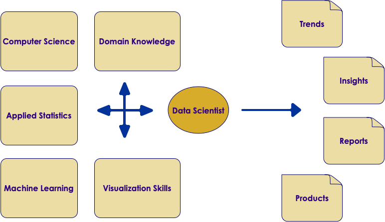
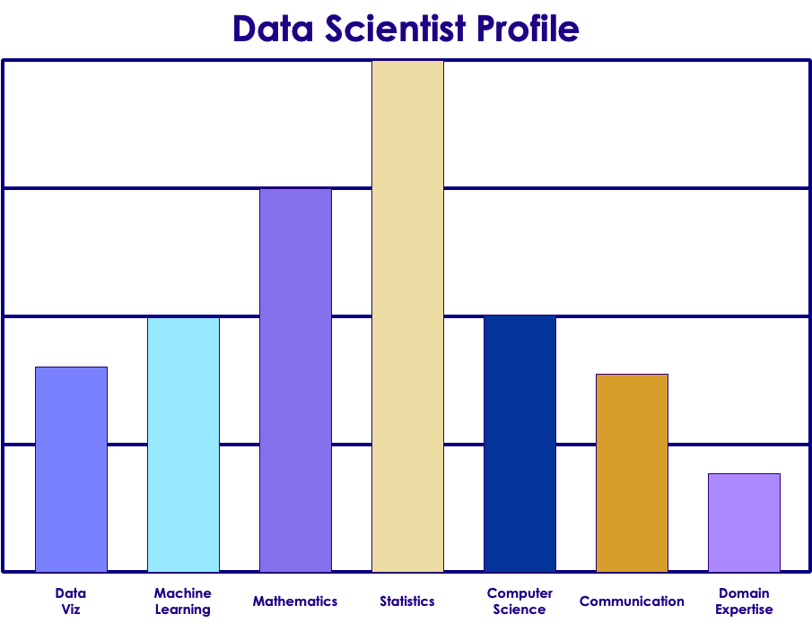
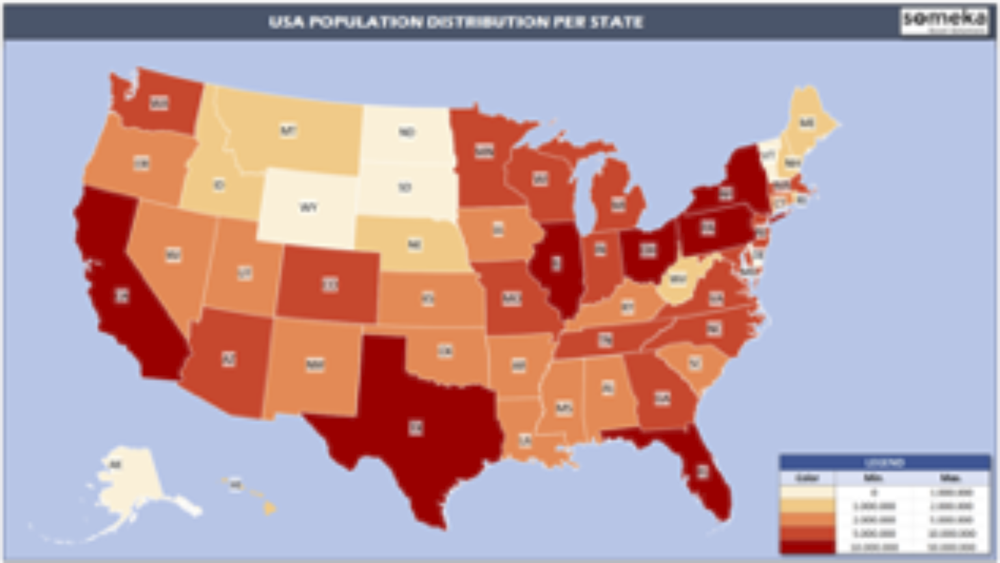
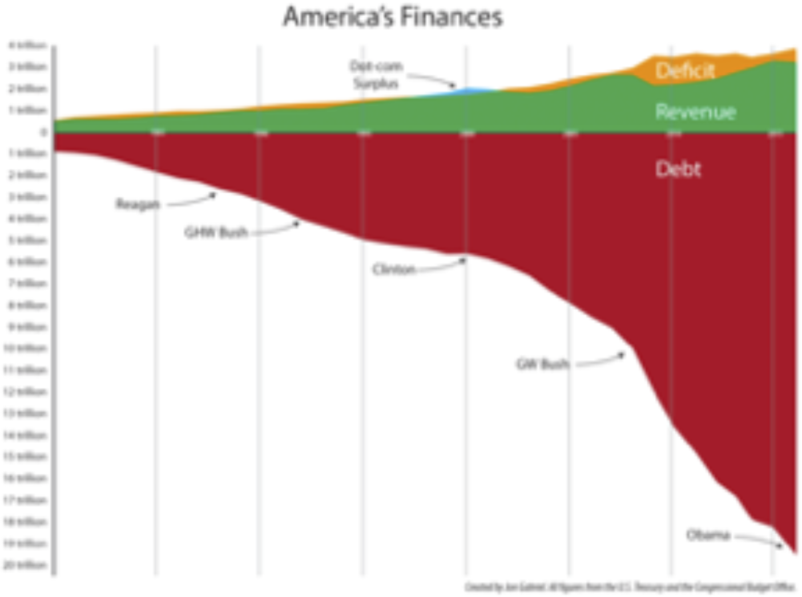
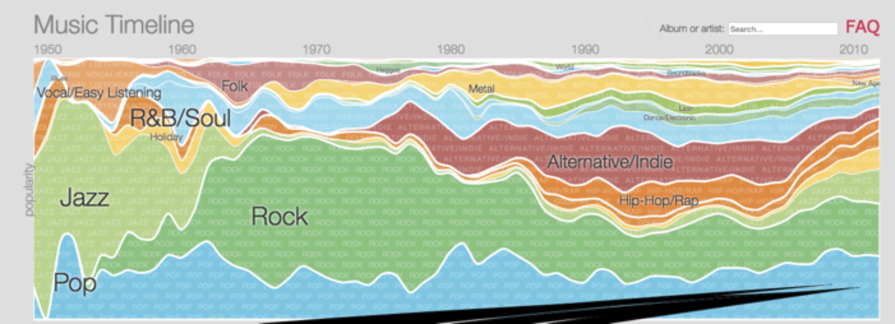
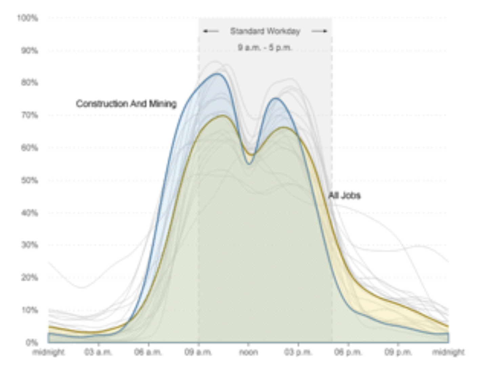
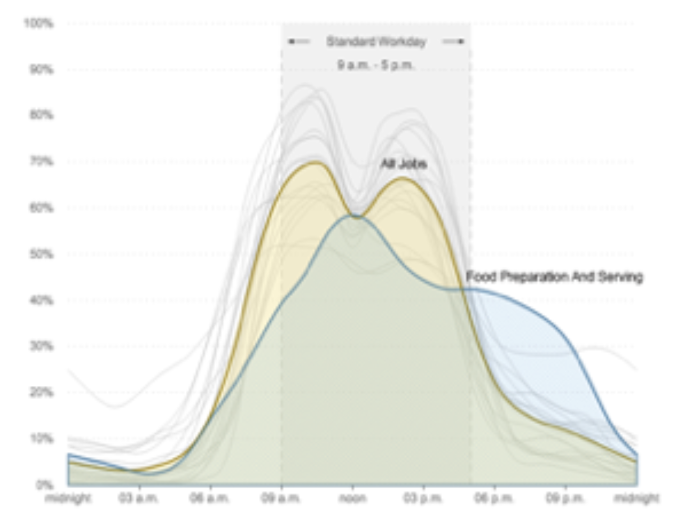
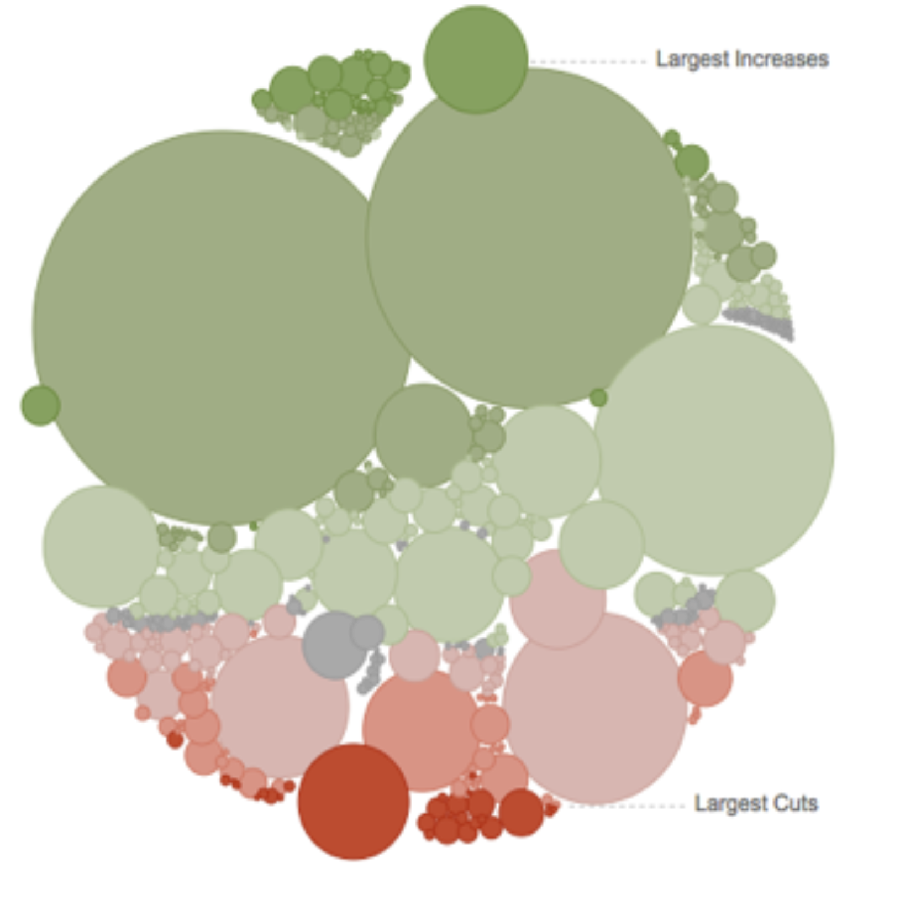

# Data Science

---

## What is "Data Science"?

 *  **Question for the class:** What comes to your mind when you hear the term "Data Science"?

Notes:

---

## What is 'Data Science'

 * From Mike Conway: A practice spanning multiple disciplines

<!-- {"left" : 2.86, "top" : 2.41, "height" : 4.25, "width" : 4.54} -->

Notes:

http://drewconway.com/zia/2013/3/26/the-data-science-venn-diagram

---

## What Is Data Science?

 * "Data-driven application development"

 * A new breed of discipline fueled by

     - Big data  (we have lot more data these days)

     - Lot of intelligence can be mined from this data

     - Technology revolutions like Hadoop & NoSQL that enabled Big Data processing possible

 * Involves multiple disciplines

     - Computer Science

     - Statistics etc.

 * "**More (quality) data** usually beats **better algorithms**"

 * Jeff Hammerbacher invented the term in 2012 while at Facebook

Notes:

https://www.linkedin.com/in/jhammerb/
https://en.wikipedia.org/wiki/Jeff_Hammerbacher

---

## Who is "Data Scientist"?

 *  **Question for the class:** What comes to your mind when you think of "Data Scientist"?

<!-- {"left" : 1.02, "top" : 3.3, "height" : 3.94, "width" : 8.21} -->

Notes:

---

## Who is "Data Scientist"?

 *  **Question for the class:** What comes to your mind when you hear the term "Data Science"?

Notes:

---

## So Here Is Data Scientist

<!-- {"left" : 1.03, "top" : 2.16, "height" : 4.74, "width" : 8.2} -->

Notes:

---

## Data Scientist Profile

<!-- {"left" : 1.47, "top" : 1.98, "height" : 5.69, "width" : 7.31} -->

Notes:

Image from "Doing Data Science"

---

## Class Exercise: Asses Your Data Scientist Profile

 *  **Overview:** You are going to asses your DS profile

 *  **Instructions:**

     - Instructor will provide 'Data-Scientist-Skill-Matrix'  Excel file

     - Download it and enter your scores.

Notes:

---

## Visualizations

 * How you tell the results - Very very important part!!

 * Good visualizations convey the point to the audience.

 * A good data scientist must learn good visualization techniques.

 * Standard graphs: line, bar, pie, ...

 * Modern visualizations: Heat maps, Animations (D3JS etc.)

<!-- {"left" : 0.69, "top" : 5.14, "height" : 2.54, "width" : 4.5} --> &nbsp; &nbsp; <!-- {"left" : 5.76, "top" : 5, "height" : 2.83, "width" : 3.8} -->

Notes:

US population heatmap : https://www.someka.net/excel-template/usa-heat-map-generator/
National debt visualization: https://ricochet.com/archives/problem-no-one-dc-wants-talk/

---

## Visualizations Demo: Google Music Trends

<!-- {"left" : 0.46, "top" : 2.84, "height" : 3.38, "width" : 9.34} -->

Notes:

http://research.google.com/bigpicture/music/

---

## Visualizations Demo: American Workday

<!-- {"left" : 0.65, "top" : 3.21, "height" : 3.22, "width" : 4.2} --> &nbsp; &nbsp; <!-- {"left" : 5.4, "top" : 3.21, "height" : 3.22, "width" : 4.2} -->

 * [Link to NPR story](https://www.npr.org/sections/money/2014/08/27/343415569/whos-in-the-office-the-american-workday-in-one-graph?/templates/story/story_php=)

Notes:

https://www.npr.org/sections/money/2014/08/27/343415569/whos-in-the-office-the-american-workday-in-one-graph?/templates/story/story_php=

---

## Visualizations Demo: National Debt Visualized

 * [Link to Demonocracy](http://demonocracy.info/infographics/usa/us_debt/us_debt.html)

<!-- {"left" : 1.02, "top" : 2.14, "height" : 5.36, "width" : 8.21} -->

Notes:

http://demonocracy.info/infographics/usa/us_debt/us_debt.html

---

## Visualizations Demo: US Budget

<!-- {"left" : 2.63, "top" : 1.23, "height" : 5.05, "width" : 5} -->

 * [Link to NYTimes article](https://archive.nytimes.com/www.nytimes.com/interactive/2012/02/13/us/politics/2013-budget-proposal-graphic.html)

Notes:

https://archive.nytimes.com/www.nytimes.com/interactive/2012/02/13/us/politics/2013-budget-proposal-graphic.html

---

## Visualizations Tools

| Eco system 	| Package    	| Description                                                                     	|
|------------	|------------	|---------------------------------------------------------------------------------	|
| Python     	| Matplotlib 	| - Powerful, portable  - Very versatile and capable Default library for many tools 	|
|            	| Seaborn    	| - Higher level API based on Matplotlib  - Stylish graphs by default                	|
|            	| Bokeh      	| - Streaming data  - Interactive, web ready plots                                   	|
|            	| Plotly     	| - Online and python  - Interactive graphs                                          	|
| JavaScript 	| D3         	| - online, web ready  - Interactive                                                 	|
| R          	| Ggplot2    	| - powerful, very capable  - Can be complex                                         	|
|            	| GgVis      	| -  Web ready graphs                                                               	|

<!-- {"left" : 0.25, "top" : 1.65, "height" : 4.38, "width" : 9.75, "columnwidth" : [2.01, 2.26, 5.48]} -->

Notes:

---

## 4.5 - Experiment to Production ('Mind the Gap')

 * Data Scientists develop their models on laptops with small data
 * There is a 'deployment gap' when it comes time to go to production
 * Solutions:
     - Frameworks like Spark are solving this
     - Cloud vendors are providing solution

<!-- {"left" : 1.3, "top" : 4.78, "height" : 3.86, "width" : 7.65} -->

Notes:

---
## Streamlining Prototyping --> deploy

 * Language neutral

 * Same model - no need to re-implement

 * Fast deploy!

<!-- {"left" : 1.63, "top" : 3.18, "height" : 5.12, "width" : 6.99} -->

Notes:

https://www.slideshare.net/julesdamji/apache-spark-mllib-2x-how-to-productionize-your-machine-learning-models

---
