# AI for Image Processing

---

## Objectives

* Understand images
* Learn algorithms for image processing

---

# Image Recognition

---

## Image Recognition is a Challenging Problem

 <!-- {"left" : 10.56, "top" : 1.89, "height" : 5.01, "width" : 6.45} -->

 * [IBM's Deep Blue supercomputer](https://en.wikipedia.org/wiki/Deep_Blue_(chess_computer)) beat the chess world champion Garry Kasparov back in 1996

 * But not until recently (2010) or so, computers were unable to recognize a cat or a dog from an image

 * Human brains can do image recognition quite 'effortlessly'

 * How ever for computers this is hard
    - Large number of features
    - Features can vary considerably
    - Large Images especially difficult

Notes:
- https://en.wikipedia.org/wiki/Deep_Blue_(chess_computer)
- https://www.ibm.com/ibm/history/ibm100/us/en/icons/deepblue/

---

# Dealing With Images

---
## Representing Images

- Images can be represented as a 2D array

- Here is a 5x5 (5 pixels wide, 5 pixels high) image

- for black and white images:
    - black = 0
    - white = 1

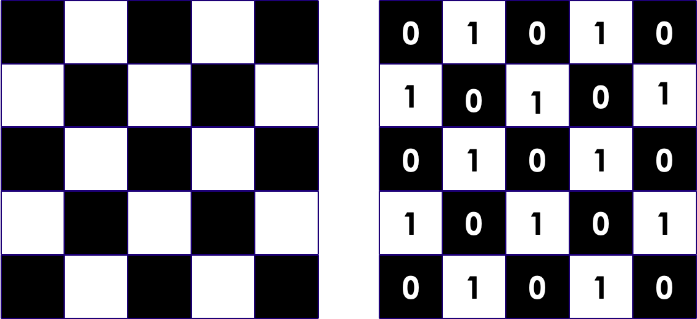<!-- {"left" : 3.65, "top" : 5.92, "height" : 4.68, "width" : 10.19} -->

---

## Greyscale Images

- Pixels are represented as numbers ranging from 0 - 255
    - 0: black
    - 255: white
    - in between: grey

<!-- {"left" : 2.89, "top" : 4.89, "height" : 5.97, "width" : 11.72} -->

---

## Color Images

- In color images, each pixel has colors
    - These are represented as RGB (Red, Green, Blue) colors

- Each RGB values are represented as numbers ranging 0-255

<!-- {"left" : 1.89, "top" : 5.43, "height" : 3.75, "width" : 13.71} -->

---

## Color Images

- Each pixel has 3 'channels' (RGB)

- Color images can be represented as 3D array

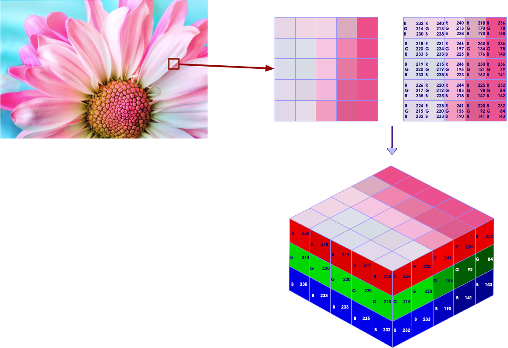<!-- {"left" : 3.78, "top" : 4.03, "height" : 6.8, "width" : 9.94} -->

---

## Channels in Images

- Images could contain more channels than usual RGB
    - For example, satellite images might have infrared spectrum

- Here is an example of Hubble image taken using multiple cameras in multiple wave lengths, combined together

<!-- {"left" : 10.33, "top" : 2.2, "height" : 5.15, "width" : 6.87} -->

Notes:  
source : https://photographingspace.com/ap-color/

---

# Image Analysis Using Neural Networks

---

## Fully Connected Network's Limitations

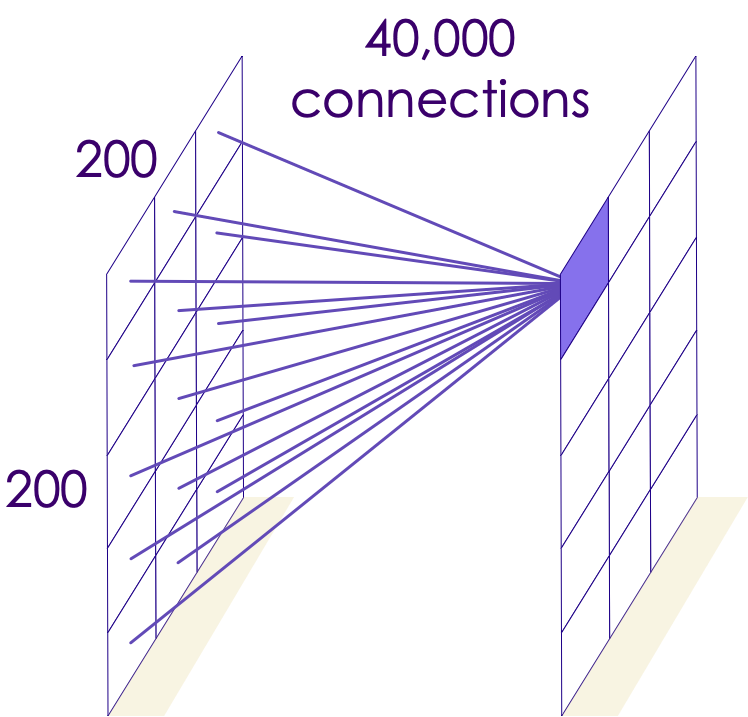<!-- {"left" : 10.39, "top" : 2.39, "height" : 6.49, "width" : 6.77} -->

- Assume we are analyzing a 200px by 200px image
    - Image has 40,000 (200x200) pixels

- If we connect each neuron on second layer to a neuron in the first layer, each neuron will have 40,000 connections

---

## Fully Connected Network's Limitations

<!-- {"left" : 4.16, "top" : 6.45, "height" : 3.67, "width" : 4.15} --> &nbsp; &nbsp; <!-- {"left" : 9.2, "top" : 6.45, "height" : 3.67, "width" : 4.15} -->

- The second layer will have  
    - 40,000 connections per pixels x (200 px x 200 px) = 1.6 billion connections
    - 10 layers ==>  16 billion connections
- That is way too many connections

---

## Fully Connected Network's Limitations

* Each layer has 1.6 billion  connections; and that many weights to learn
* How ever, a 200px x 200px image is very small!
* 4K picture is ~ 4000 x 2000 pixels (see picture below, credit [wikimedia](https://commons.wikimedia.org/wiki/File:8K,_4K,_2K,_UHD,_HD,_SD.png))
* Can you compute how many weights we will need to compute for a 4K image?
* **Quiz**: Take a picture with your phone.  What is the size? (probably 3000 x 2000 pixels)
* __So we need a another approach__

<!-- {"left" : 4.93, "top" : 7.22, "height" : 4.36, "width" : 7.64} -->

---

## Famous 'Cat Experiment'

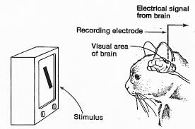<!-- {"left" : 11.71, "top" : 2.37, "height" : 3.48, "width" : 5.24} -->

* David H. Hubel and Torsten Wiesel performed experiments on cats (1958/1959) that gave us crucial understanding of brain's visual cortex.  ([paper](https://physoc.onlinelibrary.wiley.com/doi/pdf/10.1113/jphysiol.1959.sp006308))

* They hooked up electrodes to a cat's brain (cat is sedated of course!)

* Showed different shapes (dots / lines ..etc) and looked for 'neurons firing'

* But they couldn't get neurons to fire!

* Until they accidentally dragged the shape  across the screen,  then neurons fired!

* Authors won the Nobel Prize in Physiology or Medicine in 1981 for their work!

Notes:  
- https://www.princeton.edu/~cggross/Hubel.pdf
- https://www.ncbi.nlm.nih.gov/pmc/articles/PMC2718241/

---

## Our Visual Cortex is Hierarchical

<!-- {"left" : 9.75, "top" : 1.96, "height" : 2.4, "width" : 7.26} -->

* First level neurons detect simple shapes

* Next level neurons detect more complex shapes, and so on

 

<!-- {"left" : 4.69, "top" : 6.52, "height" : 4.19, "width" : 8.13} -->

[Link to video](https://www.youtube.com/watch?v=IOHayh06LJ4)

---

## Hierarchical Visual Cortex

- Our brain's visual system works hierarchically to perceive images

- Some neurons only recognize horizontal lines, some only slanted lines

- Higher level neurons can 'build on' the work done by other neurons

- In the image below, left to right, visual cortex is perceiving 'higher features'
    - Lower level neurons, visualize simple features like lines and shapes
    - Higher level neurons recognize complex shapes

<!-- {"left" : 2.06, "top" : 7.29, "height" : 3.2, "width" : 13.39} -->

---

# Filters

---

## Pre-Processing Images

  <!-- {"left" : 10.8, "top" : 2.25, "height" : 3.99, "width" : 6.01} -->

  * Image processing is a standard task for machine learning

  * Before we load the images, we can use Photoshop, OpenCV to "clean up" the image
    - remove noise
    - find edges
    - etc

  * Even now, this is a common task to help get better results.

  * This is  *feature engineering*  
  (Example image, with background blurred)

---
## Image Filter Examples

- Some sample filters
    - Blur filter
    - Sharpen filter
    - Edge detection filter

<!-- {"left" : 4.49, "top" : 4.96, "height" : 5.75, "width" : 8.53} -->

---

## Problems with Image Pre-Processing

  * How do we *know* that one filter will help us
    - Takes a lot of experience!
    - In some cases it might **hurt** rather than help.

  * Lots of trial and error!

  * What if...
    - Maybe there was a way we could find a filter that gives us better results for sure.
    - Could we automate finding the perfect filter?
    - Maybe if we used more than one filter?

---

# Convolutions

---

## A Little History: Yann LeCun

  * Yann LeCun was working on the problem of recognizing digits: MNIST
    - Recognize zip codes in letters for US Postal Service
    - Recognize digits in bank checks

  * Classical MLP networks were unable to get very high accuracy on the problem.
    - 96,97% was the best such networks could do.
    - LeCun proposed a new architecture that could be over 99% better.
    - The difference between 96% and 99+% is a big deal!

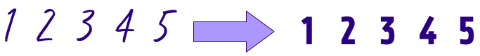<!-- {"left" : 1.1, "top" : 8.01, "height" : 1.82, "width" : 15.3} -->

---

## A Little History: Yann LeCun

  * LeCun's new architecture is called LeNet ([1998 paper](http://yann.lecun.com/exdb/publis/pdf/lecun-01a.pdf))
    - Named after himself!
    - LeNet became the basis of a transfer learning architecture (we will discuss later)

  * Lecun's architecture had 2 new elements
    - Convolutional layer
    - Pooling layer

Notes:  

---

## Convolution

* Imagine a small patch being slid across the input image. This sliding is called  **convolving** .

* It is similar to a flashlight moving from the top left end progressively scanning the entire image. This patch is called the  **filter/kernel**. The area under the filter is the receptive field.

<!-- {"left" : 2.61, "top" : 5.94, "height" : 4.86, "width" : 4.86} -->   &nbsp; &nbsp;  <!-- {"left" : 9.64, "top" : 5.94, "height" : 4.86, "width" : 5.25} -->

---

## Convolution Example: Edge Detection

* Here we are applying an edge filter to an image

* The resulting image has edges 'highlighted'

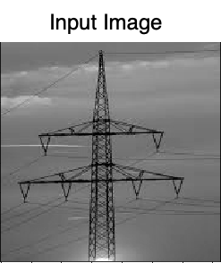 <!-- {"left" : 2.94, "top" : 4.14, "height" : 4.61, "width" : 3.88} -->

 <!-- {"left" : 7.59, "top" : 6.22, "height" : 2.67, "width" : 2.56} -->

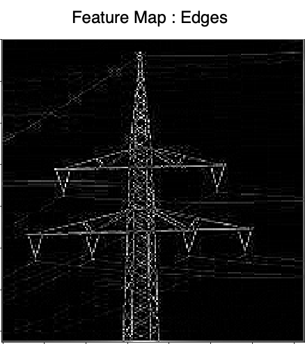 <!-- {"left" : 10.93, "top" : 4.28, "height" : 4.61, "width" : 4.1} -->

---
## Convolution Example: Vertical Edges Detection

* The resulting image has vertical edges highlighted

<!-- {"left" : 2.94, "top" : 4.14, "height" : 4.61, "width" : 3.88} -->

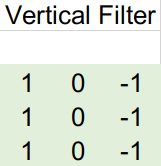 <!-- {"left" : 7.59, "top" : 6.22, "height" : 2.67, "width" : 2.56} -->

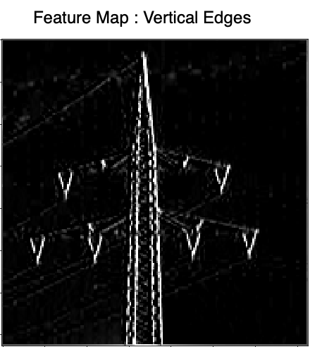 <!-- {"left" : 10.93, "top" : 4.28, "height" : 4.61, "width" : 4.1} -->

---

## Convolution Example: Horizontal Edges Detection

* The resulting image has horizontal edges highlighted

 <!-- {"left" : 2.94, "top" : 4.14, "height" : 4.61, "width" : 3.88} -->

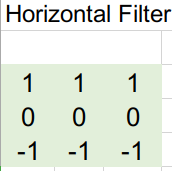 <!-- {"left" : 7.59, "top" : 6.22, "height" : 2.67, "width" : 2.56} -->

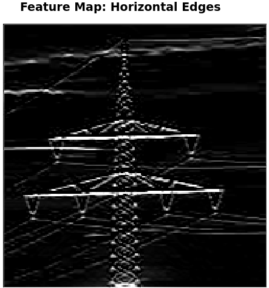 <!-- {"left" : 10.93, "top" : 4.28, "height" : 4.61, "width" : 4.1} -->

---

## Convolution Example: Edges

 <!-- {"left" : 4.2, "top" : 2.14, "height" : 2.87, "width" : 2.41} -->

 <!-- {"left" : 7.57, "top" : 2.57, "height" : 2.4, "width" : 2.41} -->

 <!-- {"left" : 10.75, "top" : 2.14, "height" : 2.87, "width" : 2.55} -->

 <!-- {"left" : 4.26, "top" : 5.33, "height" : 2.87, "width" : 2.41} -->

 <!-- {"left" : 7.62, "top" : 5.78, "height" : 2.39, "width" : 2.31} -->

 <!-- {"left" : 10.76, "top" : 5.33, "height" : 2.87, "width" : 2.57} -->

 <!-- {"left" : 4.2, "top" : 8.52, "height" : 2.93, "width" : 2.46} -->

 <!-- {"left" : 7.63, "top" : 9.03, "height" : 2.39, "width" : 2.29} -->

 <!-- {"left" : 10.69, "top" : 8.52, "height" : 2.93, "width" : 2.74} -->

---

## Learning Features

* Here we are analyzing a picture of elephant

* Assume each neuron is 'trained' recognize a certain feature (like ears / trunks / tail ..etc)

* As we scan through the image, the neurons will **'recognize the features'**

* And putting their findings together, we can conclude that we are seeing an elephant

<!-- {"left" : 3.25, "top" : 5.74, "height" : 5.11, "width" : 11} -->

---

## Learning Features

 <!-- {"left" : 11.35, "top" : 1.89, "height" : 7.52, "width" : 5.69} -->

- Each layer builds on previous layer's work

- First layer detects simple shapes - horizontal lines, slanted lines ..etc

- Second layer recognizes more complex features: eyes / nose ..etc

- Third layer recognizes faces

---

## Convolutional Layer

<!-- {"left" : 13.9, "top" : 2.2, "height" : 3.3, "width" : 3.4} -->

- Here we represent our neurons in a 2D grid format (instead of linear before), this makes visualizing connections easier

- Neurons in the convolutional layer are NOT connected to every single neuron in the layer before

- Instead each neuron is connected to a few pixels/neurons in their **receptive field**
    * The idea is to detect local features in a smaller section of the input space, section by section to eventually cover the entire image.

- This allows the first convolutional layer to concentrate on low level features

- Next layers assemble inputs from previous layers into higher level features

---

## Convolutional Process

* Here we see that in second layer, the neurons only read from a few neurons from previous layer

* They read from their 'field of view'

 <!-- {"left" : 1.91, "top" : 5.49, "height" : 2.72, "width" : 2.81} --> &nbsp; &nbsp;  <!-- {"left" : 5.59, "top" : 5.49, "height" : 2.72, "width" : 2.65} --> &nbsp; &nbsp;  <!-- {"left" : 9.29, "top" : 5.49, "height" : 2.72, "width" : 2.64} --> &nbsp; &nbsp; 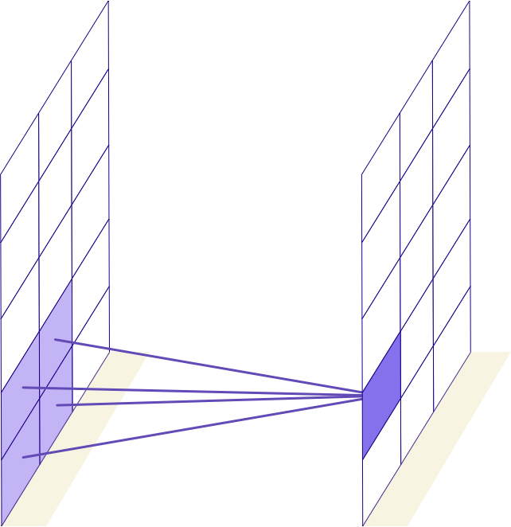<!-- {"left" : 12.95, "top" : 5.49, "height" : 2.72, "width" : 2.64} -->

---
## Fully Connected vs. Convolutional

<!-- {"left" : 6.65, "top" : 2.85, "height" : 4.14, "width" : 4.18} -->

 <!-- {"left" : 2.64, "top" : 7.91, "height" : 2.43, "width" : 2.51} --> &nbsp; &nbsp;  <!-- {"left" : 5.93, "top" : 7.91, "height" : 2.43, "width" : 2.37} --> &nbsp; &nbsp;  <!-- {"left" : 9.23, "top" : 7.91, "height" : 2.43, "width" : 2.36} --> &nbsp; &nbsp; <!-- {"left" : 12.51, "top" : 7.91, "height" : 2.43, "width" : 2.36} -->

Notes:

---

## Fully Connected vs. Convolutional

<!-- {"left" : 13.7, "top" : 1.89, "height" : 3.39, "width" : 3.29} -->

<!-- {"left" : 13.7, "top" : 5.65, "height" : 3.39, "width" : 3.29} -->

* Fully connected layers connect to every neuron from previous layer
    - This results in too many connections

* But in convolutional layers, the number of connections is greatly reduced
    - Makes computationally feasible

---

## Convolutions: Further Reading

* [Tutorial on convolutions](https://www.youtube.com/watch?v=XuD4C8vJzEQ&list=PLkDaE6sCZn6Gl29AoE31iwdVwSG-KnDzF&index=2) by Andrew Ng

* [Tutorial on padding](https://www.youtube.com/watch?v=smHa2442Ah4&list=PLkDaE6sCZn6Gl29AoE31iwdVwSG-KnDzF&index=4) by Andrew Ng

* [Tutorial on strides](https://www.youtube.com/watch?v=tQYZaDn_kSg&list=PLkDaE6sCZn6Gl29AoE31iwdVwSG-KnDzF&index=5) by Andrew Ng

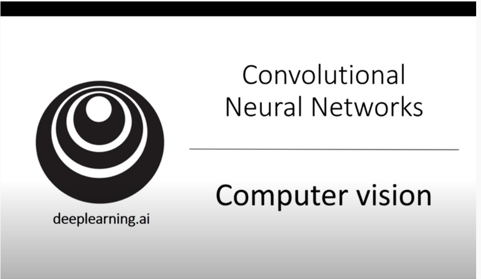 <!-- {"left" : 4.12, "top" : 5.11, "height" : 5.39, "width" : 9.27} -->

---

## Pooling Technique

- Images can be fairly large, processing large images can be computationally intensive

- **Pooling**  is used to subsample (i.e., shrink) the input image, while **keeping important features intact**

- Reduces the computational load, reduce memory usage, and reduce the number of parameters (limits overfitting)

- Here we are shrinking the picture, while still keeping the prominent feature (lighthouse)

<!-- {"left" : 2.59, "top" : 7.36, "height" : 3.19, "width" : 4.78} --> &nbsp; &nbsp; <!-- {"left" : 8.51, "top" : 7.94, "height" : 2.31, "width" : 2.31} --> &nbsp; &nbsp; <!-- {"left" : 11.69, "top" : 8.02, "height" : 2.13, "width" : 3.21} -->

---

## Pooling Example

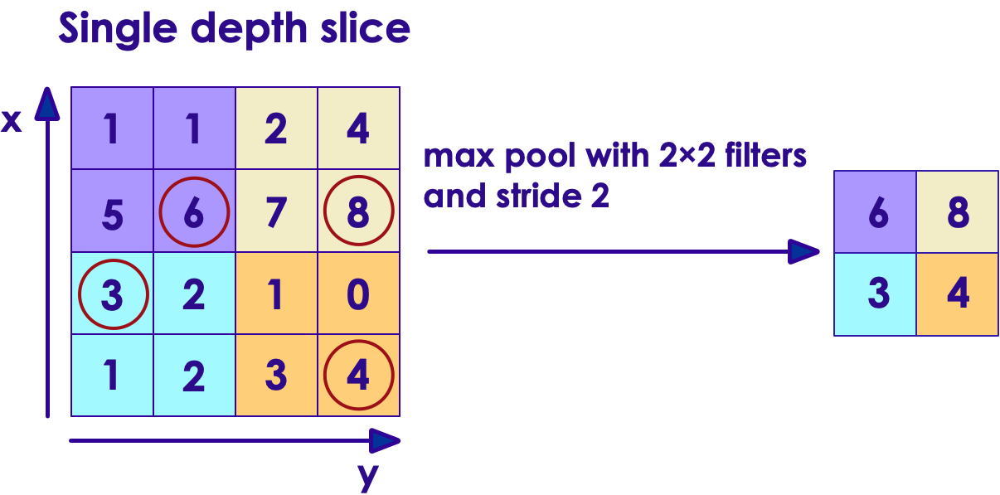 <!-- {"left" : 9.2, "top" : 1.89, "height" : 3.81, "width" : 7.88} -->

* Here is an example of **MAX pooling**

* We pick the 'max value for each pixel window'

* Here input is shrunk by factor of 4 to 1.  so the resulting image is 25% of original image

 

<!-- {"left" : 3.93, "top" : 8.3, "height" : 2.5, "width" : 3.74} --> &nbsp; &nbsp; <!-- {"left" : 8.56, "top" : 8.75, "height" : 1.81, "width" : 1.81} --> &nbsp; &nbsp; <!-- {"left" : 11.06, "top" : 8.82, "height" : 1.67, "width" : 2.52} -->

Notes:

---

## Example Convolutional Network

- Here we have repeating layers of convolutional and pooling layers

- And a final Softmax layer is giving the probabilities of the image class

<!-- {"left" : 3.78, "top" : 5.09, "height" : 4.77, "width" : 9.93} -->

Notes:

---

## Training CNNs

* Training CNNs can be computationally intensive!  Because there are lot weights to be computed

* GPUs really excel here

* **Animation**: [link-S3](https://elephantscale-public.s3.amazonaws.com/media/machine-learning/neural-networks-animation-1.mp4), [link-youtube](https://youtu.be/sLsCN9ZL9RI)

 <!-- {"left" : 2.71, "top" : 4.96, "height" : 5.09, "width" : 12.07} -->

---

## Augmenting Iamges for Stronger Training

* When we train the network, we want to use diverse set of images.  This way network can get 'stronger'

* We slightly augment the images during training (e.g. rotate, flip, zoom in/out ..etc)

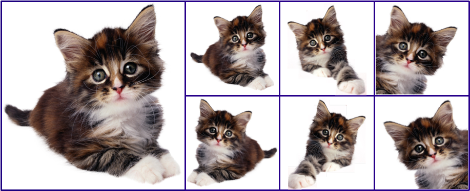 <!-- {"left" : 3.5, "top" : 5.21, "height" : 4.29, "width" : 10.51} -->

---

# Popular CNN Architectures

---

##  Popular CNN Architectures

 <!-- {"left" : 4.04, "top" : 2.14, "height" : 3.85, "width" : 9.43} -->

* References:
  - [Illustrated: 10 CNN Architectures](https://towardsdatascience.com/illustrated-10-cnn-architectures-95d78ace614d)
  - ["Programming PyTorch for Deep Learning" book  Chapter 03](https://learning.oreilly.com/library/view/programming-pytorch-for/9781492045342/ch03.html#convolutional-neural-networks)

---

## Popular CNN Models

| Year | Name                     | Created By   | Layers | Parameters  | Description                                                                                             |
|------|--------------------------|--------------|--------|-------------|---------------------------------------------------------------------------------------------------------|
| 1998 | LeNet                    | Yann Lecun   | 5      | 60,000      | Simple, but basic template for CNN architecture                                                         |
| 2012 | AlexNet                  | Hinton et al | 8      | 60 million  | Dominated ImageNet Challenge in 2012.  Ignited the NeuralNet boom.  Introduced ReLU activation function |
| 2014 | VGG-16                   | Oxford Uni   | 19     | 138 million | 2014 ImageNet 2nd place. Introduced deeper network (twice as deep as AlexNet)                                                    |
| 2014 | Inception V1 (GoogLeNet) | Google       | 22     | 7 million   | Won 2014 ImageNet competition.  Introduced Inception model of using dense modules/blocks                |
| 2015 | Inception V3             | Google       | 42     | 24 million  | 2015 ImageNet runner up.  Introduced batch normalization technique                                      |
| 2015 | ResNet-50                | Microsoft    | 150    | 26 million  | 2015 ImageNet winner.  Went way deeper than previous models                                             |
| 2016 | Xception                 | Keras Team   |        | 23 million  | Extension of Inception model                                                                            |
| 2016 | Inception V4             | Google       |        | 43 million  | Updated from previous Inception v3                                                                      |
| 2016 | Inception-ResNet-V2      | Google       |        | 56 million  | A merge of Inception and ResNet                                                                         |

<!-- {"left" : 0.41, "top" : 1.81, "height" : 1, "width" : 16.69, "columnwidth" : [1.85, 2.05, 2.18, 1.67, 2.37, 6.57]} -->

---

## LeNet (1998)

* The 'OG' of CNNs

* Created by Yann LeCun

* Handwritten digits / MNIST type data (10 classes)
  - To identify Zipcodes for USPS

* 28x28x1 monochrome images

* Revolutionary in its time
  - Mostly constrained by resources of the day

 <!-- {"left" : 1.83, "top" : 7.11, "height" : 3.41, "width" : 13.84} -->

Notes:

---

## AlexNet (2012)

* AlexNet was an important milestone in CNNs.  It kick-started the latest boom in CNNs

* In 2012 ImageNet competition, it dominated with top-5 error rate is 15.3%,  beating the second place entry with a top-5 error of 26.2%;  Almost a 10% gap

* AlexNet was the blueprint for lot of later architectures

* It introduced `MaxPool` and `DropOut` concepts,  Also introduced `ReLU` activation function

* Applied LeNet to full size RGB images (224x224x3) with 1000 classes.

* References:
  - [ImageNet Classification with Deep Convolutional
Neural Networks - original paper](https://papers.nips.cc/paper/4824-imagenet-classification-with-deep-convolutional-neural-networks.pdf)
  - [Review: AlexNet, CaffeNet — Winner of ILSVRC 2012 (Image Classification)](https://medium.com/coinmonks/paper-review-of-alexnet-caffenet-winner-in-ilsvrc-2012-image-classification-b93598314160)

---

## AlexNet (2012)

 <!-- {"left" : 2.12, "top" : 3.65, "height" : 6.41, "width" : 13.25} -->

---

## Inception V1 / GoogLeNet  (2014)

* 2014 ImageNet winner from Google, introduced a `Inception` concept

* AlexNet had a fixed size kernel;  Inception had various sized kernels
  - So a large kernel can identify a car
  - A smaller kernel can further identify logos ..etc

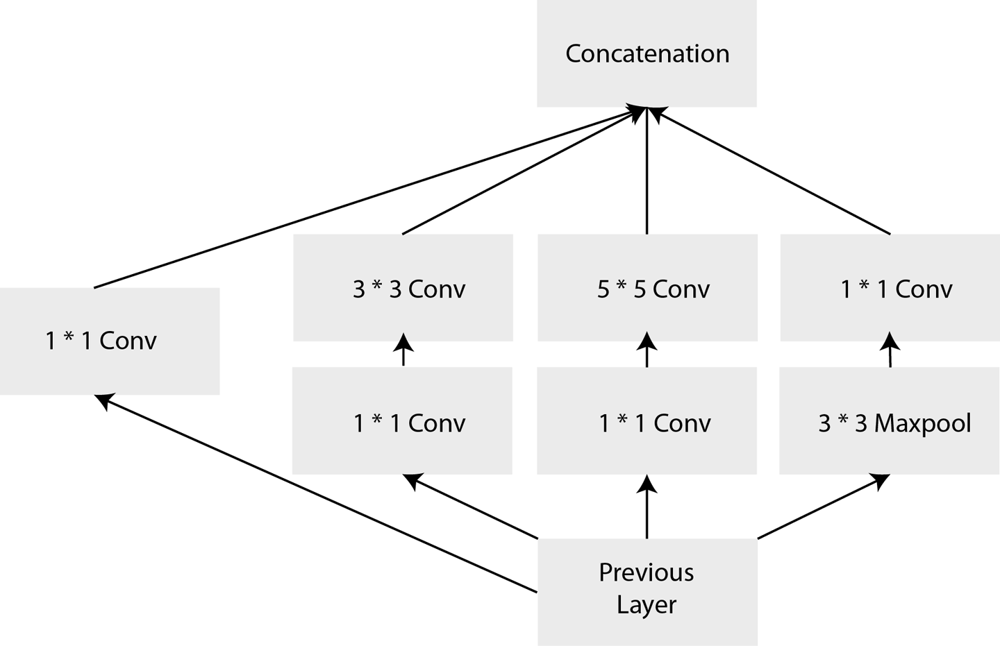 <!-- {"left" : 10.21, "top" : 3.19, "height" : 3.31, "width" : 6.85} -->

* The Inception network runs a series of convolutions of different sizes all on the same input, and concatenates all of the filters together to pass on to the next layer

* Number of layers:22,  
Number of parameters: 5 million

Notes:

Image credit : "Programming PyTorch for Deep Learning"

---

## Inception V1

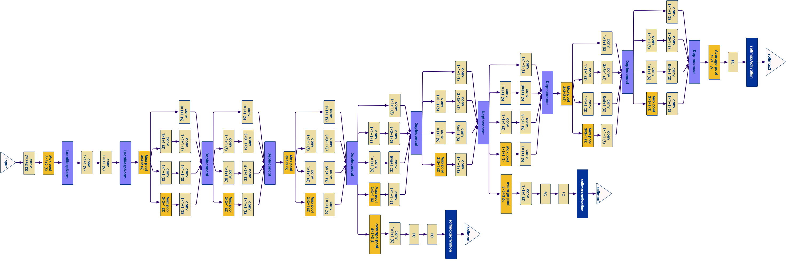 <!-- {"left" : 0.97, "top" : 3.7, "height" : 4.99, "width" : 15.56} -->

Notes:

---

## VGG (2014)

* From University of Oxford—the Visual Geometry Group (VGG)

* Won 2nd place on 2014 ImageNet competition

* It introduced deeper layers (19 layers)

* One downside of VGG is final fully connected layers make the network balloon to a large size, weighing in at 138 million parameters in comparison with GoogLeNet's 7 million

* Despite it's large size, still popular transfer learning architecture

* Number of layers: 19  
Number of parameters: 138 million

---

## VGGNet

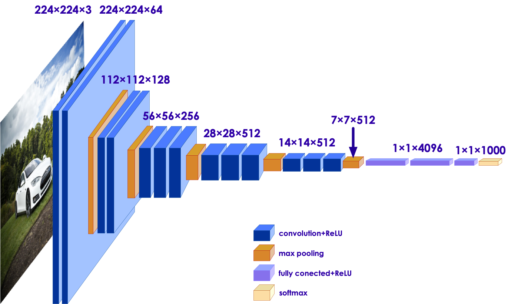 <!-- {"left" : 4.03, "top" : 2.31, "height" : 5.66, "width" : 9.44} -->

 <!-- {"left" : 1.49, "top" : 8.93, "height" : 1.81, "width" : 14.52} -->

Notes:

---

## ResNet (2015)

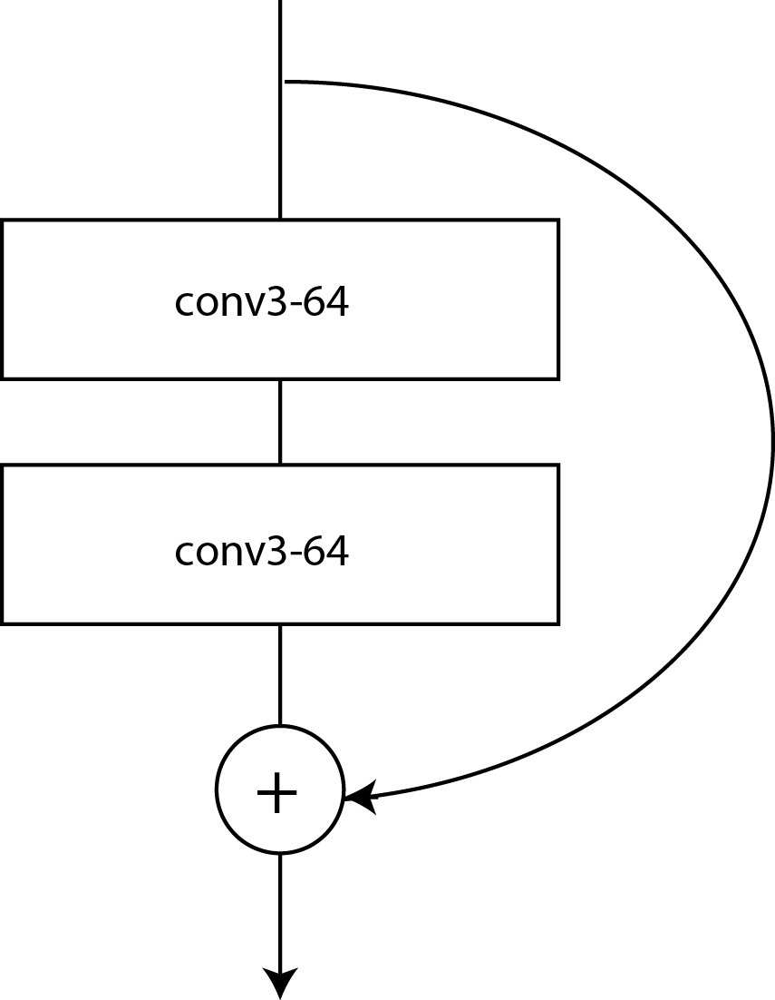 <!-- {"left" : 13.97, "top" : 1.89, "height" : 3.44, "width" : 2.67} -->

* ResNet-152 model from Microsoft is the 2015 ImageNet winner  with top-5 score of 4.49%
* ResNet uses Residual Neural Networks (RNNs); Not feed forward; Both Residual and Convolutional
* ResNet improved on the Inception-style (stacking bundle of layers approach), wherein each bundle performed the usual CNN operations but also added the incoming input to the output of the block
* Number of layers: 150  
Number of parameters: 26 million

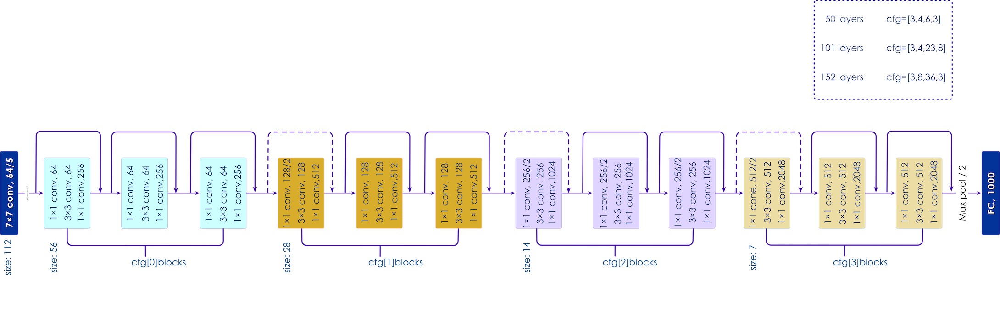 <!-- {"left" : 3.84, "top" : 8.26, "height" : 3.15, "width" : 9.82} -->

Notes:

Image credit : "Programming PyTorch for Deep Learning"

---

## CNN Architectures Comparison

* Inception wins on performance, accuracy, and size of network (number of params)
* ResNet is a close second with some valid use cases.
* Inception and ResNet are often ensembled (combined together).

 <!-- {"left" : 2.09, "top" : 5.55, "height" : 5.43, "width" : 13.31} -->

---

# Image Datasets

[Datasets-Images.md](../../deep-learning/generic/Datasets-Images.md)

---

## Lab/Demo: Image Data Generator

 <!-- {"left" : 12.26, "top" : 1.89, "height" : 5.85, "width" : 4.39} -->

* **Overview:**
    - Learn to use Image Data Generator

* **Approximate run time:**
    - 20-30 mins

* **Instructions:**
    - **IMG2:** image-generator-lab
    - **Instructor** Demo this lab

Notes:

---

## Lab/Demo: Image Classification

  <!-- {"left" : 12.26, "top" : 1.89, "height" : 5.85, "width" : 4.39} -->

* **Overview:**
    - Build an image classifier with real world images

* **Approximate run time:**
    - 30-40 mins

* **Instructions:**
    - **Instructor** Demo these labs
    - CIFAR Images
    - Cats and Dogs classifier

Notes:

---

# Transfer Learning

---

## Transfer Learning Analogy

 <!-- {"left" : 11.14, "top" : 2.12, "height" : 2.74, "width" : 5.99} -->

* Imagine you want to learn how to play the **ukulele**

* If you have no musical background, and you are starting fresh with the ukulele as your very first instrument, it'll take you a few months to get proficient at playing it

* On the other hand, if you are accustomed to playing the **guitar**, it might just take a week, due to how similar the two instruments are

* Taking the learnings from one task and fine-tuning them on a similar task is something we often do in real life.

* The more similar the two tasks are, the easier it is to adapt the learnings from one task to the other.

Notes:

- Image credits : https://pixabay.com/photos/guitar-electric-guitar-2925282/, https://pixabay.com/photos/ukulele-instrument-music-pages-1376516/

---

## Training Large Models is Difficult

 * Large models have many layers (deep models)

 * Deep layers require  **LOTS**  of time and resources to train
    - Many dozens or hundreds of CPUs / GPUs

 * They may require huge amounts of **data** to train
   - Maybe **petabytes** of training data.

 * For example, Google translate model trains on 2 billion+ words on 99+ GPUs for week+

 * What if we don't have that much compute power or don't have that much data?

 * Try to re-use pre-trained models!

---

## Using a Pre-trained Model

 <!-- {"left" : 13.32, "top" : 1.89, "height" : 6.38, "width" : 4.01} -->

 * Despite what you think, your problem is not totally unique
   - Others have worked on it before.
   - Much of their work is useful to you
   - "Stand on the shoulders of giants"

 * Instead of starting from scratch, why not start from a trained model?

 * But how much of the model is reusable?

---

## Reusability of Pre-trained Models

 * In a image classifier neural network, much of the early layers are for extracting features (eyes, ears etc)

 * These features are pretty much the same for most real world use cases

 * So we can re-use the learned knowledge in these layers

 <!-- {"left" : 3.12, "top" : 5.82, "height" : 4.11, "width" : 11.27} -->

Notes:

---
## Reusability of Pre-trained Models

 * The surprise is that a pre-trained model works pretty well!

 * Even if it was trained with data that is totally differently from your data

 * Why is this?
   - Because images are images
   - Words are words
   - etc

---

## Customizing Pre-Trained Models

 * Earlier layers of the pre-trained model are frozen; so their weights do not change during re-training

 * The last few layers can be re-trained

 * We often several `dense` layers to the back end of the network.

 * And then these layers are trained on **our own data**

 * This allows us to customize the model to our data

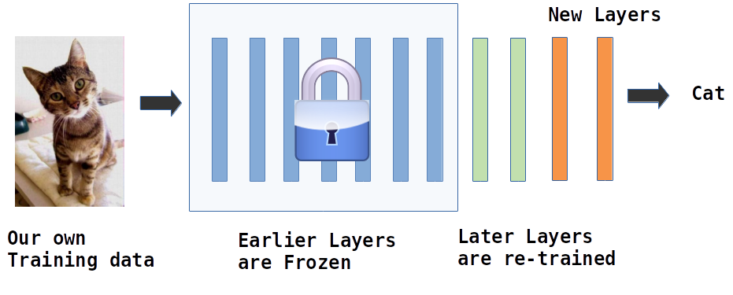 <!-- {"left" : 3.71, "top" : 6.71, "height" : 4.06, "width" : 10.09} -->

Notes:

---

## Transfer Learning Process

* Earlier layers are frozen; so their weights don't change during re-training

* And later layers are re-trained with our own data

 <!-- {"left" : 4.63, "top" : 4.11, "height" : 6.85, "width" : 8.24} -->

---

## Popular Pre-Trained Models

* Explore available models at [modelzoo.co](https://modelzoo.co/)
    - Explore models available for Tensorflow

* **Image Recognition**
  - Inception
  - ResNet

* **Natural Language**
  - Word2Vec
  - BERT

Notes:

---

## Lab: Explore Pre-trained Models

 <!-- {"left" : 12.26, "top" : 1.89, "height" : 5.85, "width" : 4.39} -->

* **Overview:**
    - Explore pre-trained models

* **Approximate run time:**
    - 15 mins

* **Instructions:**
    - **TRANSFER-1:** Explore pre-trained model

Notes:

---

## Lab: Using Pre-trained Models

 <!-- {"left" : 12.26, "top" : 1.89, "height" : 5.85, "width" : 4.39} -->

* **Overview:**
    - Use pre-trained models

* **Approximate run time:**
    - 40 mins

* **Instructions:**
    - **TRANSFER-2:** Using pre-trained model

Notes:

---

## Lab: Re-training a Pre-trained Model

 <!-- {"left" : 12.26, "top" : 1.89, "height" : 5.85, "width" : 4.39} -->

* **Overview:**
    - Customize a pre-trained model

* **Approximate run time:**
    - 40 mins

* **Instructions:**
    - **TRANSFER-3:** Retrain a pre-trained model

Notes:

