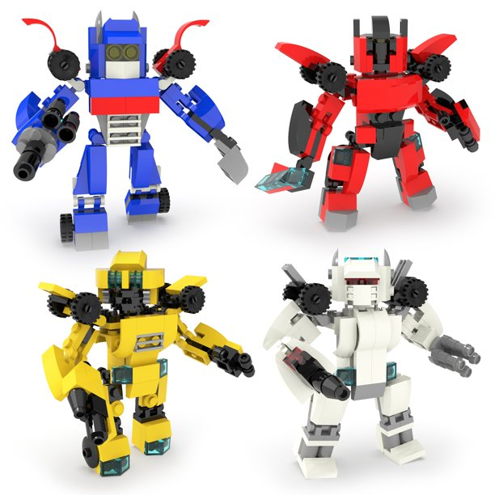

# AI for Text Processing

  <!-- {"left" : 4.19, "top" : 7.75, "height" : 2.6, "width" : 3.91} -->

  <!-- {"left" : 8.75, "top" : 7.75, "height" : 2.6, "width" : 4.56} -->

---

# NLP Intro

[../../ai-nlp/slides/NLP-Intro.md](../../ai-nlp/slides/NLP-Intro.md)

---

## Transformers

 <!-- {"left" : 13.6, "top" : 1.43, "height" : 3.41, "width" : 3.41} -->

 <!-- {"left" : 13.24, "top" : 5.95, "height" : 3.05, "width" : 4.21} -->

* In 2017, in a landmark paper ["Attention is all you need"](https://arxiv.org/abs/1706.03762), researchers from Google, proposed a novel model called **Transformers**

* In 2018, Google [open sourced](https://ai.googleblog.com/2018/11/open-sourcing-bert-state-of-art-pre.html) a state of the art  language model called [BERT (Bidirectional Encoder Representations from Transformers)](https://arxiv.org/abs/1810.04805?source=post_page) based on transformer architecture

* Since then, transformers have taken over NLP world by storm, breaking NLP records and pushing state of the art

* References:
  - Understanding searches better than ever before](https://arxiv.org/abs/1810.04805?source=post_page)
  - [BERT (language model)](https://en.wikipedia.org/wiki/BERT_(language_model))

---

## Lab: Re-training a Pre-trained Model

 <!-- {"left" : 13.01, "top" : 1.89, "height" : 5.38, "width" : 4.04} -->

* **Overview:**
    - Customize a pre-trained model

* **Approximate run time:**
    - 40 mins

* **Instructions:**
    - **TRANSFER-3:** Retrain a pre-trained model

Notes:

