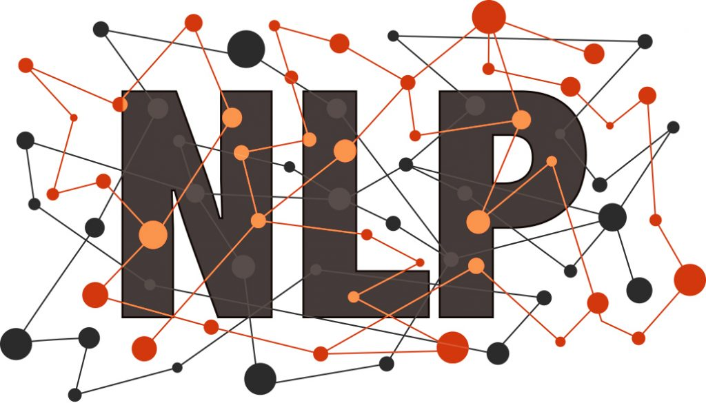

# State of AI NLP

  <!-- {"left" : 4.7, "top" : 6.84, "height" : 2.02, "width" : 3.54} -->

---

## Objectives
* one
* two

---

## Slide

* hello world

Notes:

---

## Slide

* goodbye world

Notes:

---
## Lab: Doing XYZ

<!-- {"left" : 6.76, "top" : 0.88, "height" : 4.37, "width" : 3.28} -->

* **Overview:**
    - Work with xyz

* **Approximate run time:**
    - 20-30 mins

* **Instructions:**
    - Please complete A, B, C

Notes:

---

## Review and Q&A

<!-- {"left" : 8.24, "top" : 1.21, "height" : 1.28, "width" : 1.73} -->

* Let's go over what we have covered so far

* Any questions?

<!-- {"left" : 2.69, "top" : 4.43, "height" : 3.24, "width" : 4.86} -->
