    # AI for Kids
---
## About This Class

* An **AI for Kids**, to be taught in school or learned on your own

* Goals
    - **Fun**
    - **More fun**
    - **Some real knowledge**

* To 
    
    - Arielle, Jeremiah
    - And many others who inspired us
    

Notes:

---

## Prerequisites and Expectations

 * No knowledge is assumed

 * Learning will be computer-based

     - We will need Internet
     - We will be creating accounts on sites like Google and Qwiklabs
     - No credit card will be required

 * Curiosity!

   - Ask a lot of questions

 * This is a AI class
   - No previous knowledge is assumed (but may be helpful)

Notes:

---

# AI for Kids Intro
---

## AI for Kids
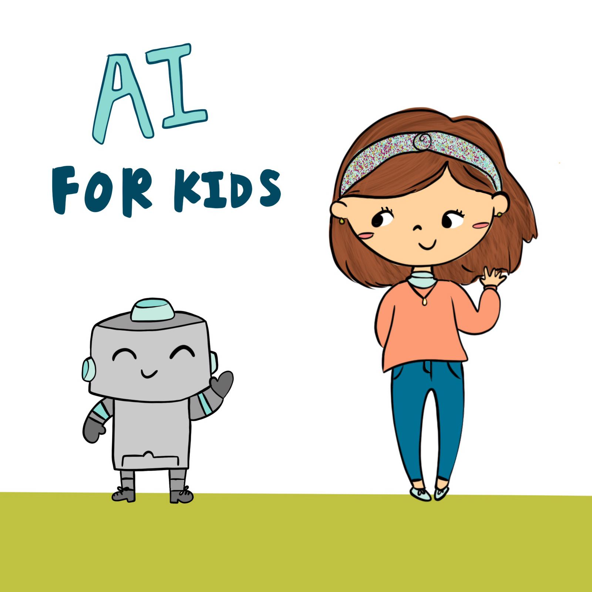

## If All Kids Learn about AI

* They will 
  - Build robots
  - Fly drones
  - Understand books (or letting robots do it)
  - What else can you think of?

---

## Kids Who Do AI Become Popular
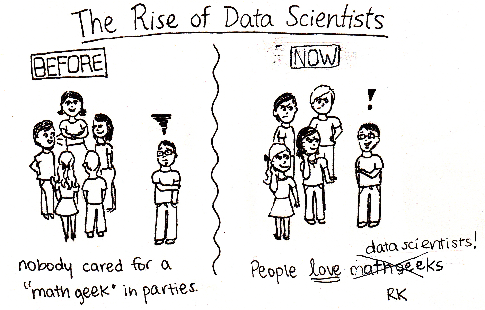

---

## Teaching Assumptions

* 2-3 hours
* 15-30 students
* Internet available (at least for the first runs)
* Ages 9-15

---

## Finland

---

## Invented a Computer
    
* Really, Linux, an operating system
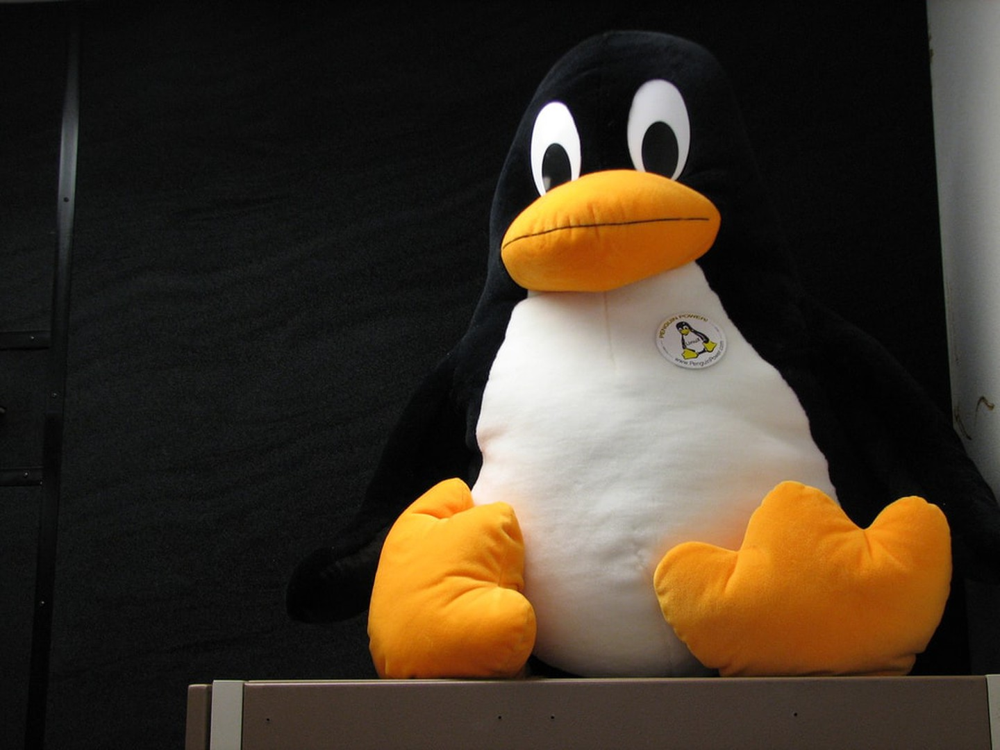

---

## Invented Linux Thorvalds
    
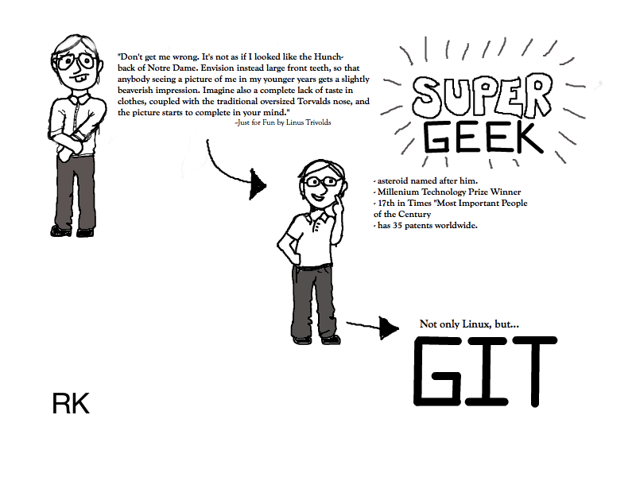

---

## Invented Chat
    
* In 1998, before most of the kids here were born
* Also, invented the first Internet browser
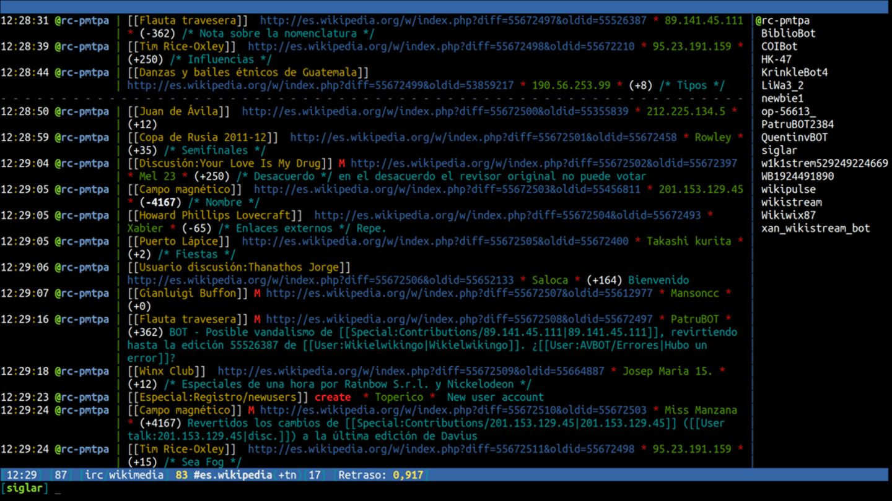

---

## Invented Angry Birds
    
* For that company, it was game number 50!
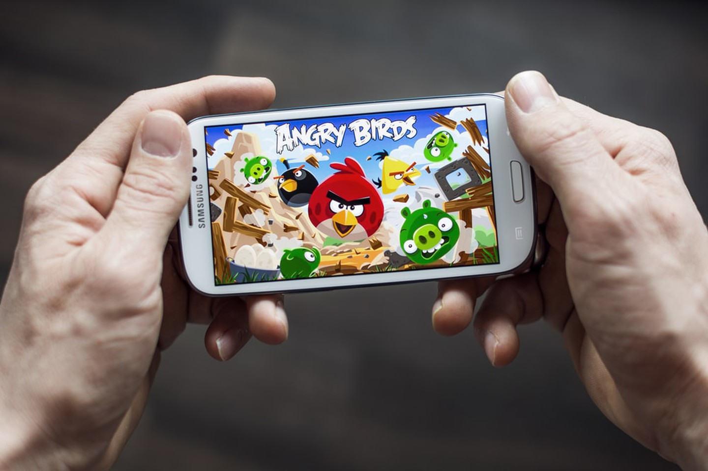

---

## Finland AI
    
* Obsessed with texting
  - Finnish PM ditches his GF with a text ***"That's it!"***    
* Population 5.8 million
* Taught 1% of its population AI a year ago
* Makes its course open and in 24 languages

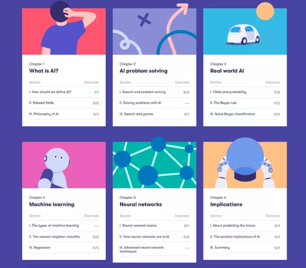

Notes:

https://www.politico.eu/article/finland-one-percent-ai-artificial-intelligence-courses-learning-training/
https://www.elementsofai.com/

---

# Let us do AI!

## Let's Draw

* [Quick Draw](https://quickdraw.withgoogle.com/) works

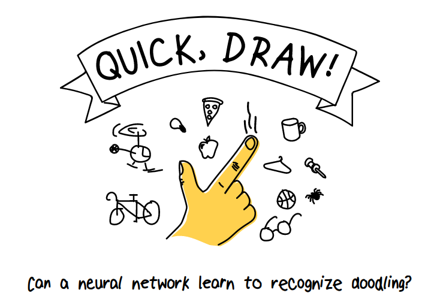

  
---

## Google Stores All Sketches
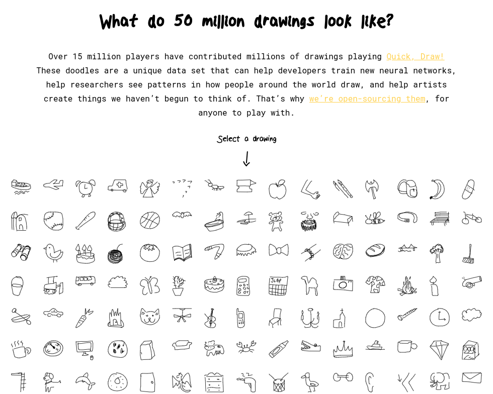

## Many Pictures of an Angel?

---

## Why is Data Important?
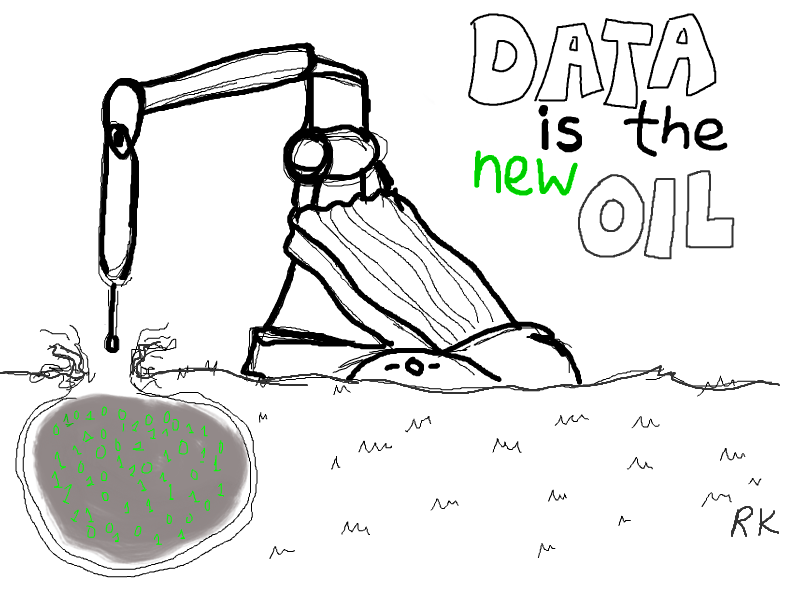

---

## How Does QuickDraw Work?

* Quick Draw selects a shape out of all that it knows
* Asks a person to draw exactly that shapes
* Invokes a software that can recognize this or close shapes
  
## Some Terms: Supervised Learning
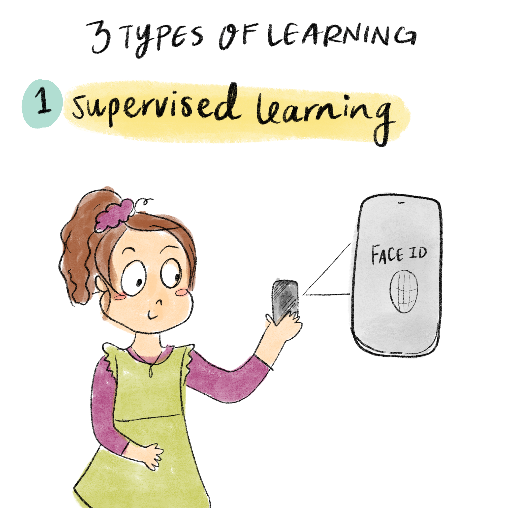

## Neural Networks (Optional)
* Coverage depends upon the level of the students and their interests
* Teacher will explain live ad libitum
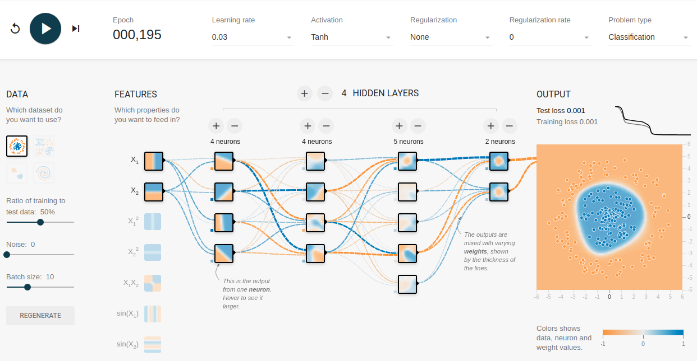
---
  
## Cats vs Dogs

---

## Cats vs Dogs Explained
* The teacher show Cat vs Dogs recognizer
* Let the student create their own recognizer
* Promises to explain how the recognizer works
* Here is a picture of a cat as your reward

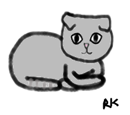

---

## Lab Cats vs Dogs 
* Create a Kaggle account
* Watch how recognizer works
* Create your own with another set of pictures, suggestion:
  - boys vs girls
  - kids vs adults

---

## BERT Trained

* Explain how BERT is trained
  - Send computer to middle and hight school
  - Teach it to understand basic English by 
    - taking some words out of the text
    - then playing with the text to restore the words
    - this is self-supervised learning
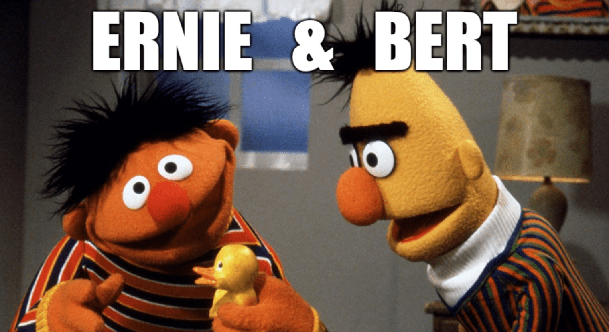
Notes:

* Here is [the link](https://medium.com/syncedreview/baidus-ernie-tops-google-s-bert-in-chinese-nlp-tasks-d6a42b49223d)
---

## BERT Software

* Then finish it up by telling it how to
  - answer questions (Stanford test)
  - guess people's sentiments
  - or any language task

---
  
## NLP lab - Rasa
* Rasa in open source conversations in AI
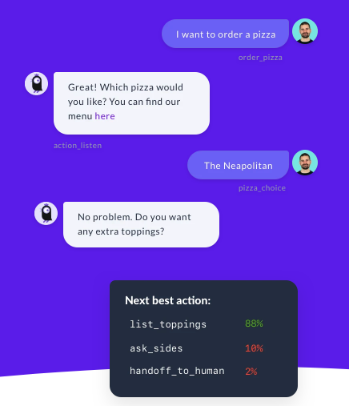
---
 
## NLP lab - BERT
* Sentiment analysis tutorial for movie review
* Run the lab
* Let BERT guess the sentiment of a review
* Add your review
* See what BERT says
---

## Hackathon (Optional)
* Divide into teams
* Give teams names
  - Eagles, Beavers, Little Rock, Houston, etc.
* Come up with ideas and present them to the class

--- 