# AI for testing introduction

---

# Software testing conundrum

---

## Software testing is expensive

<!-- {"left" : 6.16, "top" : 1.18, "height" : 2.76, "width" : 3.87} -->

* up-front and recurring investment 
  * in labor and assets
* The cost of fixing defects increases exponentially
* Bugs found early during requirements elicitation
  * cheaper to fix
* Bugs discovered while coding 
  * More expensive
* Bug found after the software is released
  * Even more expensive
* Bugs found in production (horror!)
  * cost you your reputation and business.

---

## Who will gain from the right approach?

* The managers and project overall, as above
* Developers who get better feedback
* __Testers__ - our hearts are with them

 <!-- {"left" : 1.7, "top" : 3.32, "height" : 4.31, "width" : 6.84} -->

---

## The middle way

 <!-- {"left" : 6.25, "top" : 1.17, "height" : 3.77, "width" : 3.77} -->

* The key to controlling quality cost-effectively 
  * find the right level of testing effort 
  * based on the risks associated with the release
* We want to do just enough testing 
  * remove the most harmful defects prior to the release. 
* The more test coverage, the better, but
  * coverage comes with too great an investment cost,
  * you end up overtesting 
  * and not getting ROI

---

## Need for automation

 <!-- {"left" : 6.77, "top" : 1.19, "height" : 2.65, "width" : 3.25} -->

* One way to reduce testing costs and improve your ROI is through automation
* By removing manual steps
  * organizations can scale operations faster, easier, and more cost-effectively.
* Unfortunately, the current state of the art in test automation still requires significant manual effort
* Humans have to first 
  * understand the software requirements, 
  * design and specify test cases, 
  * and then manually translate them into machine-readable scripts.

---

## Benefits of automation

 <!-- {"left" : 5.62, "top" : 1.2, "height" : 2.48, "width" : 4.4} -->

* A software-testing tool or framework is needed
* It will execute the scripts against the system under test and logs the results. 
* However, the moment the script ends ... 
  * humans enter back into the loop 
    * to verify the results
    * and translate them into actionable items. 

---

## Automation with Artificial Intelligence (AI) 

* __The good news__
  * advances in artificial intelligence (AI) and machine learning (ML) 
  * are being used to bridge
    * the gap between
      * manual and 
      * automated software testing.

 <!-- {"left" : 1.8, "top" : 3.93, "height" : 4.43, "width" : 6.64} -->

---

## Who Is This Workshop For?

* Technology leader
  * CTO, 
  * VP of engineering, 
  * quality director, or 
  * engineering manager 
  * responsible for developing high-quality software, 
  * interested in learning how to scale those efforts 
  * cost-effectively through test automation,
* Roles
  * automation engineers, 
  * software engineers, 
  * architects, 
  * technical leads, or 
  * researchers 
  * using or developing automated software-testing solutions.

---

## What we will cover

 <!-- {"left" : 6.79, "top" : 1.19, "height" : 2.14, "width" : 3.22} -->

* the grand challenges and limitations of traditional automated testing tools
* how AI-driven approaches are helping to overcome these problems. 
* Explore the application of AI/ML to 
  * functional 
  * structural 
  * performance 
  * user-design testing
* dive into techniques for automating graphically intensive solutions
* such as video streaming and gaming applications.

---

## Goals

* Wide knowledge of the various applications of AI-driven testing, 
* an understanding of its current benefits and limitations, and 
* insights into the future of this emerging discipline.

 <!-- {"left" : 1.28, "top" : 3.58, "height" : 4.62, "width" : 7.69} -->

---

# Test Automation Gap

--- 

## Automate this

* When you automate something
  * it can start, run, and complete with little to no human intervention
* 1950s -  “lights-out manufacturing” 
  * vision of factories so independent of human labor that they could operate with the lights out
* However, in the field of software testing, alas!
  * Far from a lights-out philosophy
  * There is a gap between manual and automated testing, 
  * including some grand challenges of software testing and limitations of traditional test automation approaches

---

## The Human Element of Software Testing

* People differentiated between manual and automated testing
* As a test architect, engineering director, and head of quality
  * I frequently differentiated between the two
  * However, the truth is that, outside of automatic test execution, software testing is almost entirely 
    * a manual, tedious, and time-consuming process

 <!-- {"left" : 2.27, "top" : 4.51, "height" : 3.81, "width" : 5.71} -->
 

---

## Before you can test a software system

 <!-- {"left" : 5.56, "top" : 1.47, "height" : 2.96, "width" : 4.43} -->

* You must understand
  * what the system is supposed to do
  * who its intended users are
* This generally involves
  * reviewing software requirements documentation; 
  * interviewing product analysts, end users, and customers; 
  * and comparing this information to the requirements of similar products.

---

## Once you understand

* Once you understand
  * the product requirements 
  * and customer needs
* You must examine 
  * the implemented system to determine 
  * whether it meets those needs.
* Software testing is more than having a human and/or machine check specific facts about a program.

  <!-- {"left" : 6.01, "top" : 1.24, "height" : 5.91, "width" : 3.94} -->

---

## Testing is...

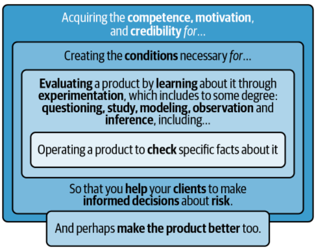 <!-- {"left" : 1.17, "top" : 1.69, "height" : 6.27, "width" : 7.91} -->

---

## Grand Challenges

* Input/Output
* State Explosion
* Data
* The Oracle
* Environment

 <!-- {"left" : 2.12, "top" : 4, "height" : 4, "width" : 6} -->

---

## Input/Output

* Computer software takes user input, processes it, and produces output. 
* For testing a very simple program with only one text field
* Still, you have computationally infeasible number of values to choose from
* Most programs contain many input fields
* Furthermore, you can apply those input combinations at different times and order them in many different ways
* Still have to check that each of those inputs produces the correct output 
  * appropriate usability
  * accessibility
  * performance
  * reliability
  * security constraints

---

## State Explosion

* Most computing systems are reactive. 
* The user provides input, the machine processes it and produces output, 
* The system is in a state
  * Depending on previous inputs, a given user action will produce specific outputs and the system will transition to an updated state
  * You are responsible for getting the system into the correct pretest state
  * Applying the input, and verifying that the correct end state has been reached. 
  * Infinite number of states. 
  * Similar to the input/output problem, testing suffers from a rapid explosion in the number of states 

---

## Data

* During testing, you can use data in many different ways
* Testers use data selection techniques like equivalence class partitioning
* verify that the software works under extreme conditions.
* Fake data? 
  * may not be representative of the real world? 
* Pull real-world data from customers in production? 
  * Can you anonymize customer data for testing in accordance with data privacy regulations?

 <!-- {"left" : 2.95, "top" : 5.55, "height" : 2.9, "width" : 4.34} -->

---

## The Oracle

* Oracle (see movie Matrix) tells us whether the software worked right or not
* Human testers do their best to act as an oracle 
  * but generally rely on other domain experts. 
  * Answers about the system’s expected behavior tend to be vague and subjective,
* Creating an automated oracle is a nontrivial problem.

---

## Environment

* Software is deployed in an environment. 
* Testing provides information about the software running in an actual environment. 
* The environment itself is a combination of hardware and other software 
* The hardware environment includes physical devices such as corporate servers, workstations, laptops, tablets, and phones,
* Operating systems, virtual machine managers, and device drivers make up the software environment.
* Obviously, it is impractical to test all of the hardware and software combinations, 
* so the best practices tend to focus on risk and past experiences.

---

## Limitations of Traditional Approaches

* Traditional approaches 
  * machine-readable scripts that check for specific system behaviors
  * automated scripts requires significant manual effort
* You first have to understand the requirements and implemented system 
* The bad news is that traditional tools and frameworks are quite rigid, so there are high maintenance costs associated with updating and maintaining these scripts over time.

 <!-- {"left" : 5.99, "top" : 1.31, "height" : 5.83, "width" : 3.89} -->

---
## Pesticide paradox

* just as insects build up resistance to pesticides over time
* the more you run the exact same tests on your software
  * the more likely it is to become immune to issues surrounding those specific scenarios.

---

## UI Test Automation

* determine if the software is able to carry out its required functions from the users’ perspective. 
* mimics users clicking, typing, tapping, or swiping on various screens of the application and verifying that the appropriate responses appear.
* For web and mobile applications
  * Selenium and Appium 
  * locate screen elements using patterns and path expressions 
  * based on the application’s document object model (DOM). 
  * drawbacks of DOM-based element selectors
    * make tests susceptible to breaking as the structure and/or behavior of the UI changes
    * changing the location or identifiers means that you have to update all the page object models
    * or test scripts associated with them. 

---

## Service and Unit Test Automation

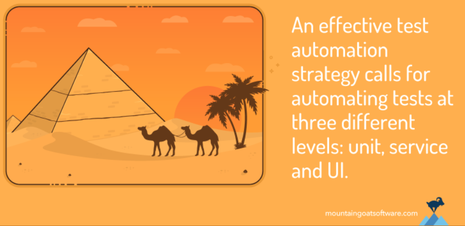 <!-- {"left" : 0.53, "top" : 2.3, "height" : 4.48, "width" : 9.19} -->

---

## Service and Unit Test Automation

* best practices like the test pyramid
* test automation should be done at the API
  * service—and unit levels. 
* code coverage can be a misleading quality measure 
* practitioners recommend testing the software on a variety of input values
* coverage of the input space, rather than coverage of the code

---

## Nonfunctional Test Automation

* Nonfunctional testing validates constraints on the system’s functionality
  * performance, 
  * security, 
  * usability, 
  * accessibility.
* emulate production traffic using hundreds and thousands of virtual concurrent users 
  * performing real-world transactions
* performance test scripts 
  * require periodic maintenance 
  * introduces an additional layer of complexity.

---

## Our conclusion

* Automation in any field has limitations and may require manual effort
* Our experience with software test automation in the field over the last 15 years 
  * many practitioners have accepted a subpar definition of what it means to automate the testing process. 
* Other practitioners claim that testing is so hard that it will never be automated.
* Understanding the test automation challenges and limitations is the __first step__

---

# AI for Test Automation

---

## Leveraging AI for Test Automation

* Did you know that autonomous and intelligent agents (__bots__) are already running tests on major applications today? 
  * The bots are in the building
  * Testing many apps in various application domains. 
  * Bots might be testing your own app - if you publish your app in one of the major app stores
* We’ll walk you through how AI tests software
* Show how this technology really works
  * testing applications at different levels or for various quality attributes.

---

## How to train AI bots

* Bots
  * perceive, 
  * explore, 
  * model, 
  * test, and 
  * learn software functionality

---

## Bots leverage machine learning

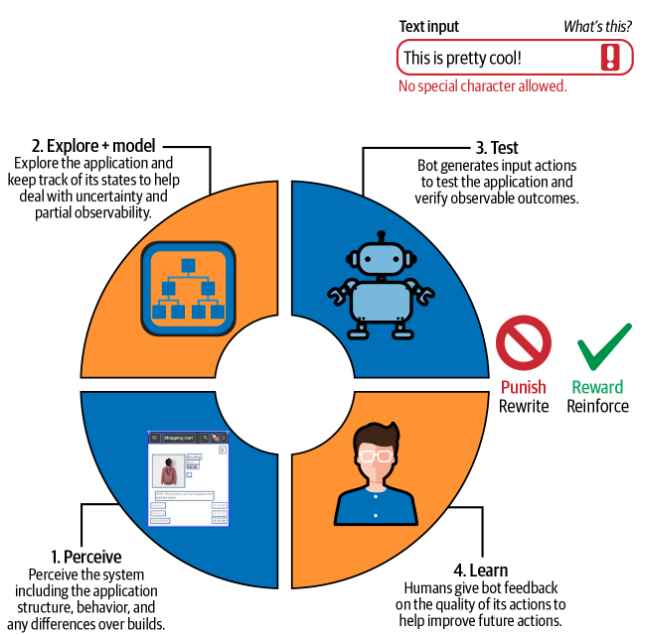 <!-- {"left" : 1.81, "top" : 1.57, "height" : 6.5, "width" : 6.62} -->

---

## Perceive

* Ability to interact with the application’s screens, controls, labels, and other widgets. 
* Traditional automation frameworks use the application’s DOM for locating UI elements 
  * DOM-based location strategies are highly sensitive to implementation changes. 
* Leveraging AI for identifying UI elements can help to overcome these drawbacks. 
* AI bots recognize what appears on an application screen independently of how it is implemented. 
* Branch of AI known as computer vision, is able to perceive anything with a screen.

---

## Explore and Model

* While exploring the app, testers create mental models 
* Similarly, AI bots explore and build models of the application under test
* You give them a goal, and they attempt to reach it by trial and error
* This is __reinforcement learning__

---

## Goal-based reinforcement learning

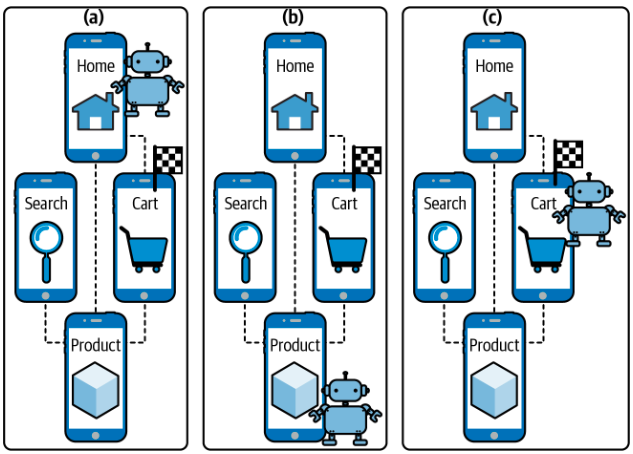 <!-- {"left" : 0.98, "top" : 1.85, "height" : 5.94, "width" : 8.28} -->

---

## Test

* The bots can perceive, explore, and model the application,
* Bots can recognize what expected and unexpected behaviors look like in given contexts. 
* It may be easier for bots to identify some types of issues than others. 
* For example, 
  * an HTTP 404 error - application has thrown an error. 
  * It is harder to know that someone’s pay stub is incorrect calculated appropriately. 
  

## Learn

* improve based on feedback. 
* Having humans provide direct feedback on the bots’ actions makes the system better. 
* Feedback mechanisms allow humans to reinforce or rewrite the AI brain
* As a result, the more feedback your teams provide to the bots on the quality of their testing, the better the bots become 
* Ultimately the more value they provide to the testing team. 
* Typically, feedback is incorporated into the product UI itself. 

---

## AI for Service/API Testing

* Automated service or API testing validates the way systems communicate via sequences of requests and responses. 
* For example, a typical communication exchange between two services, A and B, could be as follows:
* Service A sends an HTTP GET request to retrieve some data from Service B.
* Service B processes the request and returns an HTTP status of 200, indicating success along with a response body containing the requested data.

---

## AI for Unit Testing

* Automatic source code analysis to generate unit tests that reflect program behavior and help to reduce gaps in coverage.

* Integration with version control systems to monitor source code changes and keep tests up-to-date.

---

## AI for Mobile Design Testing

* Google and Apple publish guidelines to help developers ensure that Android and iOS mobile apps are well-designed.
* Example
  * When Possible, Present Choices
  * Make data entry as efficient as possible. Consider using a picker or table instead of a text field, for example, because it’s easier to choose from a list of predefined options than to type a response.
* Ambiguous?
  * you can train the bots to examine the screen just like a designer, customer, or reviewer.

---

## Conclusion

* AI-driven test automation is causing quite a stir
* AI is testing user interfaces, services, and lower-level components
* Evaluates the functionality, performance, design, accessibility, and trustworthiness of applications.
* It feels like the beginning of a new era of test automation. 

---

# Costs and Benefits of AI

---

## Investment Costs

* Based on our experiences in AI-driven testing projects
* up-front and recurring costs 
* homegrown solution vs purchasing a commercial, vendor-based solution.

---

## Homegrown Solutions

* AI-driven test automation platform or framework in-house, 
  * you’ll first need the talent to do so. 

* Talent required for this type of project is difficult to find

* Up-front costs included capital expenses related to the project’s hardware and software requirements

* After the initial rollout of your homegrown solution, 
  * you’ll still have to make significant investments in its development, evolution, and maintenance.
  
---

## Vendor-Based Solutions

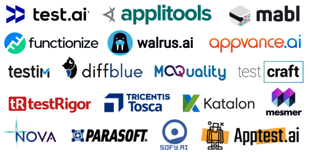

---

## ROI

* Increased Coverage and Acceleration
* 

## Increased Coverage and Acceleration

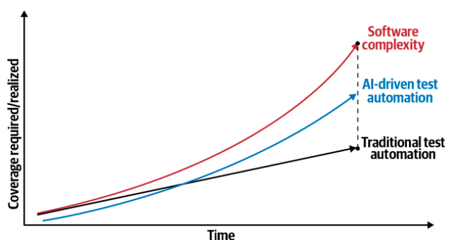

---

## Fix types

* Known issues, won’t fix
  * Any reported issue found pre- or postrelease that the business has decided to not fix. These issues represent accepted risk.

* Internally found and fixed in development
  * Defects discovered by the engineering team prior to release and that the business has decided to fix.

* Internally found in production and fixed
  * Defects discovered by the engineering team after the release and that the business has taken action to fix.

* Customer found and fixed
  * Defects reported by the client or end user after the release and that the business has taken action to fix.

* Undiscovered defects
  * Issues that have been reported by neither the engineers nor customers, pre- or postrelease. These issues represent unknown risk.

---

## Fix types

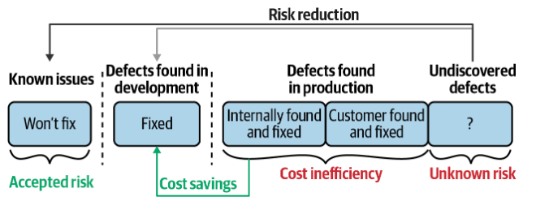

---

## Cost of testing

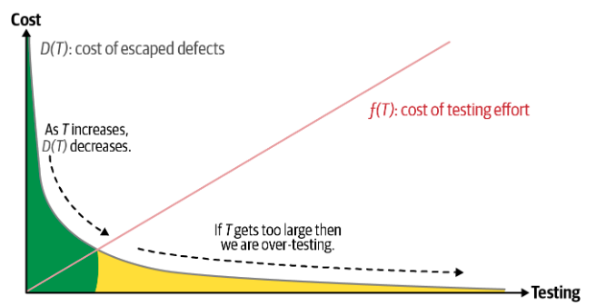

---

## Total cost of testing

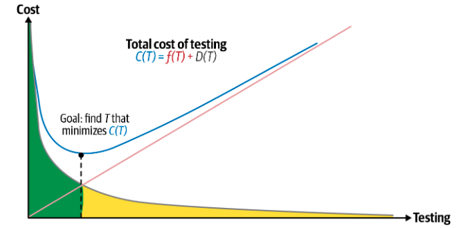

---
## Conclusion

* Determining how much to invest in AI-driven testing automation, 
  * should be based on a careful analysis of its ROI. 
  * together, we have enough insight into the available options
  * and their respective costs and benefits 

---

# Future Directions

## Future Directions

* Enhancing existing tools and frameworks at each testing level and dimension

* Full stack replacement of entire test automation tool sets

* Adaptive ML systems designed with self-testing capabilities

---

## Enhancing Existing Tools

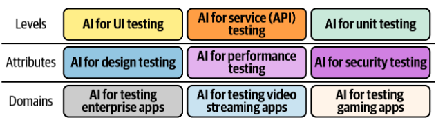

## Full Stack Replacement

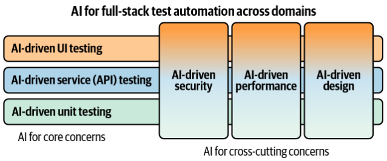

## Self-Testing Adaptive AI

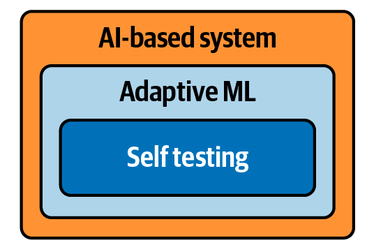

---

## Conclusion

* Software test automation has a bright future ahead of it
  * largely due to AI.
   
* AI is testing at different technical levels, 
  * validating quality attributes such as performance and accessibility, 
  * and allowing automated testing 

---

## Demo and Lab

* Teachable Machine
* https://github.com/elephantscale/cool-ML-demos/blob/main/image/teachable-machine.md
