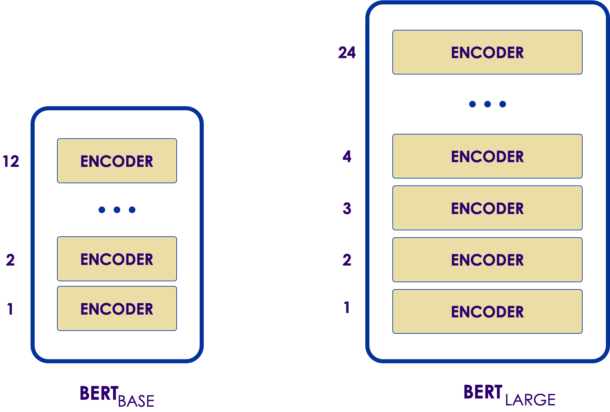
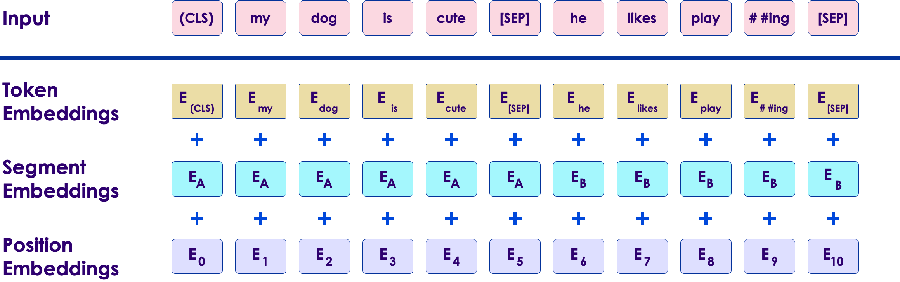
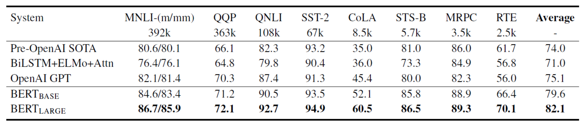
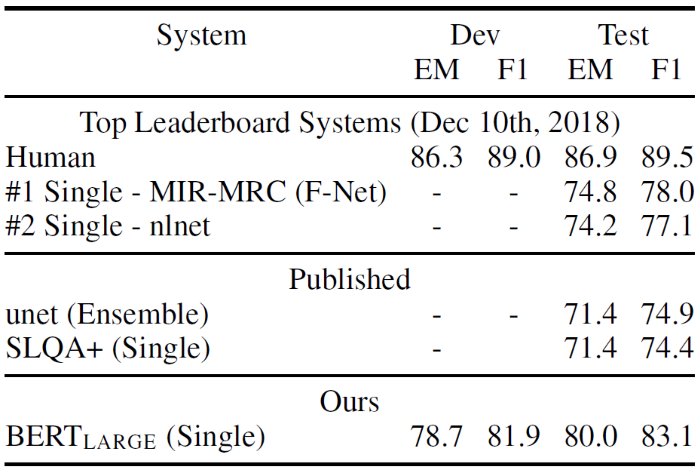
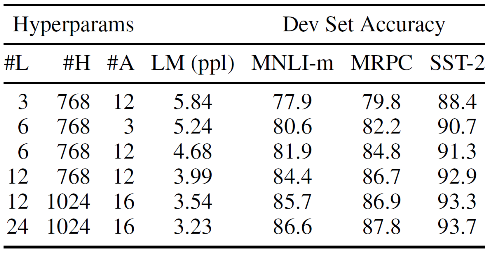
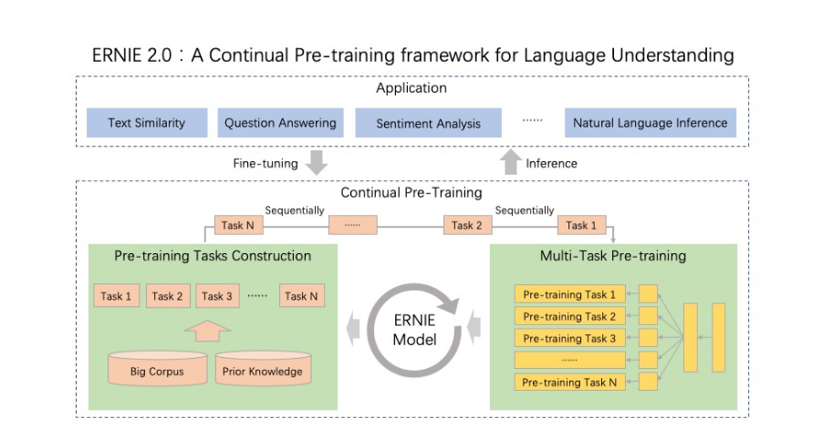

# BERT

---

## What is BERT
* Bidirectional Encoder Representations from Transformers

Notes: 

---

## BERT Whitepaper

<!-- {"left" : 0.65, "top" : 1.44, "height" : 6.76, "width" : 8.94} -->

Notes: 

---

## Before BERT 

 * word2vec (King-Man+Woman=Queen)

    - Requires new training

 * ELMO - Limited pre-training

Notes: 

---

## ULM-Fit, ELMo, and BERT

<!-- {"left" : 1.02, "top" : 2.94, "height" : 3.77, "width" : 8.21} -->

Notes: 

---

## BERT Transfer Learning

<!-- {"left" : 0.6, "top" : 2.33, "height" : 4.99, "width" : 9.06} -->

Notes: 

---

## Classification of SPAM	

<!-- {"left" : 0.75, "top" : 3.2, "height" : 3.25, "width" : 8.75} -->

Notes: 

---

## Results

<!-- {"left" : 0.79, "top" : 2.72, "height" : 3.64, "width" : 8.67} -->

Notes: 

---
 

## Bert Base vs Bert Lage

<!-- {"left" : 1.02, "top" : 3.13, "height" : 3.38, "width" : 8.21} -->

Notes: 

---

## Layers

<!-- {"left" : 0.06, "top" : 2.41, "height" : 4.26, "width" : 10.13} -->

Notes: 

---

## BERT Input Output

<!-- {"left" : 0.56, "top" : 2.79, "height" : 3.49, "width" : 9.13} -->

Notes: 

---

## Lab

* tensorflow-labs/nlp/bert.ipynb

Notes: 

---

# BERT

 * Pre-training of Deep Bidirectional Transformers for Language Understanding

---

## Content 

 *  Abstract

 * Introduction

 * Related Work

 * BERT

 * Experiments

 * Ablation Studies

 * Conclusion

Notes: 

 

---

# Abstract

---

## Abstract

 * In this paper they introduce a new language representation model called  **BERT** ( **B** idirectional  **E** ncoder  **R** epresentations from  **T** ransformers)

     -  **BERT**  is designed to  **pretrain deep bidirectional representations**  from unlabeled text

     - The  **pre-trained BERT** model can be  **finetuned** with just one additional output layer

     -  **BERT**  is conceptually  **simple**  and empirically  **powerful** 

     -  **BERT**  obtains  **new state-of-the-art results** on eleven natural language processing tasks.

Notes: 

 

---

# Introduction

---

## Introduction

 *  **Language model pre-training:** 

    - be effective for improving many natural language processing tasks

    - include sentence-level tasks such as natural language inference and paraphrasing

    - which aim to predict the relationships between sentences

 *  **Two strategies for applying pre-trained language representations:** (share the same objective function during pre-training)

     -  **Feature-based** (such as **ELMo** )

        * uses task-specific architectures

     -  **Fine-tuning** (such as the **Generative Pre-trained Transformer** )

        * introduces minimal task-specific parameters.

Notes: 

 

---

## Introduction

 *  **Current techniques:** 

     - restrict the power of the pre-trained representations

     - standard language models are unidirectional

 * In this paper:

     - They  **improve the fine-tuning**  based approaches by proposing  **BERT** 

     - BERT alleviates unidirectionality constraint by using a  **“masked language model”**  pre-training objective

     - the objective of  **MLM**  is to predict the original vocabulary id of the masked word based only on its context

     -  **MLM**  allows us to pretrain a deep bidirectional Transformer

 * They also use a **“next sentence prediction”** task that jointly  **pretrains text-pair representations**.

Notes: 

 

---

## Introduction

 *  **The contributions of their paper:** 

     - They demonstrate the **importance of bidirectional pre-training** for language representations.

     - They show that pre-trained representations **reduce** the need for any heavily-engineered task-specific architectures

 * The  **code**  and pre-trained models are available at:

 * https://github.com/google-research/bert 

Notes: 

 

---

# Related Work

---

## Related Work

 *  **Unsupervised Feature-based Approaches:** 

     - Pre-trained word embeddings are an  **integral part of modern NLP systems** , offering significant improvements over embeddings learned from scratch.

     - To pretrain word embedding vectors,  **left-to-right language modeling objectives**  have been used.

     - To discriminate correct from incorrect words in left and right context  **objectives**  have been used.

     - These approaches have been generalized to  **coarser granularities** , such as  **sentence embeddings** .

     - ELMo and its predecessor generalize  **traditional word embedding research** along a different dimension.

        * Extract  **context-sensitive features** from a left-to-right and a right-to-left language model.

Notes: 

 

---

## Related Work

 *  **Unsupervised Fine-tuning Approaches:** 

     -  **pre-trained**  word embedding parameters from  **unlabeled text** and  **fine-tuned**  for a  **supervised downstream task**.

     - The  **advantage**  of these approaches is that  **few parameters need to be learned**  from scratch.

     -  **Left-to-right language modeling** and  **auto-encoder objectives** have been used for pre-training such models.

 *  **Transfer Learning from Supervised Data:** 

     - Computer vision research has demonstrated the importance of  **transfer learning** from large pre-trained models, where an effective recipe is to  **fine-tune models pre-trained**  with  **ImageNet**.

Notes: 

 

---

# BERT

---

## BERT

 * There are  **two steps** in their framework:

     -  **pre-training:** 
        * The model is  **trained on unlabeled data** over different pre-training tasks
     -  **fine-tuning:** 

        * The  model is first initialized with the  **pre-trained parameters** , and all of the parameters are fine-tuned using labeled data from the downstream tasks.

<!-- {"left" : 1.2, "top" : 4.42, "height" : 3.31, "width" : 8.21} -->

Notes: 

 

---

## BERT

 * **Model Architecture:**

    - BERT's model architecture is a **multi-layer bidirectional Transformer encoder** based on the original implementation
    - In this work:
      - The number of layers: **L**
      - The hidden size: **H**
      - The number of self-attention heads: **A**

    - Results on two model sizes:

      - ğ‘©ğ‘¬ğ‘¹ğ‘»ğ‘©ğ‘¨ğ‘ºğ‘¬: 
         - **L**= 12, **H**= 768, **A**= 12, **Total Parameters**= 110M 

      - ğ‘©ğ‘¬ğ‘¹ğ‘»ğ‘³ğ‘¨ğ‘¹ğ‘®ğ‘¬: 
         - **L**=24,  **H**=1024,  **A**=16, **Total Parameters**= 340M 

Notes: 

 

---

## BERT

 *  **Input/Output**  **Representations** 

     - Input representation is able to  **unambiguously represent** both a single sentence and a pair of sentences in one token sequence
        * A  **“sentence”** can be an arbitrary span of contiguous text
        * A  **“sequence”** refers to the input token sequence to BERT

 * In this paper they use  **WordPiece**  embeddings with a 30,000 token vocabulary

     - The  **first token** of every sequence is a special classification token
     - The  **final hidden** state corresponding to this token is used as the aggregate sequence representation for classification tasks

     - Sentence pairs are packed together into a  **single sequence** 
     - Differentiate the sentences in two ways:
        * Separate them with a  **special token** 
        * Add a  **learned embedding** to every token indicating whether it belongs to sentence A or sentence B

Notes: 

 

---

## BERT

 *  **BERT input representation** 

<!-- {"left" : 1.02, "top" : 2.3, "height" : 3.31, "width" : 8.21} -->

Notes: 

 

---

## BERT

 * **Pre-training BERT:**
 * Pre-train BERT using two unsupervised tasks:
   - **Task #1: Masked LM:**
     - Mask some percentage of the input tokens at random
     - Then predict those masked tokens
     - The final hidden vectors corresponding to the mask tokens are fed into an output softmax over the vocabulary, as in a standard LM
 * A downside is that **they are creating a mismatch between pre-training and fine-tuning**, since the [MASK] token does not appear during fine-tuning
   - To mitigate this:
     - The training data generator **chooses 15% of the token positions** at random for prediction. If the i-th token is chosen, they replace the i-th token with:
        - The [MASK] token **80%** of the time
        - A random token **10%** of the time
        - The unchanged i-th token **10%** of the time
    - Then, **ğ‘»ğ’Š** will be used to **predict the original token** with cross entropy loss

Notes: 

 

---

## BERT

 *  **Pre-training BERT:** 

     -  **Task #2: Next Sentence Prediction (NSP):** 

        * To train a model that understands sentence relationships, they  **pre-train for a binarized next sentence prediction task**  that can be trivially generated from any monolingual corpus

        * The NSP task is closely related to  **representation learning objectives** 

 * For the  **pre-training corpus** they use the  **BooksCorpus**  and  **English Wikipedia** 

     - For Wikipedia they  **extract only the text passages** and ignore lists, tables, and headers

     - Critical to use a  **document-level corpus** rather than a shuffled sentence-level corpus

Notes: 

 

---

## BERT

 *  **Fine-tuning BERT:** 
     - For applications involving text pairs:
        *  uses the  **self-attention mechanism** to unify these two stages, as encoding a concatenated text pair with self-attention effectively includes bidirectional cross attention between two sentences
     - For each task:
        * At the  **input** , sentence  **A**  and sentence  **B**  from pre-training are analogous to
          * sentence pairs in paraphrasing
          * hypothesis-premise pairs in entailment
          * question-passage pairs in question answering
          * a degenerate text-? pair in text classification or sequence tagging
        * At the  **output** 
          * The token representations are fed into an output layer for token level tasks and classification.
 * Compared to pre-training,  **fine-tuning**  is relatively  **inexpensive** 

Notes: 

 

---

# Experiments

---

## Experiments

  * **GLUE** (General Language Understanding Evaluation):
     - A collection of diverse natural language understanding tasks

  * **Fine-tune on GLUE:**
     - Input sequence: as described in Section 4
     - Use the final hidden vector 𝐶 ∈ ğ‘…ğ» corresponding to the first input token as the aggregate representation
     - Classification layer weights: 𑊠∈ ğ‘…ğ¾Ã—ğ» (K is the number of labels)
     - Compute a standard classification loss with C and W

𝐥𝐨𝐠⁡(𝒔𝒐𝒇𝒕𝒎𝒂𝒙(ğ‘ªğ‘¾ğ‘»))

  * fine-tune for **3** epochs with learning rate among **5e-5, 4e-5, 3e-5, and 2e-5** and a batch size of **32**

Notes: 

---

## Experiments

  * **Results are presented in Table:**

<!-- {"left" : 1.02, "top" : 1.56, "height" : 1.76, "width" : 8.21} -->
  * **𝑩𝑬𝑹𝑻**𝑩𝑨𝑺𝑬 and **𝑩𝑬𝑹𝑻**𝑳𝑨𝑹𝑮𝑬 outperform all systems on all tasks by a substantial margin

  * ğµğ¸ğ‘…ğ‘‡ğ¿ğ´ğ‘…ğºğ¸ **significantly outperforms** ğµğ¸ğ‘…ğ‘‡ğµğ´ğ‘†ğ¸ across all tasks, especially those with very little training data.

Notes: 

---

## Experiments

  * **SQuAD v1.1** (Stanford Question Answering Dataset):
    - A collection of 100k crowdsourced question/answer pairs
  * In the question answering task:
    - Represent the input question and passage as a single packed sequence, with the question using the A embedding and the passage using the B embedding
      - Start vector 𑺠∈ ğ‘¹ğ‘¯
      - End vector 𝐄 ∈ ğ‘¹ğ‘¯
      - probability of word **i**:

<!-- {"left" : 6.43, "top" : 5.11, "height" : 1.29, "width" : 1.84} -->

 * Fine-tune for **3** epochs with a learning rate of **5e-5** and a batch size of **32**

Notes: 

---

## Experiments

 *  **Results from top published systems:** 

<!-- {"left" : 2.86, "top" : 1.69, "height" : 3.97, "width" : 4.52} -->

 *  **BERT model** outperforms the top ensemble system in terms of F1 score.

Notes: 

---

## Experiments

  * **SQuAD v2.0:**
    - Extends the **SQuAD 1.1** problem definition by allowing for the possibility that **no short answer** exists in the provided paragraph, making the problem more realistic

  * Treat questions that do not have an answer **as having an answer span** with start and end at the [CLS] token
  * For prediction, compare:
    - The score of the no-answer span: ğ‘ ğ‘›ğ‘¢ğ‘™ğ‘™=𝑆.𝐶+𝐸.𝐶 
    - The score of the best non-null span: ğ‘ ğ‘–â‹.𝑗= ğ‘šğ‘ğ‘¥ğ‘–>𝑗 𝑆.ğ‘‡ğ‘–+𝐸.ğ‘‡ğ‘—

  * Fine-tuned for **2** epochs with a learning rate of **5e-5** and a batch size of **48**

Notes: 

---

## Experiments

 *  **The results compared to prior leaderboard entries and top published work** 

<!-- {"left" : 2.57, "top" : 2, "height" : 3.45, "width" : 5.11} -->

 * Observe **a +5.1 F1 improvement** over the previous best system.

Notes: 

---

## Experiments

 *  **SWAG** (Situations With Adversarial Generations):

     - Contains  **113k**  sentence-pair completion examples that evaluate grounded commonsense inference

 * Construct four input sequences

     - The concatenation of the given sentence( **sentence A** )

     - Possible continuation ( **sentence B** )

     - Score for each choice (  **C**  )

 * Fine-tune the model for  **3**  epochs with a learning rate of  **2e-5**  and a batch size of  **16** 

Notes: 

---

## Experiments

 *  **Results are presented in Table** 

<!-- {"left" : 2.24, "top" : 2.33, "height" : 4.41, "width" : 5.77} -->

Notes: 

---

#  Ablation Studies

---

## Ablation Studies

  * **Effect of Pre-training Tasks:**
    - In this section they demonstrate the importance of the deep **bidirectionality of BERT** by evaluating two pretraining objectives using exactly the same pretraining data, fine-tuning scheme, and hyperparameters as **ğ‘©ğ‘¬ğ‘¹ğ‘»ğ‘©ğ‘¨ğ‘ºğ‘¬**:
    - **No NSP:**
      - Using the **“masked LM” (MLM)** without **the “next sentence prediction” (NSP)** task
    - **LTR & No NSP:**
      - Using a standard **Left-to-Right (LTR) LM** without **the NSP** task
    - Examine the **impact brought** by the NSP
     - Evaluate the **impact of training bidirectional representations** by comparing “No NSP” to “LTR & No NSP”
 * The **LTR model** performs **worse than** the **MLM model** on all tasks, with **large drops on MRPC and SQuAD**

Notes: 

---

## Ablation Studies

  * Train separate **LTR and RTL models** and represent each token as the concatenation of the two models, as **ELMo** does:
     - This is twice as **expensive** as a single bidirectional model
     - This is **non-intuitive** for tasks like QA, since the RTL model would not be able to condition the answer on the question
     - This it is strictly **less powerful** than a deep bidirectional model, since it can use both left and right context at every layer

  * Ablation over the pre-training tasks using the **ğ‘©ğ‘¬ğ‘¹ğ‘»ğ‘©ğ‘¨ğ‘ºğ‘¬ architecture**

<!-- {"left" : 1.43, "top" : 5.38, "height" : 2.8, "width" : 7.39} -->

Notes: 

---

## Ablation Studies

 *  **Effect of Model Size:** 

     - Trained a number of  **BERT models** with a differing :

        *  **number of layers** 
        *  **hidden units** 
        *  **attention heads** 

     - We can see that, **larger models** lead to a  **strict accuracy improvement** across all four datasets.

 * This is the first work to demonstrate convincingly that  **scaling to extreme model sizes** also leads to  **large improvements on very small scale tasks** , provided that the  **model has been sufficiently pre-trained.** 

Notes: 

---

## Ablation Studies

 *  **Results on selected GLUE tasks are shown in Table** 

<!-- {"left" : 1.02, "top" : 2.69, "height" : 4.26, "width" : 8.21} -->

Notes: 

---

## Ablation Studies

 *  **Feature-based Approach with BERT** 

     - fixed features are extracted from the  **pretrained model** 
     - Advantages:
        * Not all tasks can be easily represented by a Transformer encoder architecture, and therefore require a task-specific model architecture to be added.
        * There are major computational benefits to pre-compute an expensive representation of the training data once and then run many experiments with cheaper models on top of this representation

 *  **Compare**  the two approaches by applying  **BERT**  to the  **CoNLL-2003 Named Entity Recognition (NER)** task:

     -  **BERT:** 
        * Input: a case-preserving WordPiece model
     -  **NER** 
        * Input: the representation of the first sub-token

Notes: 

---

## Ablation Studies

 *  **CoNLL-2003 Named Entity Recognition results are presented in Table** 

<!-- {"left" : 5.47, "top" : 1.93, "height" : 3.72, "width" : 4.52} -->

 *  **BERT is effective** for both **finetuning** and **feature-based** approaches

Notes: 

---

# Beyond BERT

---

## RoBERTa

<!-- {"left" : 0.65, "top" : 1.44, "height" : 6.76, "width" : 8.94} -->

---

## About RoBERTa

 * Created by Facebook
 * Aims for **Robust** training

---

## AlBERT

<!-- {"left" : 0.65, "top" : 1.44, "height" : 6.76, "width" : 8.94} -->

---

## DistilBERT

<!-- {"left" : 0.65, "top" : 1.44, "height" : 6.76, "width" : 8.94} -->

---

## XLNet

<!-- {"left" : 0.65, "top" : 1.44, "height" : 6.76, "width" : 8.94} -->

---

## ERNIE

<!-- {"left" : 0.65, "top" : 1.44, "height" : 6.76, "width" : 8.94} -->

---

## About ERNIE

 * Created by Baidu
   - ERNIE 1.0
   - ERNIE 2.0 October 2019
 * Outperforms BERT

# Conclusion

---

## Conclusion

 *  **Unsupervised pre-training** is an integral part of many **language understanding systems** 

 * These results enable even  **low-resource tasks**  to benefit from  **deep unidirectional architectures** 

 * Further generalizing these findings to  **deep bidirectional architectures** , allowing the same  **pre-trained model** to successfully tackle a broad set of  **NLP**  tasks

Notes: 

---

## Question

<!-- {"left" : 3.17, "top" : 2.58, "height" : 3.91, "width" : 3.91} -->

Notes: 

