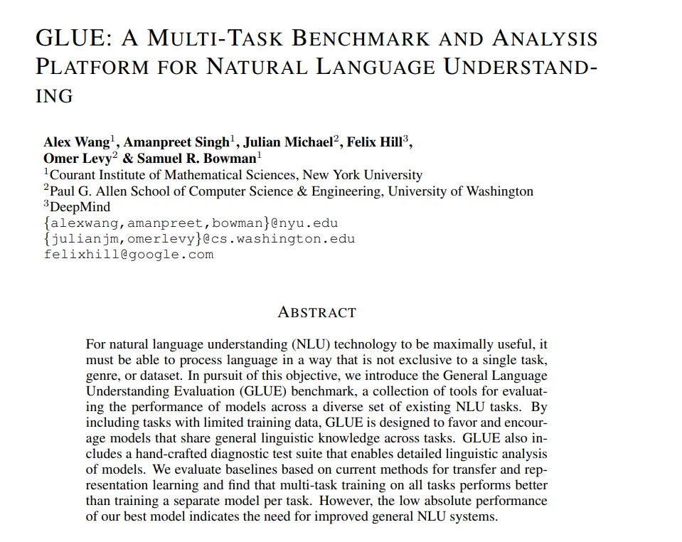
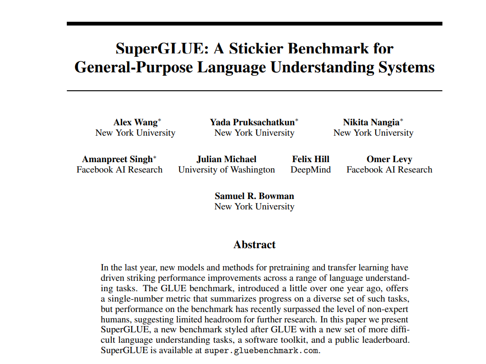

# GLUE

---

## What is GLUE
* General Language Understanding Evaluation (gluebenchmark.org)
* A suite of benchmarks for understanding langauge evaluation tasks
* A set of standard public datasets for easy download
* A leaderboard for evaluation (Kaggle-Style)

Notes: 

---

## GLUE vs SuperGLUE

 * GLUE is the original benchmark  (gluebenchmark.org)
 * SuperGLUE is a "harder" benchmark (super.gluebenchmark.com)
   - Published in 2019

## GLUE Whitepaper

<!-- {"left" : 0.65, "top" : 1.44, "height" : 6.76, "width" : 8.94} -->

Notes: 

---

## SuperGLUE Whitepaper

<!-- {"left" : 0.65, "top" : 1.44, "height" : 6.76, "width" : 8.94} -->

Notes: 

---

## Datasets

 * CoLA
 * SST
 * MPRC
 * QQP
 * STS
 * MNLI
 * SNLI
 * QNLI
 * RTE
 * WNLI 

