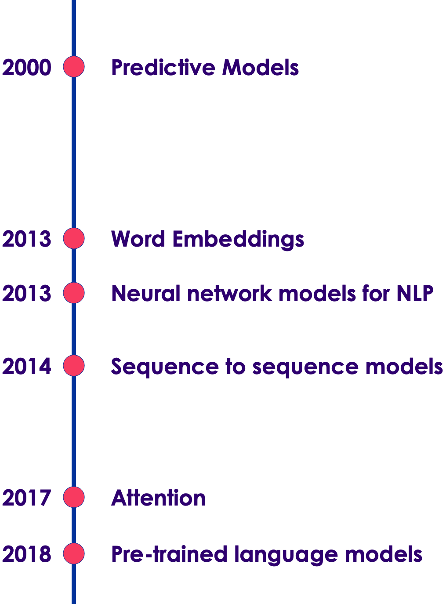
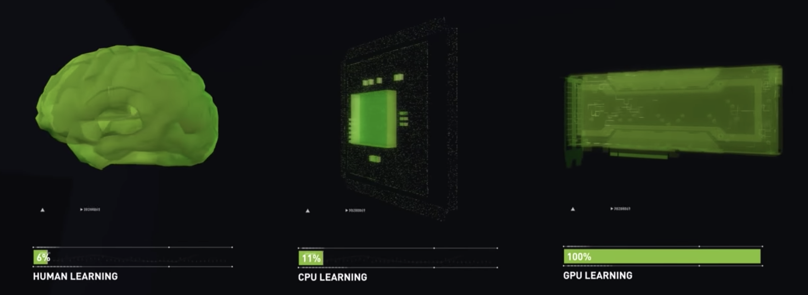
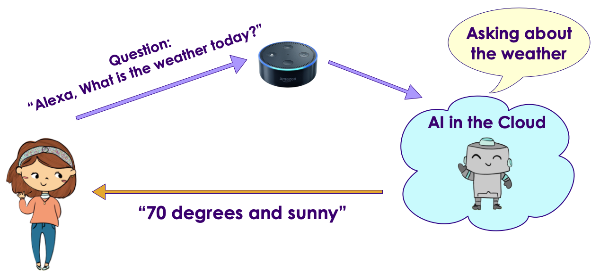

# Introduction to Natural Language Processing (NLP)

<!-- TODO shiva -->
<!-- {"left" : 5.36, "top" : 2.32, "height" : 3.8, "width" : 4.75} -->
<!-- {"left" : 5.18, "top" : 2.52, "height" : 2.94, "width" : 4.83} -->

---

## Lesson Objectives

- Understand text analytics tools, algorithms and use cases

Notes:

---

# Text Analytics Use Cases

---

## Why Text Analytics Is Important?

<!-- {"left" : 5.36, "top" : 2.32, "height" : 3.8, "width" : 4.75} -->

* We live in a world of text!

  * Social media posts (tweets, posts, blogs)

  * Customer 'chat' interaction

  * Customer emails

* Unstructured data exists in many forms

* Mostly underutilized

* Can use data to great effect given right tools

Notes:

---

## Use Case: Customer Service Via Social Media

<!-- {"left" : 0.27, "top" : 2.15, "height" : 5.35, "width" : 9.72} -->

* Customers now take to social media to complain about a company

* Some social media posts can go viral and embarass the company

* "United breaks guitars" saga
  - ['United breaks guitars' song](https://www.youtube.com/watch?v=5YGc4zOqozo)
  - [Social media lessons: United Airlines breaks guitars - ZDNet](https://www.zdnet.com/article/social-media-lessons-united-airlines-breaks-guitars/)

Notes:

---

## Use Case: Sentiment Analysis

- What are customers saying about a brand / product


<!-- {"left" : 1.24, "top" : 2.43, "height" : 4.79, "width" : 7.76} -->


Notes:

---

## Use Case - Sentiment Analytics

<!-- {"left" : 1.02, "top" : 2.17, "height" : 5.31, "width" : 8.21} -->


---

## Use Case - AirBnB Customer Service

<!-- {"left" : 0.54, "top" : 2.82, "height" : 3.42, "width" : 4.08} --> &nbsp; &nbsp; <!-- {"left" : 5.3, "top" : 2.82, "height" : 3.42, "width" : 4.41} -->


Notes:


---

## Use Case AirBnB

<!-- {"left" : 0.54, "top" : 2.82, "height" : 3.42, "width" : 4.08} --> 

* Problem
  - AirBnB is growing at an exponential rate

  - With growth, the customer support also increased

  - They had 5000 support agents, and still falling behind!

  - Needed a way to scale

* Solution

  - Deploy AI to handle customer queries

  - AI is smart enough to understand customer questions and provide answers"how do I verify my ID?"

* [Case study](http://bigdatausecases.info/entry/airbnb-driving-a-higher-level-of-customer-support-with-machine-learning)

Notes:

---

## Bank of America Customer Service Bot

<!-- {"left" : 6.26, "top" : 1.33, "height" : 1.43, "width" : 3.67} -->
<!-- {"left" : 6.08, "top" : 4.59, "height" : 3.13, "width" : 4.04} -->

* Bank of America virtual assistant can handle a variety of customer queries

* Examples:
  - Easy: "Pay $50 to Bill"
  - Complex: "show me my total expenses to Disneyland trip"

* Can understand both text / voice query

* References
  - [Meet Erica, Bank Of America's New Voice AI Banking System - Forbes](https://www.forbes.com/sites/quora/2016/10/28/meet-erica-bank-of-americas-new-voice-ai-banking-system/#655fa71f50db)
  - [Bank of America launches AI chatbot Erica - CNBC](https://www.cnbc.com/2016/10/24/bank-of-america-launches-ai-chatbot-erica--heres-what-it-does.html)


---

## Customer Service Chatbots @ Lyft 

<!-- {"left" : 8.33, "top" : 1.09, "height" : 1.66, "width" : 1.71} -->

```text
User:
    Hi, My driver went to a wrong location.  
    So I had to cancel.  
    But I was charged a cancellation fee.
    Can that be refunded"

Customer Service:
    I see, this is your first cancellation in past 2 months.  
    We will refund you the money.Have a nice day!"
```
<!-- {"left" : 0, "top" : 3.62, "height" : 0.99, "width" : 5.6} -->

- Hightlighs
  - Resolution time:  **about 20 seconds!**
  - No phone calls,
  - No wait time

---

## Translation: Early Approach

* Creating a translation system (English <--> Japanese) involves the following
  - English dictionary + grammar rules

  - Japanese dictionary + grammar rules

  - Translation rules

* Now the system is ready to translate

* But this approach really doesn't work well:

  - Rules have too many exceptions

  - Context and subtle meanings are lost

* Example : **"Minister of agriculture" --> "Priest of farming"**

Notes:


---

## Translation With AI (Google Translate)

<!-- {"left" : 5.18, "top" : 2.52, "height" : 2.94, "width" : 4.83} -->

* Google Translate has been ported to 'Google Brain' on Sept 2016

* System learned from 'data'

* AI based system improved the accuracy remarkably

* [Case study](https://www.nytimes.com/2016/12/14/magazine/the-great-ai-awakening.html)

---

# Recent Advances in NLP

---

## Recent Advances in NLP

<!-- {"left" : 5.18, "top" : 2.52, "height" : 2.94, "width" : 4.83} -->

---

## Early Applications (2010)

<!-- {"left" : 5.18, "top" : 2.52, "height" : 2.94, "width" : 4.83} -->

* Predictive text on texting applications on smartphones

* These were powered by statistical based predictions

* **Can you call me ???**
  - Likely completions are : **back**,   **ASAP**,  **when you can**
  - The model suggests the word with highest probability


---

## NLP Revolution

* 2010+ is considered an **'golden age of NLP'**

* The following factors contribute to the NLP Revolution

* **Big Data** : Now we have massive amount of data available to us, to train our models

* **Cloud compute**: Cloud compute democratized compute power

* **Increased compute power**: Advances in programming chips make it possible to train massive models

* **Availability of pre-trained models**: Means, researchers can build on and improve upoon each other's work

---

## The Rise of 'AI Chips'

<!-- {"left" : 2.52, "top" : 4.35, "height" : 3.58, "width" : 5.22} -->



* GPUs provide a huge amount of compute power, they are the goto hardware platform for intense AI workloads
  - Google translate model trains on 2 billion+ words on 99+ GPUs for week+

* Companies are also building custom 'AI chips' - specifically designed for AI processing
  - Google has Tensor Processing Unit (TPU)
  - Tesla is developing its own chip for self driving
  - Amazon, Facebook, Apple all are investing in their own AI chips

* [GPU vs. CPU comparison - video](https://www.youtube.com/watch?v=DjAJnQoNdMA) (around 50 second mark)

---

## Availability of Pre-Trained Models

* Training state-of-the-art models takes lot of expertise, lot of data and lot of compute power

* In the past few years, companies like Google, OpenAI are releasing their pre-trained models to public!

* They may have spent months/years creating, training and tweaking the models.
  - Now that the models are publicly available, anyone can use them and improve upon them

* For example, [OpenGPT-2 model](https://openai.com/blog/better-language-models/) by OpenAI 
  - Is trained on 8 million web page
  - 40GB data
  - has 1.5 billion tunable parameters

* OpenAI was hesitant to release their 'largest GPT2' model for the fear that  it can be misused to create fake news!  [Eventually they did!!](https://openai.com/blog/gpt-2-1-5b-release/)


---

## Word Embeddings (2013)

<!-- TODO shiva -->
<!-- {"left" : 5.18, "top" : 2.52, "height" : 2.94, "width" : 4.83} -->

* Machine learning algorithms work with numbers (or vectors)

* So when working with text data, we need to convert them to vectors first

* Early approaches for this were just OK

* But **word embeddings** was a break through

* It gave us vectors, that can derive meaning from text!

---

## Word Embeddings

<!-- {"left" : 2.02, "top" : 3.75, "height" : 4.68, "width" : 6.21} -->

* Here you see an example of word embeddings

* The  cool thing is, it groups similar words together
  - food, chicken
  - Linux, screen
  - music, saxophone, piano

* So now we have meaningful vectors!

---

## Word Embeddings

<!-- {"left" : 5.32, "top" : 1.17, "height" : 3.49, "width" : 4.72} -->

* Another amazing thing word2vec can do is, it can describe relationships between vectors!

* **France is to Paris as Germany is to Berlin**
  - In vector space, the distance between contries and their capitals is same!

---

## Demo: Explore Word Embeddings

<!-- {"left" : 5.32, "top" : 1.17, "height" : 3.49, "width" : 4.72} -->

* This is a fun demo to interactively explore word embeddings at work
* Go to : [projector.tensorflow.org](https://projector.tensorflow.org/)
* Load **word2vec** model (on the left side)
* Search for word **fun** on the right hand side
* Explore 'similar words'
* Try your own words and explore similar words

<!-- {"left" : 5.32, "top" : 1.17, "height" : 3.49, "width" : 4.72} -->

---

## Neural Networks and NLP

<!-- {"left" : 5.18, "top" : 2.52, "height" : 2.94, "width" : 4.83} -->

* Neural Networks are layers of parallel processing elements, working together to solve very complex tasks

* Neural networks allow us to train complex models on large amount of data

* Inspired by neurons from human brain

* **Animation** below: [link-S3](https://elephantscale-public.s3.amazonaws.com/media/machine-learning/neural-networks-animation-1.mp4), [link-youtube](https://youtu.be/sLsCN9ZL9RI)

<!-- {"left" : 0.38, "top" : 4.99, "height" : 2.23, "width" : 9.48} -->

---

## Neural Networks and NLP

* A special kind of neural networks called **Recurrent Neural Networks (RNNs)** made good progress understanding language

* They can **remember sequences** - which is very important to understand languages

*  Take the following sentence.  Who does 'she' refers to?  
__My mother is very close my sister; she is also very close to my wife__

---

## Sequence to Sequence Models

* Sequence-to-Sequence models are used to convert one sequence into another sequence

* For example, translating an English sentence to Spanish

* This model is applied to a variety of sequence data
  - Language translation
  - Time series data (stock analyis)
  - Speech recognition


<!-- {"left" : 0.38, "top" : 4.99, "height" : 2.23, "width" : 9.48} -->

---

## Issues with Seq-2-Seq Models

* Seq-2-Seq models were successful in solving a lot of tasks

* How ever they suffered from a few problems:
  - They didn't do well on long sequences
  - The sequential nature of the algorithm, limited parallelization

* Long Sequence problem.  Consider the following sentence:  
__'I lived in China during my teenage years, so I speak fluent ???__

* The important key to answer the missing piece (the language) is NOT 'teenage years', but 'China'; that was a few words back

* So the completed sentence is   
__'I lived in China during my teenage years, so I speak fluent Mandarin__

---

## Attention and Transformers  (2017)

<!-- {"left" : 5.18, "top" : 2.52, "height" : 2.94, "width" : 4.83} -->

* In a landmark paper ["Attention is all you need"](https://arxiv.org/abs/1706.03762), researchers from Google, proposed a novel model called **Transformers**

* The Transformer architecture solved the 2 nagging problems with Seq-2-Seq models
  - Transformers can 'track or remember' long sequences
  - And their operations are parallelizable

* Transformers are one the state of the art models since 2018+

---

## Pre Trained Models (2018)

* Google released a model called BERT (Bidirectional Encoder Representations from Transformers) that is based on Transformer architecture

* BERT is pre-trained on a large amount of text (Wikipedia,  Internet News Archive)

* The beauty is, BERT can be tweaked to work with variety of tasks (like sentiment detection)

<!-- {"left" : 5.18, "top" : 2.52, "height" : 2.94, "width" : 4.83} -->

---

## Race for Pre-Trained Models

* **BERT by Google** : This started the new wave of enthusiasm for NLP 

* **Transformer XL by Google**: An improved version of BERT

* **GTP-2 by OpenAI**: Can predict next occurring word in text (more in next slide)

* **ULMFit** by Fast.ai

---

## OpenAI  GPT-2 Controversy

* **GPT-2** was trained on large amount of data (40GB of interenet text data)
* It can generate text based on input provided
* Below is the text it generated, that is nothing short of astounding
* Read the full text at [OpenAI blog](https://openai.com/blog/better-language-models/)
* OpenAI, initially didn't want to release the model, because they feared it might be used to create fake news stories!
* This generated a big controversy, and got a lot of attention :-)

<!-- {"left" : 5.18, "top" : 2.52, "height" : 2.94, "width" : 4.83} -->

---

## Looking Ahead

* NLP models are getting larger and larger - trained on bigger and bigger dataset
* [Megatron](https://github.com/NVIDIA/Megatron-LM), the latest model from Nvidia has 8.3 billion parameters: 24 times larger than BERT-large, 5 times larger than GPT-2, 
* [RoBERTa](https://arxiv.org/abs/1907.11692), the latest work from Facebook AI, was trained on 160GB of text

<!-- {"left" : 5.18, "top" : 2.52, "height" : 2.94, "width" : 4.83} -->

---

## Bigger and Bigger Models

<!-- {"left" : 5.18, "top" : 2.52, "height" : 2.94, "width" : 4.83} -->

* [Source](https://developer.nvidia.com/blog/training-bert-with-gpus/)

---

## Bigger and Bigger Models

* We are seeing models that are getting exceedingly big with billion+ parameters!

<br />

| Model         | Created By | Implementation | Number of Patameters | Training Data Size |
|---------------|------------|----------------|----------------------|--------------------|
| BERT base     | Google     | Tensorflow     | 110 Million          | 16 GB              |
| RoBERTa base  | Facebook   | PyTorch        | 125 Million          | 76 GB              |
| BERT large    | Google     | Tensorflow     | 340 Million          |                    |
| RoBERTa large | Facebook   | PyTorch        | 335 Million          |                    |
| XLM           | Facebook   | PyTorch        | 665 Million          |                    |
| GPT-2         | OpenAI     | PyTorch        | 774 Million          |                    |
| Megatron      | Nvidia     | PyTorch        | 8.3 Billion          | 174 GB             |
| Turing NLG    | Microsoft  | DeepSpeed      | 17 Billion           |                    |
| GPT-3         | OpenAI     | PyTorch        | 175 Billion          |                    |

---

## Issues with Bigger Models

* As state of the art models get bigger and bigger, there is a concern about the practical / usability of these models

* They take up lot of memory; so they have to be deployed on a pretty large hardware

* And if we are doing multiple processes, each process has to load the data into its own memory space; increasing memory requirements even more

* Since they have billions of parameters to be computed, their prediction speed is slow


---

## Do We Really Need the Monster Models?

* Do we really need all the 'knowledge' of huge models, if our NLP task is simple (for example sentiment detection on small amount of data)

* And what if we want to run our model on a smaller device (edge device / phone)?  They need to be 'light weight'

<!-- {"left" : 5.18, "top" : 2.52, "height" : 2.94, "width" : 4.83} -->

---

## Distilled Models

* There is a growing  need for 'light weight' models
  - Deploy on edge devices with smaller memory and compute capabilities (e.g. smart speakers)
  - Faster prediction times

* **Distilled Models** are basically 'slimmed down' version of the large models

* They reduce the number of parameters of larger models yielding smaller models, still giving comparable performance

* Large model is called *the teacher* and smaller model is called *the student*

* **DistilBERT** is 60% faster and smaller than BERT, while still producing comparable results

* [HuggingFace](https://huggingface.co/)  publishes **distilled** models - a slim down version of large, state of the art models

* References: [1](https://medium.com/huggingface/distilbert-8cf3380435b5), [2](https://towardsdatascience.com/distilling-bert-models-with-spacy-277c7edc426c)

---

## Deploying NLP Models

* Larger models are deployed in cloud, across cluster of CPU/GPU cores for scalability

* Edge devices (speakers / phones) will send the question to the cloud and will get the answer back

<!-- {"left" : 5.18, "top" : 2.52, "height" : 2.94, "width" : 4.83} -->

---

## Edge Deployment


* To build more privacy minded systems,the models need to operate on the **edge devices**, rather than sending (possibly private/sensitive) data to the cloud

* For this we need **light weight models** (not the monster models we have just seen)

<!-- {"left" : 5.18, "top" : 2.52, "height" : 2.94, "width" : 4.83} -->

---

# NLP Ecosystem

---

## NLP Libraries

* [NLTK](https://www.nltk.org/) - mature, easy to use library
  - Capabilities: Sentiment analysis, Wordnet
* [Spacy](https://spacy.io/) - modern and state of the art
  - Capabilities : Entity recognition, 
* Transformer Libraries
  - [Hugging Face](https://huggingface.co/) NLP library is aiming make using NLP easy to use.  It has gained massive traction in a very short time
    - Capabilities: Makes working with pre-trained models (32+) like BERT, GPT very easy, Q&A, text summarization, text generation
* Other mentions
  -  [AllenNLP](https://allennlp.org/) has open source libaries
  -  [OpenAI](https://openai.com/) releases high quality models as opensource

---

## NLP Services

* Lot of companies are offering 'NLP as a Service'

* [IBM Watson](https://www.ibm.com/cloud/watson-natural-language-understanding) : IBM has been bringing the power of Watson engine to many commercial applications.

* [Amazon Comprehend](https://aws.amazon.com/comprehend/)

* [Google NLP](https://cloud.google.com/natural-language)

* [Microsoft Cortana](https://www.microsoft.com/en-us/cortana)

---


# NLP in Action

---

## What Problems Can NLPs Solve?

* **Sentiment Analysis**: Figure out sentiment (positive, negative, neutral) in product review, social media posts.  Useful for customer support and marketing

* **Machine Translation**: Convert from one language to another.  So if you are a tourist, you can use a translation app to communicate in a foreign country

* **Question Answering**: NLP Engine can be trained on huge body knowledge and answer simple to complicated questions.
  - IBM Watson answering Jeopardy questions ([1](https://www.techrepublic.com/article/ibm-watson-the-inside-story-of-how-the-jeopardy-winning-supercomputer-was-born-and-what-it-wants-to-do-next/), [2](https://en.wikipedia.org/wiki/Watson_(computer)))
  - [IBM Watson serving as conceiege at Pebble Beach](https://www.pebblebeach.com/press-releases/ibm-and-pebble-beach-company-tap-watson-to-enhance-traveler-experience-at-top-u-s-resort/)

* **Text Summarization**: Read a news article, research paper and produce a concise summary

* **Text classification**: Read email and classify as spam or not.  Classify support tickets as high/medium/low priority

* **Text to Speech / Speech to Text**: Voice assistants like Siri/Google Voice/Alexa

---

## Demo: Amazon Comprehend / Google NLP / IBM Watson

* [Amazon Comprehend](https://aws.amazon.com/comprehend/),   [Google NLP](https://cloud.google.com/natural-language),   [IBM Watson](https://www.ibm.com/demos/live/natural-language-understanding/self-service/home)

* Login into their demo consoles, and try the following

* Entity detection:  
  - Start with this:   
  _President Obama visited Seattle and spoke at the conference_
  - Look at the entities it extracted
  - Now find a news story (e.g. using [Google News](https://news.google.com/)) and copy paste some text from the story.  Watch the entities

---

## Demo: Amazon Comprehend / Google NLP / IBM Watson

* Sentiment detection:
  - Try this:  
  _The movie was beyond awful!_
  - Look at the sentiment
  - Try your own text or tweets

* **Class discussion**
  - Let's discuss what we have seen
  - Can you use any of these services in your projects?


---

## Demo: Entity Extraction

* Entities : Peoples, Places and Things

* Read some text and 'understand' entities mentioned

* Try these sample sentences
  - _President Obama visited Seattle and spoke at the conference_
  - _The iPhone is very popular with millennials_
  - Pick an article from [Google news](https://news.google.com/)
  - Pick a random tweet from [Twitter](https://twitter.com/explore/)

* Try these demos:
  - [AllenNLP](https://demo.allennlp.org/named-entity-recognition)
  - [DisplaCy](https://explosion.ai/demos/displacy-ent)
  - [Hugging Face](https://huggingface.co/hmtl/)
  - [Berkeley Neural Parser](https://parser.kitaev.io/)
  - Cloud NLP services : [Amazon Comprehend](https://aws.amazon.com/comprehend/),   [Google NLP](https://cloud.google.com/natural-language),   [IBM Watson](https://www.ibm.com/demos/live/natural-language-understanding/self-service/home)

---

## Demo: Sentiment Analysis

* Sentiment detection is important to analyze product reviews, feedback ..etc

* Sample sentences:
  - _traffic was really bad today_
  - _iPhoneX is a great update!_
  - _The movie was prety awful_
  - _It rained here after a long drought_

* Try these demos:
  - [AllenNLP](https://demo.allennlp.org/sentiment-analysis)
  - Cloud NLP services : [Amazon Comprehend](https://aws.amazon.com/comprehend/),   [Google NLP](https://cloud.google.com/natural-language),   [IBM Watson](https://www.ibm.com/demos/live/natural-language-understanding/self-service/home)

---

## Demo :  BERT

* [AllenNLP](https://demo.allennlp.org/) has very impressive demos

* Let's try the [Masked Language Modelling](https://demo.allennlp.org/masked-lm) - it uses BERT model for prediction

* Try these examples:
  - simple: _My [MASK] likes to bark_
  - Context: _I lived in China, so I am fluent in [MASK] language_
  - Distant Context: _I lived in Thailand, during my teenage years, so I am fluent in [MASK] language_
  - Two masks: _A doctor [MASK] [MASK] patients_

---

## Demo :  Reading Comprehension / Question-Answer

* Here is our sample text:

_COVID-19 is the infectious disease caused by the most recently discovered coronavirus. This new virus and disease were unknown before the outbreak began in Wuhan, China, in December 2019. The most common symptoms of COVID-19 are fever, tiredness, and dry cough. Some patients may have aches and pains, nasal congestion, runny nose, sore throat or diarrhea. These symptoms are usually mild and begin gradually. Some people become infected but don’t develop any symptoms and don't feel unwell. Most people (about 80%) recover from the disease without needing special treatment. Around 1 out of every 6 people who gets COVID-19 becomes seriously ill and develops difficulty breathing. Older people, and those with underlying medical problems like high blood pressure, heart problems or diabetes, are more likely to develop serious illness. People with fever, cough and difficulty breathing should seek medical attention._

---

## Demo :  Reading Comprehension / Question-Answer

* Sample Questions:
  - What is COVID-19?
  - What are symptoms of COVID-19?
  - Where did CORONA star?
  - Who requires medical attention?
  - Any of your questions here

* Let's try following services:
  - [AllenNLP demo](https://demo.allennlp.org/reading-comprehension/)
  - <https://www.pragnakalp.com/demos/BERT-NLP-QnA-Demo/>

---

## Demo: Text Summarization

* **Summarization** is a very handy way to deduce summaries from long text like news articles, blogs, white papers

* Sample input (you can get the URL below)
  - Dwayne 'The Rock' Johnson: Actor and family had Covid-19 : <https://www.bbc.com/news/world-us-canada-54008181>
  - England v Australia: Hosts produce remarkable fightback to win first T20 : <https://www.bbc.com/sport/cricket/54034684>

* Try these services:
  - <http://textsummarization.net/text-summarizer>
  - <https://www.summarizebot.com/text_api_demo.html>

---

## Demo: Text Generation

* This is really a fun demo.  NLP models are getting very good at generating text, based on given input

* Let your aspiring inner novelist loose!

* [Talk to a transformer](https://app.inferkit.com/demo)

* [Write with transformer](https://transformer.huggingface.co/)

* Write with OpenAI GPT-2 (The king of text generation!)
  - [Hugging face](https://transformer.huggingface.co/doc/gpt2-large)

---

## Further Reading

* [A Review of the Neural History of Natural Language Processing](https://ruder.io/a-review-of-the-recent-history-of-nlp/)

* [Natural Language Processing history and applications](https://devopedia.org/natural-language-processing)

* [NLP Progress](http://nlpprogress.com/)

* [How do Transformers Work in NLP? A Guide to the Latest State-of-the-Art Models](https://www.analyticsvidhya.com/blog/2019/06/understanding-transformers-nlp-state-of-the-art-models/)

- [The Best NLP Tools of Early 2020: Live Demos](https://towardsdatascience.com/the-best-nlp-tools-of-early-2020-live-demos-b6f507b17b0a)

- [How Do You Know a Human Wrote This?](https://www.nytimes.com/2020/07/29/opinion/gpt-3-ai-automation.html?)

---

## Review and Q&A

<!-- {"left" : 8.56, "top" : 1.21, "height" : 1.15, "width" : 1.55} -->
<!-- {"left" : 6.53, "top" : 2.66, "height" : 2.52, "width" : 3.79} -->

* Let's go over what we have covered so far

* Any questions?
