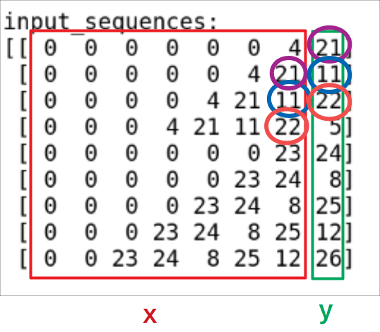
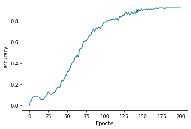

# Text Generation in TensorFlow

  <!-- {"left" : 5.88, "top" : 6.56, "height" : 1.23, "width" : 1.45} -->

---

## Objectives

* Learn text generation algorithms in TensorFlow

---

# Text Generation

---

## Text Generation Use Cases

* Text generation is widely used in applications
  - Text completion in apps and email

* Demo - Gmail AI Helper

<!-- {"left" : 1.3, "top" : 4.49, "height" : 3.29, "width" : 7.67} -->

<!-- {"left" : 0.35, "top" : 1.87, "height" : 2.68, "width" : 9.55} -->


Notes:

---

## How to do Text Generation

* Text is **sequence data**

* Usually **RNNs** and variants (**LSTM**) are used for text generation

* Given a input sequence, predict the next sequence

* `Twinkle twinkle little _______`

---

## Word Based vs. Character Based

* A language model predicts the next word in the sequence based on the specific words that have come before it in the sequence.

* Text can be generated either by character-by-character or word-by-word

* Character based generation:  
`'Please call me ba___'`    (back)

* Word based generation:  
`'Please call me ___'`  (back)

* Character based models typically require more data;  Word baed models can be trained with less data

* Also word based models tend to produce higher accurate predictions

Notes:

---

## Steps in Text Generation

* Get some sample data

* Tokenize and sequence the data

* Train a sequential network (RNN/LSTM) on the data

* Predict

---

## Text Generation: Data

* Let's start with a simple text

```text
Mary had a little lamb,
   Its fleece was white as snow,
And every where that Mary went
   The lamb was sure to go ;
He followed her to school one day
   That was against the rule,
It made the children laugh and play,
   To see a lamb at school.
And so the Teacher turned him out,
   But still he lingered near,
And waited patiently about,
   Till Mary did appear
```

---

## Text Generation: Data

```python

data = """Mary had a little lamb,
   Its fleece was white as snow,
And every where that Mary went
   The lamb was sure to go ;
He followed her to school one day
   That was against the rule,
It made the children laugh and play,
   To see a lamb at school.
And so the Teacher turned him out,
   But still he lingered near,
And waited patiently about,
   Till Mary did appear"""

corpus = data.lower().split("\n")

```

---

## Tokenizing

```python
from tensorflow.keras.preprocessing.text import Tokenizer

tokenizer = Tokenizer(oov_token='<OOV>')
tokenizer.fit_on_texts(corpus)
total_words = len(tokenizer.word_index) + 1

print('total words:', total_words)
print(tokenizer.word_index)

## lookup dicts
word2index = tokenizer.word_index
index2word = {v:k for (k,v) in word2index.items()}
```

```text
total words: 95

{'< OOV >': 1, 'and': 2, 'the': 3, 'mary': 4, 'lamb': 5, 'to': 6, 'he': 7, 'was':
8, 'her': 9, 'you': 10, 'a': 11, 'as': 12, 'that': 13, 'school': 14, 'children':
15, 'at': 16, 'so': 17, 'teacher': 18, 'did': 19, 'if': 20, 'had': 21, 'little':
22, 'its': 23, 'fleece': 24, 'white': 25, 'snow': 26, 'every': 27, 'where': 28,
'went': 29, 'sure': 30, 'go': 31, 'followed': 32, 'one': 33, 'day': 34,
'against': 35, 'rule': 36, 'it': 37, 'made': 38, 'laugh': 39, 'play': 40, 'see':
41, 'turned': 42, 'him': 43, 'out': 44, 'but': 45, 'still': 46, 'lingered': 47,
'near': 48, 'waited': 49, 'patiently': 50, 'about': 51, 'till': 52, 'appear':
53, 'then': 54, 'ran': 55, 'laid': 56, 'his': 57, 'head': 58, 'upon': 59, 'arm':
60, 'said': 61, "i'm": 62, 'not': 63, 'afraid': 64, "you'll": 65, 'keep': 66,
'me': 67, 'from': 68, 'all': 69, 'harm': 70, 'what': 71, 'makes': 72, 'love':
73, 'eager': 74, 'cry': 75, 'o': 76, 'loves': 77, 'know': 78, 'reply': 79,
'each': 80, 'gentle': 81, 'animal': 82, 'in': 83, 'confidence': 84, 'may': 85,
'bind': 86, 'make': 87, 'them': 88, 'follow': 89, 'your': 90, 'call': 91, 'are':
92, 'always': 93, 'kind': 94}

```

---

## Tokenizing

```python
## Basic info
from  collections import Counter
from pprint import pprint

print ('total num words :', len(tokenizer.word_index)+1)
print ('\nSome random word mappings : ')
pprint (sample_from_dict(tokenizer.word_index))


counter = Counter(tokenizer.word_counts)
print ('\nTop-N words:')
pprint(counter.most_common(10))
```

```text
Some random word mappings : 
{'appear': 53,
 'as': 12,
 'bind': 86,
 'every': 27,
 'go': 31,
 'little': 22,
 'your': 90}

Top-N words:
[('and', 8),
 ('the', 8),
 ('mary', 5),
 ('lamb', 5),
 ('to', 4),
 ('he', 4),
 ('was', 3)]
```

---

## Generating Sequences

```python
input_sequences = []
for line in corpus:
    print ('line: ', line)
    token_list = tokenizer.texts_to_sequences([line])[0]
    print ('   token_list: ', token_list)
    for i in range(1, len(token_list)):
        n_gram_sequence = token_list[:i+1]
        print ('     {}: n_gram_sequence: {}'.format(i, n_gram_sequence))
        input_sequences.append(n_gram_sequence)
        print ('     {}: input_sequences: {}'.format(i,input_sequences ))
        print()

```

```text
line:  mary had a little lamb,
   token_list:  [4, 21, 11, 22, 5]
     1: n_gram_sequence: [4, 21]
     1: input_sequences: [[4, 21]]

     2: n_gram_sequence: [4, 21, 11]
     2: input_sequences: [[4, 21], [4, 21, 11]]

     3: n_gram_sequence: [4, 21, 11, 22]
     3: input_sequences: [[4, 21], [4, 21, 11], [4, 21, 11, 22]]

     4: n_gram_sequence: [4, 21, 11, 22, 5]
     4: input_sequences: [[4, 21], [4, 21, 11], [4, 21, 11, 22], [4, 21, 11, 22, 5]]

line:     its fleece was white as snow,
   token_list:  [23, 24, 8, 25, 12, 26]
     1: n_gram_sequence: [23, 24]
     1: input_sequences: [[4, 21], [4, 21, 11], [4, 21, 11, 22], [4, 21, 11, 22, 5], [23, 24]]

     2: n_gram_sequence: [23, 24, 8]
     2: input_sequences: [[4, 21], [4, 21, 11], [4, 21, 11, 22], [4, 21, 11, 22, 5], [23, 24], [23, 24, 8]]

```

---

## Sequencing

* Shape the sequence into x and y

* See next slide for output

```python
# pad sequences 
max_sequence_len = max([len(x) for x in input_sequences])
print ('max_sequence_len: ', max_sequence_len)

input_sequences = np.array(pad_sequences(input_sequences, maxlen=max_sequence_len, padding='pre'))
print ('\ninput_sequences:')
print(input_sequences)

# create predictors and label
xs, labels = input_sequences[:,:-1],input_sequences[:,-1]
print ('\nxs:')
print (xs[:10])
print ('\nlabels')
print (labels[:10])

ys = tf.keras.utils.to_categorical(labels, num_classes=total_words)
print ('\nys')
print (ys[:10])

print ('xs.shape :', xs.shape)
print ('ys.shape :', ys.shape)
```

---

## Sequencing

<!-- {"left" : 6.76, "top" : 0.88, "height" : 4.37, "width" : 3.28} -->

* Note how the output (Y) becomes the next input (X) - look at the color coding

```text
max_sequence_len:  8

input_sequences:
[[ 0  0  0  0  0  0  4 21]
 [ 0  0  0  0  0  4 21 11]
 [ 0  0  0  0  4 21 11 22]
 [ 0  0  0  4 21 11 22  5]
 [ 0  0  0  0  0  0 23 24]
 [ 0  0  0  0  0 23 24  8]
 [ 0  0  0  0 23 24  8 25]
 [ 0  0  0 23 24  8 25 12]
 [ 0  0 23 24  8 25 12 26]

xs:
[[ 0  0  0  0  0  0  4]
 [ 0  0  0  0  0  4 21]
 [ 0  0  0  0  4 21 11]
 [ 0  0  0  4 21 11 22]
 [ 0  0  0  0  0  0 23]
 [ 0  0  0  0  0 23 24]
 [ 0  0  0  0 23 24  8]
 [ 0  0  0 23 24  8 25]
 [ 0  0 23 24  8 25 12]

labels
[21 11 22  5 24  8 25 12 26]

xs.shape : (113, 7)
ys.shape : (113, 95)

```

---

## Model

```python
from tensorflow.keras.layers import Embedding, LSTM, Dense, Bidirectional
from tensorflow.keras.models import Sequential

model = Sequential( [
  # Embedding handles text vectors
  # We use (max_sequence_len-1) because the last one is used as Y
  Embedding(input_dim=total_words, output_dim=64, input_length=max_sequence_len-1),

  # biLSTM for learning
  Bidirectional(LSTM(20)),

  # Softmax for predictions
  Dense(total_words, activation='softmax')
])

model.compile(loss='categorical_crossentropy', optimizer='adam', metrics=['accuracy'])

model.summary()
```

```text
Model: "sequential"
_________________________________________________________________
Layer (type)                 Output Shape              Param #   
=================================================================
embedding (Embedding)        (None, 7, 64)             6080      
_________________________________________________________________
bidirectional (Bidirectional (None, 40)                13600     
_________________________________________________________________
dense (Dense)                (None, 95)                3895      
=================================================================
Total params: 23,575
Trainable params: 23,575
Non-trainable params: 0
```

---

## Training


```python
%%time 

history = model.fit(xs, ys, epochs=200, verbose=1)
```

```text
Epoch 1/200
4/4 [==============================] - 0s 2ms/step - loss: 4.5547 - accuracy: 0.0000e+00
Epoch 2/200
4/4 [==============================] - 0s 3ms/step - loss: 4.5476 - accuracy: 0.0354
...
Epoch 199/200
4/4 [==============================] - 0s 2ms/step - loss: 0.5158 - accuracy: 0.9204
Epoch 200/200
4/4 [==============================] - 0s 2ms/step - loss: 0.5105 - accuracy: 0.9204

CPU times: user 6.76 s, sys: 1.03 s, total: 7.79 s
Wall time: 5.1 s
```

<!-- {"left" : 6.76, "top" : 0.88, "height" : 4.37, "width" : 3.28} -->

---

## Prediction

```python
from tensorflow.keras.preprocessing.sequence import pad_sequences
import numpy as np
np.set_printoptions(formatter={'float': '{: 0.3f}'.format})

seed_text = "the white lamb"

next_words = 20

text = seed_text
for i in range(next_words):
    print ('{} input text : {}'.format(i,text))
    token_list = tokenizer.texts_to_sequences([text])[0]
    print ('{} token_list: {}'.format(i, token_list))
    word_list = []
    token_list = pad_sequences([token_list], maxlen=max_sequence_len-1, padding='pre')
    #print ('{} token_list padded: {}'.format(i, token_list))

    prediction_softmax = model.predict(token_list, verbose=0)
    predicted_idx = [ np.argmax(p) for p in prediction_softmax][0]

    print ('{} predicted_idx : {}'.format(i, predicted_idx))
    output_word = index2word.get(predicted_idx, "< UNK >")
    print ('{} output_word : {}'.format(i, output_word))
    text += " " + output_word
    print ('{} output_text: {}'.format (i, text))
    print()

print('final competed text:\n', text)
```

---

## Prediction Output

```text
0 input text : the white lamb
0 token_list: [3, 25, 5]
0 predicted_idx : 30
0 output_word : sure
0 output_text: the white lamb sure

1 input text : the white lamb sure
1 token_list: [3, 25, 5, 30]
1 predicted_idx : 6
1 output_word : to
1 output_text: the white lamb sure to

2 input text : the white lamb sure to
2 token_list: [3, 25, 5, 30, 6]
2 predicted_idx : 31
2 output_word : go
2 output_text: the white lamb sure to go

3 input text : the white lamb sure to go
3 token_list: [3, 25, 5, 30, 6, 31]
3 predicted_idx : 31
3 output_word : go
3 output_text: the white lamb sure to go go


final competed text:
 the white lamb sure to go go go go school day day day day about go school day day day go day go
```

---

## Text Generation Review

* As you can see our model did ok on limited text :-) 

* But there is a lot of overfitting going on the training

* As we train our models on large amount of text to make it smarter

* How ever, large body of text will need large amount of memory

---

## Lab: Text Generation

<!-- {"left" : 6.76, "top" : 0.88, "height" : 4.37, "width" : 3.28} -->

* **Overview:**
  - Text generation using TensorFlow

* **Approximate run time:**
  - ~30 mins

* **Instructions:**
  - **TEXT-GEN-1**: Basic lab to understand text generation steps
  - **TEXT-GEN-2**: 'State of the union' text generator

Notes:

---

## Review and Q&A

<!-- {"left" : 8.56, "top" : 1.21, "height" : 1.15, "width" : 1.55} -->
<!-- {"left" : 6.53, "top" : 2.66, "height" : 2.52, "width" : 3.79} -->

* Let's go over what we have covered so far

* Any questions?
