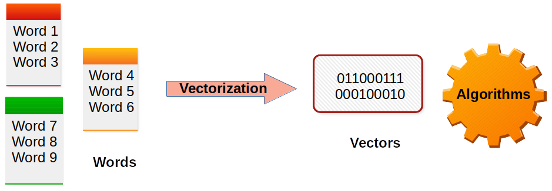
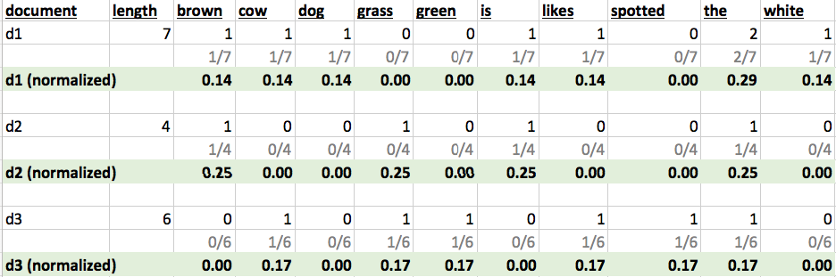
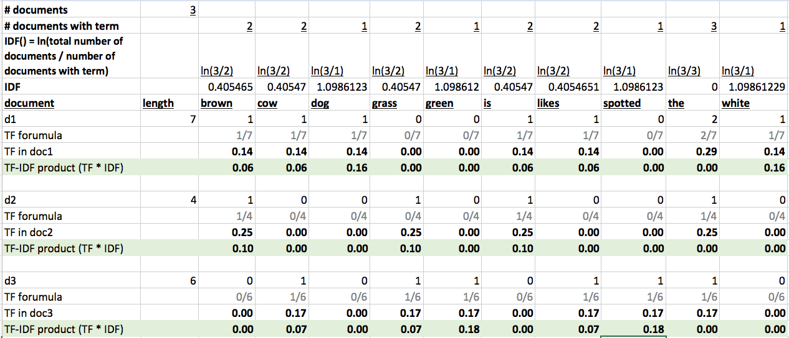
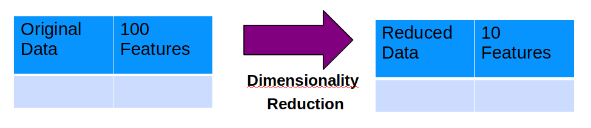
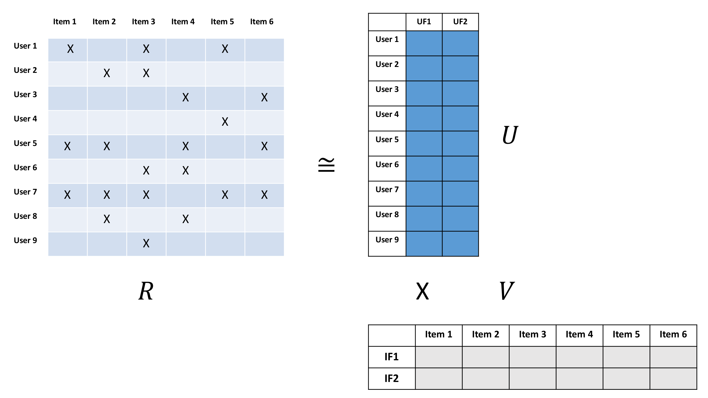

# Text Vectorization

---

## Vectorizing Text

* Machine learning algorithms deal in numbers

* They won't work with plain text (strings)

* So we need to convert text into vectors before applying machine learning algorithms

 <!-- {"left" : 0.75, "top" : 4.92, "height" : 2.91, "width" : 8.74} -->

---

## Text Vectorizing Algorithms

* Machine learning based:
  - CountVectorizer / Document Term Matrix
  - TFIDF
  - Latent Semantic Indexing (LSI)

* Deep learning based:
  - Word2Vec
  - Word Embedings
  - Transformer based algorithms: BERT, Elmo

* References
  - [Getting Started with Text Vectorization](https://towardsdatascience.com/getting-started-with-text-vectorization-2f2efbec6685)

---

# Document Term Matrix

---

## Document Term Matrix (DTM)


 * DTM is a matrix - describes how terms appear in documents

 * Rows correspond to documents

 * Columns correspond to terms

 * It will be a  **sparse**  matrix (not all terms occur on all documents)

     - Libraries need to represent sparse matrix in memory-efficient manner

| Terms -><br/><- documents | brown | dog | black | cat |
|---------------------------|-------|-----|-------|-----|
| doc1 | x | x |  |  |
| doc2 |  |  | x | x |

<!-- {"left" : 0.25, "top" : 4.63, "height" : 1.69, "width" : 9.75} -->

Notes:


---

## Term Document Matrix (TDM)


 * TDM is transposed DTM

 * Rows correspond to terms

 * Columns correspond to documents

| Documents -><br/><- Terms | doc1 | doc2 | doc3 |
|---------------------------|------|------|------|
| brown | x |  |  |
| dog | x |  |  |
| black |  | x |  |
| cat |  | x |  |

<!-- {"left" : 0.25, "top" : 3.52, "height" : 2.69, "width" : 9.75} -->

Notes:


---

## Document Term Matrix (DTM)

<br/>

```text
doc-1:
      The brown cow is sleeping
```
<!-- {"left" : 0, "top" : 1.25, "height" : 0.86, "width" : 5.94} -->


<br/>

```text
doc-2:
      The brown dog is near the brown cow
```
<!-- {"left" : 0, "top" : 2.64, "height" : 0.86, "width" : 7.61} -->

<br/>

```text
doc-3:
      The black cat is sleeping
```
<!-- {"left" : 0, "top" : 4.01, "height" : 0.86, "width" : 5.94} -->

- In Document-Term-Matrix (DTM)
    - We count the word occurrences (frequency) per document

<br />

| Document | black | brown | cat | cow | dog | is | near | sleeping | the |
|----------|-------|-------|-----|-----|-----|----|------|----------|-----|
| doc-1 | 0 | 1 | 0 | 1 | 0 | 1 | 0 | 1 | 1 |
| doc-2 | 0 | 2 | 0 | 2 | 1 | 1 | 1 | 0 | 2 |
| doc-3 | 1 | 0 | 1 | 0 | 0 | 1 | 0 | 1 | 1 |

<!-- {"left" : 0.23, "top" : 6.56, "height" : 2, "width" : 9.79, "columnwidth" : [1.59, 1, 0.98, 0.96, 0.79, 0.85, 0.69, 0.8, 1.37, 0.76]} -->

---

## Document Term Matrix (DTM)

| Document | black | brown | cat | cow | dog | is | near | sleeping | the |
|----------|-------|-------|-----|-----|-----|----|------|----------|-----|
| doc-1 | 0 | 1 | 0 | 1 | 0 | 1 | 0 | 1 | 1 |
| doc-2 | 0 | 2 | 0 | 2 | 1 | 1 | 1 | 0 | 2 |
| doc-3 | 1 | 0 | 1 | 0 | 0 | 1 | 0 | 1 | 1 |

<!-- {"left" : 0.23, "top" : 1.18, "height" : 2, "width" : 9.79, "columnwidth" : [1.59, 1, 0.98, 0.96, 0.79, 0.85, 0.69, 0.8, 1.37, 0.76]} -->

- Querying using DTM:   
  Find all documents that have the word **brown**

- Results: doc-1  and doc-2

- **Question for class:**  
Which result do we show first?  doc1 or doc2 ?

---

## Issues With Document Term Matrix (DTM)

| Document | black | brown | cat | cow | dog | is | near | sleeping | the |
|----------|-------|-------|-----|-----|-----|----|------|----------|-----|
| doc-1 | 0 | 1 | 0 | 1 | 0 | 1 | 0 | 1 | 1 |
| doc-2 | 0 | 2 | 0 | 2 | 1 | 1 | 1 | 0 | 2 |
| doc-3 | 1 | 0 | 1 | 0 | 0 | 1 | 0 | 1 | 1 |

<!-- {"left" : 0.23, "top" : 1.18, "height" : 2, "width" : 9.79, "columnwidth" : [1.59, 1, 0.98, 0.96, 0.79, 0.85, 0.69, 0.8, 1.37, 0.76]} -->

- What is the result when searching for the term __the__ ?

- We get all documents: doc-1, doc-2, doc-3

- Most common words will be present in many documents
    - like stop words (is, the, and ...)
    - and these will pollute the search results

- TF-IDF can help with this issue

---

# TF-IDF

---

## Problem: Searching for Relevant Documents


* We have a collection of text documents (emails / docs)

* We want to search for a keyword across documents

* We want to find the most relevant documents that match the search


 * Boolean searches (if a document has a keyword) may be not adequate

     - Too many results / too few results

     - Results are not ordered (important)

 * How do we prioritize documents?
    - Decide which ones are most important.  
    Think 'Google search': which results to show on the first page


Notes:


---

## TF-IDF


 * "Term Frequency, Inverse Document Frequency"

 * It is a way to score the importance of words (or "terms") in a document based on how frequently they appear across multiple documents

 * Basic algorithm

     - If a word appears frequently in a document, it's important. Give the word a high score

     - But if a word appears in many documents, it's not a unique identifier. Give the word a low score.

 * Common words like "the" and "for", which appear in many documents, will be scaled down.

 * Words that appear frequently in a single document will be scaled up

Notes:


---

## Document Frequency


 * How many times a word occurs in a document


 ```
  Document 1: the brown dog likes the white cow

  Document 2: the grass is brown

  Document 3: the spotted cow likes green grass
```
<!-- {"left" : 0, "top" : 2.16, "height" : 1.74, "width" : 8.44} -->


|  | brown | cow | dog | grass | green | is | likes | spotted | the | white |
|--------|-------|-----|-----|-------|-------|----|-------|---------|-----|-------|
| d1 (7) | 1 | 1 | 1 | 0 | 0 | 1 | 1 | 0 | 2 | 1 |
| d2 (4) | 1 | 0 | 0 | 1 | 0 | 1 | 0 | 0 | 1 | 0 |
| d3 (6) | 0 | 1 | 0 | 1 | 1 | 0 | 1 | 1 | 1 | 0 |

<!-- {"left" : 0.38, "top" : 5.15, "height" : 1.59, "width" : 9.49, "columnwidth" : [0.99, 1.04, 0.75, 0.71, 0.97, 0.95, 0.45, 0.83, 1.26, 0.65, 0.89]} -->


Notes:


---

## Term Frequency (TF)


 * A term would appear more times in a lengthier document

 * To normalize, divide the term count by total number of words in document

```
         Number of times term 't' appears in a document
TF(t) = ------------------------------------------------
         Total number of terms in the document

```
<!-- {"left" : 0, "top" : 2.99, "height" : 1.15, "width" : 10.11} -->

 <!-- {"left" : 0.75, "top" : 4.92, "height" : 2.91, "width" : 8.74} -->


Notes:

Source: tf-idf.xls


---

## Inverse Document Frequency (IDF)


 * IDF measures how important a term is

 * When computing TF (previous slide), all terms are considered equally important

 * How ever terms like 'the'  and 'of' (stop words) may appear a lot of times, but have little importance.

 * We need to weigh down frequent terms, and scale up rare ones

 * We use logarithmic scale to get reasonable numbers

 <!-- {"left" : 1.24, "top" : 5.77, "height" : 1.35, "width" : 7.77} -->


Notes:


---

## IDF Example

|                                         |                               |
|-----------------------------------------|-------------------------------|
| Number of words in **document 1**       | 100                           |
| The word **'cat'** appears in document1 | 3 times                       |
| TF (**cat**) in **document 1**          | 3/100= **0.03**               |
|                                         |                               |
| Total number of documents in corpus     | 1 million                     |
| Number of documents with **'cat'**      | 1000                          |
| IDF (**cat**)                           | LN (1,000,000/1000)= **6.91** |
| **TF-IDF (cat in document 1)**          | **0.03 * 6.91= 0.21**         |

<!-- {"left" : 0.25, "top" : 1.7, "height" : 4.5, "width" : 9.75} -->


Notes:

Source : http://www.tfidf.com/


---

## TF-IDF Example

```
  Document 1: the brown dog likes the white cow
  Document 2: the grass is brown
  Document 3: the spotted cow likes green grass
```
<!-- {"left" : 0, "top" : 1.41, "height" : 1.15, "width" : 8.61} -->

<!-- {"left" : 1.02, "top" : 3, "height" : 3.53, "width" : 8.21} -->


**You can play with the excel spreadsheet**

Notes:


---

## TF-IDF Example

```
  Document 1: the brown dog likes the white cow
  Document 2: the grass is brown
  Document 3: the spotted cow likes green grass
```
<!-- {"left" : 0, "top" : 1.23, "height" : 1.15, "width" : 8.61} -->


| term | d1 | d2 | d3 | Document rank |
|---------|------|------|------|---------------|
| brown | 0.06 | 0.10 | 0 | d2,  d1 |
| cow | 0.06 | 0 | 0.07 | d3,  d1 |
| dog | 0.16 | 0 | 0 | d1 |
| grass | 0 | 0.10 | 0.07 | d2,  d3 |
| green | 0 | 0 | 0.18 | d3 |
| is | 0.06 | 0.10 | 0 | d2 |
| likes | 0.06 | 0 | 0.07 | d3,  d1 |
| spotted | 0 | 0 | 0.18 | d3 |
| the | 0 | 0 | 0 | All zero |
| white | 0.16 | 0 | 0 | d1 |

<!-- {"left" : 1.65, "top" : 2.76, "height" : 5.5, "width" : 7.99, "columnwidth" : [1.39, 1.39, 1.39, 1.39, 1.39]} -->

Notes:


---

## TF-IDF with SciKit Learn Code

```python
from sklearn.feature_extraction.text import TfidfVectorizer

d0 = "the brown dog likes the white cow"
d1 = "the grass is brown"
d2 = "the spotted cow likes green grass"
documents = [d0,d1,d2]
tf = TfidfVectorizer(analyzer='word', ngram_range=(1,1),
                    min_df = 0, stop_words=None)
tfidf_matrix = tf.fit_transform(documents)
print(tfidf_matrix)  # document term matrix

# document-term matrix
#  (0, 8)	0.521500948636
#  (0, 0)	0.335763711163
#  ...
#  (1, 8)	0.373118805931
#  (1, 0)	0.480458397292

feature_names = tf.get_feature_names()
for i, feature in enumerate(feature_names):
    print(i,feature)
feature vectors
# 0 brown
# 1 cow
# 2 dog
...
```
<!-- {"left" : 0.0, "top" : 1.2, "height" : 6.38, "width" : 9.48} -->

Notes:

---

## Lab: Text Analytics: TFIDF Intro

<!-- {"left" : 6.97, "top" : 1.04, "height" : 4.09, "width" : 3.07} -->

* **Overview:**
  - TFIDF
  - Calculate and understand TF-IDF scores

* **Approximate time:**
  - 15 mins

* **Instructions**
  - **TFIDF-1** : Use TF-IDF to vectorize text

Notes:

---

## Lab: TFIDF With SciKit-Learn

<!-- {"left" : 6.97, "top" : 1.04, "height" : 4.09, "width" : 3.07} -->

* **Overview:**
  - Calculate TF-IDF with SciKit-Learn

* **Approximate time:**
  - 15 mins

* **Instructions**
  - **TFIDF-2** : Use TF-IDF with SciKit Learn

Notes:

---

# Latent Semantic Indexing (LSI)

---

## Dimensionality Reduction of Document-Term Matrix

* The Document-Term matrix is usually *very* dimensinoal
  - Typically 10k to millions of dimensions!!
  - With all n-gram combinations it could be 10s-100s of Millions of dimensions!
  - every instance of a word or n-gram is a dimension
  - We usually use a sparse vector / sparse matrix representation

* Can be filtered somewhat to exclude very uncommmon words or n-grams
  - but some uncommon word can be very important
  - sometimes in fact the most important term is an uncommon one.

* Can we reduce dimensionality of this huge matrix?
  - Yes! We can apply **Dimensionality Reduction**

---

## PCA

* PCA is effective at reducing dimensions

* It is formed by taking the SVD of the Covariance matrix of the dimenisions

* But PCA works better for dense dimensions of numeric data.

* Natural Language has sparse dimensions of TF-IDF scores

* PCA is not an ideal fit

* References:
  - [A One-Stop Shop for Principal Component Analysis](https://towardsdatascience.com/a-one-stop-shop-for-principal-component-analysis-5582fb7e0a9c)

<!-- {"left" : 0.91, "top" : 2.16, "height" : 4.74, "width" : 8.43} -->

---

## Latent Semantic Indexing (LSI)

* Latent means hidden; it means we are trying to find "hidden" features that help us predict the data

* The number of latent features is defined by the "rank"

* Semantic means grammatical context;   But LSI is using a Bag-of-Words representation which is not semantic!
  - But the idea is that using a lot of data, we can infer relationships about the meaning

* LSI is a low-rank **approximation** of the original matrix.
  - Wait... isn't approximation bad? Wouldn't we rather get exact representation?
  - Not necessarily!  The original matrix is very noisy
  - LSI can help "de-noisify" the matrix

* References:
  - [LSI animation](https://upload.wikimedia.org/wikipedia/commons/transcoded/7/70/Topic_model_scheme.webm/Topic_model_scheme.webm.480p.vp9.webm#t=00:00:01,00:00:17.600)

---

## How LSI works

<!-- {"left" : 0.91, "top" : 2.16, "height" : 4.74, "width" : 8.43} -->

* LSI uses the Singular Value Decomposition to find two matrices U and V
  - U is the tall-skinny matrix
  - V is the short-fat matrix
* U and V are dense matrices of a pre-defined **rank**
  - the **rank** is the numbe of columns in **U** -- the tall skinny
  - the **rank** is the number of rows in **V** -- the short fat
* Usually, we use an **approximation** of the SVD such as ALS
  - Alternating Least Squares
* The result is that we get 2 **dense** matrices
  - These can be effectively stored and solved!

---

## Result of LSI

* LSI gives us an approximation the the TF-IDF matrix that is both:
  - much smaller
  - usually more accurate for new data
* LSI is very effective at problems like:
  - Document Similarity
  - Document Categorization
  - Clustering
  - Keyword extraction

* Problems with LSI
  - bag-of-words limitations
  - TF-IDF limitations (thouguh we don't necessarily need to use tf-idf)

---

## Beyond TF-IDF

* In the next sections, we will look at more advanced algorithms

* These are based on neural network (or deep learning)
  - Word2Vec
  - Word Embeddings
  - Transformer models : BERT, ELMO ..etc

---

## Review and Q&A

<!-- {"left" : 8.56, "top" : 1.21, "height" : 1.15, "width" : 1.55} -->
<!-- {"left" : 6.53, "top" : 2.66, "height" : 2.52, "width" : 3.79} -->

* Let's go over what we have covered so far

* Any questions?
