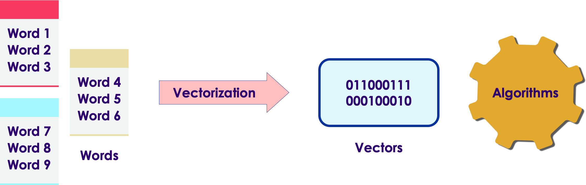

# Text Vectorization

---

## Vectorizing Text

* Machine learning algorithms deal in numbers

* They won't work with plain text (strings)

* So we need to convert text into vectors before applying machine learning algorithms

 <!-- {"left" : 3.16, "top" : 5.97, "height" : 3.72, "width" : 11.19} -->

---

## Text Vectorizing Algorithms

* Machine learning based:
  - Bag-of-Words (CountVectorizer / Document Term Matrix)
  - TFIDF
  - Latent Semantic Indexing (LSI)

* Deep learning based:
  - Word2Vec
  - Word Embedings
  - Transformer based algorithms: BERT, Elmo

* References
  - [Getting Started with Text Vectorization](https://towardsdatascience.com/getting-started-with-text-vectorization-2f2efbec6685)

---

# Bag of Words (BOW)

---


## Bag of Words (BoW)


* Given we have 3 documents like these

<br/>

```text
doc-1: The brown cow is sleeping

doc-2: The brown dog is near the brown cow
      
doc-3: The black cat is sleeping
```
<!-- {"left" : 0.8, "top" : 2.67, "height" : 1.92, "width" : 8.63} -->

* We count the word occurrences (frequency) per document

* The matrix is ordered by word alphabetic order


| Document | black | brown | cat | cow | dog | is | near | sleeping | the |
|----------|-------|-------|-----|-----|-----|----|------|----------|-----|
| doc-1 | 0 | 1 | 0 | 1 | 0 | 1 | 0 | 1 | 1 |
| doc-2 | 0 | 2 | 0 | 2 | 1 | 1 | 1 | 0 | 2 |
| doc-3 | 1 | 0 | 1 | 0 | 0 | 1 | 0 | 1 | 1 |

<!-- {"left" : 0.6, "top" : 7.16, "height" : 1, "width" : 16.3, "columnwidth" : [2.22, 1.51, 1.55, 1.7, 1.73, 1.87, 1.19, 1.46, 1.81, 1.25]} -->


* So the documents are represented in the following vector form

```text
doc-1 : [0,  1,  0,  1,  0,  1,  0,  1,  1]
doc-2 : [0,  2,  0,  2,  1,  1,  1,  0,  2]
doc-3 : [1,  0,  1,  0,  0,  1,  0,  1,  1]
```
<!-- {"left" : 0.8, "top" : 10.46, "height" : 1.15, "width" : 7.94} -->

---

## Bag of Words

| Document | black | brown | cat | cow | dog | is | near | sleeping | the |
|----------|-------|-------|-----|-----|-----|----|------|----------|-----|
| doc-1 | 0 | 1 | 0 | 1 | 0 | 1 | 0 | 1 | 1 |
| doc-2 | 0 | 2 | 0 | 2 | 1 | 1 | 1 | 0 | 2 |
| doc-3 | 1 | 0 | 1 | 0 | 0 | 1 | 0 | 1 | 1 |

<!-- {"left" : 0.6, "top" : 2.64, "height" : 1, "width" : 16.3, "columnwidth" : [2.22, 1.51, 1.55, 1.7, 1.73, 1.87, 1.19, 1.46, 1.81, 1.25]} -->


- Querying using BoW:   
  Find all documents that have the word **brown**

- Results: doc-1  and doc-2

- **Question for class:**  
Which result do we show first?  doc1 or doc2 ?

---

## Bag of Words Takeaways

* Strengths:
  * Very simple!
  * Has been used successfully for a long time for a wide variety of NLP tasks

* Weaknesses:
  * (see next slides for more details)
  * High frequency words (like 'the') will pollute the matrix
    - We can remove these words during pre-processing to alleviate this somewhat
  * For large corpus the matrix will be very sparse (thousands of columns, one for each word, and only few columns are populated)
  * Meaning of words is lost

---

## Weakness of BoW: High Frequency Words

| Document | black | brown | cat | cow | dog | is | near | sleeping | the |
|----------|-------|-------|-----|-----|-----|----|------|----------|-----|
| doc-1 | 0 | 1 | 0 | 1 | 0 | 1 | 0 | 1 | 1 |
| doc-2 | 0 | 2 | 0 | 2 | 1 | 1 | 1 | 0 | 2 |
| doc-3 | 1 | 0 | 1 | 0 | 0 | 1 | 0 | 1 | 1 |

<!-- {"left" : 0.6, "top" : 2.64, "height" : 1, "width" : 16.3, "columnwidth" : [2.22, 1.51, 1.55, 1.7, 1.73, 1.87, 1.19, 1.46, 1.81, 1.25]} -->

- What is the result when searching for the term __the__ ?

- We get all documents: doc-1, doc-2, doc-3

- Most common words will be present in many documents
  - like stop words (is, the, and ...)
  - and these will pollute the search results

- TF-IDF can help with this issue

---

## Weakness of BoW: Loss of Meaning

* Let's consider the following text

```text
Jane runs faster than Dan

Dan runs faster than Jane
```
<!-- {"left" : 0.8, "top" : 2.63, "height" : 1.15, "width" : 4.94} -->

* We get the same BoW representation for both sentences;  But the meanings of these are very different


| Document | dan | faster | jane | runs | than |
|----------|-----|--------|------|------|------|
| doc 1    | 1   | 1      | 1    | 1    | 1    |
| doc 2    | 1   | 1      | 1    | 1    | 1    |

<!-- {"left" : 2.39, "top" : 5.3, "height" : 1, "width" : 12.73} -->

* BoW technique looses the meaning of the words

---

# TF-IDF

---

## Searching for Relevant Documents


* We have a collection of text documents (emails / docs)

* We want to search for a keyword across documents

* We want to find the most relevant documents that match the search


 * Boolean searches (if a document has a keyword) may be not adequate

     - Too many results / too few results

     - Results are not ordered (important)

 * How do we prioritize documents?
    - Decide which ones are most important.  
    Think 'Google search': which results to show on the first page


Notes:


---

## TF-IDF


 * "Term Frequency, Inverse Document Frequency"

 * It is a way to score the importance of words (or "terms") in a document based on how frequently they appear across multiple documents

 * Basic algorithm

     - If a word appears frequently in a document, it's important. Give the word a high score

     - But if a word appears in many documents, it's not a unique identifier. Give the word a low score.

 * Common words like "the" and "for", which appear in many documents, will be scaled down.

 * Words that appear frequently in a single document will be scaled up

Notes:


---

## Document Frequency


 * How many times a word occurs in a document


 ```text
  Document 1: the brown dog likes the white cow

  Document 2: the grass is brown

  Document 3: the spotted cow likes green grass
```
<!-- {"left" : 0.8, "top" : 2.81, "height" : 2.03, "width" : 9.85} -->


|  | brown | cow | dog | grass | green | is | likes | spotted | the | white |
|--------|-------|-----|-----|-------|-------|----|-------|---------|-----|-------|
| d1 (7) | 1 | 1 | 1 | 0 | 0 | 1 | 1 | 0 | 2 | 1 |
| d2 (4) | 1 | 0 | 0 | 1 | 0 | 1 | 0 | 0 | 1 | 0 |
| d3 (6) | 0 | 1 | 0 | 1 | 1 | 0 | 1 | 1 | 1 | 0 |

<!-- {"left" : 0.58, "top" : 6.67, "height" : 1, "width" : 16.35} -->


Notes:


---

## Term Frequency (TF)


 * A term would appear more times in a lengthier document

 * To normalize, divide the term count by total number of words in document

```text
         Number of times term 't' appears in a document
TF(t) = ------------------------------------------------
         Total number of terms in the document

```
<!-- {"left" : 0.8, "top" : 3.44, "height" : 1.35, "width" : 11.81} -->

 <!-- {"left" : 2.25, "top" : 6.15, "height" : 4.32, "width" : 13} -->


Notes:

Source: tf-idf.xls


---

## Inverse Document Frequency (IDF)


 * IDF measures how important a term is

 * When computing TF (previous slide), all terms are considered equally important

 * How ever terms like 'the'  and 'of' (stop words) may appear a lot of times, but have little importance.

 * We need to weigh down frequent terms, and scale up rare ones

 * We use logarithmic scale to get reasonable numbers

 <!-- {"left" : 2.59, "top" : 7.57, "height" : 2.13, "width" : 12.31} -->
 


Notes:


---

## IDF Example

|                                         |                               |
|-----------------------------------------|-------------------------------|
| Number of words in **document 1**       | 100                           |
| The word **'cat'** appears in document1 | 3 times                       |
| TF (**cat**) in **document 1**          | 3/100= **0.03**               |
|                                         |                               |
| Total number of documents in corpus     | 1 million                     |
| Number of documents with **'cat'**      | 1000                          |
| IDF (**cat**)                           | LN (1,000,000/1000)= **6.91** |
| **TF-IDF (cat in document 1)**          | **0.03 * 6.91= 0.21**         |

<!-- {"left" : 0.62, "top" : 2.68, "height" : 1, "width" : 16.26} -->


Notes:

Source : http://www.tfidf.com/


---

## TF-IDF Example

```text
  Document 1: the brown dog likes the white cow
  Document 2: the grass is brown
  Document 3: the spotted cow likes green grass
```
<!-- {"left" : 0.8, "top" : 2.26, "height" : 1.55, "width" : 11.6} -->

<!-- {"left" : 2.3, "top" : 4.83, "height" : 5.54, "width" : 12.89} -->


Notes:


---

## TF-IDF Example

```text
  Document 1: the brown dog likes the white cow
  Document 2: the grass is brown
  Document 3: the spotted cow likes green grass
```
<!-- {"left" : 0.8, "top" : 2, "height" : 1.61, "width" : 12.04} -->


| term | d1 | d2 | d3 | Document rank |
|---------|------|------|------|---------------|
| brown | 0.06 | 0.10 | 0 | d2,  d1 |
| cow | 0.06 | 0 | 0.07 | d3,  d1 |
| dog | 0.16 | 0 | 0 | d1 |
| grass | 0 | 0.10 | 0.07 | d2,  d3 |
| green | 0 | 0 | 0.18 | d3 |
| is | 0.06 | 0.10 | 0 | d2 |
| likes | 0.06 | 0 | 0.07 | d3,  d1 |
| spotted | 0 | 0 | 0.18 | d3 |
| the | 0 | 0 | 0 | All zero |
| white | 0.16 | 0 | 0 | d1 |

<!-- {"left" : 0.95, "top" : 5.03, "height" : 1, "width" : 15.6} -->

Notes:


---

## TF-IDF with SciKit Learn Code

```python
from sklearn.feature_extraction.text import TfidfVectorizer

d0 = "the brown dog likes the white cow"
d1 = "the grass is brown"
d2 = "the spotted cow likes green grass"
documents = [d0,d1,d2]

tf = TfidfVectorizer(analyzer='word', ngram_range=(1,1), min_df = 0, stop_words=None)

tfidf_matrix = tf.fit_transform(documents)

print (tfidf_matrix)
print (tfidf_matrix.transpose())
```
<!-- {"left" : 0.8, "top" : 2.1, "height" : 4.07, "width" : 14.94} -->


```text
   brown   cow   dog  grass  green    is  likes  spotted   the  white
0   0.34  0.34  0.44   0.00   0.00  0.00   0.34     0.00  0.52   0.44
1   0.48  0.00  0.00   0.48   0.00  0.63   0.00     0.00  0.37   0.00
2   0.00  0.38  0.00   0.38   0.49  0.00   0.38     0.49  0.29   0.00
```
<!-- {"left" : 0.8, "top" : 6.41, "height" : 1.44, "width" : 12.28} -->

```text
            0     1     2
brown    0.34  0.48  0.00
cow      0.34  0.00  0.38
dog      0.44  0.00  0.00
grass    0.00  0.48  0.38
green    0.00  0.00  0.49
is       0.00  0.63  0.00
likes    0.34  0.00  0.38
spotted  0.00  0.00  0.49
the      0.52  0.37  0.29
white    0.44  0.00  0.00
```
<!-- {"left" : 0.8, "top" : 8.09, "height" : 3.49, "width" : 4.94} -->

Notes:

---

## Text Classification Workflow

* Here is a typical workflow of working with text

* We first convert the text into vectors

* Then these vectors can be used as input to other algorithms (e.g. classification algorithms)

 <!-- {"left" : 1.62, "top" : 6.07, "height" : 3.02, "width" : 14.26} -->


---

## Beyond TF-IDF

* In the next sections, we will look at more advanced algorithms

* These are based on neural network (or deep learning)
  - Word2Vec
  - Word Embeddings
  - Transformer models : BERT, ELMO ..etc

---

## Lab: TF-IDF Intro

 <!-- {"left" : 12.9, "top" : 1.89, "height" : 5.61, "width" : 4.2} -->

* **Overview:**
  - Calculate and understand TF-IDF scores

* **Approximate time:**
  - 15 mins

* **Instructions**
  - **TFIDF-1** : Use TF-IDF to vectorize text

Notes:

---

## Lab: TF-IDF + Naive Bayes

 <!-- {"left" : 12.9, "top" : 1.89, "height" : 5.61, "width" : 4.2} -->

* **Overview:**
  - Spam classification using TFIDF and Naive Bayes

* **Approximate time:**
  - 30 mins

* **Instructions**
  - **SCIKIT-1:** Spam classification

Notes:

---
## Review and Q&A

<!-- {"left" : 12.88, "top" : 2.06, "height" : 2.68, "width" : 3.63} -->    

* Let's go over what we have covered so far

* Any questions?

<!-- {"left" : 4.58, "top" : 5.2, "height" : 5.56, "width" : 8.33} -->    

---

# Backup Slides

---

# Latent Semantic Indexing (LSI)

---

## Dimensionality Reduction of Document-Term Matrix

* The Document-Term matrix is usually *very* dimensinoal
  - Typically 10k to millions of dimensions!!
  - With all n-gram combinations it could be 10s-100s of Millions of dimensions!
  - every instance of a word or n-gram is a dimension
  - We usually use a sparse vector / sparse matrix representation

* Can be filtered somewhat to exclude very uncommmon words or n-grams
  - but some uncommon word can be very important
  - sometimes in fact the most important term is an uncommon one.

* Can we reduce dimensionality of this huge matrix?
  - Yes! We can apply **Dimensionality Reduction**

---

## PCA

* PCA is effective at reducing dimensions

* It is formed by taking the SVD of the Covariance matrix of the dimenisions

* But PCA works better for dense dimensions of numeric data.

* Natural Language has sparse dimensions of TF-IDF scores

* PCA is not an ideal fit

* References:
  - [A One-Stop Shop for Principal Component Analysis](https://towardsdatascience.com/a-one-stop-shop-for-principal-component-analysis-5582fb7e0a9c)

 <!-- {"left" : 1.54, "top" : 7.04, "height" : 3.14, "width" : 14.41} -->    


---

## Latent Semantic Indexing (LSI)

* Latent means hidden; it means we are trying to find "hidden" features that help us predict the data

* The number of latent features is defined by the "rank"

* Semantic means grammatical context;   But LSI is using a Bag-of-Words representation which is not semantic!
  - But the idea is that using a lot of data, we can infer relationships about the meaning

* LSI is a low-rank **approximation** of the original matrix.
  - Wait... isn't approximation bad? Wouldn't we rather get exact representation?
  - Not necessarily!  The original matrix is very noisy
  - LSI can help "de-noisify" the matrix

* References:
  - [LSI animation](https://upload.wikimedia.org/wikipedia/commons/transcoded/7/70/Topic_model_scheme.webm/Topic_model_scheme.webm.480p.vp9.webm#t=00:00:01,00:00:17.600)

---

## How LSI works

 <!-- {"left" : 0.85, "top" : 2.41, "height" : 8.89, "width" : 15.8} -->    

* LSI uses the Singular Value Decomposition to find two matrices U and V
  - U is the tall-skinny matrix
  - V is the short-fat matrix
* U and V are dense matrices of a pre-defined **rank**
  - the **rank** is the numbe of columns in **U** -- the tall skinny
  - the **rank** is the number of rows in **V** -- the short fat
* Usually, we use an **approximation** of the SVD such as ALS
  - Alternating Least Squares
* The result is that we get 2 **dense** matrices
  - These can be effectively stored and solved!

---

## Result of LSI

* LSI gives us an approximation the the TF-IDF matrix that is both:
  - much smaller
  - usually more accurate for new data
* LSI is very effective at problems like:
  - Document Similarity
  - Document Categorization
  - Clustering
  - Keyword extraction

* Problems with LSI
  - bag-of-words limitations
  - TF-IDF limitations (thouguh we don't necessarily need to use tf-idf)

