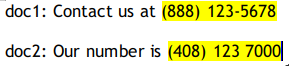

# Topic Modeling

---

# Topic Modeling

---

## What's wrong with TF-IDF/ Word2Vec

* Very high dimensionality (thousands – millions of dimensions!

* Doesn't really look at the relationship between documents in corpus

<!-- {"left" : 0.75, "top" : 4.92, "height" : 2.91, "width" : 8.74} -->

Notes:

---

## Rule Based Mining

* Rule-based text mining use regular expressions or dictionary based keyword searching techniques

* For example, find US-based phone numbers (10 digits) in text
  - This can be done via regular expressions
  - A simple regex can be :  
   `([0-9][0-9][0-9]) [0-9][0-9][0-9][- ]+[0-9][0-9][0-9][0-9]`
  
<!-- {"left" : 0.75, "top" : 4.92, "height" : 2.91, "width" : 8.74} -->

---

## Rule Based Mining

* Keyword search example: Find city names in text

* We could have a dictionary of all cities  
  e.g.  `London, San Francisco`

* And then do keyword searches

<!-- {"left" : 0.75, "top" : 4.92, "height" : 2.91, "width" : 8.74} -->

---

## Topic Modeling

<!-- {"left" : 0.75, "top" : 4.92, "height" : 2.91, "width" : 8.74} -->

* __Topic Modeling__ does the following:
  - First, finds a list of the topics in the documents
  - Second, group the documents by the discovered topics

* So from this example, we have 2 topic clusters:
  - 'virus',  'health',  'doctor'  :  (doc1 , doc2)
  - 'farm',   'corn'  ,  'crop'  : (doc3 , doc4)

* Topic Modeling automatically finds topic clusters
  - It uses **Unsupervised Machine Learning** method
  - Topics are **inferred** not specified!

---

## Topic Modeling

* Here is another example
  - doc1 has a prominent topic-2, along with topic-1
  - doc-2 features topic-4 prominently along with other topics
* [Reference](https://engineering.flipboard.com/2017/02/storyclustering)

<!-- {"left" : 0.75, "top" : 4.92, "height" : 2.91, "width" : 8.74} -->

---

## Example: Wikipedia

* Here is a [demo](https://upload.wikimedia.org/wikipedia/commons/thumb/7/70/Topic_model_scheme.webm/600px-seek%3D17.6-Topic_model_scheme.webm.jpg)

<!--  {"left" : 5.08, "top" : 1.25, "height" : 4.94, "width" : 4.92} -->

Notes:

---

## Example: Google News

<!--  {"left" : 5.08, "top" : 1.25, "height" : 4.94, "width" : 4.92} -->

* [Google News](https://news.google.com/) automatically clusters news stories by **topic**

* This is the canonical use case for topic modeling.

* Consider that on a given day news stories are not randomly distributed!
  - They cluster
  - The largest news topics of the day will have a lot of of news stories
  - These news stories will have things in common for sure
  - because they are the same topic.

---

## Example: Google News

<!--  {"left" : 5.08, "top" : 1.25, "height" : 4.94, "width" : 4.92} -->

* This is an **unsupervised** machine learning problem
  - We can't pre-define topics for news
  - The big news story tomorrow is inherently unpredictable.
  - We have to infer the topics from the data
  - Using a clustering approach.

* Can we use **k-means** or an ordinary clustering model?
  - we could, but k-means is likely to get confused
  - There are many terms that are present in every document
  - We want to cluster on the terms that really bring the topics together

---

## Topic Modeling vs. Topic Classifications

* Let's start with an example, of analyzing news stories

```text
doc-1: Stock market went up today on positive earnings

doc-2: Apple earnings beat analysts' expectations

doc-3: Hurricane Anna will make landfall tomorrow

doc-4: Coastal communities are experiencing strong winds and heavy rainfall due to the hurricane
```

* Topic Modeling can tell us we have 2 topics and cluster the documents by topics
  - 'market',  'earning' :  doc-1, doc-2
  - 'hurricane', 'rainfall',  'winds' :  doc-3,  doc-4
* How ever, it doesn't tell us that 'topic-1' is **economy** and 'topic-2' is **weather**
  * We will use **Topic Classification** for that purpose
* Topic Modeling is **unsupervised**
* Topic classification is **supervised** (trained on labeled data)

---

## Topic Modeling Algorithms

* There are various algorithms we can use for topic modeling

* Latent Dirichlet Allocation (LDA)

* Latent Semantic Analysis (LSA)
  - Uses TF-IDF to compute word frequencies
  - Then uses SVD (Singular value Decomposition) method to reduce the dimensionality of 'Document-Term-Matrix (DTM)'

* It is based on what is known as the [distributional hypothesis](https://en.wikipedia.org/wiki/Distributional_semantics) which states that the semantics of words can be grasped by looking at the contexts the words appear in

---

## Latent Semantic Analysis (LSA)

* Here is an example of DTM  ([source](https://monkeylearn.com/blog/introduction-to-topic-modeling/))

<!-- {"left" : 0.75, "top" : 4.92, "height" : 2.91, "width" : 8.74} -->

---

## Latent Semantic Analysis (LSA)

* Here is an example of how DTM is decomposed into 2 matrices ([source](https://monkeylearn.com/blog/introduction-to-topic-modeling/))

<!-- {"left" : 0.75, "top" : 4.92, "height" : 2.91, "width" : 8.74} -->

---

## Latent Dirichlet Allocation (LDA)

* LDA is the most common way of doing topic modeling

* LDA assumes
  - documents are composed of mixture of topics
  - topics then generate words based on their probability distribution

* The main difference between LSA and LDA is that LDA assumes that the distribution of topics in a document and the distribution of words in topics are Dirichlet distributions

* [Paper](http://www.jmlr.org/papers/volume3/blei03a/blei03a.pdf)

---

## Latent Dirichlet Allocation (LDA)

* LDA is a matrix factorization technique

* Here is an example of 'document term matrix (DTM)' is broken down into 2 matrices

* It Iterates through each word `w` for each document `d` and tries to adjust the current topic's probability

* See [here](https://en.wikipedia.org/wiki/Latent_Dirichlet_allocation) for detailed explanation of how this probabilities are calculated

* After a number of iterations, a steady state is achieved where the document topic and topic term distributions are fairly good. This is the convergence point of LDA

<!-- {"left" : 0.75, "top" : 4.92, "height" : 2.91, "width" : 8.74} -->

Notes:

---

## LDA vs. K-Means

<!-- {"left" : 0.75, "top" : 4.92, "height" : 2.91, "width" : 8.74} -->

* In __K-means__ an entity can only belong in __one cluster__ ; This is __hard clustering__

* LDA allows for __fuzzy memberships__ ; meaning one entity can be part of multiple clusters.

* A document can have multiple topics

* A topic can be present in multiple documents

---

## LDA Example

```python
# create sample documents
doc_a = "Brocolli is good to eat. My brother likes to eat good brocolli, but not my mother."
doc_b = "My mother spends a lot of time driving my brother around to baseball practice."
doc_c = "Some health experts suggest that driving may cause increased tension and blood pressure."
doc_d = "I often feel pressure to perform well at school, but my mother never seems to drive my brother \
to do better."
doc_e = "Health professionals say that brocolli is good for your health." 

# compile sample documents into a list
doc_set = [doc_a, doc_b, doc_c, doc_d, doc_e]
```

---

## LDA Example: Cleanup

```python
from nltk.tokenize import RegexpTokenizer
from nltk.corpus import stopwords
from nltk.stem.porter import PorterStemmer

tokenizer = RegexpTokenizer(r'\w+')
en_stop = stopwords.words('english')
p_stemmer = PorterStemmer()

# for cleaned tokens
texts = []

# loop through document list
for i in doc_set:
    
    # clean and tokenize document string
    raw = i.lower()
    tokens = tokenizer.tokenize(raw)

    # remove stop words from tokens
    stopped_tokens = [i for i in tokens if not i in en_stop]
    
    # stem tokens
    stemmed_tokens = [p_stemmer.stem(i) for i in stopped_tokens]
    
    # add tokens to list
    texts.append(stemmed_tokens)

print ('raw text:')
print (doc_set)
print ('cleaned text:')
print (texts)
```

---

## LDA Example: Cleanup

* Input text is lowercased and stopwords are removed

```text
raw text:

['Brocolli is good to eat. My brother likes to eat good brocolli, but not my mother.', 

'My mother spends a lot of time driving my brother around to baseball practice.', 

'Some health experts suggest that driving may cause increased tension and blood pressure.', 

'I often feel pressure to perform well at school, but my mother never seems to drive my brother 
  to do better.', 

'Health professionals say that brocolli is good for your health.']

~~~~~~~~~~

cleaned text:

[['brocolli', 'good', 'eat', 'brother', 'like', 'eat', 'good', 'brocolli', 'mother'], 

['mother', 'spend', 'lot', 'time', 'drive', 'brother', 'around', 'basebal', 'practic'], 

['health', 'expert', 'suggest', 'drive', 'may', 'caus', 'increas', 'tension', 'blood', 'pressur'], 

['often', 'feel', 'pressur', 'perform', 'well', 'school', 'mother', 'never', 'seem', 
'drive', 'brother', 'better'], 

['health', 'profession', 'say', 'brocolli', 'good', 'health']]
```

---

## LDA Example: Create Corpus

```python
from gensim import corpora
from pprint import pprint

# turn our tokenized documents into a id <-> term dictionary
dictionary = corpora.Dictionary(texts)
print ('dict: num_tokens : ', len(dictionary))
for (k,v) in dictionary.items():
    print (k,v)
    
# convert tokenized documents into a document-term matrix
corpus = [dictionary.doc2bow(text) for text in texts]
print ('corpus: num_docs : ', len(corpus))
for i, c in enumerate(corpus):
    print("doc" , i, c)
```

---

## LDA Example: Create Corpus

```text

dict: num_tokens :  32
0 brocolli
1 brother
2 eat
3 good
4 like
5 mother
6 around
7 basebal
8 drive
9 lot
10 practic
...

corpus: num_docs :  5

doc 0 [(0, 2), (1, 1), (2, 2), (3, 2), (4, 1), (5, 1)]

doc 1 [(1, 1), (5, 1), (6, 1), (7, 1), (8, 1), (9, 1), (10, 1), (11, 1), (12, 1)]

doc 2 [(8, 1), (13, 1), (14, 1), (15, 1), (16, 1), (17, 1), (18, 1), (19, 1), (20, 1), (21, 1)]

doc 3 [(1, 1), (5, 1), (8, 1), (19, 1), (22, 1), (23, 1), (24, 1), (25, 1), (26, 1), 
      (27, 1), (28, 1), (29, 1)]

doc 4 [(0, 1), (3, 1), (16, 2), (30, 1), (31, 1)]

```

---

## LDA Example: Create LDA Model

* We are looking for 2 topics

```python
from gensim.models.ldamodel import LdaModel
from pprint import pprint

ldamodel = LdaModel(corpus, num_topics=2, id2word = dictionary, passes=20)
print (ldamodel)
# LdaModel(num_terms=32, num_topics=2, decay=0.5, chunksize=2000)


# format : topic  --> list of (probability * word) that belong in that topic
pprint(ldamodel.print_topics(num_topics=topic_count, num_words=4))

# [(0, '0.072*"drive" + 0.043*"health" + 0.043*"pressur" + 0.043*"suggest"'),
#  (1, '0.081*"brocolli" + 0.081*"good" + 0.059*"mother" + 0.059*"brother"')]


ldamodel.print_topic(1)

# '0.081*"brocolli" + 0.081*"good" + 0.059*"mother" + 0.059*"brother" + 0.058*"eat" 
# + 0.058*"health" + 0.035*"like" + 0.035*"perform" + 0.035*"feel" + 0.035*"often"'

```

---

## Further Reading

* [Beginners Guide to Topic Modeling in Python](https://www.analyticsvidhya.com/blog/2016/08/beginners-guide-to-topic-modeling-in-python/)

* [Introduction to Topic Modeling - Monkey Learn](https://monkeylearn.com/blog/introduction-to-topic-modeling/)

* [Topic Modeling in NLP - Towards Data Science](https://towardsdatascience.com/topic-modeling-in-nlp-524b4cffeb68)

---

## Lab: Topic Modeling

<!-- {"left" : 6.76, "top" : 0.88, "height" : 4.37, "width" : 3.28} -->

* **Overview:**
  - Topic modeling with Gensim

* **Approximate run time:**
  - 20-30 mins

* **Instructions:**
  - **gensim-1**: Intro
  - **gensim-2**: Newsgroups

Notes:

---