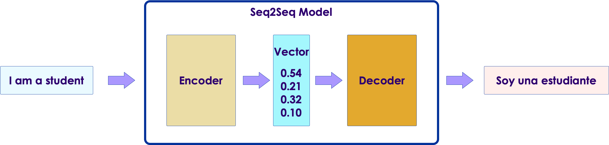
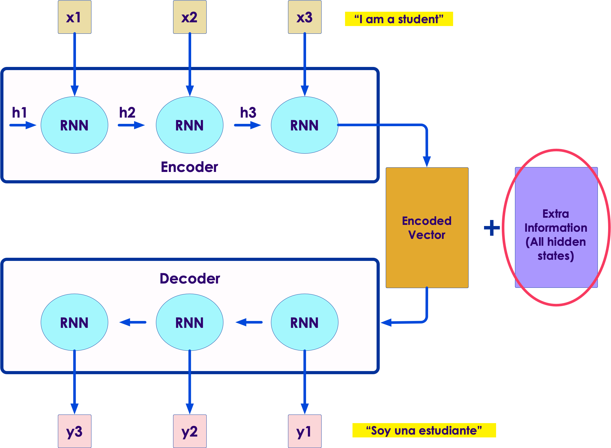
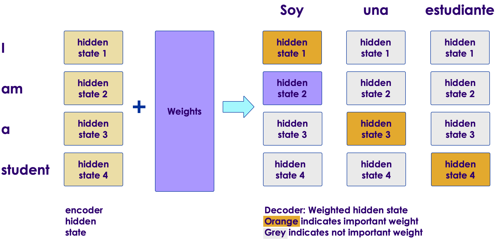

# Transformers

<!-- TODO shiva -->
  <!-- {"left" : 5.88, "top" : 6.56, "height" : 1.23, "width" : 1.45} -->    &nbsp; &nbsp;

---

## Objectives

* Understand Transformer architecture for NLP

---

## Transformers

<!-- TODO shiva -->
  <!-- {"left" : 5.88, "top" : 6.56, "height" : 1.23, "width" : 1.45} -->    &nbsp; &nbsp;
<!-- {"left" : 5.18, "top" : 2.52, "height" : 2.94, "width" : 4.83} -->

* In 2017, in a landmark paper ["Attention is all you need"](https://arxiv.org/abs/1706.03762), researchers from Google, proposed a novel model called **Transformers**

* In 2018, Google [open sourced](https://ai.googleblog.com/2018/11/open-sourcing-bert-state-of-art-pre.html) a state of the art  language model called [BERT (Bidirectional Encoder Representations from Transformers)](https://arxiv.org/abs/1810.04805?source=post_page) based on transformer architecture

* Since then, transformers have taken over NLP world by storm, breaking NLP records and pushing state of the art

* References:
  - Understanding searches better than ever before](https://arxiv.org/abs/1810.04805?source=post_page)
  - [BERT (language model)](https://en.wikipedia.org/wiki/BERT_(language_model))

---

## Transformers

  <!-- {"left" : 5.88, "top" : 6.56, "height" : 1.23, "width" : 1.45} -->    &nbsp; &nbsp;

* The Transformer architecture solved the 2 nagging problems with Seq-2-Seq models
  - Transformers can 'track or remember' long sequences
  - And their operations are parallelizable

* Transformers are one the state of the art models since 2018+

* Let's see a little more details on transformers

---

# Sequence Models

---

## Sequence Models: RNNs

<!-- {"left" : 3.63, "top" : 4.27, "height" : 3.47, "width" : 1.53} -->

* Text is essentially **sequence data**

* For example, to  predict the next word, we need to know the previous words:
  - e.g. `Please call me ____`

* In deep learning we can use **recurrent** models to deal with sequence data

* RNNs 'look back' (or remember) previous inputs to predict the next output

* How ever RNNs tend to suffer from **short term memory**

Notes:

---

## RNNs: Short Term Memory

   <!-- {"left" : 5.78, "top" : 1.06, "height" : 2.31, "width" : 4.34} -->

* Memory of the first inputs (hidden state) gradually fades away over multiple steps

* In this diagram below, we can see the 'influence' of word **'what' (color black)** is diminishing with each step

  - And in the last step word **'?'** the color black is almost non-existing

* **RNNs suffer from short term memory**

* What this means is, RNNs can't remember / process 'long sequences' (e.g. long sentences)

* [Source](https://towardsdatascience.com/illustrated-guide-to-recurrent-neural-networks-79e5eb8049c9)

---

## Short Term Memory Problem

* Consider the following word completion example

* `I lived in China, for most of my teenage years, so I speak fluent ____`

* The answer is **Mandarin**

* But which is the key to determining the answer?
  - Not the adjacent words : **my teenage years**
  - But : **lived in China** - from start of the sentence

* So to make the correct prediction, the network has to 'remember' early words (lived in China)

* RNN's short term memory makes it hard to do so

---

## Fixing the Short Term Memory Problem

* There are other architectures like LSTM were developed  to fix the short term memory problem

* LSTMs can remember longer sequences

* How ever even they are limited on how much sequence they can remember

* The **attention** mechanism fixes that
  - Given enough resources, **attention** can remember entire sequence, and can be more accurate

---

# Encoder / Decoder

---

## Seq2Seq Models

* **Seq2Seq** model translates one sequence into another
  - For example English sentence --> Spanish

* They are used in tasks like machine translation, text summarization, and image captioning

* [Google Translate](https://translate.google.com/) started [using these models in production in 2016](https://blog.google/products/translate/found-translation-more-accurate-fluent-sentences-google-translate/)

* Reference papers:
  - [Sequence to Sequence Learning
with Neural Networks, 2014](https://arxiv.org/abs/1409.3215)
  - [Learning Phrase Representations using RNN Encoder-Decoder for Statistical Machine Translation, 2014](https://arxiv.org/abs/1406.1078)

<!-- TODO shiva -->
<!-- {"left" : 6.76, "top" : 0.88, "height" : 4.37, "width" : 3.28} -->
---

## Encoder Decoder Architecture

* **Seq2Seq** models are based on **encoder-decoder** architecture

* The model consists of 3 parts:
  - encoder,
  - intermediate vector
  - and decoder

<!-- TODO shiva -->
<!-- {"left" : 6.76, "top" : 0.88, "height" : 4.37, "width" : 3.28} -->

Notes:

---

## Encoder Decoder Architecture

* Both encoder and decoder are made up several stacks of RNNs (or LSTMs or GRUs)

<!-- TODO shiva -->
<!-- {"left" : 6.76, "top" : 0.88, "height" : 4.37, "width" : 3.28} -->

---

## Encoder

<!-- TODO shiva -->
<!-- {"left" : 6.76, "top" : 0.88, "height" : 4.37, "width" : 3.28} -->

* Encoder is composed of several units of RNNs (or LSTM / GRU variants)

* Input vector is fed through RNNs

* Each layer processes the input and forwards the results to next layer

* Also each RNN remembers the sequence using **hidden state**, that is propagated forward as well

---

## Encoded Vector

<!-- TODO shiva -->
<!-- {"left" : 6.76, "top" : 0.88, "height" : 4.37, "width" : 3.28} -->

* This is the final hidden state produced from the encoder part of the model

* This vector tries to capture information from all the input elements

* This the input to decoder; becomes initial hidden state to decoder

---

## Decoder

<!-- TODO shiva -->
<!-- {"left" : 6.76, "top" : 0.88, "height" : 4.37, "width" : 3.28} -->

* Decoder is composed of several layres of RNNs

* It starts with processing **encoded vector**

* Each layer processes the hidden state from previous layer and produces the output, and its own hidden state

* Final output is a sequence vector

---

## Encoder-Decoder Strengths

<!-- TODO shiva -->
<!-- {"left" : 6.76, "top" : 0.88, "height" : 4.37, "width" : 3.28} -->

* The strength of this architecture is they can map one sequence to another sequence
  - "I am a student" --> "Soy estudiante"

* The input sequence and output sequence can be of different lengths

* This makes the model very powerful to tackle different problems

* References:
  - [Understanding Encoder-Decoder Sequence to Sequence Model](https://towardsdatascience.com/understanding-encoder-decoder-sequence-to-sequence-model-679e04af4346)
  - [Mechanics of Seq2seq Models With Attention](http://jalammar.github.io/visualizing-neural-machine-translation-mechanics-of-seq2seq-models-with-attention/)
  - [Encoder-Decoder Recurrent Neural Network Models for Neural Machine Translation](https://machinelearningmastery.com/encoder-decoder-recurrent-neural-network-models-neural-machine-translation/)

---

## Encoder Decoder Animations

* Let's look at some really good animations that explains these concepts really well

* [Visualizing A Neural Machine Translation Model](http://jalammar.github.io/visualizing-neural-machine-translation-mechanics-of-seq2seq-models-with-attention/) - Must see animations by Jay Alammar!

<!-- {"left" : 6.76, "top" : 0.88, "height" : 4.37, "width" : 3.28} -->

---

## Limitations of Encoder/Decoder Model

<!-- {"left" : 6.76, "top" : 0.88, "height" : 4.37, "width" : 3.28} -->

* The **encoded vector** turns out to be a bottleneck in this design

* Because it had to be calculated sequentially
  - Not easy to parallelize

* Also when processing long sequence of input, the accuracy declined

* **Attention** fixes these isssues

---

# Attention

---

## Attention Idea

* The **attention** papers ([1](https://arxiv.org/abs/1409.0473), [2](https://arxiv.org/abs/1508.04025)) proposed solutions for the encoder/decoder limitation

* Attention mechanism **amplifies** important signals from encoder

* This enables the decoder to focus on **important words** in hidden state, before it produces the final output

* For example in our translation scenario, attention will amplify the word **student** in the encoded vector

<!-- {"left" : 6.76, "top" : 0.88, "height" : 4.37, "width" : 3.28} -->

---

## Attention Model

* An attention model differs from a classic sequence-to-sequence model in two main ways:

- First, the **attention encoder** passes a lot more data to the decoder. Instead of passing just the last hidden state of the encoding stage, the encoder passes all the hidden states to the decoder

<!-- TODO shiva -->
<!-- {"left" : 6.76, "top" : 0.88, "height" : 4.37, "width" : 3.28} -->

---

## Attention Model

* Second, an **attention decoder** does an extra step before producing its output

* It examines all the hidden states it received from the encoder
  - Remember, encoder is passing all hidden states
  - Each hidden state is associated with a certain word in input sequence

* Then each state is assigned a **score or weight**  (details can be found in the paper)

* By multiplying hidden states by weights:
  - important words are **amplified**
  - and non-important words are **diminished**

* See next slide for an illustration

---

## Attention Model

* Here we see the decoder is assigning weights to hidden states to determine **important words**
  - **soy** focuses on words **I** and **am**
  - **estudiante** focuses on word **student**
* Another thing to note, it is not simply aligning input words to output words: input is 4 words, output is 3 words

<!-- TODO shiva -->
<!-- {"left" : 6.76, "top" : 0.88, "height" : 4.37, "width" : 3.28} -->

---

## Attention Model

<!-- TODO shiva -->
<!-- {"left" : 6.76, "top" : 0.88, "height" : 4.37, "width" : 3.28} -->

* Here is an example from attention paper.

* See how the model focuses on appropriate words:
  - French : "européenne économique zone"
  - English: "European Economic Area"
  - Even though the order of the words are reversed!

---

## Attention: Further Reading

* If you are curious about the internals of Attention model, the following are recommended readings

- [Illustrated Guide to Transformers- Step by Step Explanation](https://towardsdatascience.com/illustrated-guide-to-transformers-step-by-step-explanation-f74876522bc0)

- [Visualizing A Neural Machine Translation Model (Mechanics of Seq2seq Models With Attention)](https://jalammar.github.io/visualizing-neural-machine-translation-mechanics-of-seq2seq-models-with-attention/)

---

## Lab: Doing XYZ

<!-- {"left" : 6.76, "top" : 0.88, "height" : 4.37, "width" : 3.28} -->

* **Overview:**
  - Work with xyz

* **Approximate run time:**
  - 20-30 mins

* **Instructions:**
  - Please complete A, B, C

Notes:

---

## Review and Q&A

<!-- {"left" : 8.56, "top" : 1.21, "height" : 1.15, "width" : 1.55} -->
<!-- {"left" : 6.53, "top" : 2.66, "height" : 2.52, "width" : 3.79} -->

* Let's go over what we have covered so far

* Any questions?
