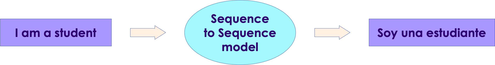
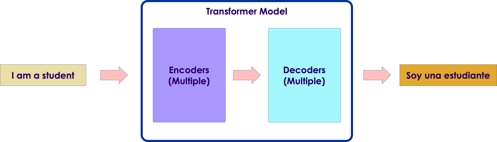
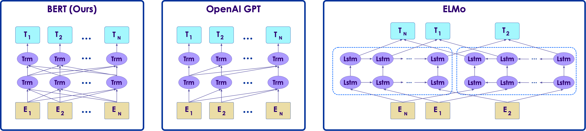
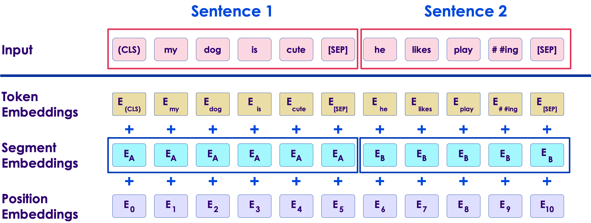
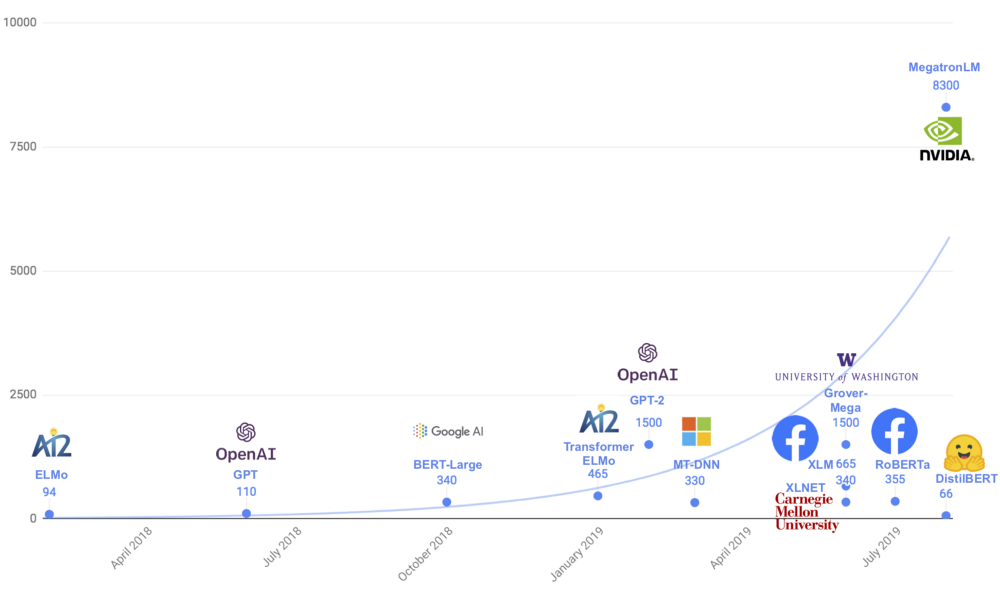

# Transformers

<!-- TODO shiva -->
  <!-- {"left" : 5.88, "top" : 6.56, "height" : 1.23, "width" : 1.45} -->    &nbsp; &nbsp;

---

## Objectives

* Understand Transformer architecture for NLP

---

## Transformers

<!-- TODO shiva -->
  <!-- {"left" : 5.88, "top" : 6.56, "height" : 1.23, "width" : 1.45} -->
<!-- {"left" : 5.18, "top" : 2.52, "height" : 2.94, "width" : 4.83} -->

* In 2017, in a landmark paper ["Attention is all you need"](https://arxiv.org/abs/1706.03762), researchers from Google, proposed a novel model called **Transformers**

* In 2018, Google [open sourced](https://ai.googleblog.com/2018/11/open-sourcing-bert-state-of-art-pre.html) a state of the art  language model called [BERT (Bidirectional Encoder Representations from Transformers)](https://arxiv.org/abs/1810.04805?source=post_page) based on transformer architecture

* Since then, transformers have taken over NLP world by storm, breaking NLP records and pushing state of the art

* References:
  - Understanding searches better than ever before](https://arxiv.org/abs/1810.04805?source=post_page)
  - [BERT (language model)](https://en.wikipedia.org/wiki/BERT_(language_model))

---

## Transformers

  <!-- {"left" : 5.88, "top" : 6.56, "height" : 1.23, "width" : 1.45} -->    &nbsp; &nbsp;

* The Transformer architecture solved the 2 nagging problems with Seq-2-Seq models
  - Transformers can 'track or remember' long sequences
  - And their operations are parallelizable

* Transformers are one the state of the art models since 2018+

* Let's see a little more details on transformers

---

# Sequence Models

---

## Sequence Models: RNNs

<!-- {"left" : 3.63, "top" : 4.27, "height" : 3.47, "width" : 1.53} -->

* Text is essentially **sequence data**

* For example, to  predict the next word, we need to know the previous words:
  - e.g. `Please call me ____`

* In deep learning we can use **recurrent** models to deal with sequence data

* RNNs 'look back' (or remember) previous inputs to predict the next output

* How ever RNNs tend to suffer from **short term memory**

Notes:

---

## RNNs: Short Term Memory

   <!-- {"left" : 5.78, "top" : 1.06, "height" : 2.31, "width" : 4.34} -->

* Memory of the first inputs (hidden state) gradually fades away over multiple steps

* In this diagram below, we can see the 'influence' of word **'what' (color black)** is diminishing with each step

  - And in the last step word **'?'** the color black is almost non-existing

* **RNNs suffer from short term memory**

* What this means is, RNNs can't remember / process 'long sequences' (e.g. long sentences)

* [Source](https://towardsdatascience.com/illustrated-guide-to-recurrent-neural-networks-79e5eb8049c9)

---

## Short Term Memory Problem

* Consider the following word completion example

* `I lived in China, for most of my teenage years, so I speak fluent ____`

* The answer is **Mandarin**

* But which is the key to determining the answer?
  - Not the adjacent words : **my teenage years**
  - But : **lived in China** - from start of the sentence

* So to make the correct prediction, the network has to 'remember' early words (lived in China)

* RNN's short term memory makes it hard to do so

---

## Fixing the Short Term Memory Problem

* There are other architectures like LSTM were developed  to fix the short term memory problem

* LSTMs can remember longer sequences

* How ever even they are limited on how much sequence they can remember

* The **attention** mechanism fixes that
  - Given enough resources, **attention** can remember entire sequence, and can be more accurate

---

# Encoder / Decoder

---

## Seq2Seq Models

* **Seq2Seq** model translates one sequence into another
  - For example English sentence --> Spanish

* They are used in tasks like machine translation, text summarization, and image captioning

* [Google Translate](https://translate.google.com/) started [using these models in production in 2016](https://blog.google/products/translate/found-translation-more-accurate-fluent-sentences-google-translate/)

* Reference papers:
  - [Sequence to Sequence Learning
with Neural Networks, 2014](https://arxiv.org/abs/1409.3215)
  - [Learning Phrase Representations using RNN Encoder-Decoder for Statistical Machine Translation, 2014](https://arxiv.org/abs/1406.1078)

<!-- TODO shiva -->
<!-- {"left" : 6.76, "top" : 0.88, "height" : 4.37, "width" : 3.28} -->
---

## Encoder Decoder Architecture

* **Seq2Seq** models are based on **encoder-decoder** architecture

* The model consists of 3 parts:
  - encoder,
  - intermediate vector
  - and decoder

<!-- TODO shiva -->
<!-- {"left" : 6.76, "top" : 0.88, "height" : 4.37, "width" : 3.28} -->

Notes:

---

## Encoder Decoder Architecture

* Both encoder and decoder are made up several stacks of RNNs (or LSTMs or GRUs)

<!-- TODO shiva -->
<!-- {"left" : 6.76, "top" : 0.88, "height" : 4.37, "width" : 3.28} -->

---

## Encoder

<!-- TODO shiva -->
<!-- {"left" : 6.76, "top" : 0.88, "height" : 4.37, "width" : 3.28} -->

* Encoder is composed of several units of RNNs (or LSTM / GRU variants)

* Input vector is fed through RNNs

* Each layer processes the input and forwards the results to next layer

* Also each RNN remembers the sequence using **hidden state**, that is propagated forward as well

---

## Encoded Vector

<!-- TODO shiva -->
<!-- {"left" : 6.76, "top" : 0.88, "height" : 4.37, "width" : 3.28} -->

* This is the final hidden state produced from the encoder part of the model

* This vector tries to capture information from all the input elements

* This the input to decoder; becomes initial hidden state to decoder

---

## Decoder

<!-- TODO shiva -->
<!-- {"left" : 6.76, "top" : 0.88, "height" : 4.37, "width" : 3.28} -->

* Decoder is composed of several layres of RNNs

* It starts with processing **encoded vector**

* Each layer processes the hidden state from previous layer and produces the output, and its own hidden state

* Final output is a sequence vector

---

## Encoder-Decoder Strengths

<!-- TODO shiva -->
<!-- {"left" : 6.76, "top" : 0.88, "height" : 4.37, "width" : 3.28} -->

* The strength of this architecture is they can map one sequence to another sequence
  - "I am a student" --> "Soy estudiante"

* The input sequence and output sequence can be of different lengths

* This makes the model very powerful to tackle different problems

* References:
  - [Understanding Encoder-Decoder Sequence to Sequence Model](https://towardsdatascience.com/understanding-encoder-decoder-sequence-to-sequence-model-679e04af4346)
  - [Mechanics of Seq2seq Models With Attention](http://jalammar.github.io/visualizing-neural-machine-translation-mechanics-of-seq2seq-models-with-attention/)
  - [Encoder-Decoder Recurrent Neural Network Models for Neural Machine Translation](https://machinelearningmastery.com/encoder-decoder-recurrent-neural-network-models-neural-machine-translation/)

---

## Encoder Decoder Animations

* Let's look at some really good animations that explains these concepts really well

* [Visualizing A Neural Machine Translation Model](http://jalammar.github.io/visualizing-neural-machine-translation-mechanics-of-seq2seq-models-with-attention/) - Must see animations by Jay Alammar!

<!-- {"left" : 6.76, "top" : 0.88, "height" : 4.37, "width" : 3.28} -->

---

## Limitations of Encoder/Decoder Model

<!-- {"left" : 6.76, "top" : 0.88, "height" : 4.37, "width" : 3.28} -->

* The **encoded vector** turns out to be a bottleneck in this design

* Because it had to be calculated sequentially
  - Not easy to parallelize

* Also when processing long sequence of input, the accuracy declined

* **Attention** fixes these isssues

---

# Attention

---

## Attention Idea

* The **attention** papers ([1](https://arxiv.org/abs/1409.0473), [2](https://arxiv.org/abs/1508.04025)) proposed solutions for the encoder/decoder limitation

* Attention mechanism **amplifies** important signals from encoder

* This enables the decoder to focus on **important words** in hidden state, before it produces the final output

* For example in our translation scenario, attention will amplify the word **student** in the encoded vector

<!-- {"left" : 6.76, "top" : 0.88, "height" : 4.37, "width" : 3.28} -->

---

## Attention Model

* An attention model differs from a classic sequence-to-sequence model in two main ways:

- First, the **attention encoder** passes a lot more data to the decoder. Instead of passing just the last hidden state of the encoding stage, the encoder passes all the hidden states to the decoder

<!-- TODO shiva -->
<!-- {"left" : 6.76, "top" : 0.88, "height" : 4.37, "width" : 3.28} -->

---

## Attention Model

* Second, an **attention decoder** does an extra step before producing its output

* It examines all the hidden states it received from the encoder
  - Remember, encoder is passing all hidden states
  - Each hidden state is associated with a certain word in input sequence

* Then each state is assigned a **score or weight**  (details can be found in the paper)

* By multiplying hidden states by weights:
  - important words are **amplified**
  - and non-important words are **diminished**

* See next slide for an illustration

---

## Attention Model

* Here we see the decoder is assigning weights to hidden states to determine **important words**
  - **soy** focuses on words **I** and **am**
  - **estudiante** focuses on word **student**
* Another thing to note, it is not simply aligning input words to output words: input is 4 words, output is 3 words

<!-- TODO shiva -->
<!-- {"left" : 6.76, "top" : 0.88, "height" : 4.37, "width" : 3.28} -->

---

## Attention Model

<!-- TODO shiva -->
<!-- {"left" : 6.76, "top" : 0.88, "height" : 4.37, "width" : 3.28} -->

* Here is an example from attention paper.

* See how the model focuses on appropriate words:
  - French : "européenne économique zone"
  - English: "European Economic Area"
  - Even though the order of the words are reversed!

---

## Multi Head Attention

* In the Attention paper (["Attention is all you need"](https://arxiv.org/pdf/1706.03762.pdf)), authors describe **mutli head attention** mechanism

* Basically it is several attention layers run in parallel and their output is joined together

* Essentially it is matrix multiplication and easily parallelizable
  - GPUs are heavily optimized for matrix multiplications

* References:
  - [How does the multi-head attention mechanism work in deep learning?](https://www.quora.com/How-does-the-multi-head-attention-mechanism-work-in-deep-learning)
  - [The Illustrated Transformer](http://jalammar.github.io/illustrated-transformer/)

---

## Attention: Further Reading

* If you are curious about the internals of Attention model, the following are recommended readings

- [Illustrated Guide to Transformers- Step by Step Explanation](https://towardsdatascience.com/illustrated-guide-to-transformers-step-by-step-explanation-f74876522bc0)

- [Visualizing A Neural Machine Translation Model (Mechanics of Seq2seq Models With Attention)](https://jalammar.github.io/visualizing-neural-machine-translation-mechanics-of-seq2seq-models-with-attention/)

---

# Transformers

---

## Onto Transformers

<!-- TODO shiva -->

  <!-- {"left" : 5.88, "top" : 6.56, "height" : 1.23, "width" : 1.45} --> 

* We just looked at the basics of **encoder-decoder** networks and **attention** mechanism

* **Tranformer** architecture builds on these concepts

* Before transformers, we used RNNs to analyze sequence of input
  - they have to process each word **one by one**, (left to right or right to left)  before they can make prediction
  - This process is sequential and takes multiple steps

* How ever,  a transformer reads the entire sentence at once.
  - This allows the transformer model to understand context of the word based on all of its surroundings

---

## Transformer Model

* Let's say we are using a transformer model for machine translation.
  - Say from english --> spanish

* The english sentence is fed into the model; it produces the output

  <!-- {"left" : 5.88, "top" : 6.56, "height" : 1.23, "width" : 1.45} --> 

---

## Transformer Model

* If we unpack the transformer model, we will find it is made up of multiple encoders and decoders

* Reference:
  - [The Illustrated Transformer by Jay Alammar](http://jalammar.github.io/illustrated-transformer/)

  <!-- {"left" : 5.88, "top" : 6.56, "height" : 1.23, "width" : 1.45} --> 

---

## Transformer Model

  <!-- {"left" : 5.88, "top" : 6.56, "height" : 1.23, "width" : 1.45} --> 

* As we unpack further, the encoders are a set of encoders;  same with decoders

* The original paper specified 6 encoders and decoders  (there is nothing special about 6, it is something we can change and experiment with)

---

## Transformer Model

* In encoder, the input goes through **attention** layer.  This layer helps encoder look at other words in the sentence

* Decoder has a pretty similar stack.  It has another attention layer in between.  This layer helps decoder focus on relevant words of the input sentence

  <!-- {"left" : 5.88, "top" : 6.56, "height" : 1.23, "width" : 1.45} --> 

---

## Transformer in Action

* Let's look at how a transformer functions

* Here is an example:
  - **`The animal didn't cross the street because it was too tired`**

* What is the second **`it`** referring to?  **`the street`** or **`the animal`**
  - This is very simple for humans, not so easy for an algorithm

* The **self-attention** mechanism allows the transformer to associate **`it`** with **`animal`**
  - Even through the word **`animal`** is 'further away' from the word **`street`**

---

## Transformer Full Architecture

  <!-- {"left" : 5.88, "top" : 6.56, "height" : 1.23, "width" : 1.45} --> 

* Reference: [Transformer paper](#)

---

## Training Transformers

* So how do we train these monster models?

* To train translation models, we need lot of data of input language and output language

| English                   | Spanish                |
|---------------------------|------------------------|
| I am a student            | Soy una estudiante     |
| I study engineering       | Estudio ingeniería     |
| I like ice cream          | me gusta el helado     |
| I like to go to the beach | me gusta ir a la playa |

---

## Training Transformers

* Here we see, after sufficient training, the model can predict the translation
* You will notice the prediction is a softmax output (total adding up to 1.0)

  <!-- {"left" : 5.88, "top" : 6.56, "height" : 1.23, "width" : 1.45} --> 

---

## Transformer: Further Reading

* For more detailed explanation see the amazing post [The Illustrated Transformer by Jay Alammar](http://jalammar.github.io/illustrated-transformer/)

* A [video by  Łukasz Kaiser](https://www.youtube.com/watch?v=rBCqOTEfxvg) - One of the authors of Attention paper

---

# BERT

---

## BERT

  <!-- {"left" : 5.88, "top" : 6.56, "height" : 1.23, "width" : 1.45} --> 

* BERT is a ground breaking (not an understatement) NLP model developed by Google

* BERT stands for **B**idirectional **E**ncoder **R**epresentations from **T**ransformers

* BERT is based on **transformer** architecture

* BERT set a lot of records in NLP benchmarks and became 'state-of-the-art'

* BERT has inspired a lot of advances in NLP in recent years

* Reference:
  - [BERT: Pre-training of Deep Bidirectional Transformers for Language Understanding](https://arxiv.org/abs/1810.04805) - BERT paper

Notes:

Image credit : https://pixy.org/4254306/

---

## BERT is BiDirectional

  <!-- {"left" : 5.88, "top" : 6.56, "height" : 1.23, "width" : 1.45} --> 

* BERT is bi-directional: BERT learns about a word from words on both and right side

* Consider this example, both sentences have the word **bank** in them.  But it means very different things in each sentence

* **`I went to the river __bank__ for a swim`**

* **`I went to the __bank__ to make a deposit`**

* So as we see **context matters**!

* And this is what BERT accomplished, it considers the words on left and right to make a prediction

Notes:

Image credit: https://pixabay.com/photos/direction-road-look-right-arrow-654123/

---

## Word Embeddings

<!-- {"left" : 2.02, "top" : 3.75, "height" : 4.68, "width" : 6.21} -->

* **Word embeddings** is how we represent words as vectors

* Early models like **word2vec** introduced really effective word embeddings

* For example, in this diagram, the word2vec embeddings can really 'extract meanings' of words
  - For example all music words are clustered together

---

## Better Word Embeddings

* To generate word embeddings, we need to train our model on sufficient data

* _"One of the biggest challenges in natural language processing is the shortage of training data. Because NLP is a diversified field with many distinct tasks, most task-specific datasets contain only a few thousand or a few hundred thousand human-labelled training examples." – Google AI_

* Word2Vec and Glove models were trained using **shallow feed-forward networks**.  So there was a limit to how much information they can capture

* And these earlier models, **did not take the context of the word** into account

* So in our earlier example, the word **bank** would need different embeddings
  - But word2vec would only generate **one** embedding for the word bank  (not sophisticated enough)

* **`I went to the river __bank__ for a swim`**

* **`I went to the __bank__ to make a deposit`**

---

## ELMO

  <!-- {"left" : 5.88, "top" : 6.56, "height" : 1.23, "width" : 1.45} --> 

* [ELMO](https://allennlp.org/elmo) was developed to solve the [polysemi](https://en.wikipedia.org/wiki/Polysemy) problem in NLP;  Same words having different meanings based on their context.

* Consider our example again:
  - **`I went to the river __bank__ for a swim`**

  - **`I went to the __bank__ to make a deposit`**

* ELMO used complex Bi-Directional LSTM architectures
  - (Word2Vec used a shallow feed-forward neural network)

* So the same word will have different ELMO embeddings based on the context it is in
  - So in our case, we will have two different embeddings for the word **bank**

* Reference:[Deep contextualized word representations](https://arxiv.org/abs/1802.05365) - ELMO paper

Notes:

Image credit : https://pixy.org/783745/

---

## ULMFit

* ULMFiT built on ELMO

* This framework allowed **fine-tuning pre-trained models**

* This is **transfer learning in NLP**
  - Take a pre-trained model
  - and adopt it to work on our own data!

* Reference: 
  - [nlp.fast.ai](https://nlp.fast.ai/)
  - [Universal Language Model Fine-tuning for Text Classification](https://arxiv.org/abs/1801.06146)

---

## GPT-1 from OpenAI

* GPT replaced the LSTM based architecture that is used by ELMO and ULMFiT into a transformer based architecture

* Not only transformer model is **simpler and faster** to train, it was able to **learn complex patterns** of data using **attention** mechanism

* GPT model is pre-trained on large amount of data

* It can also be fine tuned for custom data

---

## BERT is Bi-Directional

 <!-- {"left" : 0.34, "top" : 4.7, "height" : 2.36, "width" : 9.58} -->

* Sequence models scanned text **one-way** (left2right or right2left).  This  really didn't help them learn enough context
* ELMO tried to fix this by using two LSTM layers going bidirectional (left-to-right  and right-to-left)
  - It improved on previous models
  - But it wasn't enough, due to the shallow nature of network
* GPT-1, even though it is based on transformer architecture, it is **uni-directional**
* BERT improves on both by being
  - based on transformer model
  - bi-directional
  - and deeper network

---

## Transfer Learning

<!-- TODO shiva -->
 <!-- {"left" : 0.34, "top" : 4.7, "height" : 2.36, "width" : 9.58} -->

* Imagine that your garage band needs a  **ukulele** player

* If you have no musical background, and you are starting fresh with the ukulele as your very first instrument, it'll take you a few months to get proficient at playing it

* On the other hand, if you are accustomed to playing the **guitar**, it might just take a few days, due to how similar the two instruments are

* Taking the learnings from one task and fine-tuning them on a similar task is something we often do in real life.

* The more similar the two tasks are, the easier it is to adapt the learnings from one task to the other.

---

## Transfer Learning in NLP

* The current state-of-the-art approach in NLP is 2-step process:
  1. Train a model on large text data (unsupervised or semi-supervised)
  2. Fine tune this model to specific data (supervised)
* For example, let's say we are an insurance company that has lot of 'pdf documents'
* The NLP pre-trained models are trained on say wikipedia text - that is nothing like our data!
  - This training is computationally very intensive.  Might use 100s GPUs/TPUs and training can run for days!
  - This is not something we attempt
* How ever the model still learned 'language semantics' when trained on large amount of data
* It can then be customized or **fine-tuned** to work with our own data
  - This training is usually fairly quick
  - That is approachable by lot of organizations

---

## BERT's Architecture

 <!-- {"left" : 0.34, "top" : 4.7, "height" : 2.36, "width" : 9.58} -->

* BERT is based on **transformer** architecture

* There are two variants

* **BERT base**:
  - Layers / Transformer blocks: 12
  - Attention heads: 12
  - Hidden layers: 768
  - Total parameters: **110 million**

* **BERT large**:
  - Layers / Transformer blocks: 24
  - Attention heads: 16
  - Hidden layers: 1024
  - Total parameters: **340 million**

---

## BERT Pre-Training

 <!-- {"left" : 0.34, "top" : 4.7, "height" : 2.36, "width" : 9.58} -->

* BERT is **pre-trained** on large amount of data
  - Entire wikipedia text (2.5 Billion words)
  - Book Corpus (800 million words)

* Pre-training steps:
  - Step 1: Text pre-processing
  - Step 2: Training tasks
    - Masked Language Modeling
    - Next sentence prediction

* (See next slides for details)

---

## BERT Training: Text Pre-Processing

* BERT developers done some clever language processing, so BERT can understand the context better
* **Position embeddings**: This enables to BERT to learn the sequence or order of information
* **Segment embeddings**: 
  - BERT can take sentence pairs as input, for question-answering tasks
  - So unique embedding for first and second sentence helps BERT process them better
  - In this example we see **Ea** belonging to first sentence, and **Eb** belongs to second sentence
* **Token embeddings**: These are embeddings for words

 <!-- {"left" : 0.34, "top" : 4.7, "height" : 2.36, "width" : 9.58} -->

---

## BERT Training: Masked Language Modeling (MLM)

* Training data to BERT is **masked** and BERT is tasked with finding the masked word

* **`I take my dog to the [MASK]  and we play fetch`**
  - Guess the masked word:  **`park`**

* **15%** of words in training data were **randomly masked**

* To make the model more resilient:
  - most of the times the words were replaced by [MASK] token
  - sometimes the words were replaced by random words

---

## BERT Training: Next Sentence Prediction

* In addition to predict masked words, BERT is also trained on **next sentence prediction** tasks

* This is useful for **question answer** tasks

* Sentence-1: **`What is Antarctica?`**

* Sentence-2: **`Antarctica is a continent`**

* For example if our input is 1000 sentences, they were divided into 500 sentence-pairs

---

## BERT Performance

 <!-- {"left" : 0.34, "top" : 4.7, "height" : 2.36, "width" : 9.58} -->

* Combining both **Masked Language Model(MLM)** and **Next Sentence Prediction(NSP)** BERT became a very powerful model

* It set lot of records in NLP benchmarks

* See next slides for more details

---

## BERT Benchmarks: GLUE

* [GLUE (General Language Understanding Evaluation)](https://gluebenchmark.com/) is a  collection of diverse natural language understanding tasks

* **BERT**BASE and **BERT**LARGE outperform all systems on all tasks by a substantial margin

* BERTLARGE **significantly outperforms** BERTBASE across all tasks, especially those with very little training data.

<!-- {"left" : 1.02, "top" : 1.56, "height" : 1.76, "width" : 8.21} -->

---

## BERT Benchmarks: SQUAD

* [SQUAD - Stanford Question Answering Dataset](https://rajpurkar.github.io/SQuAD-explorer/) is a reading comprehension dataset
  - consisting of questions posed by crowdworkers on a set of Wikipedia articles
  - where the answer to every question is a segment of text,  from the corresponding reading passage
  - or the question might be unanswerable

* Examples:
  - **`What is the capitol of UK?`** - Answer : London
  - **`What is the capitol of Mars?`** - No-answer

---

## BERT Benchmarks: SQUAD

<!-- {"left" : 2.57, "top" : 2, "height" : 3.45, "width" : 5.11} -->

* Observe **a +5.1 F1 improvement** over the previous best system.

---

## BERT: Further Reading

* [Demystifying BERT](https://www.analyticsvidhya.com/blog/2019/09/demystifying-bert-groundbreaking-nlp-framework/)

---

# Beyond BERT

---

## BERT Inspired

 <!-- {"left" : 0.34, "top" : 4.7, "height" : 2.36, "width" : 9.58} -->

* BERT really kick-started a boom in NLP research

* Since BERT was introduced, every month (or every week) we are seeing newer improved models being showcased by companies like Facebook, OpenAI and Microsoft

* References:
  - [A very nice inforgraphic](https://www.analyticsvidhya.com/blog/2019/08/complete-list-important-frameworks-nlp/) - Instructor showcase this please!
  - [nlpprogress.com](http://nlpprogress.com/)

---

## Looking Ahead

* NLP models are getting larger and larger - trained on bigger and bigger dataset
* [Megatron](https://github.com/NVIDIA/Megatron-LM), the latest model from Nvidia has 8.3 billion parameters: 24 times larger than BERT-large, 5 times larger than GPT-2, 
* [RoBERTa](https://arxiv.org/abs/1907.11692), the latest work from Facebook AI, was trained on 160GB of text

<!-- {"left" : 5.18, "top" : 2.52, "height" : 2.94, "width" : 4.83} -->

---

## Bigger and Bigger Models

* We are seeing models that are getting exceedingly big with billion+ parameters!

 

| Model         | Created By | Implementation | Number of Parameters | Training Data Size |
|---------------|------------|----------------|----------------------|--------------------|
| BERT base     | Google     | Tensorflow     | 110 Million          | 16 GB              |
| RoBERTa base  | Facebook   | PyTorch        | 125 Million          | 76 GB              |
| BERT large    | Google     | Tensorflow     | 340 Million          |                    |
| RoBERTa large | Facebook   | PyTorch        | 335 Million          |                    |
| XLM           | Facebook   | PyTorch        | 665 Million          |                    |
| GPT-2         | OpenAI     | PyTorch        | 774 Million          |                    |
| Megatron      | Nvidia     | PyTorch        | 8.3 Billion          | 174 GB             |
| Turing NLG    | Microsoft  | DeepSpeed      | 17 Billion           |                    |
| GPT-3         | OpenAI     | PyTorch        | 175 Billion          |                    |

---

## Transformer Demo: Word Prediction / Completion

* Go to [https://demo.allennlp.org/next-token-lm](https://demo.allennlp.org/next-token-lm?text=AllenNLP%20is)

* Provide some 'seed text' and see what the transformer predicts next

---

## Transformer Demo: Talk to a Transformer

* This is a fun one!

* Write your own novel or poem using a transformer!

* Go to [https://app.inferkit.com/demo](https://app.inferkit.com/demo)

---

## Transformer Demo: Write with a Transformer

* [https://transformer.huggingface.co/](https://transformer.huggingface.co/)

* Another cool demo showcasing text generation by transformers

* You can try different transformer models (BERT, GPT2 ..etc)

---

## Lab: Transformer Lab

<!-- {"left" : 6.76, "top" : 0.88, "height" : 4.37, "width" : 3.28} -->

* **Overview:**
  - Play with transformers

* **Approximate run time:**
  - 20-30 mins

* **Instructions:**
  - Please complete the labs

Notes:

---

## Review and Q&A

<!-- {"left" : 8.56, "top" : 1.21, "height" : 1.15, "width" : 1.55} -->
<!-- {"left" : 6.53, "top" : 2.66, "height" : 2.52, "width" : 3.79} -->

* Let's go over what we have covered so far

* Any questions?

---

## Further Reading

* [Deep Learning in Natural Language Processing: History and Achievements](https://blog.exxactcorp.com/deep-learning-in-natural-language-processing-history-and-achievements/)

* [Illustrated Guide to Transformers- Step by Step Explanation](https://towardsdatascience.com/illustrated-guide-to-transformers-step-by-step-explanation-f74876522bc0)

* [Visualizing A Neural Machine Translation Model (Mechanics of Seq2seq Models With Attention)](https://jalammar.github.io/visualizing-neural-machine-translation-mechanics-of-seq2seq-models-with-attention/)
