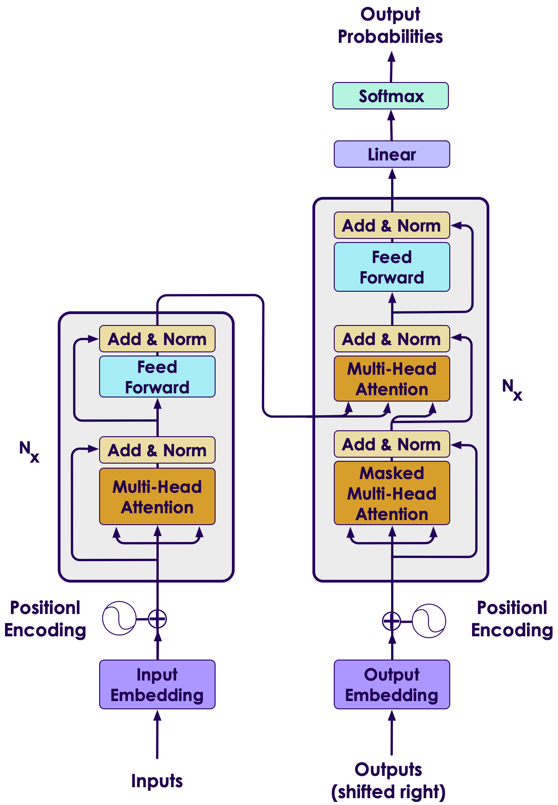
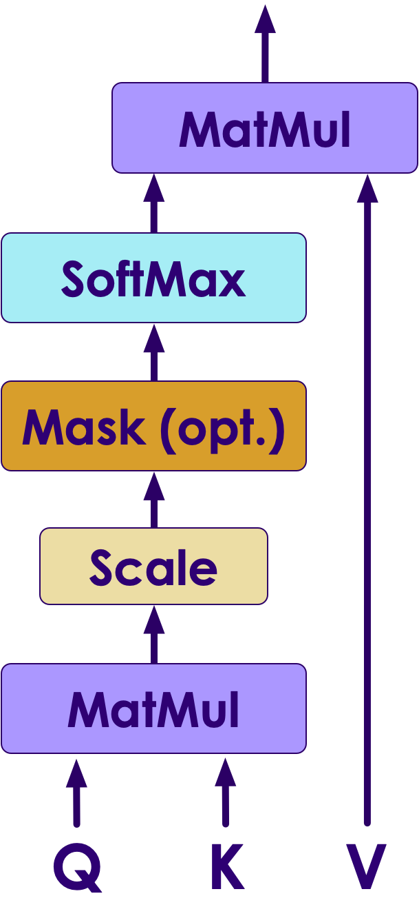
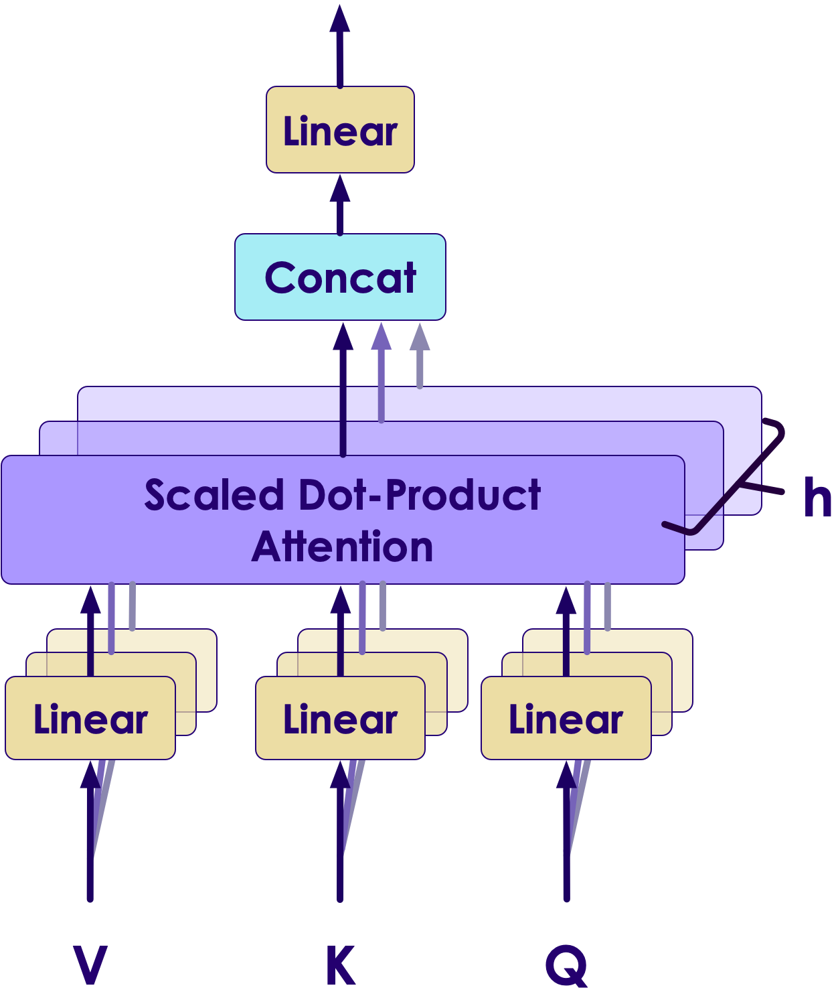

# Attention Is All You Need

---

## Content 

 *  Abstract

 * Introduction

 * Background

 * Model Architecture

 * Why self-attention

 * Training

 * Results

 * Conclusion

Notes: 

 
---

# Abstract

---

## Abstract

 *  **Problem:**

    - The dominant sequence transduction models are based on complex recurrent or convolutional neural networks that include an encoder and a decoder. The best performing models also connect the encoder and decoder through an attention mechanism. **Which do not work well in all situation**.

 *  **Solution:**

     -  **Propose a new simple network architecture**, the Transformer, based solely on attention mechanisms, dispensing with recurrence and convolutions entirely. these models to be  **superior in quality** while being  **more parallelizable**  and requiring significantly less time to train

Notes: 

 

---

# Introduction

---

## Introduction

 *  **Recurrent neural networks:**
    - state of the art approaches in sequence modeling and transduction problems such as language modeling and machine translation

 *  **Recurrent models:** 
    - Typically factor computation along the symbol positions of the input and output sequences.

    - They generate a sequence of hidden states 𝒉_𝒕

    - Function of the previous hidden state 𝒉(𝒕−𝟏)

    - The input of position 𝒕

    - They generate a sequence of hidden states

 *  **Recent work has achieved significant improvements in computational efficiency through factorization tricks, but the fundamental constraint of sequential computation, however, remains.**

Notes: 

---

## Introduction

 * In this paper, they propose the  **Transformer** 

 *  **Transformer is a model architecture which:** 
    - Eschewing recurrence.

    - Relying entirely on an attention mechanism to draw global dependencies between input and output.

    - Allows for significantly more parallelization.

    - Can reach a new state of the translation quality after being trained for as little as 8 hours on P100 GPUs.

Notes: 

 
---

# Background

---

## Background

 *  **Extended Neural GPU**, **ByteNet** and **ConvS2S** are models that presented in [16], [18] and [9]: 

    - Their **goal is reducing sequential computation.**

    - They use **convolutional neural networks** as basic building blick.

    - They **computing hidden representations** in parallel for all input and output positions

    -  Their number of operations required to relate signals from two arbitrary input or output positions, grows in the distance between positions,  **linearly for ConvS2S and logarithmically for ByteNet.** 

    - This makes it  **more difficult to learn dependencies between distant positions** 

 * In the **Transformer:**
    - **the number of operations required reduced to a constant number of operations** 

Notes: 

---

## Background

 *  **Self-attention (intra-attention):** 

    - Is an  **attention mechanism** relating different positions of a single sequence in order to compute a representation of the sequence.

    - It has been used in:
      - **reading comprehension** 
      - **abstractive summarization** 
      - **textual entailment** 
      - **learning task-independent sentence** 

 *  **End-to-end memory networks** are based on a **recurrent attention mechanism** and they work well on **simple-language question answering** and **language modeling** tasks.

Notes: 

 

---

# Model Architecture

---

## Model Architecture

 *  Most **competitive neural sequence transduction models** have an **encoder-decoder** structure.

    - **Encoder:** maps, 
an **input sequence of symbol representations** **( 𝑥1 , ... , ğ‘¥ğ‘› )**
 to
 a **sequence of continuous representations**  **z = ( 𝑧1 , ... , ğ‘§ğ‘› )**

    - **Decoder:** given z, 
generates an **output sequence (𝑦1 , ... , ğ‘¦ğ‘› )** of symbols one element at a time.

Notes: 

 

---

## Model Architecture

 * The **Transformer** follows this overall architecture, shown in figure.

Notes: 

---

## Model Architecture

 *  **Encoder:**

    - Is composed of a stack of **N=6** identical layer.

    - Each layer has 2 sub-layer:
      - **multi-head self-attention mechanism**
      - **simple, position-wise fully connected feed-forward network**

    - the output of each sub-layer is 
      - **LayerNorm(x + Sublayer(x))**

    - produce outputs of dimension **ğ‘‘ğ‘šğ‘œğ‘‘ğ‘’ğ‘™=512**

Notes: 

---

## Model Architecture

 *  **Decoder:**

    - Is composed of a stack of N=6 identical layer.

    - Each layer has 3 sub-layer:
      - **multi-head self-attention mechanism** 
      - **simple, position-wise fully connected feed-forward network** 
      - **Performs multi-head attention over the output of encoder stack**
 
    - The output embeddings are offset by one position

    - Ensures that the predictions for position  **i** can depend only on the known outputs at positions less than **i** 

Notes: 

---

## Model Architecture

 *  **Attention function:** 

    - Mapping a query and a set of key-value pairs to an output

    - The query, keys, values, and output are all vectors

    - Output is computed as a weighted sum of the values

 *  **Most commonly used attention functions:** 

    - **Additive attention** 

    - **Dot-product attention** 

 *  **Additive attention:** 

    - computes the compatibility function using a feed-forward network with a single hidden layer.

Notes: 

---

## Model Architecture

 <!-- {"left" : 7.52, "top" : 1.28, "height" : 5.39, "width" : 2.5} -->

 *  **Scaled Dot-Product Attention**
 *  Dot-product attention is identical to the algorithm in this paper that call:
    -  **"Scaled Dot-Product Attention"**
 *   **Input:**
    -  **Queries** and  **keys** of dimension ğ‘‘𑘠and  **values** of dimension ğ‘‘ğ‘£

 *   **Formula of Matrix of outputs:**

 <!-- {"left" : 0.84, "top" : 5.86, "height" : 0.52, "width" : 5.02} -->

Notes: 

---

## Model Architecture

 *  **Comparison of additive attention and dot-product attention:**

    -  Similar in theoretical **complexity**

    -  Dot-product attention is **much faster**

    -  Dot-product attention is **more space-efficient** in practice

    -  For small values of ğ‘‘𑘠, additive attention **work faster**

Notes: 

---

## Model Architecture

 *  **Multi-Head Attention**

 *  **linearly project** the queries, keys and values **𝒉** times with different, learned linear projections to **ğ’…ğ’Œ**, **ğ’…ğ’Œ** and **ğ’…ğ’—** dimensions.

<!-- {"left" : 6.39, "top" : 4.56, "height" : 4.22, "width" : 3.54} -->

 *  **Formula of Matrix of outputs:**

    -  **𝑴𝒖𝒍𝒕𝒊𝑯𝒆𝒂𝒅(𝑸,𝑲,𝑽)= 𝑪𝒐𝒏𝒄𝒂𝒕 (ğ’‰ğ’†ğ’‚ğ’…ğŸ,...,ğ’‰ğ’†ğ’‚ğ’…ğ’‰ ) ğ‘¾ğ‘¶**

    -  Where
 **ğ’‰ğ’†ğ’‚ğ’…ğ’Š= 𝑨𝒕𝒕𝒆𝒏𝒕𝒊𝒐𝒏(ğ‘¸ğ‘¾ğ’Šğ‘¸, ğ‘²ğ‘¾ğ’Šğ‘², ğ•ğ‘¾ğ’Šğ‘½)**

 *  and:
    -  ğ‘Šğ‘–ğ‘„  ∈ 𝑅(ğ‘‘ğ‘šğ‘œğ‘‘ğ‘’ğ‘™  × ğ‘‘𑘠)
    -  ğ‘Šğ‘–ğ¾  ∈ 𝑅(ğ‘‘ğ‘šğ‘œğ‘‘ğ‘’ğ‘™  × ğ‘‘𑘠)
    -  ğ‘Šğ‘–𑉠 ∈ 𝑅(ğ‘‘ğ‘šğ‘œğ‘‘ğ‘’ğ‘™  × ğ‘‘ğ‘£ )
    -  ğ‘Šğ‘‚  ∈ 𝑅(â„ğ‘‘ğ‘£  × ğ‘‘ğ‘šğ‘œğ‘‘ğ‘’ğ‘™ )

Notes: 

---

## Model Architecture

 *  **Applications of Attention in this Model**
 *  The **Transformer** uses **multi-head attention** in three different ways:
    -  In **encoder-decoder attention** layer:
      -  Queries → come from the **previous decoder layer**
      -  Memory keys and values -> from the output of the encoder
      -  allows every position in the decoder to attend over all positions in the input sequence.
    -  In a **self-attention** layer:
    -  Keys, values and queries -> from the **output of the previous layer** in the encoder
    -  Each position in the encoder can attend to all positions in the previous layer of the encoder
 *  **self-attention** layers in the decoder
    -  allow each position in the decoder to attend to all positions in the decoder up to and including that position

Notes: 

---

## Model Architecture

 *  **Position-wise Feed-Forward Networks:**

    -  encoder and decoder contains a **fully connected feed-forward network**

    -  This consists of **two linear transformations** with a ReLU activation in between, the formula is:

      -  𝑭𝑭𝑵(𝒙)=𝒎𝒂𝒙 (ğŸ, ğ’™ğ‘¾ğŸ+ğ’ƒğŸ ) ğ‘¾ğŸ + ğ’ƒğŸ

 *  **Embeddings and Softmax:**

    -  **Embeddings:** convert the input tokens and output tokens to vectors of dimension ğ‘‘ğ‘šğ‘œğ‘‘ğ‘’ğ‘™
    -  **Softmax:** convert the decoder output to predicted next-token probabilities

Notes: 

---

## Model Architecture

 *  **Positional encoding:** 

     - use some information about the relative or absolute position of the tokens in the sequence(in table), to make use of the order of the sequence

       -  **n** is the sequence length

       -  **d** is the representation dimension

       -  **k** is the kernel size of convolutions

       -  **r** the size of the neighborhood in restricted self-attention

<!-- {"left" : 0.77, "top" : 5.32, "height" : 1.76, "width" : 8.21} -->

Notes: 

---

## Model Architecture

 *  There are many choices of **positional encodings**, they use sine and **cosine functions** of different frequencies in this paper:

      -  𝑷𝑬(𝒑𝒐𝒔 , 𝟐𝒊)=𝐬𝐢𝐧⁡ (𝒑𝒐𝒔/ğŸğŸğŸğŸğŸğŸğ’Š /ğ’…ğ’ğ’ğ’…ğ’†ğ’)

      -  𝑷𝑬(𝒑𝒐𝒔 , 𝟐𝒊+ğŸ)=𝒔𝒊𝒏⁡ (𝒑𝒐𝒔/ğŸğŸğŸğŸğŸğŸğ’Š /ğ’…ğ’ğ’ğ’…ğ’†ğ’)

 *  Where:

      -  **𝒑𝒐𝒔** is the position

      -  **𝒊** is the dimension

Notes: 

---

# Why Self-Attention

---

## Why Self-Attention

 *  **Comparison of self-attention layers and recurrent and convolutional layers:** 

     -  **Computational complexity** per layer

        *  **self-attention** layers are  **faster**  than  **recurrent**  layers when the sequence length  **n**  is smaller than the representation dimensionality **d** 

        * To improve  **computational performance:**

          * self-attention could be restricted to considering only a neighborhood of size  **r**  in the input sequence centered around the respective output position.

     -  **Amount of computation** that can be parallelized

     - The **path length** between long-range dependencies in the network

 *  **self-attention could yield more interpretable models** 

Notes: 

---

# Training

---

## Training

 *  **Training Data and Batching:** 

     -  **Dataset(English-German):** 

        * WMT 2014 English-German

        * 4.5 million sentence pairs

        * encoded using byte-pair encoding

        * has a shared sourcetarget vocabulary of about 37000 tokens

     -  **Dataset (English-French):** 

        * WMT 2014 English-French

        * 36M sentences

        * split tokens into a 32000 word-piece vocabulary

 * Each training batch contained a  **set of sentence pairs** containing approximately  **25000** source tokens and **25000** target tokens.

Notes: 

---

## Training

 *  **Hardware and Schedule:**
     -  machine with 8 NVIDIA P100 GPUs
     -  each training step took about 0.4 seconds
     -  trained the base models for a total of 100,000 steps or 12 hours
     -  Big models were trained for 300,000 steps and step time was 1.0 seconds
 *  **Optimizer:**
     -  used the Adam optimizer (ğ›½1= 0.9 , ğ›½2= 0.98 , 𜖠= 10−9)
     -  Learning rate formula: (ğ‘¤ğ‘ğ‘Ÿğ‘šğ‘¢ğ‘ğ‘ ğ‘¡ğ‘’ğ‘ğ‘  = 4000)
𝒍𝒓𝒂𝒕𝒆= ğ’…ğ’ğ’ğ’…ğ’†ğ’−ğŸ.📠. 𝐦𝐢𝐧⁡(ğ’”ğ’•ğ’†ğ’‘ğ’ğ’–ğ’−ğŸ.𝟓, ğ’”ğ’•ğ’†ğ’‘ğ’ğ’–ğ’ .ğ’˜ğ’‚ğ’“ğ’ğ’–ğ’‘ğ’”ğ’•ğ’†ğ’‘ğ’”−ğŸ.𝟓)

Notes: 

---

## Training

 *  **Regularization:**
     -  employ 2 types of regularization during training:
       -  **Residual Dropout:**
         -  Apply dropout to the output of each sub-layer, before it is added to the sub-layer input and normalized. 
(with ğ‘·ğ’…ğ’“ğ’ğ’‘= ğŸ.ğŸ)

       -  **Label Smoothing:**
         -  employed label smoothing of value ğ’†ğ’ğ’”=ğŸ.ğŸ
         -  **Hurts perplexity**, but **improves accuracy and BLEU score**

Notes: 

---

# Results

---

## Results

 *  **English-to-German dataset:** 

     - The **Transformer**  achieves better BLEU scores than  **previous models** 

 *  **English-to-French dataset:** 

     -  **big model** achieves better BLEU score

<!-- {"left" : 1.02, "top" : 4.35, "height" : 3.55, "width" : 8.21} -->

Notes: 

---

## Results

 *  **Model Variations:**
     - To evaluate the importance of different components of the Transformer
 *  according to the table in next slide
     - Row **A‫:‬**
       - **worse** than the best setting
       - **quality** also drops off with too many heads
     - Row **B‫:‬**
       - reducing the attention key size ğ’…𒌠hurts model quality
     - Row **C** and **D:**
       - **bigger models** are better
       - dropout is very helpful in avoiding over-fitting
     - Row **E:**
       - **nearly identical results to the base model**

Notes: 

---

## Results

<!-- {"left" : 1.02, "top" : 2.19, "height" : 5.26, "width" : 8.21} -->

Notes: 

---

## Results

 *  **English Constituency Parsing:** 

     - To  **evaluate**  if the  **Transformer can generalize** to other tasks

 * They performed experiments on English constituency parsing. The results are in table in next slide.

 * According to the table:

     - Despite the lack of task-specific tuning they model  **performs surprisingly well** 

     - Yielding  **better results** than all previously reported models with the exception of the Recurrent Neural Network Grammar

     - The  **Transformer outperforms** the Berkeley-Parser even when training only on the WSJ training set of 40K sentences

Notes: 

---

## Results

<!-- {"left" : 1.02, "top" : 2.97, "height" : 3.71, "width" : 8.21} -->

Notes: 

---

# Conclusion

---

## Conclusion

 * Presented the  **Transformer** 

     - The **first sequence transduction model** based entirely on attention

 *  **Replacing the recurrent layers** most commonly used in encoder-decoder architectures with multi-headed self-attention.

 * For translation tasks,  **the Transformer can be trained significantly faster** than architectures based on recurrent or convolutional layers.

 * The code they used to train and evaluate our models is available at:

 * https://github.com/tensorflow/tensor2tensor

Notes: 

---

## Question

<!-- {"left" : 3.07, "top" : 2.48, "height" : 4.12, "width" : 4.12} -->

Notes: 

