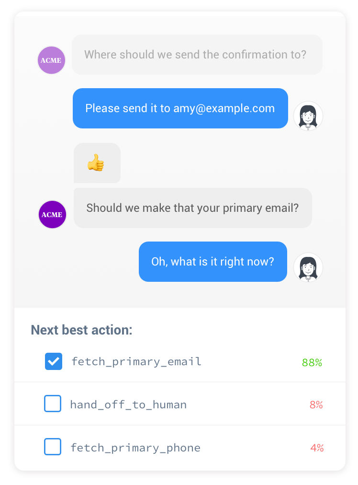
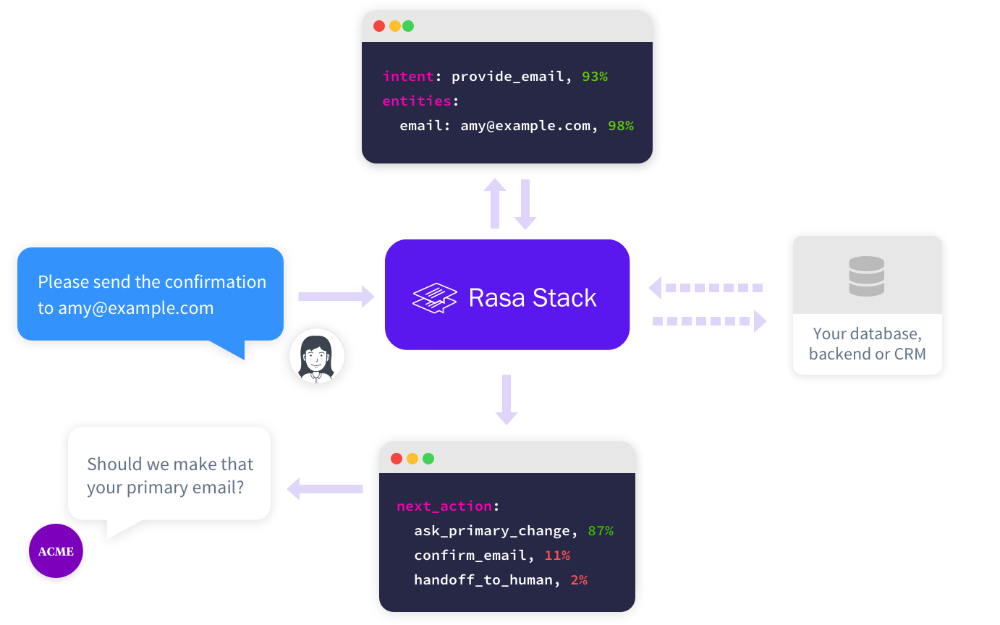
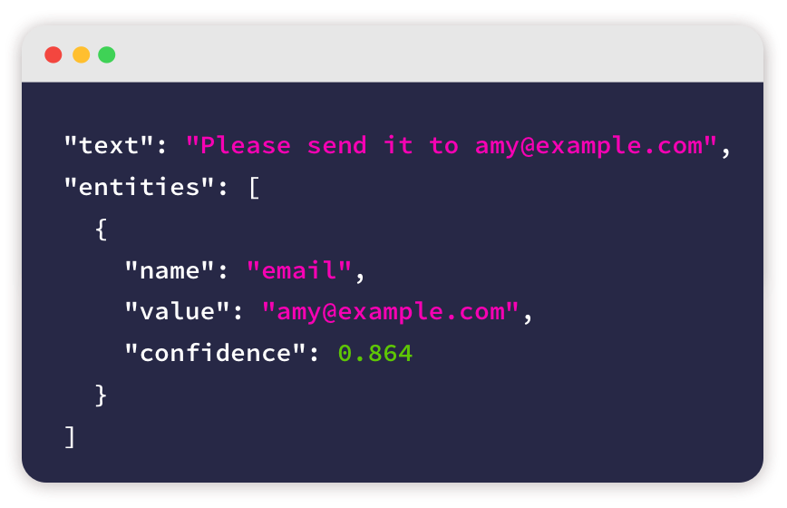
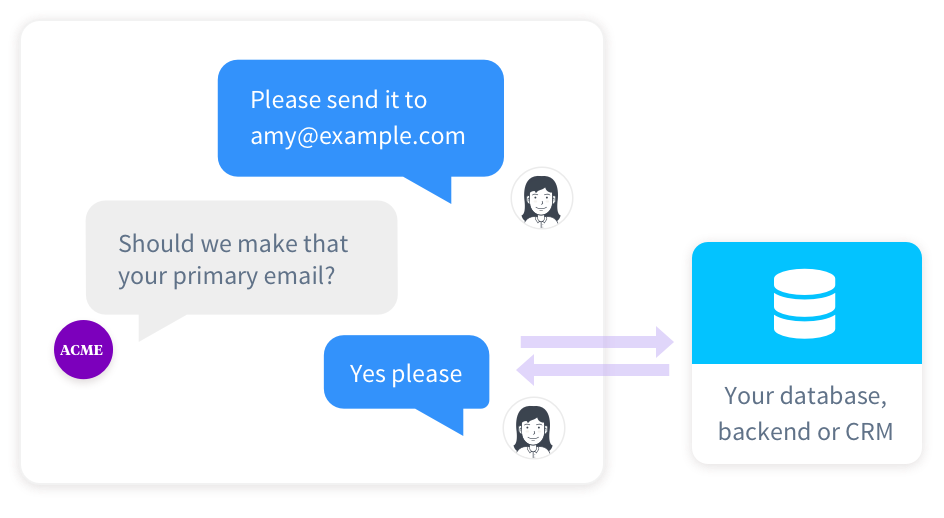

# Intro to Rasa
---

# What is Rasa?

---
##  What is Rasa?

 * Open Source Conversational AI
 * Build Chatbots
 * Uses Deep Learning Models
 * Written in Python

Notes: 

---
## Rasa

<!-- {"left" : 2.72, "top" : 1.57, "height" : 6.5, "width" : 4.8} -->


Notes: 

---
## Rasa Projects

 * There are two Rasa projects:
   - rasa-core
   - rasa-nlu

 * rasa-core
   - handles chatbot creation
   - handles state management

 * rasa-nlu
   - handles natural language understanding (NLU)
   - integrates with other NLP software
     - spacy

Notes: 

---
## Dependencies

 * spacy:
   - open-source NLP system for Python

 * scikit-learn
   - open-source Machine Learning for Python

 * tensorflow
   - industry-standard deep learning and ML engine.

 * keras:
   - Deep Learning API for Tensorflow and other DL

Notes: 

---
## Installation

 * Install Anaconda for Python 3.x

 * Install rasa

```bash
  pip install rasa-core rasa-nlu[spacy]
  pip install tensorflow keras spacy
```
<!-- {"left" : 0, "top" : 2.22, "height" : 0.86, "width" : 6.94} -->

Notes: 

---
## Lab 1.1: Installation

  * Log into Nodes (if applicable)

  * Install Anaconda

  * Install Rasa

---

## Rasa Ecosystem

<!-- {"left" : 1.02, "top" : 1.97, "height" : 5.13, "width" : 8.21} -->


Notes: 

---
## Contextual Dialogues

  * Traditionally, used state machines and "rules"

  * Problem: Too Many Rules!
    - Tended to be overly scripted
    - Get more and more complex.

Notes: 

---
## Contextual Dialogues

<!-- {"left" : 2.72, "top" : 1.57, "height" : 6.5, "width" : 4.8} -->


Notes: 

---
## Intent Recognition

  * Develop Machine Learning Classification model for Intents

  * What is an "Intent"?

    - What is the user trying to do.
    - Greet?
    - Email Change?

  * Performs **probabalistic** classification

<!-- {"left" : 1.56, "top" : 4.1, "height" : 4.46, "width" : 7.13} -->


Notes: 

---
## Intent Recognition

<!-- {"left" : 1.02, "top" : 1.97, "height" : 5.13, "width" : 8.21} -->


Notes: 

---
## Entity Extraction

  * Named Entity Extraction is task in NLP

    - Proper names: people, companies
    - Concepts, objects: emails, addresses

  * Train your own!

<!-- {"left" : 1.02, "top" : 3.33, "height" : 5.3, "width" : 8.21} -->


Notes: 

---
## Entity Extraction

<!-- {"left" : 1.02, "top" : 1.89, "height" : 5.3, "width" : 8.21} -->


Notes: 

---
## Connect APIs

 * You can use your own custom APIs / DB, etc.
 

<!-- {"left" : 1.02, "top" : 2.28, "height" : 4.51, "width" : 8.21} -->


