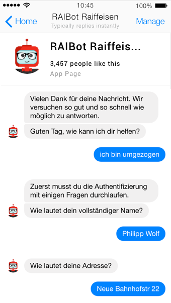
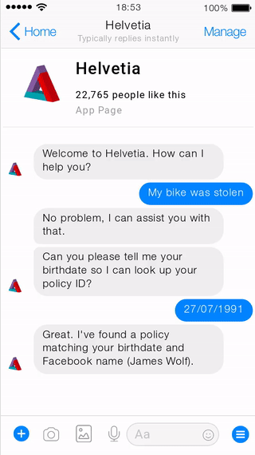
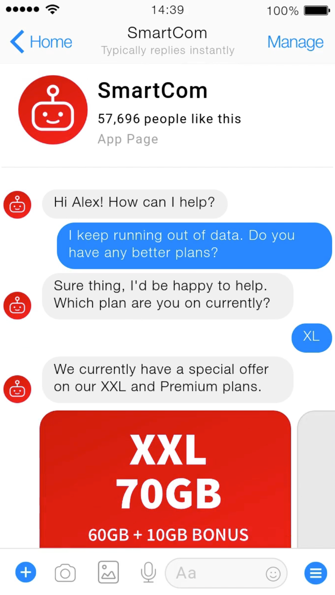
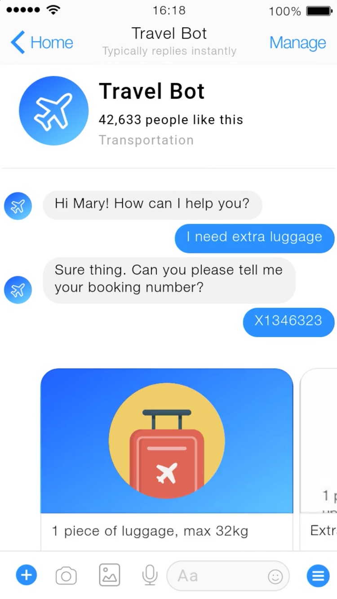

# Rasa Use Cases
---

# Banking
---

## Banking

  * Order new credit card

  * Check balance

  * Buy short-term loan

  * Change Address

Notes: 

---
## Banking UseCase: Raiffeisen
<!-- {"left" : 3.35, "top" : 1.68, "height" : 6.28, "width" : 3.54} -->

Notes: 

---
# Insurance
---

## Insurance

  * Change Address

  * Check claim status

  * Update Policies

  * Buy New Policies

  * Add new payment info

Notes: 

---
## Insurance Use Case: Helvetia

  * Claims Management

  * Analyze Data from Claims

  * Integrated Authentication and anti-fraud

  * Integrated to CRM

  * User Testing

Notes: 

---
## Insurance UseCase: Helvetia

<!-- {"left" : 3.46, "top" : 1.85, "height" : 5.94, "width" : 3.33} -->

Notes: 

---
# Healthcare
---

## Healthcare Use Cases

  * Get private answers to heath questions

  * Sensitive topics chatbots may be *preferable* to humans

  * book a doctor's appointment

  * Reminders for medications

  * Nutrition Plans

Notes: 

---
## Example: Tia

  * HIPPA: Needs all the data to be local

Notes: 

---
## Tia screenshort

<!-- {"left" : 3.35, "top" : 1.68, "height" : 6.28, "width" : 3.54} -->

Notes: 

---
# Telecom
---

## Telecom Use cases:

  * Plan change

  * Check data usage

Notes: 

---
## Example: Telecom

<!-- {"left" : 3.3, "top" : 1.57, "height" : 6.5, "width" : 3.65} -->

Notes: 

---
# Travel
---

## Travel Use Cases

  * Flight booking

  * Itinerary Changes

  * Refunds

Notes: 

---
## Example: Travel

<!-- {"left" : 3.3, "top" : 1.57, "height" : 6.5, "width" : 3.65} -->

