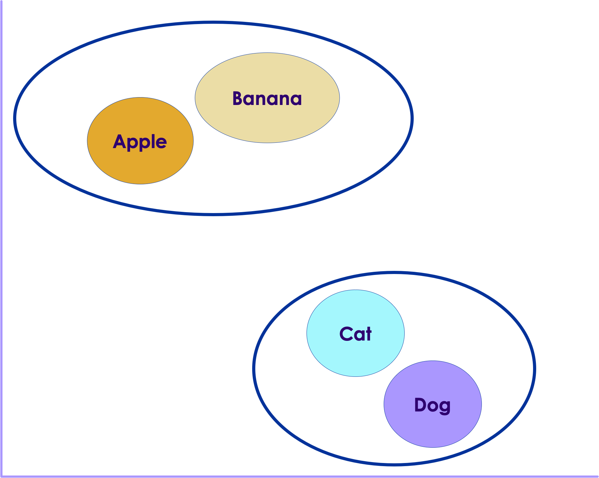
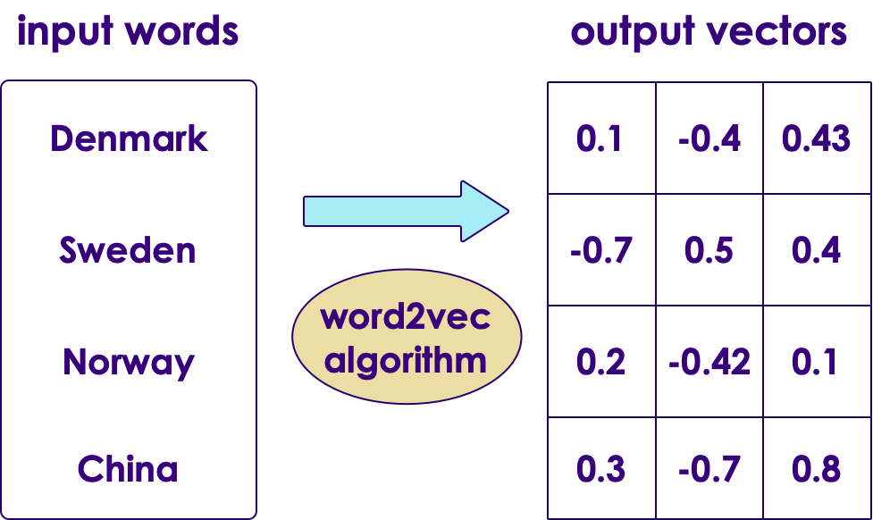
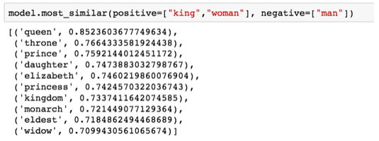
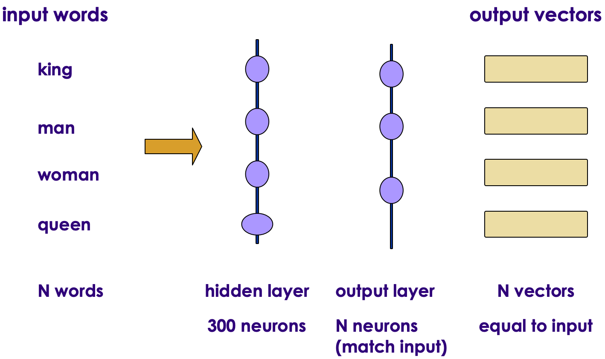

# word2vec

---

## Before word2vec: Bag of Words

* NLP systems and techniques treat words as atomic units

* There is no notion of similarity between words

* Words are represented as indices in a vocabulary

```text
I eat an apple and a banana for lunch.
I have a cat and a dog as pets.
```

|        | apple | banana | cat | dog | i | lunch | pet |
|--------|-------|--------|-----|-----|---|-------|-----|
| apple  | 1     | 0      | 0   | 0   | 0 | 0     | 0   |
| banana | 0     | 1      | 0   | 0   | 0 | 0     | 0   |
| cat    | 0     | 0      | 1   | 0   | 0 | 0     | 0   |
| dog    | 0     | 0      | 0   | 1   | 0 | 0     | 0   |
| i      | 0     | 0      | 0   | 0   | 1 | 0     | 0   |
| lunch  | 0     | 0      | 0   | 0   | 0 | 1     | 0   |
| pet    | 0     | 0      | 0   | 0   | 0 | 0     | 1   |

---

## Strenghts of Bag-of-words

* Simplicity

* Robustness

* Simple models trained on huge amounts of data
  - outperform complex systems trained on less data

* Example
   - N-gram model
    - used for statistical language modeling
    - N-grams trained on virtually all available data (trillions of words)

---

## Weakness of BoW: Loss of Meaning

* Let's consider the following text

```text
Jane runs faster than Dan

Dan runs faster than Jane
```

* We get the same BoW representation for both sentences;  But the meanings of these are very different

<br/>

| Document | dan | faster | jane | runs | than |
|----------|-----|--------|------|------|------|
| doc 1    | 1   | 1      | 1    | 1    | 1    |
| doc 2    | 1   | 1      | 1    | 1    | 1    |

<br/>

* BoW technique looses the meaning of the words

---

## Word2vec Goals

<!-- TODO shiva -->
 <!-- {"left" : 0.75, "top" : 4.92, "height" : 2.91, "width" : 8.74} -->

* Preserve word order (indirectly)

* Preserve word distance / relationship
  - If two words are close in meaning, then should be represented by vectors that are close
  - For example **banana** should be close **apple** but distant from **dog**

```text
I eat an apple and a banana for lunch.
I have a cat and a dog as pets.
```

---

## Word2Vec

* Word2Vec is a statistical method for efficiently learning a standalone word embedding from a text corpus.

* It was developed at Google in 2013
  - by Tomas Mikolov,  Kai Chen,   Greg Corrado,  Jeff Dean
  - White paper : ["Efficient Estimation of Word Representations in Vector Space", Google, 2013](https://arxiv.org/abs/1301.3781)

* Idea is to use the neural-network-based training to calculate word embeddings

* Word2Vec is a high-quality word vectors
  - Trained from huge data sets, with billions of words,  with millions of words in the vocabulary

* Google has a patent for Word2Vec.  But they made a version available under commercial friendly Apache-2 license

---

## Understanding Word2Vec

- Before we understand word2vec, let's understand vectors and how to measure their similarities

---

## Cosine Similarity

[../../machine-learning/generic/ML-Concepts-Errors-and-Loss-Functions.md#Cosine Similarity](../../machine-learning/generic/ML-Concepts-Errors-and-Loss-Functions.md#Cosine Similarity)

---

## Now Back to Word2vec

* Inputs a large corpus of text (bunch of words)
* Produces a vector space
  - Typically of several hundred dimensions
  - (Practically between 100 and 1000)
* words => vectors

<!-- {"left" : 1.39, "top" : 3.79, "height" : 4.45, "width" : 7.47} -->

---

## Word2vec Results

* Word vectors are positioned in the vector space
* Words that share common contexts in the corpus are located in close proximity to one another
    * In this example we see 'food items' are close together on top-left
    * And music items are close together on right

<!-- {"left" : 2.02, "top" : 3.75, "height" : 4.68, "width" : 6.21} -->


---
## Word2Vec Relationships Between Vectors

<!-- {"left" : 5.32, "top" : 1.17, "height" : 3.49, "width" : 4.72} -->

* Another amazing thing word2vec can do is, it can describe relationships between vectors!

* **France is to Paris as Germany is to Berlin**

---

## Demo: Explore Word Embeddings

<!-- {"left" : 5.32, "top" : 1.17, "height" : 3.49, "width" : 4.72} -->

* This is a fun demo to interactively explore word embeddings at work
* Go to : [projector.tensorflow.org](https://projector.tensorflow.org/)
* Load **word2vec** model (on the left side)
* Search for word **fun** on the right hand side
* Explore 'similar words'
* Try your own words and explore similar words

<!-- {"left" : 5.32, "top" : 1.17, "height" : 3.49, "width" : 4.72} -->

---

# How word2vec Works

---

## Word Embeddings

- __Word Embedding__ is the vectorized form of words

- Here is a vectorized form for word 'king'  in a popular word2vec model called 'Glove Wikipedia' (more on this later).  
list of 50 numbers

```text
[ 0.50451 , 0.68607 , -0.59517 , -0.022801, 0.60046 , -0.13498 , -0.08813 , 0.47377 , -0.61798 ,
-0.31012 , -0.076666, 1.493 , -0.034189, -0.98173 , 0.68229 , 0.81722 , -0.51874 , -0.31503 ,
-0.55809 , 0.66421 , 0.1961 , -0.13495 , -0.11476 , -0.30344 , 0.41177 , -2.223 , -1.0756 ,
-1.0783 , -0.34354 , 0.33505 , 1.9927 , -0.04234 , -0.64319 , 0.71125 , 0.49159 , 0.16754 ,
0.34344 , -0.25663 , -0.8523 , 0.1661 , 0.40102 , 1.1685 , -1.0137 , -0.21585 , -0.15155 ,
0.78321 , -0.91241 , -1.6106 , -0.64426 , -0.51042 ]
```
<!-- {"left" : 0, "top" : 3.24, "height" : 1.48, "width" : 10.25} -->

- Let's color code the cells based on their values (red if they're close to 2, white if they're close to 0, blue if they're close to -2)

<!-- {"left" : 0.17, "top" : 6.1, "height" : 1.48, "width" : 9.91} -->

- Reference : http://jalammar.github.io/illustrated-word2vec/

Notes:

---

## Word Embeddings: Magic of Word2Vec

<!-- {"left" : 0.56, "top" : 1.58, "height" : 3.17, "width" : 9.14} -->

- See how 'man' and 'woman' are much close to each other than 'king' ?

- Reference : http://jalammar.github.io/illustrated-word2vec/

Notes:

---

## Magic of Word2Vec

<!-- {"left" : 1.02, "top" : 2.62, "height" : 4.39, "width" : 8.21} -->


---

## Magic of Word2Vec

<!-- {"left" : 6.9, "top" : 1.02, "height" : 1.72, "width" : 3.21} -->

- There's a straight red column through all of these different words. They're similar along that dimension (and we don't know what each dimensions codes for)

-  __woman__ and __girl__ are similar to each other in a lot of places. The same with __man__ and __boy__

- There are clear places where __king__ and __queen__ are similar to each other and distinct from all the others. Could these be coding for a vague concept of __royalty__?

- The last word is __water__, different than all other words (people).  We can see the solid blue line in the middle, that goes through all people, stops at water!


---

## Magic of Word2Vec: Relationship Between Vectors

- One of the really cool featurs of word2vec is it can infer meanings between vectors

- The most famous example is the following formula:  
__`king - man + woman --> queen`__

<!-- {"left" : 1.41, "top" : 3.94, "height" : 2.78, "width" : 7.43} -->

- Reference : http://jalammar.github.io/illustrated-word2vec/

Notes:

---

## King - Man + Woman = Queen

- Here you can see, when we add / substract vectors, the resulting vector of __(King - Man + Woman)__ is remarkably similar to __Queen__ !

<!-- {"left" : 1.25, "top" : 2.93, "height" : 3.88, "width" : 7.75} -->

- Reference : http://jalammar.github.io/illustrated-word2vec/

Notes:

---

## Training word2vec Model


- Words are input, vectors are output

<!-- {"left" : 0.8, "top" : 3, "height" : 3.64, "width" : 8.21} -->

---

## Training word2vec Model  using Neural Net

<!-- {"left" : 5.14, "top" : 1.21, "height" : 2.93, "width" : 4.93} -->


- Word2Vec is a shallow 2 layer neural network

- Google's original model used 300 dimensions, so it had 300 neurons in 'hidden layer'

- Number of neurons in output layer will match number of words (if 10,000 input words --> 10,000 output neurons)

---

## How word2vec Model is Created

* Two general approaches are used
    * Continuous bag-of-words (CBOW)
    * Continuous skip-gram


---

## Continuous bag-of-words (CBOW)

* The model predicts the current word
  - From a window of surrounding context words

* The order of context words does not influence prediction
 - bag-of-words assumption

* Example:   
"Soviet __???__"
* Output is probabilities of next possible words
    - "Union": 0.9 (90%)
    - "Russia": 0.8 (80%)
    - "pie": 0.04  (4%)

* [original word2vec white paper](https://arxiv.org/pdf/1301.3781.pdf)

---

## Continuous Skip-gram

* Sort of opposite of 'Continuous Bag of Words'

* The model uses the current word
  - To predict the surrounding window of context words

* The skip-gram architecture weighs nearby context words
  - more heavily than more distant context words

* Example

```text
 __???__ , __???___  and __???___ are part of NAFTA

 predictions (uses 'NAFTA' word) :
 - United States
 - Canada
 - Mexico
```
<!-- {"left" : 0, "top" : 4.35, "height" : 2.03, "width" : 9.11} -->

---

## CBOW vs. Skip-gram

- According to Mikolov:
    - Skip-gram: works well with small amount of the training data, represents well even rare words or phrases.
    - CBOW: several times faster to train than the skip-gram, slightly better accuracy for the frequent words

- References:
    - [1](http://jalammar.github.io/illustrated-word2vec/)
    - [2](https://www.quora.com/What-are-the-continuous-bag-of-words-and-skip-gram-architectures)
    - [3](https://www.analyticsvidhya.com/blog/2017/06/word-embeddings-count-word2veec/)

---

## Word2Vec Pre-trained Models

- The more data we train on, the better the model gets
    - this can be pretty intensive in real world datasets

- So we can start with a pre-trained model and then tweak it to work on our models
    - This is essentially 'transfer learning' (more on this later)

- Some really good models are available as open source

- Here is a repo: https://github.com/RaRe-Technologies/gensim-data

| model | size | number of vectors | description |
|--------------------------|----------|-------------------|------------------------------------------------------|
| glove-twitter-25 | 104 MB | 1,193,514 | Twitter (2B tweets, 27B tokens, 1.2M vocab, uncased) |
| word2vec-google-news-300 | 1,662 MB | 3,000,000 | Google News (about 100 billion words) |
| glove-wiki-gigaword-300 | 376 MB | 400,000 | Wikipedia 2014 + Gigaword 5 (6B tokens, uncased) |

---

## Lab: Word2Vec

<!-- {"left" : 6.77, "top" : 1, "height" : 4.43, "width" : 3.32} -->

 * **Overview:**
    - Use word2vec

 * **Builds on previous labs:**
    - None

 * **Approximate time:**
    - 30 mins

 * **Instructions**"
    - R / Python  / Spark

---

# Backup Slides

---

## Doc2Vec

* Word2Vec gives us a vector representation of a word.

* But what about a **document**?

* Word2vec is not really suitable for anything but the smallest documents (e.g. tweets)

* Because it will store 100-1000 dimensional vector for each word!
  - too much information!

* One solution is Paragraph Vectors (PV) better known as Doc2Vec

* Published by Quoc Le and Tomas Mikolov from Google (as Paragraph Vectors)

* [Link](https://cs.stanford.edu/~quocle/paragraph_vector.pdf)

---

## Deep Learning Approaches

* Sometimes we use a deep learning approach instead of PV/Doc2Vec

* Treat the paragraph / document as a sequence of the word vectors

* Then use a neural network to create a document vector from the word vector

* The advantage of this is that you can make a neural network very well-tuned to your particular problem and dataset.

---

## GloVE
 * GloVE is another Word (not document) vectorization approach.
 * Alternative to Word2Vec
 * Uses the whole-document approach rather than a limited neighborhood approach as word2vec does.
 * [Paper](https://nlp.stanford.edu/pubs/glove.pdf)

---

## Sense2Vec

 * A better word2vec for some applications
 * Query vectors for multi-word phrases based on part-of-speech tags and entity labels.
 * spaCy pipeline component and extension attributes.
 * Fully serializable so you can easily ship your sense2vec vectors with your spaCy model packages.
 * Optional caching of nearest neighbors for super fast "most similar" queries.
 * Train your own vectors using a pretrained spaCy model, raw text and GloVe or Word2Vec via fastText (details).
 * Prodigy annotation recipes for evaluating models, creating lists of similar multi-word phrases and converting them to match patterns, e.g. for rule-based NER or to boostrap NER annotation (details & examples).
 * [Demo](https://explosion.ai/demos/sense2vec)

 
---

## Word2vec Parametrization
* word2vec is sensitive to parameters
* Training algorithm
  - Hierarchical softmax
  - Negative sampling


---

## Word2vec Algorithms
* Hierarchical softmax
  - approximate the conditional log-likelihood
  - uses a Huffman tree to reduce calculation
* The negative sampling method
  - Solves the maximization problem
  - by minimizing the log-likelihood of sampled negative instances


---

## Word2vec Dimensionality
* Higher dimensionality => Higher quality of word embedding
* But marginal gain diminishes
* Typically, the dimensionality of the vectors
  - is set to be between 100 and 1,000


---

## Context Window          
* Context window -
* How many words before and after a given word
  - would be included as context words
  - the recommended value is
    - 10 for skip-gram
    - 5 for CBOW


