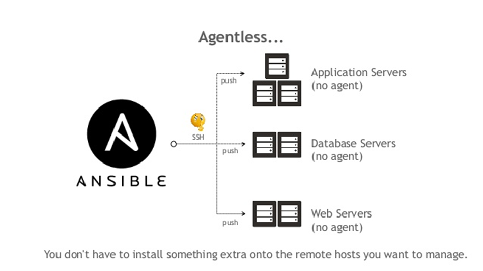

# Stating a problem


---

# Automating the management and deployment of a large infrastructure


---

# Answer


---


# Ansible


---


## What is Ansible?

* Ansible is a simple IT automation tool that makes your applications and systems easier to deploy.
* Avoid writing scripts or custom code to deploy and update your applications
* automate in a language that approaches plain English, using SSH, with no agents to install on remote systems.
* Ansible is agentless, so you don’t have to install software on remote systems to manage them.

---

## Where to use Ansible

* Configuration Management
* Application Deployment
* Continuous Delivery
* Orchestration
* Security Automation
* Multi-Tier Applications
* Cloud Provisioning
* Network Automation
* And more...

---

## Agentless

Target systems do not need to have any software installed on them to be managed by Ansible.

Tasks are executed over SSH by default, but can also be executed locally.



<span style="font-size:15px; color:red">_except for Windows systems, which require a small Python executable to be installed._</span>

---

# Why Agentless?

The reasons for this choice in the Ansible design are many, not least that just about every Linux/FreeBSD/macOS host has it built in, as do many network devices such as switches and routers.

---

# Idempotent

Ansible is idempotent, meaning that it can be run multiple times without changing the state of the system.

---


Ansible is not a configuration management tool

BUT

it can be used to manage configuration files.

---

## Ansible Architecture


---

## Run AGAINST

Means to run a specific adhoc, play or playbook on the specified host or group from the inventory


---

## Ansible Vs Chef Vs Puppet Vs SaltStack
| Feature              | Ansible                                                                 | Chef                                             | Puppet                                            | SaltStack                                            |
|----------------------|-------------------------------------------------------------------------|--------------------------------------------------|---------------------------------------------------|------------------------------------------------------|
| Configuration language | YAML                                                                    | Ruby DSL                                         | Puppet DSL                                        | YAML                                                 |
| Masterless support | Yes                                                                     | No                                               | No                                                | Yes                                                   |
| Agent-based support | Optional (ansible-pull)                                                 | Yes                                              | Yes                                               | Yes                                                   |
| Idempotent execution | Yes                                                                     | Yes                                              | Yes                                               | Yes                                                   |
| Real-time execution | Yes                                                                     | No                                               | No                                                | Yes                                                   |
| Parallel execution | Yes                                                                     | Yes                                              | Yes                                               | Yes                                                   |
| Dependency management | Yes                                                                  | Yes                                              | Yes                                               | Yes                                                   |
| Dry-run testing | Yes                                                                    | Yes                                              | Yes                                               | Yes                                                   |
| Declarative configuration | Yes                                                             | Yes                                              | Yes                                               | Yes                                                   |


---

<br>

| Feature              | Ansible                                                                 | Chef                                             | Puppet                                            | SaltStack                                            |
|----------------------|-------------------------------------------------------------------------|--------------------------------------------------|---------------------------------------------------|------------------------------------------------------|
| Community support | Strong                                                                  | Strong                                           | Strong                                            | Strong                                               |
| Ease of use | Easy to learn and use, minimal setup required                            | Steep learning curve, complex setup required     | Steep learning curve, complex setup required      | Easy to learn and use, minimal setup required         |
| Platform support | Cross-platform (Windows, Linux, macOS, etc.)                             | Cross-platform (Windows, Linux, macOS, etc.)     | Cross-platform (Windows, Linux, macOS, etc.)      | Cross-platform (Windows, Linux, macOS, etc.)         |
| Reporting | Basic reporting built-in, additional tools available                      | Strong reporting and monitoring capabilities     | Strong reporting and monitoring capabilities      | Strong reporting and monitoring capabilities         |
| Language support | Supports multiple programming languages and frameworks                    | Ruby DSL                                         | Puppet DSL                                        | Python                                               |
| Custom module development | Yes                                                | Yes                                              | Yes                                               | Yes                                                   |

---
<br>

| Feature              | Ansible                                                                 | Chef                                             | Puppet                                            | SaltStack                                            |
|----------------------|-------------------------------------------------------------------------|--------------------------------------------------|---------------------------------------------------|------------------------------------------------------|
| Extensibility | Plugin system for modules, roles, and collections                         | Plugins and modules                              | Plugins and modules                               | Python modules and plugins                            |
| Infrastructure as code (IaC) | Yes                                             | Yes                                              | Yes                                               | Yes                                                   |
| Task scheduling | Yes                                                                 | Yes                                              | Yes                                               | Yes                                                   |
| Compliance auditing | Yes                                                             | Yes                                              | Yes                                               | Yes                                                   |
| Configuration testing | Yes                                                          | Yes                                              | Yes                                               | Yes                                                   |
| Centralized management | Yes                                                             | Yes                                              | Yes                                               | Yes                                                   |
| System monitoring | Yes                                                              | Yes                                              | Yes                                               | Yes                                                   |
| Encryption | Yes (Ansible Vault)                                                     | Yes (Chef Vault)                                 | Yes (Hiera-eyaml)                                 | Yes (GPG and Vault)                                   |

---

<br>

| Feature              | Ansible                                                                 | Chef                                             | Puppet                                            | SaltStack                                            |
|----------------------|-------------------------------------------------------------------------|--------------------------------------------------|---------------------------------------------------|------------------------------------------------------|
| Configuration management | Yes                                                          | Yes                                              | Yes                                               | Yes                                                   |
| Cloud provisioning | Yes                                                                 | Yes                                              | Yes                                               | Yes                                                   |
| Continuous delivery | Yes                                                            | Yes                                              | Yes                                               | Yes                                                   |
| Multi-environment management | Yes                                                | Yes                                              | Yes                                               | Yes 

---

# Inventory

---


## Inventory

* A list of hosts that Ansible can manage
* Can be static or dynamic
* Can be defined in a file or in the command line


```ini

mailserver mail.example.com

[webserver]
foo.example.com
bar.example.com

[appserver]
one.example.com
two.example.com
three.example.com
mailserver
```
---

## INI Format

* The INI format is a simple format that uses sections and key/value pairs
* The sections are the groups of hosts
* The key/value pairs are the hosts and their attributes
* The attributes are optional
* The attributes are used to define the connection parameters
* The attributes are defined in the form of key=value pairs
* The attributes are defined after the host name


---

## Static Inventory

* A static inventory is a list of hosts defined in a file
* The file is usually called `hosts` and is located in the `/etc/ansible` directory
* The file can be in any format, but the most common one is the INI format


---

## Example

```ini
[webserver]
<Machine-IP>  ansible_ssh_pass=<Password>


[webserver:vars]
ansible_user=<Username>

[appserver]
<Machine-IP> ansible_ssh_pass=<Password>

[appserver:vars]
ansible_user=<Username> # ( ubuntu in our environment )
```

---

## Dynamic Inventory

* A dynamic inventory is a list of hosts that is generated by a script
* The script can be written in any language
* The script can be written to query a database, a cloud provider, or any other source
* The script must return a JSON object with the list of hosts and their attributes
* The script must be located in the `/etc/ansible` directory

---


# Install Ansible

---

## Install Ansible

* Ansible is written in Python and, as such, can be installed on a wide range of systems

  * Debian
  * RedHat
  * FreeBSD

* macOS

The one exception to this is Windows, though native Python distributions exist, there is yet no native Ansible build.


---

## Release Cycle

The release cycle for Ansible is usually about four months, and during this short release cycle, there are normally many changes, from minor bug fixes to major ones, to new features and even sometimes fundamental changes.

The simplest way to not only get up and running with Ansible but to keep yourself up to date is to use the native packages built for your operating system where they are available.


---

# LAB

Install Ansible

* [https://github.com/elephantscale/ansible-labs/blob/main/setup/Install-Ansible.md](https://github.com/elephantscale/ansible-labs/blob/main/setup/Install-Ansible.md)
---

# Ansible Ad-Hoc

---

## Ad-Hoc Commands

* An Ansible ad hoc command uses the `ansible` command-line tool to automate a single task on one or more managed nodes.
* ad hoc commands are quick and easy, but they are not reusable.
* ad hoc tasks can be used to reboot servers, copy files, manage packages and users, and much more.* You can use any Ansible module in an ad hoc task.* ad hoc commands demonstrate the simplicity and power of Ansible
* It will port over directly to the playbook language
* For every ad hoc command you run, you will get a response in JSON format
* You can use the `-m` option to specify the module to use
* You can use the `-a` option to specify the arguments to pass to the module
* You can use the `-i` option to specify the inventory file to use

---

## Example

```bash
ansible -i hosts -m ping all
```

---

# LAB

Adhoc Lab
* [https://github.com/elephantscale/ansible-labs/tree/main/adhoc](https://github.com/elephantscale/ansible-labs/tree/main/adhoc)