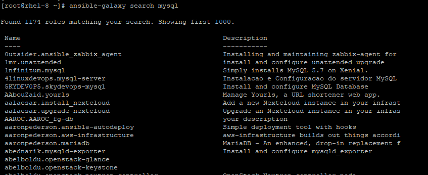
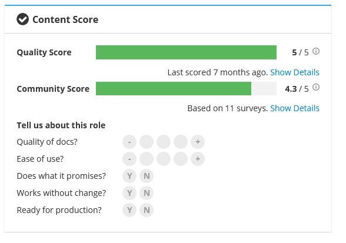
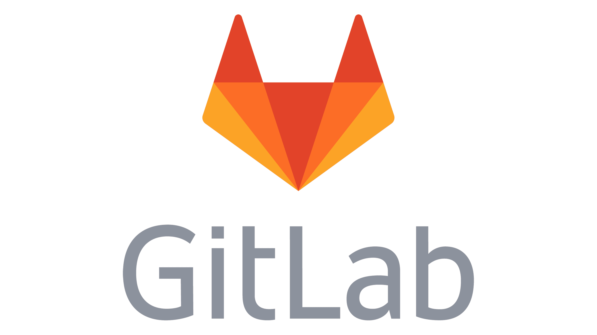

# Ansible Galaxy

---

## What is Ansible Galaxy?

- **Definition**: Ansible Galaxy is a public, community-driven hub for sharing and discovering Ansible roles, collections, and other resources.  
- **Purpose**: It streamlines reuse by allowing users to publish and download high-quality, vetted content for common automation tasks.


---

## Registry

- **Ansible Galaxy Registry**: A searchable and browsable repository of community-contributed Ansible content, such as roles, collections, modules, and plugins.  
- **Features**:  
  - Search, browse, and download content.  
  - Rate and review content to foster a quality-driven ecosystem.
- **Use Cases**:  
  - Quickly find well-tested roles for popular software (e.g., Apache, MySQL).  
  - Reuse code for consistent deployments across environments.


---

## Collections

- **Definition**: Collections are bundles of Ansible content (roles, modules, plugins, etc.) grouped under one namespace.  
- **Advantages**:  
  - Can include metadata, documentation, and dependencies for easy consumption.  
  - Red Hat strongly promotes collections as the new standard for distributing Ansible content.
- **Usage**: Include collections in your playbooks via the `collections` keyword.  

```yaml
# Example usage in a playbook
- name: Use a community collection
  hosts: all
  collections:
    - community.general
  tasks:
    - name: Example task
      some_module:
        ...
```

---

## Roles

- **Definition**: Roles are structured, reusable units of Ansible functionality, containing tasks, files, templates, and variables.  
- **Galaxy Integration**: You can publish or install roles directly from Galaxy.  
- **Installation**: Use the `ansible-galaxy` CLI or reference roles in a `requirements.yml` file.

```text
ansible-galaxy install username.role_name
```

---

## Galaxy Tools

- **`ansible-galaxy` CLI**:  
  - Manages roles, collections, and other Galaxy content.  
  - Allows installing, removing, and listing roles or collections.

- **`ansible-builder`**:  
  - Creates and packages custom Ansible collections.  
  - Helps ensure your collections have proper structure and metadata.



---

## Galaxy Organizations

- **Purpose**: Provide a collaborative space for teams or companies to manage Ansible content within Galaxy.  
- **Features**:  
  - Multiple repositories under one organizational umbrella.  
  - Granular permission levels for members.  
  - Unified branding and oversight.


---

## Quality Scoring



- **Scoring System**: Galaxy assigns quality scores based on factors like documentation, testing, and community ratings.  
- **Goal**: Help users identify reliable and well-maintained content.  
- **Practical Tip**: Check the score and user reviews before adopting content in production.

---

## Dependencies


- **Definition**: Galaxy allows content creators to specify dependencies on other roles, collections, or modules.  
- **Metadata**: These dependencies are listed in `meta/main.yml` (for roles) or within a collection’s metadata.  
- **Example**:

```ini
# In a role's meta/main.yml
dependencies:
  - src: geerlingguy.apache
    version: 3.0.0
```

```bash
# Install from a requirements file
ansible-galaxy install -r requirements.yml
```

---

## Licensing


- **Open-Source Requirement**: All content on Ansible Galaxy must use an approved open-source license (e.g., MIT, Apache 2.0, GPL).  
- **Why It Matters**: Ensures community trust, legality, and compliance with open-source standards.

---

## Contributing

- **Open to Everyone**: Anyone can publish roles or collections to Galaxy, provided they adhere to guidelines.  
- **Best Practices**:  
  - Write clear documentation and examples.  
  - Maintain thorough testing and CI pipelines.  
  - Follow Ansible’s recommended folder structure.
- **Getting Started**: Sign up, create or import your GitHub role/collection, then publish.


---

## Security


- **Vulnerability Scanning**: Galaxy leverages the Snyk vulnerability database to scan for known security issues.  
- **Contributor License Agreement (CLA)**: Contributors must sign a CLA to ensure their work doesn’t infringe on intellectual property rights.  
- **User Responsibility**: Always review and test community content in non-production environments before widespread rollout.

---

## Best Practices

1. **Review & Test**: Validate content in a staging environment first.  
2. **Trusted Sources**: Favor roles and collections from reputable authors with high-quality scores.  
3. **Minimal Privileges**: Adhere to the principle of least privilege when running roles or collections.  
4. **Regular Updates**: Keep your roles and collections up-to-date to benefit from security patches and improvements.


---

## Alternatives

- **GitHub, GitLab, Bitbucket**:  
  - You can host and share Ansible content in private or public repos.  
  - Great for custom or proprietary roles/collections not meant for general publication.  
- **Comparison**: Galaxy offers community ratings and a built-in scoring system, while Git-based repositories may rely on manual or third-party checks.





---

## Noteworthy Contributors

- **[Jeff Geerling](https://galaxy.ansible.com/geerlingguy)**  
  - Maintains several widely-used roles.  
  - Actively shares Ansible knowledge via blogging and YouTube.

- **[David Winterbottom](https://galaxy.ansible.com/dwinterbottom)**  
  - Contributed to official AWS modules.  
  - Frequent conference speaker and workshop instructor.

- **Nick Janetakis**  
  - Author of “Docker for Developers.”  
  - Offers tutorials and insights integrating Docker with Ansible.

- **Tim Gerla**  
  - Authored “Mastering Ansible,” a comprehensive guide published by Packt.  
  - Shares best practices for large-scale Ansible deployments.

---

## Conclusion

- **Efficient Sharing**: Ansible Galaxy enables quick discovery and reuse of quality content, saving time and effort.  
- **Community-Driven**: Active user contributions and rating systems help maintain high standards.  
- **Security & Reliability**: By following best practices (license compliance, scanning, testing), you can confidently leverage Galaxy content in production.


---


**Good Bye & Happy Automating!**