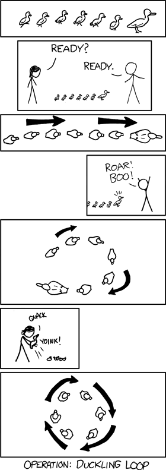

# Ansible Playbook

---

## What is a Playbook?

- **Definition**: A playbook is a YAML-formatted file that contains a list of “plays,” which in turn define tasks for configuration, deployment, and orchestration.
- **Purpose**: Playbooks describe the desired state of your systems, allowing Ansible to maintain consistency across various environments.


---

## Key Components of a Playbook


- **Plays**: Group tasks under a specific host or group of hosts.
- **Tasks**: Individual instructions, often using Ansible modules, such as installing packages or creating files.
- **Variables**: Key-value pairs that store data for dynamic or reusable settings.
- **Handlers**: Special tasks triggered by “notify” statements to perform actions after changes (e.g., restarting a service).
- **Templates**: Use Jinja2 to generate dynamic configuration files.

We will examine each component in more detail.

---

## Playbook Example

Below is a simple playbook:

```yaml
- name: Print a message
  hosts: all

  tasks:
    - name: Print a debug message
      debug:
        msg: "Hello, world!"
```

Let’s break down this example into its component parts.

---

## YAML Header

```yaml
---
```

- **Purpose**: This marker indicates the start of a YAML document.
- **No Specific Version**: You’re simply declaring that the file is valid YAML.

---

## Play

```yaml
- hosts: servers
  become: true
```

- **Hosts**: Defines which group(s) or host(s) the tasks should run against.
- **Become**: Indicates that tasks in this play should run with elevated (sudo) privileges.

---

## What is a Play?

A **play** is a series of tasks that target a specific group of hosts:

```yaml
- hosts: servers
```

In this example, `servers` refers to a host group defined in your inventory.

---

## What is Become?

```yaml
become: true
```

- **Definition**: Tells Ansible to escalate privileges (e.g., sudo) for the tasks under this play.
- **Use Case**: Ideal for tasks that require root or administrative privileges.


---

## Task Structure

```yaml
  tasks:
    - name: Print a debug message
      debug:
        msg: "Hello, world!"
```

- **Name**: A human-readable label for the task, aiding in clarity and logging.
- **Module**: Specifies which Ansible module is used (e.g., `debug`, `apt`, `yum`, `copy`).
- **Arguments**: Key-value pairs passed to the module to configure its behavior.

---

## Task: Name

```yaml
    - name: Print a debug message
```

- **Purpose**: Provides a descriptive identifier for the task.
- **Recommendation**: Use clear, concise naming to quickly understand what the task does.

---

## Task: Module

```yaml
      debug:
```

- **Definition**: The module to be executed by Ansible.
- **Examples**: `apt` (Debian-based package manager), `yum` (Red Hat-based), `copy`, `file`, `user`, etc.
- **Custom Modules**: You can write your own or use community-provided modules.

---

# Let’s Discuss Modules

---

## Task: Module Arguments

```yaml
        msg: "Hello, world!"
```

- **Key-Value Pairs**: Customize module behavior, such as package names, file paths, or messages.
- **Example**: When using the `apt` module, arguments might include `name` and `state` to indicate which package to install.

---

## Modules: Types

- **Core Modules**
    - Maintained by the Ansible team.
    - Found in your Python site-packages directory (e.g., `/usr/lib/python3.x/site-packages/ansible/modules`).
- **Extra Modules**
    - Maintained by the community.
    - May be promoted to core or removed if unmaintained.
    - Installable via `ansible-galaxy`.

---

## Modules: Index

- **Local Documentation**: `/usr/share/doc/ansible/html/modules_by_category.html`
- **Online Index** (for Ansible 2.9 example):  
  [Ansible Modules by Category](https://docs.ansible.com/ansible/2.9/modules/modules_by_category.html)

---

## Modules: Documentation

- **Local Docs**: `/usr/share/doc/ansible/html/modules/<module_name>.html`
- **Online Docs**: `https://docs.ansible.com/ansible/2.9/modules/<module_name>.html`
- **Contents**:
    - Description of the module
    - Required arguments (e.g., `name`, `state`)
    - Return values
    - Code examples

---

# Returning to Our Playbook

---

## Playbook: Summary

```yaml
- name: Print a message
  hosts: all

  tasks:
    - name: Print a debug message
      debug:
        msg: "Hello, world!"
```

- **Single Play**: Targets all hosts in the inventory.
- **Single Task**: Uses the `debug` module to display “Hello, world!”
- **Execution**: Run with `ansible-playbook -i <inventory_file> playbook.yml`.

---

## Running the Playbook

Execute the playbook with:

```bash
ansible-playbook -v playbook.yml
```

- **`-v`**: Increases verbosity, showing more detail on what Ansible is doing.
- **Default Behavior**: Uses `hosts: all` if not overridden by the CLI.

---

## LAB

Practice your new knowledge by completing the hands-on exercises in the lab:

**[Access the Lab Here]** (Link to your specific lab resource)

---

## Variables and Facts

Consider the following example:

```yaml
---
- hosts: servers
  vars:
    my_var: "Hello, world!"
  tasks:
    - name: Debug variable
      debug:
        var: my_var
```

We’ll break this down to understand variables and facts more clearly.

---

## Variables

```yaml
vars:
  my_var: "Hello, world!"
```

- **Definition**: Store data for easy reuse or customization.
- **Location**: Can be defined at the play level, in inventory, or in a separate file.
- **Scope**: Variables can be scoped to a play, group, host, or globally.

---

## Task: Debug

```yaml
- name: Debug variable
  debug:
    var: my_var
```

- **Debug Module**: Helps you print or inspect variables.
- **`var` Parameter**: Tells Ansible which variable to display.

---

## LAB

Hands-on practice:

**[Access the Lab Here]** (Link to your lab exercises)

---

## Prompt for Input

You can prompt the user for input dynamically:

```yaml
---
- hosts: servers
  vars_prompt:
    - name: my_var
      prompt: "Enter a value for my_var: "
  tasks:
    - name: Debug variable
      debug:
        var: my_var
```

---

## Variables: Prompt

```yaml
vars_prompt:
  - name: my_var
    prompt: "Enter a value for my_var: "
    default: "default value"
    private: yes
```

- **`default`**: Used if the user presses Enter without typing a value.
- **`private`**: Masks user input (useful for passwords or sensitive data).

---

## Variables: File

You can load variables from a separate file:

```yaml
---
- hosts: servers
  vars_files:
    - vars.yml
  tasks:
    - name: Debug variable
      debug:
        var: my_var
```

- **`vars_files`**: Lists one or more external YAML files containing variable definitions.
- **`include_vars`**: An alternative module that can also import variables from a file during a task.

---

## Variables: Register

```yaml
- name: Register a variable
  shell: cat /home/ubuntu/a.txt
  register: motd_contents
```

- **`register`**: Captures the output of a task’s command for later use.
- **Usage**: Refer to the registered variable in subsequent tasks.

---

## Variables: set_fact

```yaml
- name: Setting host facts using set_fact module
  set_fact:
    fact_one: "Hello"
    fact_other: "Bye"
    john_fact: "Doe"
    cacheable: yes
```

- **`set_fact`**: Dynamically sets variables (known as “facts”) during a play’s execution.
- **`cacheable`**: Can cache these facts for future use if a fact cache (e.g., Redis) is configured.

---

## LAB

Explore further with a practice lab:

**[Access the Lab Here]**

---

## Ansible Facts

Facts are automatically collected information about each managed host (e.g., OS, network interfaces, CPU count).

```yaml
---
- hosts: servers
  gather_facts: yes
  tasks:
    - name: Display CPU count
      debug:
        msg: "The target host has {{ ansible_facts['processor']['count'] }} CPUs."
```

---

## gather_facts

```yaml
gather_facts: yes
```

- **Purpose**: Enables the automatic collection of system information from the target host.
- **Customization**: You can choose which subsets of facts to gather or exclude.

---

## Task: Debug (Facts)

```yaml
- name: Display CPU count
  debug:
    msg: "The target host has {{ ansible_facts['processor']['count'] }} CPUs."
```

- **ansible_facts**: A dictionary containing various system attributes.
- **Examples**: `ansible_facts['distribution']`, `ansible_facts['interfaces']`, etc.

---

## LAB

Strengthen your fact-handling skills:

**[Access the Lab Here]**

---

# Conditionals

---

## Conditionals

```yaml
---
- hosts: servers
  vars:
    my_var: true
  tasks:
    - name: Display message
      debug:
        msg: "The variable is true."
      when: my_var
```

Conditionals allow tasks to run only if a specified expression evaluates to `true`.

---

## Variable Definition

```yaml
vars:
  my_var: true
```

- **my_var** is set to `true`. The following task will only run under this condition.

---

## Task: Debug with Condition

```yaml
- name: Display message
  debug:
    msg: "The variable is true."
  when: my_var
```

- **`when`**: Determines whether the task executes.
- **Usage**: Combine with logical operators (`and`, `or`, `not`), comparison operators (`==`, `!=`, `>`, `<`), or fact variables.

---

## Conditions: Operators

- **Logical**: `and`, `or`, `not`
- **Comparison**: `==`, `!=`, `>`, `>=`, `<`, `<=`
- **Boolean**: `true`, `false`, `none`

```yaml
when: (ansible_facts['os_family'] == 'RedHat') and (my_var == true)
```

---

## LAB

Test your knowledge of conditionals in a lab setting:

**[Access the Lab Here]**

---

# Loops

---

## Loops

Ansible offers simple looping constructs to iterate over sets of data.



```yaml
---
- hosts: servers
  vars:
    my_list:
      - item1
      - item2
      - item3
  tasks:
    - name: Display list items
      debug:
        msg: "{{ item }}"
      with_items: "{{ my_list }}"
```

---

## Defining the Variable

```yaml
vars:
  my_list:
    - item1
    - item2
    - item3
```

- **my_list**: A list of items to iterate over in the tasks.

---

## Task: Debug with Loops

```yaml
- name: Display list items
  debug:
    msg: "{{ item }}"
  with_items: "{{ my_list }}"
```

- **`with_items`**: Iterates over `my_list`, rendering `{{ item }}` each time.

---

## Loop Keyword

An alternative to `with_items` is the `loop` directive:

```yaml
- name: Display list items
  debug:
    msg: "{{ item }}"
  loop: "{{ my_list }}"
```

- **`loop`**: Often preferred for readability and flexibility.

---

## Loops with Conditionals

```yaml
- name: Display list items except 'item2'
  debug:
    msg: "{{ item }}"
  loop: "{{ my_list }}"
  when: item != 'item2'
```

- **Combining** loops with `when` allows you to filter or skip certain items.

---

## loop_control Keyword

```yaml
- name: Display list items with index
  debug:
    msg: "Index: {{ my_index }} - Value: {{ my_loop }}"
  loop: "{{ my_list }}"
  loop_control:
    index_var: my_index
    loop_var: my_loop
```

- **`index_var`**: Stores the current iteration index.
- **`loop_var`**: Renames the loop variable from `item` to something else.

---

## LAB

Practice using loops in Ansible:

**[Access the Lab Here]**

---

# Handlers

---

## Handlers

Handlers are tasks that run in response to a “notify” event. For example:

```yaml
---
- hosts: servers
  tasks:
    - name: Display message
      debug:
        msg: "Hello World"
      notify: restart service

  handlers:
    - name: restart service
      service:
        name: httpd
        state: restarted
```

---

## Task: Debug

```yaml
- name: Display message
  debug:
    msg: "Hello World"
  notify: restart service
```

- **Notification**: If this task changes the system state, it triggers the handler named `restart service`.

---

## Handlers Section

```yaml
handlers:
  - name: restart service
    service:
      name: httpd
      state: restarted
```

- **Execution**: Occurs only at the end of the play (or after all tasks are run).
- **Purpose**: Typically used for service restarts, reloading configurations, etc.

---

## Best Practices

- **Idempotency**: Handlers should focus on actions that make sense to trigger after a change has occurred (e.g., reloading a changed config).
- **Avoid Overuse**: Don’t use handlers for normal tasks like package installs.

---

## LAB

Try out handlers in your lab environment:

**[Access the Lab Here]**

---

# Blocks

---

## Blocks

Blocks let you group tasks and manage error handling within a single structure:

```yaml
---
- hosts: servers
  tasks:
    - name: Create directory
      block:
        - file:
            path: /tmp/my_dir
            state: directory
      rescue:
        - debug:
            msg: "Directory creation failed!"
```

---

## Task: Block

```yaml
block:
  - file:
      path: /tmp/my_dir
      state: directory
rescue:
  - debug:
      msg: "Directory creation failed!"
```

- **`block`**: Contains tasks that run sequentially.
- **`rescue`**: Runs only if any task in `block` fails.
- **`always`**: Runs regardless of success or failure (not shown in this example).

---

## Benefits

- **Readability**: Groups related tasks, making your playbook more organized.
- **Error Handling**: Simplifies recovery steps when a task fails.
- **Robustness**: Allows for more structured exception handling in your automation.

---

# Templates

---

## Templates

Jinja2 templates let you generate dynamic configuration files on target hosts:

```yaml
---
- hosts: servers
  vars:
    my_var: "Hello World"
  tasks:
    - name: Create configuration file
      template:
        src: my_template.j2
        dest: /tmp/my_config.conf
```

```jinja
# my_template.j2
This is my configuration file
{{ my_var }}
```

---

## Variable: Define

```yaml
vars:
  my_var: "Hello World"
```

- **Usage**: Insert dynamic values into templates.
- **Location**: Defined inline or loaded from external files.

---

## Task: Template

```yaml
- name: Create configuration file
  template:
    src: my_template.j2
    dest: /tmp/my_config.conf
```

- **`template` Module**: Copies a Jinja2 file from the control node to the target, rendering variables.
- **`src`**: Path to your `.j2` file.
- **`dest`**: Destination path on the managed node.

---

## Jinja2 Template

```jinja
# my_template.j2
This is my configuration file
{{ my_var }}
```

- **Syntax**: Uses double curly braces (`{{ }}`) for variable references.
- **Advanced**: Supports conditionals, loops, and filters in Jinja2.

---

## Benefits

- **Maintainability**: Easy to modify a single template rather than multiple config files.
- **Consistency**: Ensures consistent settings across multiple servers.
- **Modularity**: Keeps playbooks clean by separating logic from configuration data.

---

## LAB

Try using templates with a hands-on lab:

**[Access the Lab Here]**

---

# Ansible Vault

---

## Ansible Vault

- **Purpose**: Encrypt sensitive data (passwords, tokens, SSL certificates) within playbooks or variable files.
- **Built-In**: Ships with Ansible, accessed via the `ansible-vault` command.

```yaml
---
- hosts: servers
  vars:
    my_secret: !vault |
      $ANSIBLE_VAULT;1.1;AES256
      6238633...  (encrypted data)
  tasks:
    - name: Display secret
      debug:
        var: my_secret
```

---

## Encrypting Variables

```yaml
vars:
  my_secret: !vault |
    $ANSIBLE_VAULT;1.1;AES256
    623863366f...
```

- **`!vault`**: Indicates that the variable is encrypted.
- **Use Cases**: Storing encrypted strings, entire files, or entire playbooks.

---

## Basic Vault Commands

1. **Create**: `ansible-vault create vault.yml`
2. **Edit**: `ansible-vault edit vault.yml`
3. **View**: `ansible-vault view vault.yml`
4. **Encrypt**: `ansible-vault encrypt vault.yml`
5. **Decrypt**: `ansible-vault decrypt vault.yml`
6. **Rekey**: `ansible-vault rekey vault.yml`

---

## Running Playbooks with Vault

- **Prompt for Password**:
  ```bash
  ansible-playbook playbook.yml --ask-vault-pass
  ```
- **Password File**:
  ```bash
  ansible-playbook playbook.yml --vault-password-file vault_pass.txt
  ```

---

## LAB

Practice protecting secrets with Ansible Vault:

**[Access the Lab Here]**

---

# Plugins

---

## Plugins

Plugins extend Ansible’s functionality and run on the control node before or during play execution.

```yaml
- hosts: windows_servers
  tasks:
    - name: Install Notepad++
      ansible.windows.win_package:
        name: notepadplusplus.install
        state: present
        choco_path: C:\ProgramData\chocolatey\bin
        choco_install_args: "--force"
      become: yes
```

---

## Task: Module and Plugin

- **Module**: `ansible.windows.win_package` manages Windows software packages.
- **Plugin**: `win_chocolatey` used to interface with Chocolatey for Windows package management.
- **Parameters**:
    - **`choco_path`**: Path to Chocolatey binaries.
    - **`choco_install_args`**: Additional installation flags.

---

## Plugin Types

- **Action Plugins**: Extend or override how modules run.
- **Callback Plugins**: Customize Ansible’s output formatting or logging.
- **Connection Plugins**: Define how Ansible connects to hosts (e.g., SSH, WinRM).
- **Filter Plugins**: Extend Jinja2 filters for templating.
- **Inventory Plugins**: Dynamically generate inventory from external sources.
- **Lookup Plugins**: Pull data from external systems or files.
- **Module Plugins**: Extend modules’ underlying functionality.
- **Strategy Plugins**: Control how tasks are executed (e.g., linear vs. free strategy).
- **Test Plugins**: Add new Jinja2 test operators.
- **Terminal Plugins**: Modify interactions with remote shells.
- **Var Plugins**: Extend how variables are loaded.
- **Cache Plugins**: Modify how facts and data are cached.

---

# Roles

---

## Roles

- **Purpose**: Organize playbooks into reusable, maintainable collections of tasks, files, templates, and variables.
- **Syntax**:

```yaml
---
- hosts: servers
  roles:
    - common
    - webserver
    - database
```

---

## Role Definition

```yaml
roles:
  - common
  - webserver
  - database
```

- **Structure**: Each role includes directories for tasks, handlers, files, templates, and variables.
- **Example**: `webserver` might include tasks to install Apache, handlers to restart Apache, templates for Apache config, etc.

---

## Role Directory Structure

```yaml
my_role/
tasks/
main.yml
handlers/
main.yml
files/
templates/
vars/
main.yml
defaults/
main.yml
meta/
main.yml
```

- **tasks/**: Where you define the actions a role performs.
- **handlers/**: Where you define handlers (e.g., service restarts).
- **files/**: Where you store static files.
- **templates/**: Where you keep Jinja2 templates.
- **vars/** and **defaults/**: Where role-specific variables are defined.
- **meta/**: Role metadata, dependencies, author info, etc.

---

## Benefits of Roles

- **Reusability**: Roles can be shared or published to Ansible Galaxy.
- **Maintainability**: Isolates functionality, making it easier to update and test.
- **Structure**: Ensures a consistent framework across different roles and projects.

---

## LAB

Try creating and using roles in a lab:

**[Access the Lab Here]**

---

## Delegation and Local Actions

- **`delegate_to`**
    - Execute a task on a different host than the one you’re managing.
    - Commonly used for tasks like load balancer updates or running a command from the control node itself.
- **`local_action`**
    - Shortcut for delegating a task to `localhost`.
- **Why It Matters**: Makes it easier to handle cross-service coordination (e.g., updating a load balancer after deploying web servers).

---

# Scaling Playbooks

---

## Why Scale?

- **Growing Infrastructure**: As your server count and complexity increase, naive approaches can become slow or unmanageable.
- **Consistency Across Environments**: Production, staging, and development environments may each have unique scaling needs.
- **Performance & Reliability**: Efficient playbook execution ensures minimal downtime and faster deployments.

---

## Best Practices for Scaling

1. **Use Roles & Collections**
    - Break down playbooks into modular roles.
    - Leverage Ansible Galaxy Collections for third-party modules and roles.

2. **Organize Inventory**
    - Use dynamic inventory for cloud providers (AWS, Azure, GCP).
    - Group hosts logically to simplify targeting (e.g., `[webserver]`, `[dbserver]`).

3. **Limit Parallelism**
    - Avoid overloading networks or remote hosts.
    - Use `serial` or `batch_size` to control how many hosts are updated at once.

---

## Best Practices for Scaling (Contd.)

4. **Leverage Tags**
    - Tag tasks or entire roles (e.g., `tags: [“webserver_install”]`).
    - Makes partial or targeted execution easier (`--tags` or `--skip-tags`).

5. **Use Caching**
    - Enable fact caching to speed up repeated queries of host facts.

6. **Employ Vault for Secrets**
    - Keep sensitive credentials out of plain text while scaling to multiple teams or environments.

---

## Rolling Updates

```yaml
- name: Rolling update for webservers
  hosts: webservers
  serial: 2
  tasks:
    - name: Update web application
      git:
        repo: https://github.com/myorg/webapp.git
        dest: /var/www/webapp
```

- **`serial`**: Updates 2 servers at a time, preventing all services from going offline simultaneously.
- **Benefit**: Ideal for zero-downtime or minimal-downtime deployments.

---

# Run Strategy

---

## What is a Run Strategy?

- **Definition**: A “strategy” in Ansible defines how tasks are executed across hosts.
- **Location**: Specified at the play level, it tells Ansible whether to run tasks linearly, in parallel, or in a more customized manner.

```yaml
- name: Deploy to multiple nodes
  hosts: all
  strategy: free
  tasks:
    - name: ...
```

---

## Default Strategy: Linear

- **Linear Execution**:
    - Runs each task on all targeted hosts before moving on to the next task.
    - Ensures tasks complete in a well-ordered sequence.

- **Pros**:
    - Simple and predictable.
    - Good for tasks that must finish on all hosts before the next task starts.

- **Cons**:
    - Potentially slower if some hosts are significantly slower or busier than others.

---

## Free Strategy

- **Parallel Execution**:
    - Allows each host to run through the tasks at its own pace.
    - Faster overall if some hosts are idle or have fewer changes.

- **Pros**:
    - Speed: Freed from waiting on the slowest host for each task.
    - Efficiency: Busy hosts don’t delay others.

- **Cons**:
    - Harder to predict exact timing of events on each host.
    - Might complicate debugging if issues arise at different times.

```yaml
- name: Play with free strategy
  hosts: app_servers
  strategy: free
  tasks:
    - name: Install dependencies
      yum:
        name: httpd
        state: latest
```

---

## Other Strategies & Customization

1. **Debug Strategy**
    - Prints more detailed information, mainly for troubleshooting.

2. **Mitogen Strategy (Plugin)**
    - A community strategy plugin that can significantly speed up Ansible by reducing SSH overhead.

3. **Custom Strategy Plugins**
    - Write your own to handle specialized execution models (e.g., partial concurrency, multi-phase rollouts).

---

## Strategy & Serial

You can combine strategies like `free` or `linear` with the `serial` keyword for partial concurrency:

```yaml
- name: Rolling out updates in batches
  hosts: app_servers
  strategy: free
  serial: 3
  tasks:
    - name: Update application
      git:
        repo: "https://github.com/myorg/app.git"
        dest: "/var/myapp"
```

- **Effect**:
    - Processes 3 hosts at a time, each host can proceed through tasks independently of the others.

---

## Asynchronous Tasks

- **`async` and `poll` Parameters**
    - Allow tasks to run in the background.
    - Lets you move on to other tasks without waiting for lengthy operations (e.g., large file downloads).
- **Example**:
  ```yaml
  - name: Long-running database import
    shell: /usr/local/bin/import_db.sh
    async: 300
    poll: 10
  ```
- **Why It Matters**: Helps with performance and responsiveness when dealing with time-consuming tasks.

---

## Putting It All Together

- **Use Roles** for modularity, especially in large environments.
- **Optimize Inventory** to easily target specific groups and scale dynamically.
- **Employ Run Strategies** (`linear`, `free`, custom) based on your operational needs.
- **Leverage Rolling Updates & Serial** to avoid downtime and reduce risk.
- **Test Thoroughly** in staging or development environments before hitting production.

---

## LAB

**Scaling & Strategy Practice**

- Implement a rolling update scenario with your existing roles.
- Experiment with `linear` vs. `free` strategy.
- Observe the impact on performance and reliability.

**[Access the Lab Here]** (Link to your scaling/strategy lab resource)

---

## Ansible Tower / AWX

- **What It Is**: A web-based UI and enterprise solution for Ansible.
- **Use Cases**: Role-based access control (RBAC), job scheduling, centralized logging, and reporting.
- **Distinction**:
    - **AWX** is the open source community edition.
    - **Ansible Tower** is the Red Hat-supported version with additional features and commercial support.
- **Why Mention It**: As teams and infrastructures grow, a web interface and enterprise features can greatly simplify user management, auditing, and visibility.

---

## Testing and Validation

- **Molecule**
    - A popular framework to test Ansible roles locally or in CI/CD pipelines.
    - Supports multiple scenarios (Docker, Vagrant, etc.).
- **Ansible Lint**
    - Checks playbooks and roles for potential issues or non-idiomatic Ansible usage.
- **Why It Matters**: Promotes best practices, ensures playbooks remain maintainable, and helps catch errors before hitting production.

---

## CI/CD Integration

- **Continuous Integration**
    - Run linting, static checks, and unit tests for roles (via Molecule or other frameworks).
- **Continuous Delivery**
    - Integrate Ansible playbooks in your pipelines (e.g., Jenkins, GitLab CI, GitHub Actions) to automate deployments.
- **Why It Matters**: Ensures reliability and repeatability, enabling automated testing and rollouts of code and infrastructure changes.

---

## Check Mode and Dry Runs

- **`--check` Mode**
    - Simulates running a playbook without making changes.
    - Ideal for validating tasks and seeing what *would* happen.
- **`--diff`**
    - Shows you changes to files or templates that are about to be applied.
- **Why It Matters**: Critical for safe operations in production; you can preview changes before actually applying them.

---

## Handling Command & Shell Modules Carefully

- **Idempotency Concerns**
    - The `command`/`shell` modules can break idempotency if not managed carefully.
    - Use specialized modules (`file`, `copy`, `git`, `service`) whenever possible.
- **Why It Matters**: Maintaining idempotency is the core advantage of Ansible, ensuring consistent states across multiple runs.

---

## Security & Compliance

- **Compliance as Code**
    - Use Ansible to enforce security baselines (e.g., CIS Benchmarks, DISA STIGs).
- **Auditing**
    - Combine with Ansible Tower/AWX for centralized logging of who ran what and when.
- **Why It Matters**: Security is a major concern; Ansible’s agentless model and Vault encryption can simplify compliance tasks and auditing.

