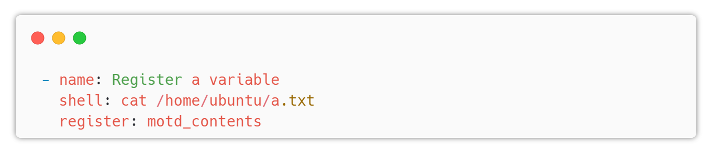
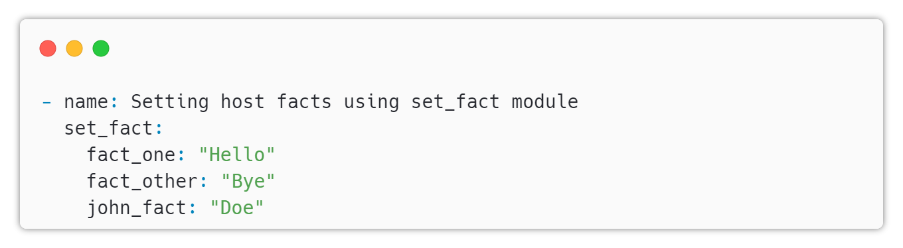
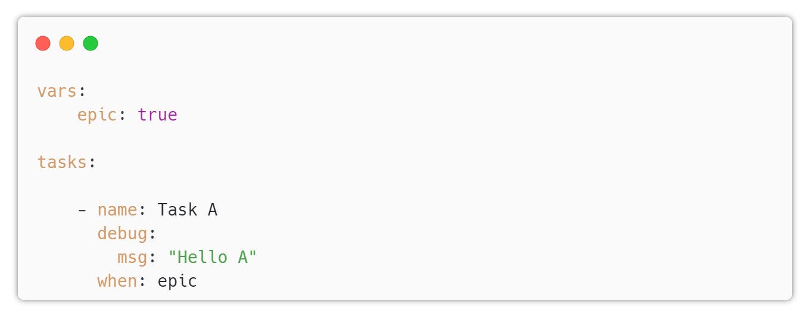

# Ansible Playbook

---


## What is a Playbook?

* A playbook is a list of plays


* A playbook is a YAML-formatted file in Ansible that contains a series of tasks to automate configuration, deployment, and orchestration of IT infrastructure.

* Playbooks define the desired state of a system, allowing Ansible to manage and maintain consistency across environments.


---

## Key Components of a Playbook
  * Plays: Organize tasks for a specific group of hosts.
  * Tasks: Execute a single action using Ansible modules (e.g., package installation, file creation).
  * Variables: Define custom or dynamic values to be used in tasks.
  * Handlers: Perform actions in response to specific triggers (e.g., restarting a service).
  * Templates: Dynamically generate configuration files using Jinja2 templating language.
  * Playbooks promote reusable, shareable, and maintainable code for infrastructure management.

We will discuss each of these components in detail in the following slides.

---

## Playbook

Let's take a look at a simple playbook:

```yaml
- name: Print a message
  hosts: all

  tasks:
    - name: Print a debug message
      debug:
        msg: "Hello, world!"
```
now, we're going to break down the playbook into its component parts.

---

## YAML header

The first line of the playbook is a YAML header that specifies the document type and version. In this case, it's a YAML document with no specific version:

```yaml
  ---
```

---

## Play

The _hosts_ and _become_ directives are part of the first play defined in the playbook:

```yaml
- hosts: servers
  become: true
```

---

## What is a play?

A _play_ is a set of tasks that run on a specific set of hosts. 

```yaml
- hosts: servers
```

In this case, the play is targeting the `servers` group of hosts,

---

## What is become?

`become` directive tells Ansible to run the tasks with elevated privileges.

```yaml
  become: true
```

---

## Task structure

```yaml
  tasks:
    - name: Print a debug message
      debug:
        msg: "Hello, world!"
```

* Each task in a playbook has a name, a module, and any necessary module arguments.

* The name directive is a human-readable label for the task, used for reporting and logging.

* The module specifies the name of the Ansible module to use for the task, such as apt, yum, or copy.

* Any necessary module arguments are specified as key-value pairs under the module.


---


## Patterns


## Tasks

* A task is a single action that is executed on a host
* A task is a single module with a set of arguments


---

# Modules

* A module is a self-contained script that implements a single action
* Modules are the building blocks of Ansible
* Modules are executed on the remote hosts
* Modules are written in Python

---

## Module Types

* Core modules
  * Maintained by the Ansible team
  * Located in the `/usr/lib/python3.6/site-packages/ansible/modules` directory


* Extra modules
  * Maintained by the Ansible community
  * Located in the `/usr/lib/python3.6/site-packages/ansible/modules` directory
  * Can be promoted to core modules
  * might be removed if they are not maintained
  * Can be installed using the `ansible-galaxy` command

---

## Index of Modules

* The index of modules is located in the `/usr/share/doc/ansible/html/modules_by_category.html` directory

* The index of modules is also available online at https://docs.ansible.com/ansible/2.9/modules/modules_by_category.html

---

## Module Documentation

* The documentation for each module is located in the `/usr/share/doc/ansible/html/modules/<module_name>.html` directory

* The documentation for each module is also available online at `https://docs.ansible.com/ansible/2.9/modules/module_name>.html`

* The documentation for each module includes:
  * A description of the module
  * A list of the module's arguments
  * A list of the module's return values
  * A list of the module's examples


---

## Facts

* Facts are pieces of information about the remote hosts
* Facts are gathered by Ansible and can be used in playbooks
* Facts are stored in the ansible_facts variable
* Facts are gathered by default

---

## Variables

* Variables are used to store information that can be used in playbooks and templates
* Variables can be defined in the playbook or in a separate file
* Variables can be defined in the inventory file

---

## Templates

* Templates are files that contain variables
* Templates are used to generate configuration files
* Templates are written in Jinja2
* Templates are rendered on the Ansible controller

---

## Handlers

* Handlers are tasks that are triggered by notifications
* Handlers are used to restart services
* Handlers are executed at the end of the play
* Handlers are executed only if the task that triggered them has changed
* Handlers are executed only once
* Handlers are executed in the order they are defined
* Handlers are executed on the hosts that were changed

---

## Conditionals

* Conditionals are used to execute tasks based on conditions
* Conditionals are written in Jinja2
* Conditionals are evaluated on the Ansible controller
* Conditionals are evaluated before the play starts

---

## Plugins

* Plugins are used to extend Ansible
* Plugins are written in Python
* Plugins are executed on the Ansible controller
* Plugins are executed before the play starts

---

## Looping

* Looping is used to execute tasks multiple times
* Looping is written in Jinja2
* Looping is evaluated on the Ansible controller
* Looping is evaluated before the play starts

---

## Vault

* Vault is used to encrypt sensitive data
* Vault is used to encrypt variables
* Vault is used to encrypt files
* Vault is used to encrypt the entire playbook

---

## Ansible Galaxy

* Ansible Galaxy is a repository of Ansible roles
* Ansible Galaxy is a repository of Ansible modules

---

## Roles

* Roles are a way to organize playbooks

---

## Run AGAINST

Means to run a specific adhoc, play or playbook on the specified host or group from the inventory

---

# Install Ansible

---

## Install Ansible

* Ansible is written in Python and, as such, can be installed on a wide range of systems

  * Debian
  * RedHat
  * FreeBSD

* macOS

The one exception to this is Windows, though native Python distributions exist, there is yet no native Ansible build.


---

The release cycle for Ansible is usually about four months, and during this short release cycle, there are normally many changes, from minor bug fixes to major ones, to new features and even sometimes fundamental changes.

The simplest way to not only get up and running with Ansible but to keep yourself up to date is to use the native packages built for your operating system where they are available.

---

# LAB

Install Ansible

# Ansible Plugin

---

## What is a plugin?

* A plugin is a piece of code that extends Ansible
* Plugins are written in Python
* Plugins are executed on the Ansible controller
* Plugins are executed before the play starts

---

## Plugin Types

* Action plugins
* Callback plugins
* Connection plugins
* Filter plugins
* Inventory plugins
* Lookup plugins
* Module plugins
* Strategy plugins
* Test plugins
* Terminal plugins
* Var plugins
* Cache plugins

---

## Action Plugins

* Action plugins are used to extend the functionality of modules
* Action plugins are executed on the Ansible controller
* Action plugins are executed before the play starts
* Action plugins are executed before the module is executed

---

## Callback Plugins

* Callback plugins are used to extend the functionality of the output
* Callback plugins are executed on the Ansible controller
* Callback plugins are executed before the play starts
* Callback plugins are executed after the play ends

---

## Connection Plugins

* Connection plugins are used to extend the functionality of the connection
* Connection plugins are executed on the Ansible controller
* Connection plugins are executed before the play starts
* Connection plugins are executed before the module is executed
* Connection plugins are executed before the task is executed

---

## Filter Plugins

* Filter plugins are used to extend the functionality of the filters
* Filter plugins are executed on the Ansible controller
* Filter plugins are executed before the play starts
* Filter plugins are executed before the module is executed

---

## Inventory Plugins

* Inventory plugins are used to extend the functionality of the inventory
* Inventory plugins are executed on the Ansible controller
* Inventory plugins are executed before the play starts
* Inventory plugins are executed before the inventory is loaded

---

# Ansible Modules
---

## Module

* A module is a self-contained script that implements a single action
* Modules are the building blocks of Ansible
* Modules are executed on the remote hosts
* Modules are written in Python
* Modules are located in the `/usr/lib/python3.6/site-packages/ansible/modules` directory

---


# Ansible Ad-Hoc
---

## Ad-Hoc Commands

* An Ansible ad hoc command uses the `ansible` command-line tool to automate a single task on one or more managed nodes.
* ad hoc commands are quick and easy, but they are not reusable.
* ad hoc tasks can be used to reboot servers, copy files, manage packages and users, and much more.* You can use any Ansible module in an ad hoc task.* ad hoc commands demonstrate the simplicity and power of Ansible
* It will port over directly to the playbook language
* For every ad hoc command you run, you will get a response in JSON format
* You can use the `-m` option to specify the module to use
* You can use the `-a` option to specify the arguments to pass to the module
* You can use the `-i` option to specify the inventory file to use

---

## Example

```bash
ansible -i hosts -m ping all
```

---

# LAB

Adhoc Lab

## Module Arguments

* Arguments are the parameters that are passed to the module
* Arguments are passed as key-value pairs

---

## Module Return Values

* Return values are the values that are returned by the module
* Return values are passed as key-value pairs

---

# Ansible Playbook

---

# Ansible Handlers

---

## Handlers

* Handlers in Ansible are special tasks that are only executed when a change has been made.

* They are used to trigger a specific action, such as restarting a service, after a configuration change has been made.

* Handlers are defined in the playbook, just like regular tasks.

* The difference is that handlers are associated with a specific event, such as a configuration file being changed.

* Handlers are triggered using the notify keyword in a task, which tells Ansible to execute the handler if the task makes any changes.

* Handlers are useful for managing complex configurations where multiple tasks may need to be executed in a specific order.

* Handlers are executed at the end of a playbook run, after all tasks have been completed.

* Handlers can be defined globally in a playbook or in a specific role.

---

## Example


---

In the previous above, the handler is named "restart apache" and will restart the Apache service.

* The "listen" keyword is used to associate the handler with a specific task that will trigger it.

* Handlers can also be used with variables, allowing you to define more dynamic configurations.

* Handlers are a powerful feature of Ansible that can help you manage complex configurations and ensure that your systems are always up-to-date.

---

## Best practices

* Only use handlers when necessary
* Use descriptive names for handlers
* Define handlers in a separate file to keep your playbook organized
* Test your handlers thoroughly to ensure they work as expected

## Playbook

A playbook is a collection of tasks that define the desired state of a system.

Playbooks are written in YAML format and can be used to manage a wide range of systems, from simple web servers to complex multi-tier applications.

---

## Example


---

## Task Structure

A task is a single module with a set of arguments.


---

# Ansible Variables

---

## Variables

* Variables are used to store information that can be used in playbooks and templates.

* Variables can be defined in the playbook or in a separate file.

* Variables are defined in the form of key=value pairs.

* Variables are defined in the vars section of the playbook.

* Variables can be used in the tasks section of the playbook.

---

## Example


---

## Variables Prompt

* Variables can be prompted for user input.
* The prompt can be defined in the vars section of the playbook.

---

## Example


`name`: variable name

`prompt`: prompt message

`default`: default if user skips the prompt

`private`: hide the input from the screen

---

## Variables File

* Variables can be defined in a separate file.
* The file can be in any format, but the most common one is the YAML format.
* The file must be located in the same directory or relative to the playbook.
* The file must be named anything that you need.
* The file must be defined in the vars_files section of the playbook.
  * There is a module called `include_vars` that can be used to include variables from a file as a task.

---

## Variables Register

* Variables can be registered to store the output of a task.



---

## Variables Set Fact

Variables can be set as facts to store the output of a task using `set_fact` module

these variables can be accessed like a normal variable



Note: If you have `redis` installed, you can use `cached` to store these variables for later use.

---

# Ansible Condition

---

## Condition

* Ansible supports conditional execution of tasks.
* The condition can be defined in the `when` section of the task.
* The condition can be defined as a string, a list of strings, or a dictionary.
* Strings must be a valid expression.
* Lists of strings must be valid expressions.
* Dictionaries must be valid expressions.
* The condition can be defined as a Jinja2 expression.
* The condition can be defined as a variable.

---

## Example



---

## Condition Operators

* Ansible supports the following operators:
  * `and`
  * `or`
  * `not`
  * `==`
  * `!=`
  * `>`
  * `>=`
  * `<`
  * `<=`
* The condition can be defined as a Jinja2 expression.
* The condition can be defined as a variable.

---

## Condition Expressions

* Ansible supports the following expressions:
  * `true`
  * `false`
  * `none`
* The condition can be defined as a Jinja2 expression.
* The condition can be defined as a variable.
* The condition can be defined as a list.
  * The list must contain valid expressions.
  * `and` operator is used between each item of the list.

---

## Condition Variables

* Ansible supports the following variables:
  * `ansible_facts`
  * `ansible_hostname`
  * `ansible_host`
  * `ansible_os_family`
  * `ansible_os_name`
  * `ansible_os_version`
  * `ansible_playbook_python`
  * `ansible_python`
  * ...

---

# Ansible Loop

---

## Loop

Ansible provides a simple and efficient way to iterate over a set of values using loops in a playbook.
---

## The with_items Loop

The `with_items` loop is the most commonly used loop in Ansible. It iterates over a list of items and performs a task for each item.


---

## The `loop` Loop

The `loop` loop is a newer alternative to with_items loop, and it offers more flexibility and readability. It allows you to loop over a list or dictionary of items, and use the item variable to access each item.


---

## Using Loops with Conditionals

You can also use loops with conditionals to perform tasks based on certain conditions.


---

## The loop_control Keyword

The loop_control keyword allows you to modify the behavior of the loop. For example, you can use it to set the loop index, skip items, or stop the loop.


---

## Conclusion

Loops in Ansible Playbook provide an efficient way to perform repetitive tasks. With the with_items and loop loops, you can iterate over a list of items or a dictionary, and use conditionals and loop_control keyword to modify the behavior of the loop.

# Ansible Block

---

## Blocks in Ansible Playbook

* Blocks are a way to group related tasks together in an Ansible playbook
* They can be used to apply conditions, retries, and error handling to a set of tasks as a single unit
* Blocks can make playbooks more readable and easier to maintain

---

## Syntax of Blocks in Ansible Playbook

The syntax for defining a block in an Ansible playbook is as follows:


* The `block` keyword is used to define the set of tasks that should be grouped together
* The `rescue` keyword is used to define a set of tasks to be run if any task in the block fails
* The `always` keyword is used to define a set of tasks to be run regardless of whether the block succeeds or fails

---

## Example


---

* In this example, the tasks for installing and starting the Apache web server are grouped together in a block
* If any task in the block fails, the rescue tasks will be executed to handle the failure
* The always tasks will be executed regardless of whether the block succeeds or fails, in this case to clean up a lock file created during the installation

---

## Benefits

* Using blocks in an Ansible playbook can make the playbook more readable and easier to maintain by grouping related tasks together
* Blocks can also make it easier to apply conditions, retries, and error handling to a set of tasks as a single unit
* Using blocks can help to reduce duplication and make playbooks more modular
* By using blocks, it is possible to write more robust and error-tolerant playbooks

# Ansible Vault

---

# Ansible Vault: Secure Secrets Management with Examples

 
---

## What is Ansible Vault?

* Ansible Vault is a feature that allows you to encrypt sensitive data such as passwords or keys.
* Ansible Vault is a part of Ansible, which means that it is installed by default when you install Ansible.
* Ansible Vault is a command line tool that allows you to encrypt and decrypt files.
* Everything in Ansible is a file, so Ansible Vault can be used to encrypt any file.
* Everytime you run a playbook, Ansible Vault will ask you for the password to decrypt the file.

---

## Basic Vault Commands

* ansible-vault create
  * `ansible-vault create vault.yml` => creates a new vault file
* ansible-vault edit
  * `ansible-vault edit vault.yml` => opens the vault file in an editor
* ansible-vault view
  * `ansible-vault view vault.yml` => displays the contents of the vault file
* ansible-vault encrypt
  * `ansible-vault encrypt vault.yml` => encrypts an existing file
* ansible-vault decrypt
  * `ansible-vault decrypt vault.yml` => decrypts an existing file
* ansible-vault rekey
  * `ansible-vault rekey vault.yml` => rekeys an existing file

---

## Run Playbooks with Vault

* ansible-playbook
  * `ansible-playbook playbook.yml --ask-vault-pass` => prompts for the vault password
  * `ansible-playbook playbook.yml --vault-password-file vault_pass.txt` => uses a file to store the vault password

---

# Ansible Roles

---

# Overview

* Reusable, modular components in Ansible
* Organize tasks, variables, templates, and files
* Enable sharing, reusing, and distributing automation code
* Encapsulate functionality for specific services or applications

---

# Role Directory Structure


---

# Role Components

* Tasks: Define the actions to execute
* Handlers: Manage service restarts or configuration reloads
* Templates: Create dynamic configuration files using Jinja2
* Files: Store static files required by the role
* Vars: Define role-specific variables
* Defaults: Set default variable values

---

# Including Roles in Playbooks

* Use the "roles" keyword in a playbook
* Specify the role name or path
* Pass variables to customize the role

---


---

# Benefits of Using Roles

* Enhance code reusability and maintainability
* Simplify playbook structure
* Enable collaboration and sharing via Ansible Galaxy

