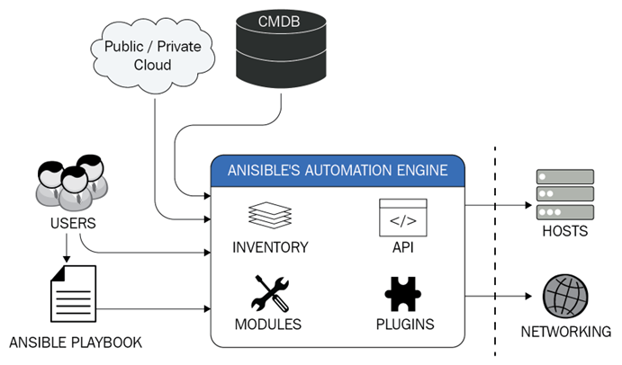

# Stating a problem

---

# Automating the management and deployment of a large infrastructure

---

# Answer

---

# Ansible

* Ansible is a simple IT automation tool that makes your applications and systems easier to deploy.
* Avoid writing scripts or custom code to deploy and update your applications
* automate in a language that approaches plain English, using SSH, with no agents to install on remote systems.
* Ansible is agentless, so you don’t have to install software on remote systems to manage them.

---

## Where to use Ansible

* Configuration Management
* Application Deployment
* Continuous Delivery
* Orchestration
* Security Automation
* Multi-Tier Applications
* Cloud Provisioning
* Network Automation
* And more...

---

## Agentless

Target systems do not need to have any software installed on them to be managed by Ansible *.

Tasks are executed over SSH by default, but can also be executed locally.

* _except for Windows systems, which require a small Python executable to be installed._

---

# Why Agentless?

The reasons for this choice in the Ansible design are many, not least that just about every Linux/FreeBSD/macOS host has it built in, as do many network devices such as switches and routers.

---

# Idempotent

Ansible is idempotent, meaning that it can be run multiple times without changing the state of the system.

---

Ansible is not a configuration management tool

BUT

it can be used to manage configuration files.

---

