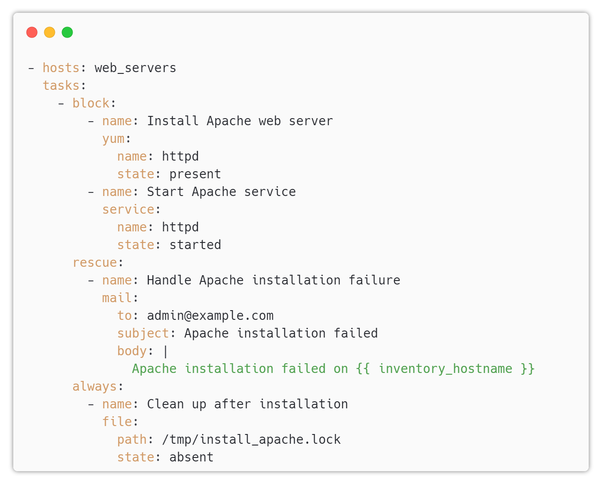

# Ansible Block

---
 
## Blocks in Ansible Playbook

* Blocks are a way to group related tasks together in an Ansible playbook
* They can be used to apply conditions, retries, and error handling to a set of tasks as a single unit
* Blocks can make playbooks more readable and easier to maintain

---

## Syntax of Blocks in Ansible Playbook

The syntax for defining a block in an Ansible playbook is as follows:

* The `block` keyword is used to define the set of tasks that should be grouped together
* The `rescue` keyword is used to define a set of tasks to be run if any task in the block fails
* The `always` keyword is used to define a set of tasks to be run regardless of whether the block succeeds or fails

---

## Example 

---

* In this example, the tasks for installing and starting the Apache web server are grouped together in a block
* If any task in the block fails, the rescue tasks will be executed to handle the failure
* The always tasks will be executed regardless of whether the block succeeds or fails, in this case to clean up a lock file created during the installation

---

## Benefits 

* Using blocks in an Ansible playbook can make the playbook more readable and easier to maintain by grouping related tasks together
* Blocks can also make it easier to apply conditions, retries, and error handling to a set of tasks as a single unit
* Using blocks can help to reduce duplication and make playbooks more modular
* By using blocks, it is possible to write more robust and error-tolerant playbooks