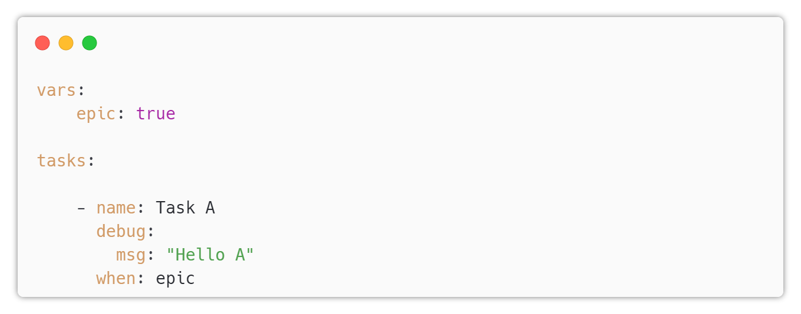

# Ansible Condition

---

## Condition

* Ansible supports conditional execution of tasks.
* The condition can be defined in the `when` section of the task.
* The condition can be defined as a string, a list of strings, or a dictionary.
* Strings must be a valid expression.
* Lists of strings must be valid expressions.
* Dictionaries must be valid expressions.
* The condition can be defined as a Jinja2 expression.
* The condition can be defined as a variable.

---

## Example

---

## Condition Operators

* Ansible supports the following operators:
  * `and`
  * `or`
  * `not`
  * `==`
  * `!=`
  * `>`
  * `>=`
  * `<`
  * `<=`
* The condition can be defined as a Jinja2 expression.
* The condition can be defined as a variable.

---

## Condition Expressions

* Ansible supports the following expressions:
  * `true`
  * `false`
  * `none`
* The condition can be defined as a Jinja2 expression.
* The condition can be defined as a variable.
* The condition can be defined as a list.
  * The list must contain valid expressions.
  * `and` operator is used between each item of the list.

---

## Condition Variables

* Ansible supports the following variables:
  * `ansible_facts`
  * `ansible_hostname`
  * `ansible_host`
  * `ansible_os_family`
  * `ansible_os_name`
  * `ansible_os_version`
  * `ansible_playbook_python`
  * `ansible_python`
  * ...
---