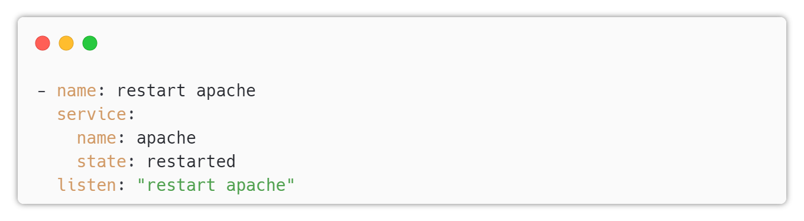

# Ansible Handlers

---
 
## Handlers

* Handlers in Ansible are special tasks that are only executed when a change has been made.

* They are used to trigger a specific action, such as restarting a service, after a configuration change has been made.

* Handlers are defined in the playbook, just like regular tasks.

* The difference is that handlers are associated with a specific event, such as a configuration file being changed.

* Handlers are triggered using the notify keyword in a task, which tells Ansible to execute the handler if the task makes any changes.

* Handlers are useful for managing complex configurations where multiple tasks may need to be executed in a specific order.

* Handlers are executed at the end of a playbook run, after all tasks have been completed.

* Handlers can be defined globally in a playbook or in a specific role.

---

## Example

---

In the previous above, the handler is named "restart apache" and will restart the Apache service.

* The "listen" keyword is used to associate the handler with a specific task that will trigger it.

* Handlers can also be used with variables, allowing you to define more dynamic configurations.

* Handlers are a powerful feature of Ansible that can help you manage complex configurations and ensure that your systems are always up-to-date.

---

## Best practices

* Only use handlers when necessary
* Use descriptive names for handlers
* Define handlers in a separate file to keep your playbook organized
* Test your handlers thoroughly to ensure they work as expected
